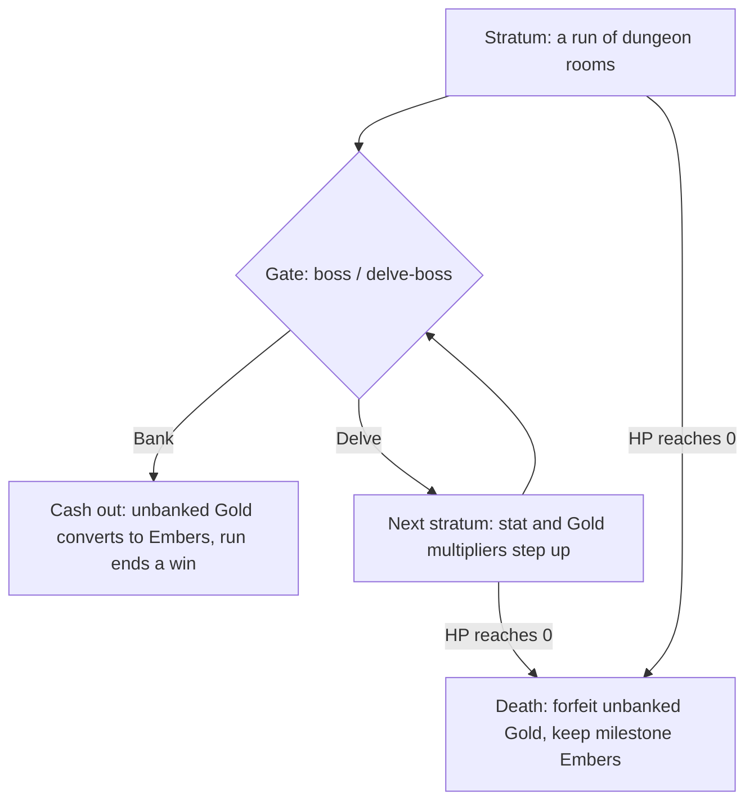

# Push-Your-Luck Banking: Endless Descent

## Summary

Make "Escape" a verb. Beating the room-10 boss stays a win, but it becomes the
first **gate**: cash out — converting your run's unbanked Gold into Embers — or
**delve** into a harder stratum with everything still at risk. Each gate is a
bigger all-or-nothing swing; dying in a stratum forfeits the unbanked Gold while
the safe milestone-Ember run is untouched. The MVP reuses the existing
depth-parametric room generator with per-stratum multipliers and bundles minimal
combat scripts for the strong enemies so deep death feels earned.

## Problem Frame

The game is named _Escape_, but leaving is never a decision — the dungeon is a
forward-only crawl that ends at the room-10 boss, and there is no point at which
walking out with your haul is a strategy.

Two economy facts make the absence felt. First, **Gold has no path to
permanence**: it is run-local (`state.ts`), and even a winning run never
converts it — the run-end message literally reads _"Gold stays with this run."_
Your best runs rake in Gold that simply evaporates. Second, the meta currency is
already partly death-proof — milestone Embers for rooms 3/6/9 are kept even when
you die (`metaRewards.ts`) — so "death resets you to zero" was never the real
stakes. The thing that actually dies with a run is Gold, and Gold has nothing to
do.

Push-your-luck canon (Can't Stop, Clank!) and Path of Exile's Delve show the
fix: a banked pool you can lose hurts more than a reset, and an endless descent
with no natural stopping point turns "one more floor?" into a genuine,
repeatable gut-check. A fixed 10-room cap can't produce that tension — there is
always a safe default (just finish). Removing the cap removes the default.

## Key Decisions

- **Endless-descent overlay; the boss stays a win.** Rooms 1–10 plus the boss
  remain a complete, winnable run. Delving is an optional layer _on top of_ that
  victory, not a replacement for it — so a satisfying completion is preserved
  for players who never delve.
- **Gold is the at-risk pool; escaping converts it.** The visible, growing Gold
  pile is what the player sweats over. Banking converts unbanked Gold into
  Embers; dying forfeits it. This gives Gold the weight it has always lacked and
  makes spending it mid-run a real cost.
- **Universal conversion.** Banking converts unbanked Gold to Embers at _every_
  gate, including a clean boss-win that never delves — so Gold gains weight for
  cautious players too, and the delve is simply "leave more Gold at risk, for
  longer, to convert more."
- **Stratum commitment, no mid-stratum bail.** The bank-or-delve choice fires
  only at gates. Once you commit to a stratum you are in until the next gate or
  death. Committing _is_ the gamble; this is what gives each push teeth.
- **MVP escalation by multipliers.** Strata reuse the existing room generator
  with escalating stat and Gold-income multipliers — enough to validate the loop
  before investing in bespoke per-stratum content.
- **Bundle minimal strong-enemy scripts.** Scripting the knight / necromancer /
  ogre (a slice of the Reading-the-Enemy work) is a prerequisite of this ship,
  so deep death reads as "I pushed too far," not a coinflip against an
  unreadable enemy. Specified in
  `docs/brainstorms/2026-06-29-reading-the-enemy-combat-requirements.md`.
- **Daily delve yields depth, not Embers.** In a Daily, Gold→Ember conversion is
  switched off; the delve produces a comparable depth result. This keeps Daily
  meta-grind-proof and feeds the spoiler-free sharing idea.
- **Reward-decay fixes are out of scope.** Because converted-to-Gold rewards now
  become Embers on escape, the "best runs get punished" decay
  (relics falling through to Gold once all are owned, potion-only item drops,
  `iron_armor` never dropping) largely self-heals. The only reward change this
  feature _requires_ is that Gold income escalates per stratum. The cosmetic
  bugs are separate cleanup (overlapping the I7 honesty pass).

## Key Flows

The run/delve loop:

- F1. Gate decision
  - **Trigger:** A stratum is cleared — the room-10 boss for gate 1, a
    delve-boss for deeper gates.
  - **Steps:** Present bank-or-delve. Bank → convert unbanked Gold to Embers,
    award the escape bonus, end the run as a win. Delve → commit to the next
    stratum with multipliers stepped up; the pool stays at risk.
  - **Outcome:** Either a banked win, or commitment to a harder stratum.
  - **Covered by:** R1, R2, R3, R6, R8

- F2. Death in a stratum
  - **Trigger:** Player HP reaches 0 in any stratum, base or delve.
  - **Steps:** End the run; forfeit all unbanked Gold (no conversion); retain
    milestone Embers already earned.
  - **Outcome:** Run ends as a loss; meta progress limited to death-proof
    milestone Embers, exactly as today.
  - **Covered by:** R7, R8

## Requirements

**Run shape and the gate decision**

- R1. Beating the room-10 boss remains a win (sets `escaped`) and presents the
  first gate rather than ending the run outright.
- R2. At each gate the player chooses to bank (end the run and cash out) or
  delve (begin the next stratum).
- R3. Committing to a stratum is irreversible until the next gate; there is no
  mid-stratum exit.
- R4. Strata continue the dungeon past depth 10 using the existing
  depth-parametric room generator.

**Gold, Embers, and conversion**

- R5. Gold accumulates across the whole run and constitutes the unbanked,
  at-risk pool.
- R6. Banking at any gate converts the player's unbanked Gold into Embers,
  including a boss-win that never delves.
- R7. Dying in any stratum forfeits all unbanked Gold; milestone Embers already
  earned are retained (unchanged from today).
- R8. Milestone Embers (rooms 3/6/9) and the +3 escape bonus are unchanged,
  stay capped, and are never at risk in the delve; the delve's only Ember
  source is converted Gold.
- R9. Spending Gold mid-run (rest, upgrades) reduces the eventual conversion —
  buying survival costs future Embers. Planning must preserve this tension
  rather than wall delve-Gold off from in-run spending.

**Escalation and difficulty**

- R10. Each successive stratum applies escalating stat and Gold-income
  multipliers over the reused room generator.
- R11. The strong enemies (knight, necromancer, ogre) gain combat scripts so
  deep-stratum fights are readable; see the Reading-the-Enemy requirements.
- R12. Gold income escalates per stratum so that delving carries positive
  expected value before the meta-economy guard caps it (this is the only piece
  of "deeper genuinely pays more" the feature requires).

**Meta-economy safety**

- R13. Expected Ember yield from delving stays bounded by a guard (diminishing
  conversion and/or risk that scales faster than reward) so unlimited delving
  cannot trivialize the Campfire economy.
- R14. The balance harness is extended to model the bank-or-delve decision and
  stratum escalation, and to verify that neither "always bank at gate 1" nor
  "always push until death" is a dominant line.

**Daily Descent**

- R15. The delve is available in Daily Descents, but Gold→Ember conversion is
  disabled there; delving yields depth only. Base-run milestone Embers in a
  Daily are unchanged.
- R16. Daily delve depth is recorded as a comparable metric in the daily record.

**Recording**

- R17. The chronicle and daily records gain fields for deepest stratum reached,
  Embers gained via conversion, and whether the run ended by banking or by dying
  in a delve.

## Acceptance Examples

- AE1. Bank at the boss gate, no delve
  - **Given** the player beats the room-10 boss holding 40 Gold.
  - **When** they choose Bank.
  - **Then** the 40 Gold converts to Embers, the escape bonus is awarded, and
    the run ends as a win. **Covers R1, R6.**

- AE2. Die in a delve stratum
  - **Given** the player delved into stratum 2 with 90 unbanked Gold.
  - **When** their HP reaches 0 before the next gate.
  - **Then** all 90 Gold is forfeited with no conversion, milestone Embers
    already earned are retained, and the run ends as a loss. **Covers R7, R8.**

- AE3. Spend-to-survive lowers the payout
  - **Given** the player holds 90 Gold and spends 30 at a rest room mid-stratum.
  - **When** they later bank at the next gate.
  - **Then** only 60 Gold converts to Embers — the 30 spent is gone from the
    payout. **Covers R9.**

- AE4. Daily delve
  - **Given** a Daily Descent where the player delves past the boss and banks at
    a later gate.
  - **When** the run ends.
  - **Then** no Embers are produced by conversion, the deepest stratum is
    recorded as the comparable result, and base milestone Embers behave exactly
    as in a normal Daily today. **Covers R15, R16.**

## Scope Boundaries

Deferred for later:

- The Ledger (leveraged-debt curse) and the hunting-boss clock — escalators
  explicitly kept out of the MVP.
- Per-stratum modifiers / rule-benders and a procedural enemy generator — the
  long-term "stay fresh past a few strata" layer; the fast-follow once the loop
  proves out.
- The spoiler-free share glyph and async leaderboard themselves — the Daily
  depth-score feeds them, but building the sharing surface is the separate I3
  direction.
- The full Reading-the-Enemy reads game (asymmetric payoffs, bluffs, buy-down
  info) — only the minimal strong-enemy scripts are bundled here.
- Cosmetic reward-honesty bugs (`iron_armor` drop path, the status-upgrade
  no-op) — separate I7 cleanup.

Rejected:

- Per-door banking / mid-stratum bail — considered and dropped in favor of
  stratum commitment.

## Dependencies / Assumptions

- **Minimal strong-enemy combat scripts** (R11) are a prerequisite, specified in
  `docs/brainstorms/2026-06-29-reading-the-enemy-combat-requirements.md`.
- **Balance-harness extension** (R14) is a hard prerequisite, not a follow-up:
  the meta-economy guard (R13) and the "no dominant line" success criterion can
  only be tuned once the simulator models the bail/delve decision and escalation.
  Today `balanceSimulator.ts` uses `BALANCE_ENCOUNTER_POLICY = 'fight-taken-baseline'`,
  loops only depth 2..`MAX_DEPTH`, and models no bail path.
- **Assumption — rooms extend cleanly past depth 10.** `makeNextRoom` is
  parametric on depth, but nothing proves depths > 10 are free of depth-bound
  assumptions. Planning must confirm before relying on it.
- **Assumption — a stratum is 10 rooms**, matching the "next 10 rooms" framing.
  Adjustable; confirm during planning.
- **Current Daily behavior, stated accurately:** a Daily run today _does_ award
  run-end milestone/escape Embers (`awardEmbersOnce` is unconditional in
  `End.ts`). What the Daily ignores is Ember-purchased _benefits_ on input
  (Starter Kit / Starter Variety). R15 disables only the new delve conversion in
  Daily; it does not change existing Daily Ember awards.

## Success Criteria

- Deep-stratum death reads as a misjudged push, not a random coinflip (enabled
  by R11).
- The balance harness shows neither "always bank at gate 1" nor "always push
  until death" is a statistically dominant line.
- Expected Ember yield from delving stays bounded; Campfire meta pacing is not
  trivialized for skilled players who bank deep runs.
- A cautious player can still complete the safe run and earn the existing
  milestone Embers with no change to that experience.

## Outstanding Questions

No questions block planning — every remaining item is a tuning decision settled
during planning against the extended balance harness, not in dialogue.

Deferred to planning:

- The Gold→Ember conversion rate and its curve across strata (the central EV
  knob), and which guard mechanism enforces R13 — diminishing conversion vs.
  risk that scales faster than reward.
- Exact per-stratum stat and Gold multiplier values.
- Stratum length (confirm 10 rooms vs. another value).
- Where the gate decision surfaces in the dungeon flow and how "cash out" routes
  into the existing run-end / `escaped` path.

## Sources / Research

Repo grounding (verified against source):

- `config.ts` — `MAX_DEPTH = 10`; `rooms.ts` `makeNextRoom` forces a boss at
  depth 10 and generates events per depth.
- `metaRewards.ts` — milestones `[3,6,9]` (+1 each), `ESCAPE_EMBERS = 3`, max 6;
  `escapeEmbers` requires `escaped`, milestones do not.
- `End.ts` — Embers awarded once per `runId`; Gold not transferred ("Gold stays
  with this run"); `awardEmbersOnce` fires unconditionally for Daily.
- `state.ts` — `RunState.gold`, reset to 0 on new run; `meta.ts` —
  `MetaState.embers`, `lastAwardedRunId`.
- `roomThreat.ts` — `evaluateRoomThreatEscape` returns `grantBattleReward:false`
  in every branch and the field is never read (dead escape-reward path).
- `enemies.ts` / `enemyIntent.ts` — strong enemies have no `combatScript`, fall
  through to weighted-random `pickFallbackCard`.
- `rewards.ts` / `relics.ts` / `items.ts` — relic→gold fallthrough once all
  owned, potion-only item drops, `iron_armor` defined with no drop path.
- `daily.ts` — `DailyRecord` stores `date/seed/bestDepth/escaped/attempts` only.

External canon: Can't Stop / Clank! (banked-loss tension), Path of Exile Delve
(endless escalating descent with voluntary pull-out).

Related directions: `docs/ideation/2026-06-29-escape-next-directions-ideation.html`
(I1 Reading the Enemy, I3 seeded-engine sharing, I4 content engine / balance
harness).
