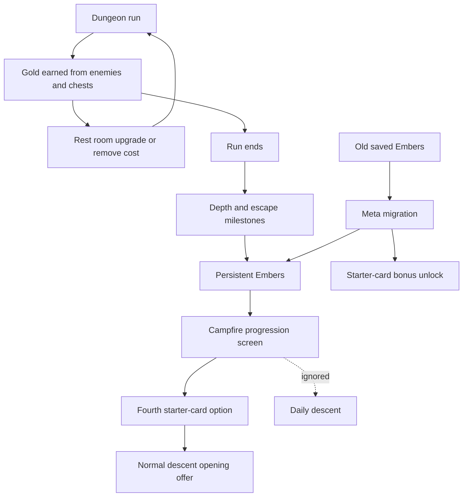

# Gold and Embers Economy - Plan

## Goal Capsule

- **Objective:** Replace the single liquid ember economy with a split where Gold matters during the current run and Embers carry long-term starter-card progression.
- **Product authority:** The Product Contract defines player-facing behavior; the Planning Contract defines implementation choices that must preserve that behavior.
- **Execution profile:** Standard code plan with pure-rule tests first, then Phaser scene integration and manual gameplay smoke.
- **Stop conditions:** Stop if implementation would keep unlimited Ember-funded supplies or bargain payouts, make the first Ember unlock a raw stat upgrade, or silently discard old saved progress without the bonus unlock.
- **Tail ownership:** The implementer owns automated validation, manual smoke, and removal of abandoned exploratory code before claiming done.

---

## Product Contract

### Summary

Escape should use two familiar currencies with different lifetimes: Gold resets with the current dungeon run, and Embers persist for long-term progression.
This keeps treasure useful inside the run while making Embers feel like earned campfire progress instead of a wallet for buying every next-run supply.

### Problem Frame

Escape already has a roguelite loop with run gold, end-run embers, campfire supplies, bargains with curses, relics, daily runs, a chronicle, and balance tests.
The current economy collapses too much value into one persistent wallet: end-run rewards can produce enough embers to cover most small campfire purchases, and bargains add more embers into that same wallet.
The ideation prompt also called for a Vampire Survivors-like progression loop, but obscure currency names such as Ash and Kindling add teaching cost for non-native speakers.

### Key Decisions

- **Use Gold and Embers instead of Ash and Kindling.** Gold is already understood as run loot, and Embers already fit the campfire progression fantasy.
- **Use a lifetime split, not two persistent wallets.** Gold is for choices inside the active run, while Embers are for long-term progression between runs.
- **Earn Embers from milestones.** Depth bands, escapes, records, and first-time achievements should drive Ember income more than raw performance totals.
- **Keep permanent progression mostly about options.** Ember spending should unlock variety, choices, or durable goals before it grants raw stat strength.
- **Start Ember unlocks with starter-card variety.** The first long-term progression surface should add more opening-build variety rather than stronger baseline stats.
- **Reset old Ember balances with a bonus unlock.** Returning players should get a starter-card-variety unlock as migration compensation instead of carrying an inflated old balance into the new economy.

### Requirements

**Currency identity**

- R1. Gold must remain the current-run currency earned from dungeon play and must not persist as spendable currency after the run ends.
- R2. Embers must become the long-term progression currency earned from milestones and stored outside the current run.
- R3. Player-facing UI must avoid obscure new currency names for this feature.

**Earning**

- R4. Ember rewards must favor meaningful milestones such as depth progress, boss escape, personal records, or first-time accomplishments.
- R5. Carrying more Gold at the end of a run must not be the main source of long-term Ember progress.
- R6. Failed runs must still provide some Ember progress when the player reaches meaningful depth or progress milestones.

**Spending**

- R7. Embers must first buy starter-card variety, such as additional opening card options or new starter-card availability.
- R8. Raw permanent stat upgrades must be excluded from the first requirements scope.
- R9. Existing next-run supply purchases must no longer be treated as the primary Ember sink.

**Campfire role**

- R10. The campfire must remain the between-run hub for viewing long-term Embers and progression.
- R11. Any next-run prep that remains at the campfire must be limited so it does not recreate the old liquid-ember problem.
- R12. Bargains must not inject long-term Embers as a routine shortcut without a stricter progression trade-off.

**Migration and clarity**

- R13. Existing saved ember balances must reset into the new economy with a starter-card-variety bonus unlock so returning players are not silently reset.
- R14. The end-run summary must distinguish run Gold from milestone Ember progress.
- R15. The plan must preserve current run difficulty as a first-class constraint when adding Ember progression.

### Key Flows

- F1. End a run and earn progress
  - **Trigger:** The player dies or escapes.
  - **Steps:** The end screen summarizes run outcome, clears the current-run Gold economy, and awards Embers for milestone progress.
  - **Outcome:** The player returns to the campfire with durable Ember progress and no expectation that carried Gold became a persistent wallet.
  - **Covered by:** R1, R2, R4, R5, R6, R14.

- F2. Spend long-term Embers
  - **Trigger:** The player visits the campfire between runs.
  - **Steps:** The campfire shows the Ember balance and available long-term progression goals.
  - **Outcome:** Spending Embers unlocks choices or variety without directly flattening run challenge.
  - **Covered by:** R7, R8, R10, R15.

- F3. Handle next-run prep
  - **Trigger:** The player wants immediate help before starting another run.
  - **Steps:** The campfire presents only constrained prep options or routes prep to another economy chosen during planning.
  - **Outcome:** Short-term prep remains useful without consuming the same wallet as durable progression.
  - **Covered by:** R9, R11, R12.

### Acceptance Examples

- AE1. **Covers R1, R2, R5, R14.** Given a player escapes with carried Gold, when the end screen awards progression, then the summary treats Gold as run-local loot and awards Embers from milestone progress rather than converting all Gold into a large persistent payout.
- AE2. **Covers R4, R6.** Given a player dies after reaching a meaningful depth milestone, when the run ends, then the player receives some Embers even without escaping.
- AE3. **Covers R7, R8, R15.** Given a player spends Embers at the campfire, when the next run starts, then the unlock should add choices or variety without granting an unconditional permanent damage, HP, armor, or block increase.
- AE4. **Covers R9, R11, R12.** Given the current campfire supply loop exists, when the new economy is planned, then those supplies cannot remain an unlimited long-term Ember sink plus bargain-funded shortcut.
- AE5. **Covers R13.** Given a returning player has saved Embers from the old economy, when the new economy loads, then the old balance is reset and the player receives a starter-card-variety bonus unlock.

### Success Criteria

- The player can explain the economy as "Gold is for this run; Embers are for long-term progress."
- A strong run should feel rewarding without making every future prep option automatically affordable.
- Ember progression should create goals beyond the next attempt without making baseline runs trivial.
- Planning can proceed without inventing currency names, currency lifetimes, or whether Embers are milestone-based.

### Scope Boundaries

- Full feat-contract progression is deferred.
- Randomized campfire market design is deferred.
- Challenge ladders or heat systems are deferred.
- Broad enemy, card, and relic rebalance is deferred except where balance validation is needed for this economy.
- Raw permanent stat upgrades are outside the first version's identity.

### Dependencies / Assumptions

- Gold already exists as run-local loot and can be reused as the clear short-lifetime currency.
- Embers already exist as persistent meta progress and can be repositioned as the long-term currency.
- The existing campfire remains the long-term progression hub.
- Balance validation must check that full prep and Ember unlocks do not erase the intended challenge band.

### Outstanding Questions

**Deferred to Planning**

- What are the exact Ember milestone payout values?
- What happens to each current campfire supply purchase in the first implementation?
- Do bargains move away from Ember gains, become rarer, or trade for run-local benefits instead?

### Sources / Research

- `docs/ideation/2026-06-27-escape-progression-economy-ideation.html` proposed the original economy split and identified the liquid-ember problem.
- `src/game/metaRewards.ts` currently calculates one end-run ember total from depth, enemies, Gold, and victory.
- `src/game/metaRewards.test.ts` includes a victory reward example totaling 54 embers.
- `src/meta.ts` currently stores persistent `embers`, pending prep, and the last awarded run id.
- `src/data/campfirePurchases.ts` currently prices next-run supplies at 4-10 embers.
- `src/data/campfireBargains.ts` currently grants 8-10 embers immediately for one pending curse.
- Earlier campfire planning established the first campfire loop and avoided permanent power creep.
- Earlier roadmap notes deferred a permanent unlock tree and randomized campfire offers because of scope and balance risk.

---

## Planning Contract

### Product Contract Preservation

Product Contract unchanged during planning.
Deferred Product Contract questions were resolved into planning decisions below: starter-card variety becomes the first Ember unlock, old Ember balances reset into a starter-card-variety bonus unlock, and current Ember-funded supplies and bargains are removed from the active player path.

### Research Summary

Escape is a Phaser 3, TypeScript, Vite, and Vitest browser game with strict TypeScript, ESLint, Prettier, and colocated tests.
The economy surfaces are already separated into pure rule modules and Phaser scenes: run-local Gold lives in `RunState`, persistent Embers live in `MetaState`, end-run rewards are calculated in `src/game/metaRewards.ts`, and campfire purchases and bargains are pure data/rule modules wired through scenes.
No `docs/solutions/` learning corpus exists in this repo, so the plan relies on current source, prior plans, and the brainstorm grounding dossier.

### Key Technical Decisions

- **KTD1. Make Ember rewards milestone-based and small.** Replace the current depth/enemy/Gold conversion with +1 Ember at room 3, +1 at room 6, +1 at room 9, and +3 on escape; this gives failed runs progress while reducing the victory payout from a liquid 54-Ember example to a long-term progression payout.
- **KTD2. Use one first Ember unlock: a fourth starter-card option.** The first unlock costs 4 Embers and permanently adds `minor_heal` to normal-run opening offers while keeping the default pick count at two.
- **KTD3. Keep daily runs fixed.** Daily descents should ignore Ember unlocks and temporary prep so the seeded challenge stays comparable.
- **KTD4. Migrate old Ember balances by versioning meta state.** A saved old balance greater than zero grants the starter-card-variety unlock and resets the new Ember balance to zero; old pending prep is preserved once so already-bought preparation is not lost.
- **KTD5. Remove active Ember-funded supply and bargain entry points.** The player-facing campfire path should expose Progression, Descend, and Daily Descend, not an Ember supply shop or Ember-gain bargain shortcut.
- **KTD6. Make Gold matter through rest-room deck improvement.** Rest-room upgrade and remove actions cost run Gold, using the existing rest choice point instead of adding a new shop room in this pass.

### High-Level Technical Design

The design keeps each currency tied to a single lifetime.
Gold is earned and spent before the run ends.
Embers are awarded after the run ends and spent only on durable progression.
Migration is part of meta normalization so returning players get the bonus unlock before any campfire screen renders.

### Sequencing

1. Update persistent meta and migration first so every later unit can read a stable progression shape.
2. Add starter-card unlock rules before scene work so the UI and dungeon start room can share one source of truth.
3. Replace end-run Ember rewards after the progression shape exists.
4. Wire campfire progression and remove active Ember supply/bargain entry points.
5. Add Gold costs to rest rooms and the simulator.
6. Finish with copy, docs, and full validation.

### Scope Boundaries

**In scope**

- Persistent Ember progression state and migration.
- One starter-card-variety unlock.
- Milestone Ember rewards.
- Campfire progression UI.
- Gold-cost rest-room upgrade and remove actions.
- Balance simulator updates and validation.

**Deferred to Follow-Up Work**

- Additional Ember unlock families.
- Feat contracts, achievement chains, or challenge ladders.
- Randomized campfire market design.
- A dedicated in-run shop room.
- Reworking old campfire purchase and bargain modules beyond removing their active player-facing entry points.

**Outside this version's identity**

- Raw permanent damage, HP, armor, or block upgrades.
- Converting carried Gold into large persistent Ember rewards.
- Letting bargains routinely mint long-term Embers.

### System-Wide Impact

- Persistent browser storage changes require backward-compatible normalization.
- End-run reward text, chronicle entries, and campfire display all need the same new Ember meaning.
- Daily runs must remain stable even though normal runs gain a permanent opening-offer unlock.
- Rest rooms become economy nodes, so balance validation must include the new Gold spending behavior.

### Risks & Dependencies

- **Migration surprise:** Resetting old Embers can feel punitive if the bonus unlock is not visible; the campfire must show the unlocked starter-card benefit after migration.
- **Balance drift:** Gold-cost rest actions can reduce win rate because rest rooms were free; simulator thresholds should be recalibrated after representing the costs.
- **UI density:** The campfire already has dense text; the progression screen should replace the old supply path instead of adding another crowded panel.
- **Legacy module confusion:** Old purchase and bargain modules may remain as inactive code for a later cleanup, but they must not remain reachable from the normal player path.

---

## Implementation Units

### U1. Add Progression Meta And Migration

- **Goal:** Extend persistent meta state so Embers represent long-term progression and returning players with old Embers receive the starter-card-variety bonus unlock.
- **Requirements:** R2, R7, R13, AE5.
- **Dependencies:** None.
- **Files:** `src/meta.ts`, `src/meta.test.ts`.
- **Approach:** Add a versioned progression shape to `MetaState` that can record persistent starter-card unlocks and distinguish old saved Ember data from the new economy.
  Normalize missing-version data by granting the starter-card-variety unlock when the old saved Ember balance is greater than zero, resetting the new Ember balance to zero, and preserving pending prep for one run.
  Keep malformed or brand-new data on the default path with no bonus unlock.
- **Execution note:** Start with failing normalization and load/save tests before changing runtime state.
- **Patterns to follow:** Existing `normalizeMetaState`, `loadMetaState`, `saveMetaState`, and `MemoryStorage` tests in `src/meta.test.ts`.
- **Test scenarios:**
  - Covers AE5. Old saved data with positive `embers` and no economy version normalizes to zero new Embers plus the starter-card-variety unlock.
  - Old saved data with pending prep keeps that pending prep after migration.
  - Brand-new or malformed saved data normalizes to the new default without a bonus unlock.
  - Already-migrated saved data preserves its Ember balance, unlocks, pending prep, and last-awarded run id.
  - `setMeta` normalizes sequential writes with the new progression fields.
- **Verification:** Meta state has a durable unlock field, old balances cannot inflate the new economy, and saved migrated state round-trips.

### U2. Apply Starter-Card Variety Unlocks

- **Goal:** Make the first Ember unlock add a permanent fourth starter-card option for normal runs without changing the default number of picked cards.
- **Requirements:** R7, R8, R10, R15, AE3.
- **Dependencies:** U1.
- **Files:** `src/game/startingCards.ts`, `src/game/startingCards.test.ts`, `src/game/campfirePrep.ts`, `src/game/campfirePrep.test.ts`, `src/state.ts`, `src/state.test.ts`, `src/scenes/Dungeon.ts`.
- **Approach:** Separate "available starter-card options" from "number of cards picked."
  Normal runs should use the persistent starter-card unlock to include `minor_heal` as a fourth offer, while still choosing two cards unless a one-run pending prep effect says otherwise.
  Daily runs should use the default three-card offer and two picks.
  Any preserved old pending `extraStartingChoice` can still apply once, but it should not be purchasable through the new Ember progression UI.
- **Execution note:** Implement new starter-card helper behavior test-first because the same rule feeds the dungeon scene and simulator.
- **Patterns to follow:** Current `startingCardIdsForChoiceCount` clamp tests and `applyPendingPrepToRun` run-start tests.
- **Test scenarios:**
  - Without the unlock, a normal run offers the existing three starter cards.
  - With the starter-card-variety unlock, a normal run offers the fourth starter option and still requires two picks.
  - A daily run ignores the starter-card-variety unlock and uses the default offer.
  - Preserved one-run `extraStartingChoice` still increases the run's opening choices and picks once.
  - Narrow Opening curse still reduces picks after any temporary extra-pick effect.
- **Verification:** Opening-card behavior is controlled by one helper path, and no first-version unlock grants raw HP, damage, armor, or block.

### U3. Replace Ember Rewards With Milestones

- **Goal:** Award small, milestone-based Embers at the end of a run and stop converting carried Gold into long-term progress.
- **Requirements:** R1, R2, R4, R5, R6, R14, F1, AE1, AE2.
- **Dependencies:** U1.
- **Files:** `src/game/metaRewards.ts`, `src/game/metaRewards.test.ts`, `src/scenes/End.ts`, `src/chronicle.ts`, `src/chronicle.test.ts`.
- **Approach:** Rework the reward breakdown around depth bands and escape: +1 Ember for reaching room 3, +1 for room 6, +1 for room 9, and +3 for escaping.
  Remove Gold and enemy kills as direct Ember payout sources while keeping Gold and enemy counts in chronicle records.
  Update the end screen to describe milestone Embers and avoid wording that implies carried Gold was converted.
- **Execution note:** Update reward calculator tests before scene text changes so the formula change is pinned independently.
- **Patterns to follow:** Current `calculateEmberReward` tests, `awardEmbersOnce` idempotency guard, and chronicle `emberReward` recording.
- **Test scenarios:**
  - Covers AE2. A room 2 death awards 0 Embers and a room 3 death awards 1 Ember.
  - A room 6 death awards 2 Embers and a room 9 death awards 3 Embers.
  - Covers AE1. An escape with any carried Gold awards 6 Embers and no Gold-derived Ember component.
  - Negative or non-integer inputs normalize safely before calculating milestone rewards.
  - End-scene once-only award still prevents duplicate Ember grants for the same run id.
  - Chronicle entries continue recording run Gold separately from the Ember reward.
- **Verification:** End-run Embers are small, milestone-based, idempotent, and independent of carried Gold.

### U4. Replace Ember Supply Shop With Progression UI

- **Goal:** Make the campfire show long-term Embers and starter-card progression instead of an Ember-funded supplies and bargains loop.
- **Requirements:** R3, R7, R9, R10, R11, R12, R13, R14, F2, F3, AE3, AE4, AE5.
- **Dependencies:** U1, U2, U3.
- **Files:** `src/game/progression.ts`, `src/game/progression.test.ts`, `src/scenes/Campfire.ts`, `src/scenes/Progression.ts`, `src/scenes/Supplies.ts`, `src/main.ts`, `src/game/campfireSummary.ts`, `src/game/campfireSummary.test.ts`.
- **Approach:** Replace the campfire's Supplies and Bargains actions with a Progression action that opens a focused progression scene.
  The progression screen should show current Embers, starter-card unlock state, unlock cost, and whether migration granted the bonus unlock.
  Purchasing the starter-card unlock spends 4 Embers and persists the unlock.
  The old `SuppliesScene` should be removed or made unreachable from normal play; if removed, update scene registration and imports.
  Existing pending prep display can remain for one-run migrated prep, but no new player action should spend Embers on supplies or grant Embers from bargains.
- **Execution note:** Treat UI text as product behavior here because it teaches the new currency split.
- **Patterns to follow:** Existing scene event pattern with `meta-update`, `setMeta`, pointer hover styling, and fixed-width word wrapping in `CampfireScene` and `SuppliesScene`.
- **Test scenarios:**
  - Pure formatter tests show migrated pending prep and starter unlock summaries without mentioning Ash or Kindling.
  - Buying the starter unlock through the progression rules succeeds with enough Embers and fails when already unlocked or unaffordable.
  - Campfire scene wiring no longer exposes player-facing Supplies or Bargains actions.
  - Debug meta updates still emit `meta-update` and refresh progression display.
- **Verification:** A player can see Embers, buy the starter unlock, and start a normal run with the unlock, while no reachable campfire path sells supplies for Embers or grants bargain Embers.

### U5. Add Gold Costs To Rest-Room Deck Improvement

- **Goal:** Give run-local Gold a meaningful in-run sink by charging Gold for rest-room upgrade and remove actions.
- **Requirements:** R1, R5, R9, R15, F3, AE4.
- **Dependencies:** U2.
- **Files:** `src/game/restEconomy.ts`, `src/game/restEconomy.test.ts`, `src/scenes/Dungeon.ts`, `src/game/balanceSimulator.ts`, `src/game/balanceSimulator.test.ts`.
- **Approach:** Add a pure rest-economy helper with costs of 12 Gold to upgrade a card and 10 Gold to remove a card.
  Rest-room UI should show each action's Gold cost, disable unaffordable actions, and allow the player to leave when no action can be afforded.
  Successful rest actions subtract Gold before applying the card upgrade or removal.
  The simulator should model these costs so balance tests represent the new economy.
- **Execution note:** Keep the card-upgrade/remove behavior unchanged except for affordability and payment.
- **Patterns to follow:** Existing `applyRestCardChoice` scene flow, `upgradeCard`, `removeCard`, `orderedDeckEntries`, and simulator rest heuristics.
- **Test scenarios:**
  - A run with enough Gold can pay 12 Gold and upgrade a card.
  - A run with enough Gold can pay 10 Gold and remove a card when more than one card remains.
  - Insufficient Gold disables the selected rest action and does not mutate card collection.
  - Attempting to remove the last card remains rejected and does not charge Gold.
  - Simulator rest choices spend Gold before applying upgrade or removal.
  - Balance simulator assertions are recalibrated so baseline runs remain difficult and starter-card variety does not erase challenge.
- **Verification:** Gold decreases only for successful rest actions, rest rooms cannot trap a broke player, and simulator coverage reflects the paid-rest model.

### U6. Update Copy, Documentation, And Full Validation

- **Goal:** Align player-facing copy and documentation with the Gold/Embers split and prove the whole loop works.
- **Requirements:** R3, R14, R15, all acceptance examples.
- **Dependencies:** U1, U2, U3, U4, U5.
- **Files:** `README.md`, `src/scenes/Title.ts`, `src/scenes/Hud.ts`, `docs/plans/2026-06-27-001-feat-gold-embers-economy-plan.md`.
- **Approach:** Update visible instructions where they describe starting cards, Gold, Embers, or campfire progression.
  Keep the HUD focused on run-local Gold and the campfire/progression screens focused on persistent Embers.
  Do not add new tutorial walls; use concise wording in existing surfaces.
- **Test scenarios:** Test expectation: none for README and title copy; behavior is covered by U1-U5 tests and manual smoke.
- **Verification:** The player-facing text consistently teaches "Gold is for this run; Embers are for long-term progress" and does not reference Ash, Kindling, or Ember-funded supplies.

---

## Verification Contract

| Gate                | Command                                                                                                                                                                                                             | Done Signal                                                                                      |
| ------------------- | ------------------------------------------------------------------------------------------------------------------------------------------------------------------------------------------------------------------- | ------------------------------------------------------------------------------------------------ |
| Focused pure rules  | `npm test -- src/meta.test.ts src/game/progression.test.ts src/game/startingCards.test.ts src/game/metaRewards.test.ts src/game/restEconomy.test.ts src/game/campfirePrep.test.ts src/game/campfireSummary.test.ts` | New progression, migration, reward, starter-card, campfire-summary, and rest-economy tests pass. |
| Balance guardrails  | `npm test -- src/game/balanceSimulator.test.ts`                                                                                                                                                                     | Simulator represents paid rest actions and updated starter-card unlock assumptions.              |
| Full test suite     | `npm test`                                                                                                                                                                                                          | All Vitest tests pass.                                                                           |
| Typecheck and build | `npm run build`                                                                                                                                                                                                     | TypeScript and Vite production build pass.                                                       |
| Lint                | `npm run lint`                                                                                                                                                                                                      | ESLint exits cleanly with strict unused-symbol checks.                                           |
| Format              | `npm run format:check`                                                                                                                                                                                              | Prettier reports all matched files are formatted.                                                |

Manual smoke with the dev server must cover:

- Fresh profile: campfire shows zero Embers, no starter unlock, and no active Ember supply or bargain path.
- Migrated profile: old positive Embers reset to zero and the starter-card bonus unlock is visible.
- Normal run after unlock: the start room offers the fourth starter option while still requiring two picks.
- Daily run after unlock: daily start uses the default fixed opening offer.
- End run: Gold remains run-local and the end screen awards milestone Embers.
- Rest room: upgrade/remove actions show Gold costs, charge only on success, and let a broke player leave.

---

## Definition of Done

- Product Contract behavior is preserved, including Gold as run-local currency, Embers as long-term progression, starter-card variety as the first unlock, and no raw permanent stat upgrades.
- `artifact_readiness` remains `implementation-ready` and no launch-blocking open question remains.
- All implementation units satisfy their listed test scenarios and verification outcomes.
- Automated gates in the Verification Contract pass.
- Manual smoke confirms the migration, campfire progression, normal-run unlock, daily-run exclusion, end-run reward, and paid-rest flows.
- No reachable player-facing UI still sells next-run supplies for Embers or grants routine bargain Embers.
- Abandoned exploratory code, stale imports, and obsolete scene routes are removed from the final diff.
