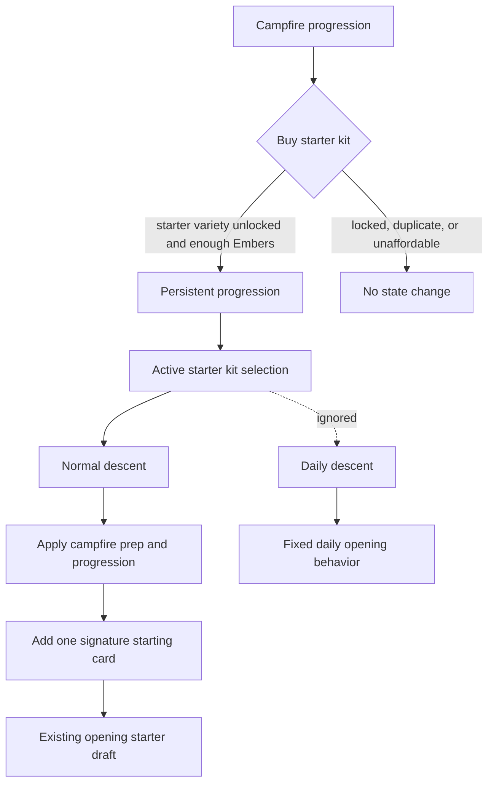

# Starter Kit Ember Unlocks - Plan

## Goal Capsule

- **Objective:** Add Ember-unlocked starter kits so a selected normal-run kit grants one signature starting card before room 1 while preserving the existing starter draft.
- **Product authority:** The Product Contract defines player-facing behavior; the Planning Contract defines implementation choices that must preserve that behavior.
- **Execution profile:** Standard code plan with pure progression/meta tests first, then Phaser scene integration, balance checks, and browser smoke.
- **Stop conditions:** Stop if implementation would change the Product Contract, make kits mandatory, affect daily runs, grant raw permanent stats, or make the existing starter-card-variety unlock irrelevant.
- **Tail ownership:** The implementer owns automated validation, manual smoke, and cleanup of obsolete exploratory code before claiming done.

---

## Product Contract

### Summary

Ember progression should unlock named starter kits for normal runs.
Each kit gives the run one signature starting card while preserving the existing starter draft, so the player feels the unlock immediately without turning the opener into a fixed class deck.

### Problem Frame

The current Ember economy has one durable unlock: starter-card variety.
That unlock broadens the opening draft, but unlocked cards can still feel like they did not change the next run because the player starts with the same early decision shape.
A larger reward pool would make variety appear later and less reliably.
The next family should make Ember progress visible at the start of a normal descent while respecting the Gold and Embers split, daily-run fairness, and the no raw permanent stat-upgrade boundary.

### Key Decisions

- **Use starter kits as the next Ember family.** Class-like kits make the unlock understandable and visible before the first room.
- **Grant one signature starting card.** A single card gives identity without replacing the existing opening-choice flow.
- **Keep the starter draft.** The player still makes the current opening card choices after selecting a kit, so the run is not a fully preset build.
- **Limit kits to normal runs.** Daily runs stay fixed and outside Ember progression.
- **Keep progression horizontal.** Kits should create different play patterns, not raw permanent HP, damage, armor, or block increases.

### Requirements

**Progression role**

- R1. Embers must unlock named starter kits as the next variety-focused progression family.
- R2. A starter kit unlock must be durable and reusable for normal runs, not a one-run consumable.
- R3. Starter kits must extend the existing Ember progression path without invalidating the starter-card-variety unlock or migration bonus.

**Run start behavior**

- R4. Before starting a normal run, the player must be able to choose at most one unlocked starter kit or choose no kit.
- R5. A selected kit must add one signature starting card to the run before room 1.
- R6. The existing opening starter draft must still happen when a kit is selected.
- R7. Daily runs must ignore starter kits and remain fixed for comparability.

**Kit identity and balance**

- R8. Each kit must communicate a distinct play style through its signature card.
- R9. The first kit set should cover meaningfully different archetypes such as aggression, defense or sustain, and status or tempo.
- R10. Starter kits must not grant unconditional permanent HP, damage, armor, block, or similar raw stat upgrades.
- R11. Starter kits must preserve the current challenge band rather than making normal runs broadly easier by default.

**Campfire clarity**

- R12. The campfire progression surface must show which kits are locked, unlocked, and available to choose for the next normal run.
- R13. Each kit must show enough information about its signature card for the player to understand the run identity before spending Embers or descending.
- R14. The UI must continue teaching that Gold is for the current run and Embers are for long-term progress.

### Key Flows

- F1. Unlock a starter kit
  - **Trigger:** The player visits campfire progression with enough Embers.
  - **Steps:** The progression surface shows locked starter kits, their themes, their signature cards, and their Ember costs; the player buys one kit.
  - **Outcome:** The kit becomes a durable normal-run option.
  - **Covered by:** R1, R2, R8, R12, R13.

- F2. Start a normal run with a kit
  - **Trigger:** The player starts a normal descent after unlocking one or more kits.
  - **Steps:** The player chooses one kit or no kit, then uses the existing opening starter draft.
  - **Outcome:** The run begins with the selected kit's signature card plus the drafted starter cards.
  - **Covered by:** R4, R5, R6, R8, R11.

- F3. Start a daily run
  - **Trigger:** The player starts a daily descent after unlocking starter kits.
  - **Steps:** The daily run bypasses kit selection and uses the fixed daily opening behavior.
  - **Outcome:** Daily comparisons are unaffected by Ember progression.
  - **Covered by:** R7.

### Acceptance Examples

- AE1. **Covers R1, R2, R12, R13.** Given a player has enough Embers, when they buy a locked starter kit at the campfire, then that kit becomes an unlocked reusable option and the player can see its signature-card identity.
- AE2. **Covers R4, R5, R6.** Given a player selects an unlocked starter kit before a normal descent, when the run starts, then the run includes the kit's signature card and still presents the normal starter draft.
- AE3. **Covers R4, R6.** Given a player chooses no kit, when a normal run starts, then the run uses the current opening draft without a kit signature card.
- AE4. **Covers R7.** Given a player has unlocked starter kits, when they start a daily run, then the daily opening ignores those kits.
- AE5. **Covers R8, R10, R11.** Given a kit is unlocked, when it changes the next run, then the change is a visible play-style difference rather than an unconditional raw stat increase.

### Success Criteria

- A player can describe an Ember kit as "a starting identity with one signature card."
- Unlocking a kit changes the next normal run before the first room.
- The opening still feels like Escape's draft-based start rather than a fixed class loadout.
- Daily runs remain comparable after kits are unlocked.
- Planning can proceed without re-deciding whether kits are durable, optional, normal-run-only, or stat-upgrade-free.

### Scope Boundaries

**Deferred for later**

- Fixed starter decks that replace the opening draft.
- Starting relic themes.
- Late-run card-pool unlocks.
- Additional relic families.
- Feat contracts, challenge ladders, or achievement chains.
- Randomized campfire market design.

**Outside this version's identity**

- Raw permanent stat upgrades.
- Making a starter kit mandatory for normal runs.
- Replacing the existing starter draft with a full class selection screen.
- Letting daily runs benefit from Ember progression.

### Dependencies / Assumptions

- `docs/plans/2026-06-27-001-feat-gold-embers-economy-plan.md` remains the authority for Gold as run-local currency and Embers as long-term progression.
- `src/meta.ts` currently stores Ember progression with starter-card variety as the only durable unlock family.
- `src/game/progression.ts` currently models one Ember purchase and can be extended in planning.
- `src/scenes/Progression.ts` currently presents one progression panel and should not become a crowded shop.
- The first starter-kit set can use existing card types and effects as balance anchors, but exact card definitions are planning work.

### Outstanding Questions

**Deferred to Planning**

- What are the first kit names, signature-card names, card effects, and Ember costs?
- Should the chosen kit persist as a default between normal runs, or should each normal descent ask for the kit choice?
- How many kits should ship in the first implementation pass while still covering distinct archetypes?

### Sources / Research

- `docs/plans/2026-06-27-001-feat-gold-embers-economy-plan.md` established the Gold and Embers split, starter-card variety as the first Ember unlock, and the boundary against raw permanent stat upgrades.
- `src/meta.ts` shows the current persisted progression state and migration shape.
- `src/game/progression.ts` shows the current single Ember unlock rule and summary formatting.
- `src/scenes/Progression.ts` shows the current campfire progression surface and its "Gold is for this run. Embers are for long-term progress." teaching copy.
- `src/data/cards.ts` shows existing card types, tiers, and status effects that can anchor starter-kit signature cards.

---

## Planning Contract

### Product Contract Preservation

Product Contract unchanged.
The Product Contract's deferred planning questions are resolved here: the first implementation ships three kits, each kit costs 6 Embers, and the active kit persists as the campfire's selected normal-run kit until the player changes it or clears it.

### Research Summary

Escape is a Phaser 3, TypeScript, Vite, and Vitest browser game with strict compiler settings, colocated pure-rule tests, and Phaser scene integration for visual flows.
Current progression is already split cleanly: persistent Embers and progression live in `src/meta.ts`, progression purchase rules live in `src/game/progression.ts`, normal runs apply persistent progression through campfire prep, and daily runs bypass that prep path.
The existing start room builds starter-card offers from the run's starting-card fields, so a starter kit should add one signature card to the run before the existing draft rather than replacing the draft.
No `docs/solutions/` learning corpus or `CONCEPTS.md` file exists in this repo, so planning relies on the Product Contract, current source, prior plans, and memory-derived Escape preferences.

### Key Technical Decisions

- KTD1. **Make starter kits data-driven.** Add a starter-kit definition layer with kit id, name, archetype, Ember cost, description, and signature card id so progression rules, UI, tests, and simulator use one source of truth.
- KTD2. **Ship three 6-Ember MVP kits.** Use Duelist with Riposte as aggression, Warden with Field Dressing as defense or sustain, and Hexbinder with Cinder Hex as status or tempo.
- KTD3. **Gate kits behind starter-card variety.** The existing 4-Ember starter-card-variety unlock remains the first Ember milestone, and kit purchases become available only after it is unlocked.
- KTD4. **Persist unlocked kits and one active kit.** Add unlocked starter-kit ids and an active starter-kit id to persistent progression, normalize unknown ids away, and clear an active selection that is no longer unlocked.
- KTD5. **Apply kits only through normal-run prep.** Normal descents receive the active kit's signature card before the opening draft; daily descents continue to bypass Ember progression.
- KTD6. **Model kit balance in the simulator.** The simulator must include signature starter cards so the challenge-band tests represent the shipped loop.

### High-Level Technical Design

### Sequencing

1. Add kit data, signature cards, and pure progression rules first so persistence and scenes share stable concepts.
2. Extend persistent meta normalization before wiring scenes so old saved data and debug setters cannot produce invalid kit state.
3. Apply active kits to normal runs and the simulator before UI work so the behavior is covered outside Phaser.
4. Wire campfire/progression UI after the rules are stable.
5. Finish with copy, docs, full validation, and browser smoke.

### System-Wide Impact

- Persistent browser storage gains additive progression fields and must normalize old saves safely.
- The campfire progression screen becomes a multi-family progression surface, so density and readability matter.
- Normal-run start state changes, while daily-run start state must remain unchanged.
- Balance tests must account for the extra signature card because it changes early combat strength before room 1.

### Risks & Dependencies

- **Power creep:** A free signature card can raise win rate more than intended; simulator guardrails must fail if kits erase the challenge band.
- **Unlock order confusion:** Kits appearing before starter-card variety would make the existing first unlock feel obsolete.
- **UI density:** The progression scene has one focused panel today; kit cards must stay compact enough to scan.
- **Save compatibility:** Unknown or stale kit ids in local storage must normalize to safe defaults.

### Sources / Research

- `docs/plans/2026-06-27-001-feat-gold-embers-economy-plan.md` provides the economy baseline and deferred "Additional Ember unlock families" slot.
- `docs/plans/2026-06-27-002-feat-starter-kit-ember-unlocks-plan.md` Product Contract defines the starter-kit behavior.
- `src/meta.ts` and `src/meta.test.ts` show current persistent meta normalization and migration tests.
- `src/game/progression.ts` and `src/game/progression.test.ts` show current Ember purchase rule shape.
- `src/game/campfirePrep.ts` and `src/game/campfirePrep.test.ts` show the current normal-run prep seam and daily-run exclusion.
- `src/scenes/Campfire.ts`, `src/scenes/Progression.ts`, and `src/scenes/Dungeon.ts` show campfire actions, progression UI, and opening-card draft behavior.
- `src/game/balanceSimulator.ts` and `src/game/balanceSimulator.test.ts` provide the current challenge-band guardrails.

---

## Implementation Units

### U1. Add Starter Kit Data And Signature Cards

- **Goal:** Define the first starter-kit family and signature cards as reusable data.
- **Requirements:** R1, R8, R9, R10, AE5.
- **Dependencies:** None.
- **Files:** `src/data/cards.ts`, `src/data/starterKits.ts`, `src/data/starterKits.test.ts`.
- **Approach:** Add three starter kits with 6-Ember costs: Duelist with Riposte, Warden with Field Dressing, and Hexbinder with Cinder Hex.
  Riposte should be a tier-1 attack/utility card that deals 5 damage and gains 2 block.
  Field Dressing should be a tier-1 block/heal card that gains 5 block and restores 2 HP.
  Cinder Hex should be a tier-1 status card that deals 2 damage and applies 2 burn for 2 turns.
  Keep each signature card horizontal: it should create a distinct play pattern without raising player stats outside the card system.
- **Execution note:** Implement the kit data and card references test-first so missing or mistyped card ids fail before scene wiring.
- **Patterns to follow:** Mirror `src/data/relics.ts` for small definition modules and `src/data/cards.ts` for card ids, tiers, colors, descriptions, and effect shapes.
- **Test scenarios:**
  - Every starter kit references an existing signature card id.
  - Starter-kit ids are unique and stable.
  - Every kit has cost 6 and a non-empty archetype/description for UI display.
  - Riposte, Field Dressing, and Cinder Hex have the planned tier, effect mix, and starter-level values.
  - Signature cards use existing effect kinds and do not encode permanent HP, damage, armor, or block upgrades outside card effects.
  - Unknown kit lookup throws a useful error, matching `relicDef` style.
- **Verification:** The first kit set is available as pure data and can be used by progression rules without duplicating card or cost definitions.

### U2. Extend Progression State And Purchase Rules

- **Goal:** Persist unlocked starter kits, enforce the unlock order, and support one active normal-run kit selection.
- **Requirements:** R1, R2, R3, R4, R12, AE1, AE3.
- **Dependencies:** U1.
- **Files:** `src/meta.ts`, `src/meta.test.ts`, `src/game/progression.ts`, `src/game/progression.test.ts`.
- **Approach:** Extend persistent progression with unlocked starter-kit ids and an active starter-kit id.
  Normalize missing arrays to empty, filter unknown ids, deduplicate saved ids, and clear active kit ids that are not unlocked.
  Add pure rules to buy a starter kit and to set or clear the active starter kit.
  Purchases should fail when starter-card variety is still locked, when the kit is already unlocked, or when Embers are insufficient.
- **Execution note:** Add normalization and purchase tests before modifying Phaser scenes or run-start behavior.
- **Patterns to follow:** Reuse `normalizeProgression`, `buyStarterCardVarietyUnlock`, and existing `MetaState` load/save tests.
- **Test scenarios:**
  - Old saved meta without starter-kit fields normalizes to no unlocked kits and no active kit.
  - Saved progression with duplicate, invalid, or stale active kit ids normalizes to a deduplicated unlocked list and safe active value.
  - Covers AE1. Buying a kit after starter-card variety is unlocked and enough Embers are available spends 6 Embers and adds the kit to unlocked kits.
  - Buying a kit fails without starter-card variety, with insufficient Embers, for duplicate purchases, and for unknown kit ids.
  - Covers AE3. Selecting `null` clears the active kit, and selecting an unlocked kit sets it active.
  - Selecting a locked or unknown kit fails without mutating state.
- **Verification:** Persistent progression can safely store starter-kit unlocks and one active selection across save/load, debug setters, and malformed local storage.

### U3. Apply Active Kits To Normal Runs

- **Goal:** Make a selected starter kit add one signature card before the normal-run opening draft while daily runs remain fixed.
- **Requirements:** R4, R5, R6, R7, R11, F2, F3, AE2, AE3, AE4, AE5.
- **Dependencies:** U1, U2.
- **Files:** `src/state.ts`, `src/game/campfirePrep.ts`, `src/game/campfirePrep.test.ts`, `src/game/startingCards.ts`, `src/game/startingCards.test.ts`, `src/game/balanceSimulator.ts`, `src/game/balanceSimulator.test.ts`.
- **Approach:** Add run-state fields only as needed to record the active starter kit and ensure the signature card is added once before draft selection.
  Normal runs should apply the active kit from persistent progression through the same campfire prep seam that already applies starter-card variety.
  The signature card must not count against opening draft picks, and choosing no kit should preserve current behavior.
  Daily runs should continue to skip the prep/progression path.
  The simulator should support scenarios with active starter kits and should choose starting cards after the signature card is present.
- **Execution note:** Keep this behavior covered in pure tests before relying on Phaser start-room smoke.
- **Patterns to follow:** Follow the existing `applyPendingPrepToRun`, `startingCardIdsForRun`, `chooseStartingCards`, and balance simulator scenario patterns.
- **Test scenarios:**
  - Covers AE2. Applying progression with an active unlocked kit adds exactly that kit's signature card before the opening draft.
  - Covers AE3. Applying progression with no active kit leaves the starting deck behavior unchanged.
  - Applying progression with a stale active kit id ignores it after normalization.
  - Signature cards do not increment `startingCardsTaken` and do not reduce the number of opening draft picks.
  - Covers AE4. Daily-run creation still bypasses starter kits and uses the fixed opening offer.
  - Balance simulator can run each MVP starter kit scenario and keeps baseline challenge-band assertions meaningful.
- **Verification:** Normal runs receive exactly one selected signature card before room 1, the draft still works, and daily runs remain isolated from Ember progression.

### U4. Wire Progression And Campfire UI

- **Goal:** Let players buy, view, select, and clear starter kits from the campfire progression surface.
- **Requirements:** R4, R12, R13, R14, F1, F2, AE1, AE3.
- **Dependencies:** U1, U2.
- **Files:** `src/game/progression.ts`, `src/game/progression.test.ts`, `src/game/campfireSummary.ts`, `src/game/campfireSummary.test.ts`, `src/scenes/Progression.ts`, `src/scenes/Campfire.ts`.
- **Approach:** Expand progression formatting so it summarizes starter-card variety and starter kits without introducing obscure currency names.
  The progression scene should show each kit's locked/unlocked/active state, cost, archetype, and signature-card description.
  Player actions should support buying an affordable locked kit, selecting an unlocked kit, and clearing the active kit for a no-kit normal run.
  The campfire's next-run summary should include the active kit so the player sees the selected identity before descending.
- **Execution note:** Add formatter and rule tests before adjusting Phaser layout.
- **Patterns to follow:** Follow the current `ProgressionScene` redraw pattern, `meta-update` event handling, fixed-width text wrapping, and `formatStarterCardProgressionSummary` tests.
- **Test scenarios:**
  - Covers AE1. Progression formatting shows a locked kit with cost and signature-card identity.
  - Unlocked inactive kits and the active kit have distinct summary text.
  - Buying and selecting through pure progression rules updates Embers, unlocked kits, and active kit as expected.
  - Covers AE3. Clearing active kit updates summary text to a no-kit state.
  - The formatted text does not mention Ash or Kindling.
  - Debug `meta-update` still refreshes visible progression and campfire summaries.
- **Verification:** The campfire progression loop teaches what kits do, lets the player choose one normal-run identity, and remains consistent with the Gold/Embers split.

### U5. Update Copy, Documentation, And Full Validation

- **Goal:** Align player-facing copy and documentation with starter kits and prove the full loop.
- **Requirements:** R8, R11, R14, all acceptance examples.
- **Dependencies:** U1, U2, U3, U4.
- **Files:** `README.md`, `src/scenes/Title.ts`, `src/scenes/Dungeon.ts`, `docs/plans/2026-06-27-002-feat-starter-kit-ember-unlocks-plan.md`.
- **Approach:** Update concise instructions where the game explains Embers, starter progression, and run start behavior.
  Add start-room feedback if the active kit's signature card was added so the run identity is visible before the player leaves the first room.
  Keep documentation and visible copy focused on "Gold is for this run; Embers are for long-term progress."
- **Test scenarios:**
  - Test expectation: none for README and title copy; behavior is covered by U1-U4 tests and manual smoke.
  - Covers AE2. Manual smoke confirms selecting a kit, descending, and seeing the signature-card run identity before leaving room 1.
  - Covers AE4. Manual smoke confirms daily descent ignores an active kit.
  - Covers AE5. Manual smoke confirms starter kits feel like card-based identity changes, not raw stat upgrades.
- **Verification:** Player-facing copy and smoke-tested behavior agree with the Product Contract, and no stale text describes Embers as a next-run supply wallet.

---

## Verification Contract

| Gate | Command | Done Signal |
|---|---|---|
| Starter kit rules | `npm test -- src/data/starterKits.test.ts src/meta.test.ts src/game/progression.test.ts src/game/campfirePrep.test.ts src/game/startingCards.test.ts src/game/campfireSummary.test.ts` | Starter-kit data, persistence, purchase, selection, run-start, and formatter tests pass. |
| Balance guardrails | `npm test -- src/game/balanceSimulator.test.ts` | Simulator includes active kit scenarios and challenge-band assertions remain bounded. |
| Full test suite | `npm test` | All Vitest tests pass. |
| Typecheck and build | `npm run build` | TypeScript and Vite production build pass. |
| Lint | `npm run lint` | ESLint exits cleanly under strict unused-symbol rules. |
| Format | `npm run format:check` | Prettier reports all matched files are formatted. |

Manual smoke with the dev server must cover:

- Fresh profile: progression shows starter-card variety first and locked starter kits after it.
- Unlock path: after starter-card variety is unlocked, buying a starter kit spends Embers and marks it unlocked.
- Selection path: selecting an unlocked kit updates campfire next-run summary.
- Normal descent: selected kit adds its signature card and the normal starter draft still occurs.
- No-kit path: clearing the selected kit starts a normal run with current starter behavior.
- Daily descent: active starter kit is ignored.

---

## Definition of Done

- Product Contract behavior is preserved, including optional normal-run starter kits, one signature starting card, the existing starter draft, daily-run exclusion, and no raw permanent stat upgrades.
- `artifact_readiness` is `implementation-ready`, and no launch-blocking open question remains.
- All implementation units satisfy their listed test scenarios and verification outcomes.
- Automated gates in the Verification Contract pass.
- Manual smoke confirms unlock, selection, no-kit, normal-run, and daily-run flows.
- The balance simulator includes starter-kit scenarios and continues to protect the intended challenge band.
- Abandoned exploratory code, stale imports, obsolete copy, and unreachable UI paths are removed from the final diff.
