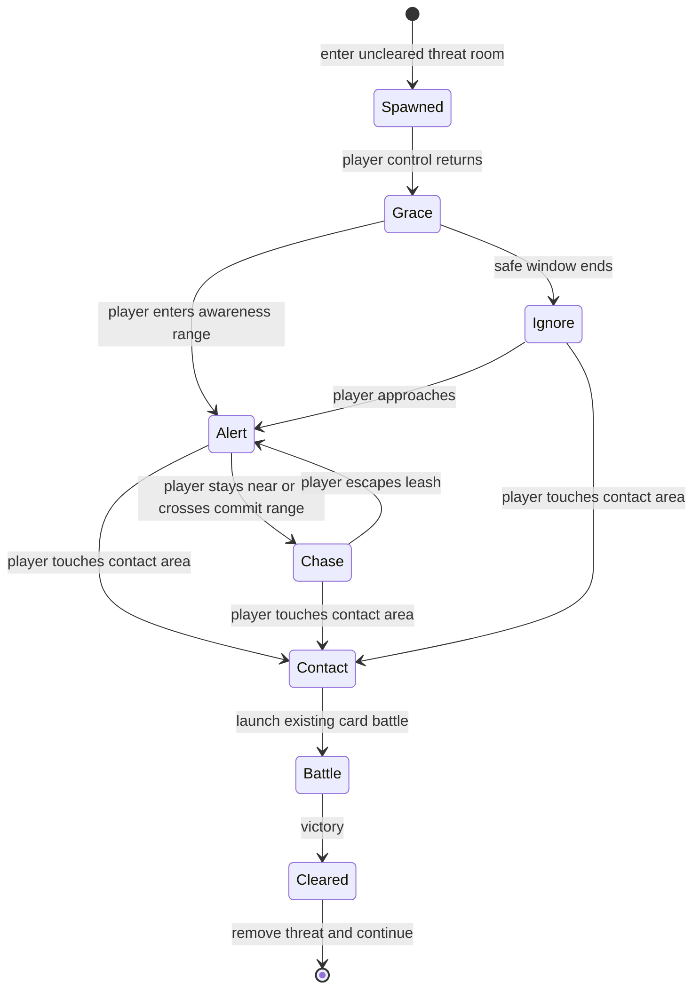
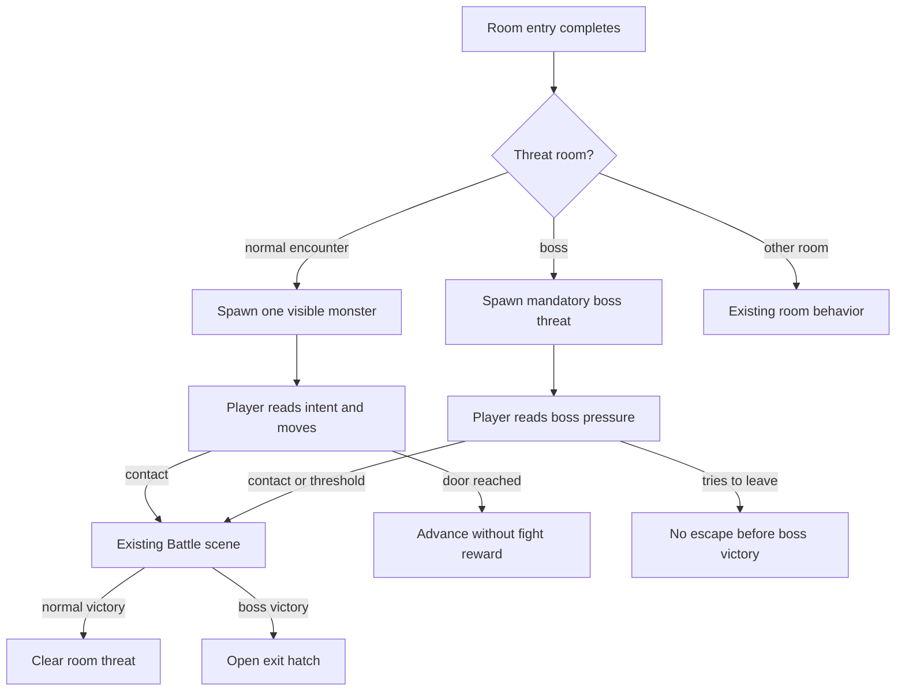

# Room Threat System - Plan

## Goal Capsule

- **Objective:** Add a room threat system that makes encounter rooms spatial before combat: one visible monster can alert, chase, and start battle on contact.
- **Product authority:** The Product Contract defines player-facing dungeon behavior; planning owns technical structure, tuning, and exact implementation.
- **Execution profile:** Standard code plan with pure dungeon-rule tests first, Phaser scene integration second, then balance/readability validation and browser smoke.
- **Stop conditions:** Stop if implementation changes Product Contract behavior, lets boss rooms be skipped, adds multiple active monsters, replaces card combat, or requires persistent backtracking state.
- **Tail ownership:** The implementer owns automated validation, visible dungeon smoke, cleanup of abandoned exploratory code, and documentation updates before claiming done.

---

## Product Contract

### Summary

Encounter rooms should become playable threat spaces before combat.
In v1, a room threat system manages one visible monster, starts the existing card battle on contact, lets normal encounter rooms be escaped under pressure, and keeps boss encounters mandatory.

### Problem Frame

Escape currently sells itself as a top-down dungeon crawler where walking matters, but entering an encounter room starts combat immediately.
That makes encounter rooms feel like door-triggered battle menus instead of spaces the player reads, navigates, and reacts to.
The next step should make pre-battle movement meaningful without replacing the card battle system or redesigning the whole dungeon generator.

### Key Decisions

- **Use a room threat system boundary.** The feature should be framed around room-level threat behavior, not a thin contact check attached to the existing monster image.
- **Ship one active monster in v1.** The system may own room-level responsibilities, but the first slice proves the feel with one visible monster per encounter room.
- **Allow normal-room escape under pressure.** Open-door avoidance is intentional, but it should feel tense through alert and chase behavior rather than becoming a free skip.
- **Make boss encounters mandatory.** Boss rooms must not allow escape without the fight, preserving the final-room commitment.
- **Treat readability as core behavior.** The player must be able to tell when a monster is ignoring, alerting, chasing, or dangerous to touch.

### Requirements

**Encounter room behavior**

- R1. Entering a normal encounter room must no longer start battle by itself.
- R2. A normal encounter room must present one visible monster before combat starts.
- R3. Touching the visible monster or its readable contact area must start the existing card battle for that room.
- R4. Normal encounter rooms must allow the player to leave before fighting, but the monster behavior must make that escape pressured when the monster is alert or chasing.
- R5. Winning the battle must clear the room threat so the same room does not restart the encounter.

**Threat behavior**

- R6. The room threat system must own the visible monster's active room behavior, including intent state, movement, contact readiness, battle handoff, pause, resume, and cleanup.
- R7. V1 must support one active monster in the room, even if the system boundary leaves room for later multi-threat behavior.
- R8. Monster behavior must fit inside the current room space and respect safe entry so the player is not forced into instant contact after a room transition.
- R9. Threat behavior must be repeatable for the same seeded run or daily descent so pre-battle movement does not undermine comparability.

**Readability and feedback**

- R10. Monster intent must be visible enough for the player to distinguish ignore, alert, chase, and contact danger before collision.
- R11. Contact must produce immediate feedback and a battle transition that feels like a result of touching the monster, not a delayed room-entry trigger.
- R12. Visual markers, motion, and contact areas must stay readable on the live Phaser canvas during normal movement.

**Boss rooms**

- R13. Boss rooms must still require the boss fight before escape is possible.
- R14. Boss-room threat behavior may use the room threat system, but it must not let the player bypass the boss by leaving.
- R15. Boss readability should preserve the boss as a climax rather than making it feel like a skippable roaming monster.

### Key Flows

- F1. Normal encounter pressure
  - **Trigger:** The player enters an uncleared normal encounter room.
  - **Steps:** A visible monster appears in the room; the player can move, read intent, avoid or approach the monster, and choose whether to try leaving.
  - **Outcome:** Touching the monster starts battle; reaching a door exits the room under pressure.
  - **Covered by:** R1, R2, R3, R4, R10.

- F2. Battle and clear
  - **Trigger:** The player contacts the room monster.
  - **Steps:** The dungeon pauses into the existing card battle; after victory, the room threat is removed and the room is marked clear.
  - **Outcome:** The player can continue navigating without retriggering that encounter.
  - **Covered by:** R3, R5, R6, R11.

- F3. Boss commitment
  - **Trigger:** The player enters the boss room.
  - **Steps:** The boss presents a readable threat, but room exit remains locked behind the boss fight.
  - **Outcome:** The player must defeat the boss before escape can proceed.
  - **Covered by:** R13, R14, R15.

### Acceptance Examples

- AE1. **Covers R1, R2, R3.** Given the player enters an uncleared normal encounter room, when they do not touch the visible monster, then battle does not start.
- AE2. **Covers R3, R11.** Given the player contacts the visible monster, when contact occurs, then the existing card battle starts with contact feedback.
- AE3. **Covers R4.** Given the player avoids an alert or chasing monster and reaches an open door, when they leave the normal encounter room, then the room remains an unresolved threat rather than a cleared fight.
- AE4. **Covers R5.** Given the player wins the battle, when they return to or remain in that room, then the room threat no longer starts that encounter.
- AE5. **Covers R8.** Given the player has just transitioned into an encounter room, when control returns, then the monster cannot immediately force battle before the player can react.
- AE6. **Covers R10, R12.** Given a monster changes from ignore to alert or chase, when the player watches the room, then the state change is visible during live movement.
- AE7. **Covers R13, R14.** Given the player reaches the boss room, when they try to escape without fighting, then escape remains blocked until the boss is defeated.

### Success Criteria

- Encounter rooms feel like a spatial pre-battle decision instead of a room-entry countdown.
- Players can describe why contact happened because they saw the monster's behavior first.
- Avoiding a normal encounter is possible but tense enough that it does not feel like a free reward.
- Boss rooms still preserve the run climax and cannot be skipped.
- Planning can proceed without re-deciding single-monster v1 scope, normal-room escape, or boss mandatory behavior.

### Scope Boundaries

**Deferred for later**

- Multiple active monsters in one room.
- Encounter-plus rooms that mix several reward or hazard systems.
- Multi-monster battles or single battles triggered by touching any monster in a group.
- Vision cones, stealth systems, or security-camera-style detection.
- Battle advantages, reward modifiers, or balance bonuses based on who touched whom first.

**Outside this version's identity**

- Replacing card combat with real-time combat.
- Turning every room into a threat room.
- Making the room threat system a broad entity-component framework.
- Letting the boss room be escaped without defeating the boss.

### Dependencies / Assumptions

- The existing Battle scene, rewards, and room-cleared flow remain the combat handoff.
- Current room movement, door transitions, pickup proximity, trap feedback, and boss victory flow remain the interaction baseline.
- The first implementation can use existing monster art and intent markers before adding new visual assets.
- Browser smoke is required because Phaser canvas behavior can be logically correct while still reading poorly on screen.

### Outstanding Questions

**Deferred to Planning**

- Which initial movement profiles should ship for ignore, alert, chase, and boss pressure?
- What contact radius, grace window, and safe-entry placement make contact feel fair?
- What visual language best communicates ignore, alert, chase, and contact danger without clutter?
- How should an unresolved normal encounter behave if the player leaves and later re-enters that room?
- Should boss rooms use a stationary guard, slow advance, or threshold trigger while still requiring the fight?

### Sources / Research

- `docs/ideation/2026-06-28-contact-triggered-dungeon-monsters-ideation.html` ranks room monster actor and contact-triggered monster behavior ideas.
- `README.md` documents the current player-facing rule that entering an encounter room starts the fight immediately.
- `src/scenes/Dungeon.ts` contains the current room construction, room-entry battle trigger, movement loop, proximity interactions, battle handoff, and boss victory flow.
- `src/data/enemies.ts` contains normal enemy and boss definitions without dungeon movement behavior for normal enemies.
- `src/dungeon/rooms.ts` contains room event generation, blocked entry doors, and trap fairness placement.
- `docs/solutions/ui-bugs/phaser-screen-layout-readability-regressions.md` records the repo-local lesson that visible Phaser behavior needs browser smoke validation.

---

## Planning Contract

### Product Contract Preservation

Product Contract unchanged.
Planning resolves the deferred questions by choosing a one-way normal encounter escape model, deterministic single-monster threat profiles, contact tuning anchored to existing proximity interactions, and mandatory boss-room commitment.

### Research Summary

Escape is a strict TypeScript, Phaser 3, Vite, and Vitest browser game.
Runtime code is organized under `src/`, with scenes in `src/scenes/`, room-generation rules in `src/dungeon/`, enemy data in `src/data/`, and pure gameplay helpers under `src/game/`.
The current dungeon creates each entered room on demand, destroys the prior room after the camera pan, and blocks the entry door in generated rooms, so normal encounter escape can advance to the next room without needing a new room-history model.
The current encounter path stores `enemy` and `enemySprite` in `BuiltRoom`, shows a red `!` on room entry, waits 450ms, and launches the existing Battle scene.
Existing proximity interactions use tuned distances and rectangles for doors, pickups, rest rooms, spikes, and the exit hatch; trap generation already reserves safe entry cells.
The repo has one relevant learning in `docs/solutions/ui-bugs/phaser-screen-layout-readability-regressions.md`: visible Phaser behavior needs browser smoke because correct logic can still read poorly on canvas.

### Key Technical Decisions

- KTD1. **Keep threat rules deterministic and pure-testable.** Put profile selection, safe-entry placement, intent transitions, contact readiness, and movement decisions behind pure dungeon helpers before wiring Phaser objects.
- KTD2. **Use one room threat with one active monster in v1.** The scene may hold a room-level threat object, but it owns only the current encounter monster and does not introduce a general entity system.
- KTD3. **Resolve normal escape as one-way advancement.** Leaving a normal encounter advances through the existing door transition, awards no enemy card or Gold, and does not preserve a revisitable unresolved room.
- KTD4. **Preserve boss commitment through existing room shape.** Boss rooms keep no open exit doors before victory; the room threat can render boss pressure, but escape still depends on defeating the boss and opening the hatch.
- KTD5. **Use behavior profiles on enemy definitions.** Normal enemies gain lightweight dungeon profiles, and bosses gain a boss-pressure profile while combat cards and boss specials remain unchanged.
- KTD6. **Treat live readability as part of completion.** Automated tests prove deterministic rules and state transitions; browser smoke proves markers, movement, contact, and boss commitment are readable in the Phaser canvas.

### High-Level Technical Design

### Sequencing

1. Add pure room-threat rules and tests before touching Phaser rendering.
2. Add enemy behavior profile data and validate every enemy has a profile.
3. Replace room-entry auto-battle with scene-owned threat lifecycle and contact handoff.
4. Wire normal escape and mandatory boss behavior against the existing one-way room transition model.
5. Update docs and run automated plus browser validation.

### System-Wide Impact

- Dungeon pacing changes because normal encounters can be skipped at the cost of losing fight rewards.
- Boss completion remains the run's hard final gate.
- The room-generation model stays one-way; no persistent room map or backtracking state is introduced.
- The Battle scene and reward flow remain the combat authority after contact.
- Daily Descent repeatability depends on deterministic threat profile selection, placement, and movement.

### Risks & Dependencies

- **Encounter skips can over-ease runs.** Mitigate by making escape pressured, giving no combat reward on skip, and preserving current simulator baselines as fight-taken balance rather than modeling optimal skipping in v1.
- **Canvas readability can fail despite correct state.** Mitigate with state-driven markers, bounded motion, and browser smoke for encounter and boss rooms.
- **Scene complexity can grow quickly.** Mitigate by keeping state transitions in pure helpers and limiting the scene to Phaser object ownership and event handoff.
- **Boss pressure can accidentally feel optional.** Mitigate by keeping boss exits locked before victory and validating attempted escape in smoke.

### Sources / Research

- The Product Contract section above defines the behavioral scope and non-goals.
- `docs/ideation/2026-06-28-contact-triggered-dungeon-monsters-ideation.html` records the selected contact-triggered monster direction and room-threat framing.
- `src/scenes/Dungeon.ts` shows room construction, door transitions, current room-entry battle start, proximity interactions, and battle cleanup.
- `src/dungeon/rooms.ts` shows one-way room generation, blocked entry doors, room 10 boss creation, and trap fair-cell placement.
- `src/data/enemies.ts` shows the current enemy and boss definition shape.
- `src/game/rng.ts` and `src/game/test-rng.ts` provide the GameRng abstraction and deterministic test helper.
- `docs/solutions/ui-bugs/phaser-screen-layout-readability-regressions.md` provides the live-canvas validation learning.

---

## Implementation Units

### U1. Add Deterministic Room Threat Rules

- **Goal:** Create a pure room-threat rule layer for profiles, intent transitions, safe entry, contact readiness, movement bounds, and one-way escape policy.
- **Requirements:** R3, R4, R6, R7, R8, R9, R10, R11, AE1, AE2, AE3, AE5, AE6.
- **Dependencies:** None.
- **Files:** `src/dungeon/roomThreat.ts`, `src/dungeon/roomThreat.test.ts`, `src/config.ts`.
- **Approach:** Model the room threat independently from Phaser rendering, using room dimensions, entry direction, player position, elapsed time, and a profile to produce intent, movement target, contact readiness, and escape allowance. Use initial profile contracts for ignore, patrol, alert-chase, and boss pressure. Keep exact pixel tuning centralized with existing dungeon constants, using existing pickup and trap thresholds as scale anchors.
- **Execution note:** Implement rule tests first because the scene integration will be harder to debug if state transitions are implicit.
- **Patterns to follow:** `src/dungeon/rooms.ts` for pure dungeon rules, `src/dungeon/rooms.test.ts` for fairness tests, and `src/game/test-rng.ts` for deterministic RNG coverage.
- **Test scenarios:**
  - Covers AE1. Given a newly entered normal encounter room inside the safe-entry grace window, when the player is not in contact range, then battle readiness remains false.
  - Covers AE2. Given the player crosses the readable contact area after grace, when contact is evaluated, then the rule reports battle readiness.
  - Covers AE3. Given a normal encounter threat is active and the player reaches an open door without contact, when escape is evaluated, then the room may transition without marking the threat cleared.
  - Covers AE5. Given every entry direction, when a threat is placed or starts moving, then its initial active contact cannot overlap the player's entry cell or breathing-room cell.
  - Covers AE6. Given an alert-chase profile, when the player enters awareness range and then commit range, then intent advances through readable alert/chase states.
  - Given the same seed, room depth, entry direction, and profile, when the threat initializes twice, then initial placement and patrol selection match.
  - Given movement updates over multiple ticks, when the profile patrols or chases, then the target stays inside walkable room bounds.
- **Verification:** Threat rules expose deterministic behavior that can be tested without booting Phaser, and no Product Contract requirement depends on scene-only hidden state.

### U2. Add Enemy Dungeon Behavior Profiles

- **Goal:** Attach lightweight dungeon behavior profiles to normal enemies and bosses without changing combat cards, HP, specials, or enemy combat selection.
- **Requirements:** R2, R7, R9, R10, R13, R14, R15, AE6, AE7.
- **Dependencies:** U1.
- **Files:** `src/data/enemies.ts`, `src/data/enemies.test.ts`, `src/dungeon/roomThreat.ts`.
- **Approach:** Extend enemy definitions with a dungeon behavior profile or derive one through a small data helper. Use weaker enemies for calmer ignore/patrol behavior, stronger enemies for alert-chase pressure, and bosses for boss-pressure behavior. Keep profile names few and observable so enemy data does not become vague.
- **Patterns to follow:** Existing `EnemyDef` fields in `src/data/enemies.ts`, boss special definitions, and enemy generation tests in `src/data/enemies.test.ts`.
- **Test scenarios:**
  - Given every normal enemy definition, when profiles are inspected, then each enemy resolves to a known non-boss threat profile.
  - Given every boss definition, when profiles are inspected, then each boss resolves to the boss-pressure profile.
  - Given `spawnEnemy()` and `spawnBoss()`, when enemies are generated for combat, then card counts and boss specials remain unchanged from current expectations.
  - Given an unknown or missing profile is introduced in data, when tests run, then the profile contract test fails.
- **Verification:** Enemy data can drive dungeon behavior variety while preserving existing battle generation behavior.

### U3. Integrate Threat Actor Lifecycle Into Dungeon Scene

- **Goal:** Replace room-entry auto-battle with a scene-owned room threat lifecycle that renders the monster, updates behavior, shows intent, starts battle on contact, pauses cleanly, and cleans up after victory.
- **Requirements:** R1, R2, R3, R5, R6, R8, R10, R11, R12, AE1, AE2, AE4, AE5, AE6.
- **Dependencies:** U1, U2.
- **Files:** `src/scenes/Dungeon.ts`, `src/dungeon/roomThreat.ts`, `src/dungeon/roomThreat.test.ts`, `src/audio/sfx.ts`.
- **Approach:** Replace the `enemySprite`-only representation with a room threat object that owns the enemy instance, visible sprite, optional contact/debug geometry, intent marker, update state, and cleanup. Remove the delayed room-entry battle start for normal encounters. Call threat update only when normal player control is active, pause it during overlays, transitions, and battle, and call the existing Battle scene only from contact readiness. Use existing floating text, tint, camera feedback, and SFX patterns for contact feedback rather than adding a new UI system.
- **Patterns to follow:** `BuiltRoom` ownership and `destroyBuilt()` cleanup, player movement and overlay gating in `DungeonScene.update()`, existing proximity checks for potions/rest/chests, and battle handoff through `scene.launch('Battle')`.
- **Test scenarios:**
  - Covers AE1. Given the scene-facing threat rule is active after room entry, when no contact occurs, then the update contract does not request battle start.
  - Covers AE2. Given the threat rule reports contact, when the scene consumes it, then the handoff path starts the existing Battle scene once.
  - Covers AE4. Given a battle ends in victory, when the scene resumes, then the threat object is removed and the room is marked cleared.
  - Covers AE5. Given a room transition just completed, when the first threat update runs, then contact is still gated by safe-entry readiness.
  - Covers AE6. Given a monster changes intent, when the scene renders the marker state, then ignore/alert/chase are distinguishable without persistent text clutter.
- **Verification:** Entering a normal encounter room leaves the player in dungeon control until contact, contact launches one battle, victory clears the threat, and scene shutdown/transition cleanup leaves no orphaned sprites, markers, tweens, or colliders.

### U4. Preserve Normal Escape And Mandatory Boss Commitment

- **Goal:** Implement the room-flow rules that make normal encounter escape possible without rewards while keeping boss encounters impossible to bypass.
- **Requirements:** R4, R5, R13, R14, R15, AE3, AE4, AE7.
- **Dependencies:** U1, U3.
- **Files:** `src/scenes/Dungeon.ts`, `src/dungeon/roomThreat.ts`, `src/dungeon/roomThreat.test.ts`, `src/game/balanceSimulator.ts`, `src/game/balanceSimulator.test.ts`.
- **Approach:** Let normal encounter doors keep using the existing one-way transition model while the threat is unresolved, and do not award enemy Gold, cards, relic effects, or cleared-room state on skip. Keep boss rooms on the existing no-open-door shape before victory, and ensure any boss-pressure behavior cannot expose a door or hatch until the boss battle is won. Leave the balance simulator as the fight-taken baseline for v1, but add or preserve tests that make this limitation explicit so later optimal-skip modeling is a deliberate follow-up.
- **Patterns to follow:** Door transition handling in `DungeonScene.startTransition()`, boss victory hatch creation in `onBattleEnd()`, and simulator challenge-band assertions in `src/game/balanceSimulator.test.ts`.
- **Test scenarios:**
  - Covers AE3. Given a normal encounter threat is unresolved and the player reaches an open door, when transition starts, then no battle reward or cleared-room state is applied.
  - Covers AE4. Given a normal encounter battle is won, when victory cleanup completes, then the cleared-room path still reveals follow-on room information as before.
  - Covers AE7. Given a boss threat is active before victory, when escape is evaluated, then leaving the boss room is not allowed.
  - Given the balance simulator still models fight-taken encounter baselines, when challenge-band tests run, then existing win-rate and boss-reach thresholds remain meaningful.
  - Given a future implementation tries to count skipped encounters as defeated encounters, when unit tests inspect run rewards and enemy defeat state, then the test fails.
- **Verification:** Normal encounter avoidance advances without rewards, boss rooms remain mandatory, and current balance tests are not silently reinterpreted as optimal-skip simulations.

### U5. Update Player-Facing Text, Docs, And Validation Notes

- **Goal:** Align player-facing docs and durable repo vocabulary with contact-triggered room threats and record the validation expectations for visible gameplay.
- **Requirements:** R10, R12, R13, R14, R15.
- **Dependencies:** U1, U2, U3, U4.
- **Files:** `README.md`, `CONCEPTS.md`, `docs/plans/2026-06-28-001-feat-room-threat-system-plan.md`.
- **Approach:** Update README gameplay text so encounter rooms no longer promise immediate combat, normal encounter escape is described accurately, and boss fights remain mandatory. Keep `CONCEPTS.md` focused on the durable Room Threat System term rather than implementation classes. Do not add a new `docs/solutions/` writeup unless implementation uncovers a reusable Phaser or dungeon-state lesson.
- **Patterns to follow:** Existing concise README gameplay bullets and CONCEPTS entry style.
- **Test scenarios:**
  - Test expectation: none for README and glossary prose; behavior is covered by U1-U4 tests and browser smoke.
- **Verification:** Documentation describes the shipped player-facing rules without exposing internal implementation names or stale immediate-fight wording.

---

## Verification Contract

| Gate                            | Applies To     | Done Signal                                                                                                                                                                                                    |
| ------------------------------- | -------------- | -------------------------------------------------------------------------------------------------------------------------------------------------------------------------------------------------------------- |
| `npm test`                      | U1, U2, U3, U4 | Threat rules, enemy profile contracts, simulator baseline, and existing gameplay tests pass.                                                                                                                   |
| `npm run lint`                  | U1-U5          | Strict TypeScript and ESLint conventions pass without unused symbols or casing drift.                                                                                                                          |
| `npm run format:check`          | U1-U5          | Prettier agrees with the changed source, tests, docs, and plan.                                                                                                                                                |
| `npm run build`                 | U1-U5          | `tsc --noEmit` and Vite production build pass.                                                                                                                                                                 |
| `git diff --check`              | U1-U5          | No whitespace errors are present.                                                                                                                                                                              |
| Browser smoke via `npm run dev` | U3, U4, U5     | Normal encounter entry does not auto-start battle; contact starts battle once; normal escape gives no fight reward; boss escape is blocked before victory; intent markers and movement read clearly on canvas. |

Browser smoke should cover a normal run with at least one normal encounter, one skipped normal encounter, one fought normal encounter, and the boss room.
If deterministic setup requires a URL seed, use a fixed seed and record it in the implementation handoff or PR notes.

---

## Definition of Done

- `artifact_readiness` is `implementation-ready`, and no launch-blocking open question remains.
- Product Contract behavior is preserved: one active monster in v1, contact-start battles, pressured normal escape, and mandatory boss encounters.
- Every implementation unit is complete, and no abandoned prototype code, temporary debug geometry, or unused constants remain.
- Automated gates in the Verification Contract pass.
- Browser smoke confirms room-threat readability, contact handoff, normal escape, and boss commitment.
- README and `CONCEPTS.md` match the shipped player-facing rules.
