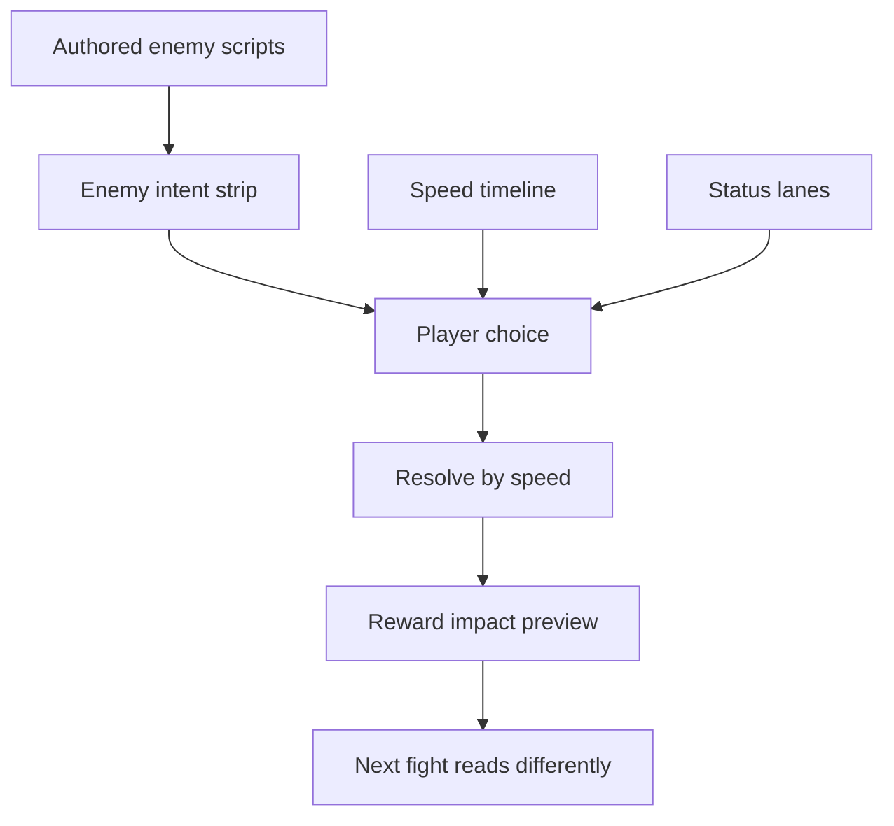
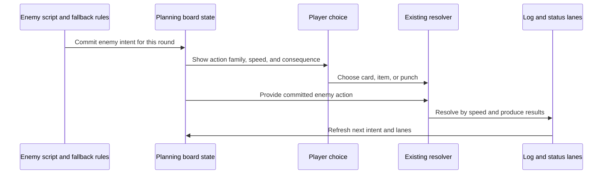
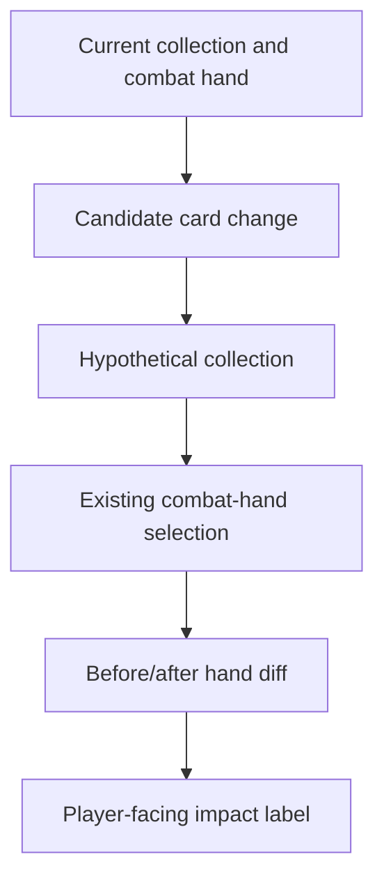

# Card Battle Planning Board - Plan

## Goal Capsule

- **Objective:** Add a Card Battle readability package centered on enemy intent, speed order, status consequences, and reward impact preview.
- **Product authority:** The Product Contract defines player-facing combat behavior; Planning Contract and Implementation Units define how to build it without changing scope.
- **Execution profile:** Standard code plan with pure combat-planning helpers first, Phaser scene wiring second, then reward/rest preview and browser smoke.
- **Stop conditions:** Stop if implementation replaces simultaneous card resolution, moves battle intent into Room Threat System, redesigns action economy, changes Ember/Daily Descent progression, or requires broad combat rebalance beyond scripted-enemy fairness.
- **Tail ownership:** The implementer owns automated tests, browser smoke for the visible battle screen, cleanup of abandoned layout experiments, and documentation updates before claiming done.

---

## Product Contract

### Summary

Add a Card Battle Planning Board that lets the player read enemy intent, speed order, and status consequences before committing a card.
Authored enemy scripts, status lanes, and reward impact preview support that planning moment instead of becoming separate combat systems.

### Problem Frame

Escape already has simultaneous card combat, speed ordering, poison, burn, stun, items, relics, enemy-card rewards, boss specials, and separate collection versus combat-hand state.
Normal battles still hide the enemy's chosen action until after the player commits, which makes speed, block, stun, healing, and status choices feel more like guesses than plans.
Rewards can also feel opaque because a new card may enter the collection without visibly changing the next combat hand.

### Key Decisions

- **Make the planning board the package spine.** Intent, speed, and status readability should improve every battle turn before the work expands into deeper enemy content.
- **Keep Card Battle as the combat authority.** The Room Threat System remains the dungeon-side pre-battle intent layer; this package begins after battle starts.
- **Reveal enough to plan, not enough to solve every turn.** The player needs action family, speed, and main consequence before choosing, while exact card detail can stay hidden when full reveal would remove tension.
- **Use enemy scripts to support readable intent.** Normal enemies should gain compact recurring patterns, but the first version should avoid a full AI rewrite or fully deterministic puzzle fights.
- **Treat reward preview as clarity, not economy change.** Reward impact preview should explain hand impact without changing Gold, Ember, or card reward balance.

### Requirements

**Battle planning board**

- R1. Card Battle must show the enemy's next committed action or action family before the player chooses a card, item, or punch.
- R2. The planning board must show speed order early enough for the player to compare their available actions against enemy timing.
- R3. Enemy intent must show the main expected consequence, such as damage, block, healing, status pressure, or boss special pressure.
- R4. Intent reveal must preserve uncertainty where useful by summarizing action family and primary effect instead of always exposing the exact enemy card.
- R5. The board must make speed, block, stun, heal, and damage choices visibly actionable before round resolution.

**Enemy scripts and boss alignment**

- R6. Normal enemies must gain small recognizable combat scripts or archetype patterns that produce readable intent.
- R7. Enemy scripts must retain enough variation that repeated fights do not become solved after one encounter.
- R8. Named enemies should ask different planning questions, such as tempo pressure, status pressure, block pressure, or sustain pressure.
- R9. Boss telegraphs must align with the planning board so boss special rounds still follow the read, choose, resolve loop.

**Status lanes**

- R10. The battle screen must present active combat conditions as future-facing lanes, including poison, burn, stun, block, and armor when relevant.
- R11. Status lanes must communicate when effects tick, expire, block an action, reduce damage, or persist into later rounds.
- R12. Status counterplay in this package must stay narrow and grounded in existing card behavior unless a tiny proof point is needed for lane readability.

**Reward impact preview**

- R13. Card rewards, stolen enemy cards, upgrades, and removals must preview whether the change affects the next combat hand.
- R14. Reward preview must explain impact in player-facing terms such as enters hand, replaces a role, stays in collection, or improves a combat role.
- R15. Reward preview must avoid exposing raw hand-scoring details that make rewards feel spreadsheet-like.
- R16. Reward preview must not change run reward economy or persistent progression.

**Readability and feedback**

- R17. Critical enemy intent and status information must be visible on the battle screen, not only buried in prompt or history text.
- R18. The battle screen must remain readable on the live Phaser canvas while showing intent, status lanes, player hand, enemy state, and resolution feedback.
- R19. Round resolution feedback must still distinguish what was predicted, what the player chose, and what actually resolved.

### Key Flows

- F1. Readable normal round
  - **Trigger:** The player enters a normal Card Battle round.
  - **Steps:** Enemy intent appears; speed order and status lanes update; the player chooses a card, item, or punch; actions resolve by speed.
  - **Outcome:** The player can explain why their choice answered or failed to answer the visible threat.
  - **Covered by:** R1, R2, R3, R5, R17, R19.

- F2. Learning an enemy pattern
  - **Trigger:** The player fights a named normal enemy with an authored script.
  - **Steps:** The enemy repeats a compact pattern with variation; intent previews make the pattern learnable; later rounds reward recognition without removing uncertainty.
  - **Outcome:** The enemy feels like a distinct combat lesson rather than a random hand of cards.
  - **Covered by:** R6, R7, R8.

- F3. Reading status consequences
  - **Trigger:** Poison, burn, stun, block, or armor is active during a round.
  - **Steps:** Lanes show the relevant next consequence; the player compares that consequence against intent and speed; resolution updates the lanes.
  - **Outcome:** Delayed effects and defensive choices are understandable before and after the turn.
  - **Covered by:** R10, R11, R12.

- F4. Reward impact
  - **Trigger:** The player can take, upgrade, remove, or steal a card.
  - **Steps:** The reward surface previews whether the choice enters the next combat hand, changes a role, or stays collection-only.
  - **Outcome:** The player understands whether the next fight changes before committing.
  - **Covered by:** R13, R14, R15, R16.

- F5. Boss special round
  - **Trigger:** A boss special is upcoming or active.
  - **Steps:** The special's telegraph appears through the same planning-board language as normal intent; the player chooses against its speed and effect.
  - **Outcome:** Bosses remain climactic while using the same readability contract as normal battles.
  - **Covered by:** R3, R9, R17, R19.

### Acceptance Examples

- AE1. **Covers R1, R2, R3.** Given a normal enemy has a next action, when the player is choosing, then the battle screen shows the action family, speed, and main consequence before the player commits.
- AE2. **Covers R4.** Given exact reveal would make a scripted round solved, when intent is shown, then the screen can show a concise family and primary effect instead of the full card.
- AE3. **Covers R5, R10, R11.** Given the enemy is stunned and burn is active, when the round starts, then the player can see that stun blocks the enemy action and burn ticks with remaining duration.
- AE4. **Covers R6, R7, R8.** Given the player fights a Bandit, Cultist, or Armored Goblin more than once, when reading intent across rounds, then the enemy has a recognizable pattern with some variation.
- AE5. **Covers R9.** Given a boss special round is upcoming, when the player chooses, then the special reads through the same intent and speed language as normal enemy actions.
- AE6. **Covers R13, R14, R15.** Given a stolen enemy card would not enter the current combat hand, when the reward is offered, then the preview says it stays collection-only without exposing raw scoring math.
- AE7. **Covers R13, R14, R16.** Given a removal or upgrade changes the next combat hand, when the player reviews the choice, then the preview names the hand impact without changing reward payout rules.
- AE8. **Covers R17, R18, R19.** Given intent, lanes, hand cards, enemy state, and resolution feedback are all visible, when the battle screen is smoked in browser, then critical text does not overlap and the round can still be read at a glance.

### Success Criteria

- Each combat turn feels like a readable plan instead of a hidden enemy roll.
- Players can describe the incoming threat, timing, and key status consequence before choosing.
- Named normal enemies start to feel distinct without requiring a large content rewrite.
- Reward choices answer whether the next fight changes.
- Planning can proceed without re-deciding action economy, full enemy AI, or boss rhythm scope.

### Scope Boundaries

**Deferred for later**

- Prepared answer slots, energy systems, draw or discard systems, and larger action-economy redesign.
- Full boss rhythm boards, interrupt windows, and boss-specific counterplay phases.
- Broad new status mechanics such as cleanse, ward, or large status-combo matrices.
- Guaranteed enemy archetype reward pools or signature enemy rewards beyond what reward preview needs to explain current hand impact.
- Combat balance retuning beyond what is necessary to keep authored scripts fair.

**Outside this version's identity**

- Cloning Slay the Spire combat structure.
- Replacing simultaneous card resolution with a different combat model.
- Turning Room Threat System into battle AI or moving battle intent into dungeon movement.
- Changing Ember progression, Daily Descent comparability, or run reward economy.

### Dependencies / Assumptions

- Card Battle remains the authority for combat after dungeon contact commits the player to fight.
- Room Threat System remains the authority for dungeon-side pre-battle monster behavior.
- The existing simultaneous resolver and speed ordering remain the core combat cadence.
- The existing collection versus combat-hand split remains player-facing and should be explained by reward preview.
- Visible battle UI changes require browser smoke because Phaser text can overlap even when the rules are correct.

### Outstanding Questions

**Resolved in Planning Contract**

- Enemy-card reveal depth, first scripted enemies, smallest status-lane layout, and boss-special treatment are resolved in `## Planning Contract`.

### Sources / Research

- `docs/ideation/2026-06-28-card-battle-ideation.html` ranks the four included ideas and records the chosen planning-board direction.
- `CONCEPTS.md` defines Card Battle and Room Threat System boundaries.
- `src/scenes/Battle.ts` shows current enemy card backs, boss telegraphs, status text, action order, enemy action selection, victory rewards, and reward overlay behavior.
- `src/game/combat.ts` defines speed ordering, status ticking, stun consumption, block, damage, healing, and action resolution.
- `src/data/cards.ts` defines the current card types, speed values, and poison, burn, and stun effects.
- `src/data/enemies.ts` defines named normal enemies, tiers, dungeon threat profiles, and boss specials.
- `src/state.ts` separates `cardCollection` from `combatHand`.
- `src/game/cardSelection.ts` scores and selects the combat hand.
- `src/game/rewards.ts` awards chest cards, enemy Gold, items, armor, healing, and relics.

---

## Planning Contract

### Product Contract Preservation

Product Contract changed only to mark the deferred planning questions as resolved.
Requirements, flows, acceptance examples, scope boundaries, and success criteria are unchanged.

### Key Technical Decisions

- KTD1. **Extract shared battle planning rules before scene wiring.** Enemy action commitment, reveal summaries, speed order, and status-lane summaries should be pure helpers that `BattleScene`, tests, and the balance simulator can consume.
- KTD2. **Start authored scripts with three normal enemies.** Bandit should represent tempo pressure, Cultist status pressure, and Armored Goblin block pressure; other normal enemies can keep fallback weighted behavior until later content work.
- KTD3. **Commit the enemy action before player choice each round.** The planning board needs a stable enemy intent for the current decision, while round resolution still uses the existing simultaneous resolver.
- KTD4. **Reveal action family by default.** Normal enemy intent should show family, speed, and primary consequence; boss specials can show their existing named telegraph because they already function as explicit set pieces.
- KTD5. **Make status lanes presentational in v1.** Poison, burn, stun, block, and armor should explain upcoming consequences using existing rules before adding cleanse, ward, interrupt, or other new mechanics.
- KTD6. **Preview reward impact by simulating hand selection, not by showing scores.** The helper should compare before/after combat-hand membership and role changes, then surface player-facing labels such as enters hand, replaces card, improves role, or stays collection-only.
- KTD7. **Treat Battle layout as a tested geometry problem.** Add pure layout metrics for the planning board and reward preview surfaces so browser smoke checks final readability instead of being the only layout protection.

### High-Level Technical Design

The planning board is a read-only layer over the existing resolver.
It commits one enemy action for display, helps the player choose, and then passes the same committed action into the current round resolution.

Reward impact preview uses the same `cardCollection` versus `combatHand` split that already drives deck ordering.
It should compare the actual current hand with a hypothetical after-state and render the difference without exposing raw scoring math.

### Resolved Planning Questions

- **Reveal depth:** Normal enemies reveal action family, speed, and main consequence; exact enemy card identity is revealed during or after resolution unless the card is already obvious from a boss special.
- **First scripts:** Bandit, Cultist, and Armored Goblin get authored scripts first because the Product Contract already names them as distinct planning lessons.
- **Status-lane shape:** V1 uses compact player/enemy lanes with tick, expiry, skip-action, and damage-reduction consequences; no new broad status mechanics are planned.
- **Boss scope:** Boss specials join the planning board's language, but full rhythm boards and interrupt windows remain deferred.

### Implementation Constraints

- Keep `BattleScene` responsible for rendering, input, and scene transitions; keep combat planning and impact summaries in pure `src/game/` helpers.
- Keep `Room Threat System` out of battle-side intent beyond the handoff boundary already captured in `CONCEPTS.md`.
- Keep daily-run comparability intact by preserving deterministic enemy action choices under the same seeded run inputs.
- Do not change Gold, Ember, reward payout, or rest-room pricing as part of this plan.
- Browser smoke is required for the final battle screen because prior Phaser regressions came from fixed-position text overlap.

### Sources / Research

- `docs/solutions/design-patterns/room-threat-system.md` establishes the boundary: dungeon owns pre-battle threat behavior and Battle owns combat resolution and rewards.
- `docs/solutions/ui-bugs/phaser-screen-layout-readability-regressions.md` establishes the layout pattern: put geometry in pure helpers, test relationships, then browser-smoke visible Phaser screens.
- `src/game/balanceSimulator.ts` currently duplicates enemy action selection, so shared enemy planning rules should prevent Battle and simulation drift.
- `src/game/battleLog.ts` already provides ordered action summaries that the planning board can reuse or extend.
- `src/game/deckOrdering.ts` already orders collection cards and flags current hand membership, which is the right basis for reward impact preview.

### Deferred to Follow-Up Work

- Enemy archetype rewards that guarantee signature cards from specific enemies.
- Boss rhythm boards with setup, pressure, special, and recovery phases.
- New status verbs such as cleanse, ward, soft interrupt, or delayed prepared answers.
- A broader battle-screen redesign unrelated to planning-board readability.

---

## Implementation Units

### U1. Shared Enemy Intent And Script Rules

- **Goal:** Create pure enemy action planning that can commit the current enemy intent before player choice and can be shared by Battle and simulation.
- **Requirements:** R1, R3, R4, R6, R7, R8, R9.
- **Files:** `src/game/enemyIntent.ts` (new), `src/game/enemyIntent.test.ts` (new), `src/data/enemies.ts`, `src/data/enemies.test.ts`, `src/game/balanceSimulator.ts`, `src/scenes/Battle.ts`.
- **Dependencies:** None.
- **Approach:** Add a small script profile or combat-pattern field for selected normal enemies, with fallback weighted selection for enemies without scripts.
  The helper should accept the enemy, round, used-card state, low-health state, and RNG, then return the committed enemy action, updated used-card state, and a reveal summary.
  Boss special handling should remain compatible with the existing interval, speed, telegraph, and effects.
- **Patterns to follow:** Existing `getEnemyThreatProfile()` data-boundary shape in `src/data/enemies.ts`; deterministic pure-rule pattern from `src/dungeon/roomThreat.ts`; existing `SequenceRng` tests.
- **Test scenarios:**
  - Covers AE1. Given a scripted Bandit round, when intent is planned, then the helper returns a stable action family, speed, and main consequence before player choice.
  - Covers AE2. Given a normal scripted enemy with an exact card available, when reveal mode is normal, then the summary exposes family and primary effect without requiring full card identity.
  - Covers AE4. Given Bandit, Cultist, and Armored Goblin definitions, when scripts are inspected, then each resolves to a distinct planning archetype.
  - Given an unscripted normal enemy, when intent is planned, then fallback weighted behavior still chooses a legal enemy card and updates used-card state.
  - Given a boss special interval round, when intent is planned, then the boss special action and telegraph data are selected instead of a normal card.
  - Given the same seeded RNG and used-card state, when Battle and balance simulation ask for enemy intent, then they receive equivalent committed actions.
- **Verification:** Enemy intent can be planned before player choice, selected enemies have recognizable scripts, fallback enemies still work, and simulator behavior no longer owns a divergent enemy-choice copy.

### U2. Planning Board State And Status Lanes

- **Goal:** Build pure display-state helpers for the planning board, speed timeline, predicted consequences, and status lanes.
- **Requirements:** R1, R2, R3, R5, R10, R11, R12, R17, R19.
- **Files:** `src/game/battlePlan.ts` (new), `src/game/battlePlan.test.ts` (new), `src/game/battleLog.ts`, `src/game/battleLog.test.ts`, `src/game/combat.ts`.
- **Dependencies:** U1.
- **Approach:** Convert a committed enemy action, available player action, active statuses, armor, and round state into display-ready summaries.
  Reuse existing action labels and speed ordering where possible, and keep status lanes descriptive rather than changing resolver rules.
  The helper should distinguish predicted information shown before choice from resolved information shown after the round.
- **Patterns to follow:** Existing `orderedBattleActions()` and `buildBattleRoundHistory()` in `src/game/battleLog.ts`; existing status application and stun consumption in `src/game/combat.ts`.
- **Test scenarios:**
  - Covers AE1. Given a player card and committed enemy action with different speeds, when planning state is built, then speed order shows the action that will resolve first.
  - Covers AE3. Given enemy stun and burn are active, when status lanes are built, then the enemy lane says stun skips the next action and burn ticks with remaining duration.
  - Given player armor and a block card are present, when status lanes are built, then persistent armor and one-round block are labeled as different damage reducers.
  - Given poison or burn expires after the next tick, when lane summaries are built, then the summary names expiry rather than implying indefinite damage.
  - Given round resolution completes, when post-round display state is built, then predicted intent and actual outcome can both be represented without overwriting history.
- **Verification:** Planning-board state is available without Phaser, every supported status has a clear lane summary, and existing battle-log behavior remains compatible.

### U3. Battle Scene Planning Board Rendering

- **Goal:** Wire the planning board into `BattleScene` so enemy intent, speed timeline, status lanes, and resolution feedback are visible before and after each round.
- **Requirements:** R1, R2, R3, R4, R5, R9, R10, R11, R17, R18, R19.
- **Files:** `src/scenes/Battle.ts`, `src/gfx/battlePlanningBoard.ts` (new), `src/game/battleLayout.ts` (new), `src/game/battleLayout.test.ts` (new), `src/game/battlePlan.ts`, `src/game/enemyIntent.ts`.
- **Dependencies:** U1, U2.
- **Approach:** Add a scene-owned current enemy plan for each active round and render it through a reusable planning-board view.
  Replace the "enemy backs only until resolution" experience with a clear intent strip plus compact speed and status regions, while keeping enemy card backs if they still communicate hidden hand size.
  Generate layout metrics in a pure helper and keep Phaser drawing code focused on rendering those metrics.
- **Patterns to follow:** Current `renderHand()`, `renderEnemyCards()`, `updateOrderText()`, `updateTelegraph()`, and `updateStatusText()` responsibilities in `src/scenes/Battle.ts`; layout-helper prevention guidance from `docs/solutions/ui-bugs/phaser-screen-layout-readability-regressions.md`.
- **Test scenarios:**
  - Covers AE1. Given a new normal battle round, when the scene is ready for player input, then an enemy intent summary is available before any player card click.
  - Covers AE5. Given a boss special round, when the scene renders planning state, then boss telegraph information uses the same intent and speed presentation as normal turns.
  - Covers AE8. Given the hand area, enemy sprite, battle log, planning board, and item buttons all render, when layout metrics are inspected, then critical regions do not overlap.
  - Given the player is stunned, when the scene renders player options and planning state, then the board still explains that the player action will be skipped.
  - Given the round resolves, when the scene advances to the next round, then the previous outcome remains in history and the next committed enemy intent refreshes once.
- **Verification:** The player can read intent before choosing, boss telegraphs align with the board, layout metrics have regression coverage, and the scene still transitions to victory or defeat through existing flow.

### U4. Reward Impact Preview Rules

- **Goal:** Add pure reward-impact summaries for card take, steal, upgrade, and remove choices without changing reward economy.
- **Requirements:** R13, R14, R15, R16.
- **Files:** `src/game/rewardImpact.ts` (new), `src/game/rewardImpact.test.ts` (new), `src/game/cardSelection.ts`, `src/game/deckOrdering.ts`, `src/game/rewards.test.ts`, `src/game/cardUpgrade.test.ts`, `src/state.test.ts`.
- **Dependencies:** None.
- **Approach:** Compare the current combat hand against a hypothetical after-state using the existing combat-hand selection rules.
  Produce concise labels for enters hand, replaces another card, improves an existing card role, removes a hand card, or stays collection-only.
  Keep raw combat score values internal to the helper.
- **Patterns to follow:** Existing `selectCombatHand()` in `src/game/cardSelection.ts`; existing `orderedDeckEntries()` in `src/game/deckOrdering.ts`; `RunState.addCard()`, `RunState.removeCard()`, and `RunState.refreshCombatHand()`.
- **Test scenarios:**
  - Covers AE6. Given a stolen card would not enter the combat hand, when impact is previewed, then the label says collection-only and omits raw scoring.
  - Covers AE7. Given adding a stronger card replaces a current hand card, when impact is previewed, then the label names both the entering card and the replaced role or card.
  - Covers AE7. Given upgrading a card already in hand changes its primary effect, when impact is previewed, then the label says the card remains in hand and improves its role.
  - Given removing a reserve card does not change the combat hand, when impact is previewed, then the label says next hand unchanged.
  - Given removing a current hand card causes a reserve card to enter, when impact is previewed, then the label names the replacement outcome.
- **Verification:** Preview labels are stable, player-facing, and independent of actual mutation until the user commits the reward or rest action.

### U5. Reward And Rest Preview Surfaces

- **Goal:** Show reward-impact summaries on battle victory rewards, chest card rewards, and rest-room upgrade/remove choices.
- **Requirements:** R13, R14, R15, R16, R18.
- **Files:** `src/scenes/Battle.ts`, `src/scenes/Dungeon.ts`, `src/gfx/rewardImpactView.ts` (new), `src/game/rewardImpact.ts`, `src/game/battleLayout.ts`, `src/game/battleLayout.test.ts`.
- **Dependencies:** U4.
- **Approach:** Add the preview text near each selectable reward card and each rest-card picker row without changing click behavior or payout rules.
  The battle victory overlay should preview enemy-card take outcomes.
  Chest card rewards should show next-hand impact when the automatic card grant is displayed, without changing chest reward odds or adding a new chest choice.
  The rest card picker should preview upgrade and removal outcomes before charging Gold.
  Keep "Take nothing", back, leave, and payment behavior unchanged.
- **Patterns to follow:** Existing battle reward overlay in `BattleScene.victory()`; existing chest reward flow in `DungeonScene.openChest()` and `rollChestReward()`; existing rest-room picker flow in `DungeonScene.openRestCardPicker()`; existing deck row formatting in `createDeckPanel()`.
- **Test scenarios:**
  - Covers AE6. Given the victory overlay offers enemy cards, when a card would stay reserve-only, then the preview shows collection-only before the player clicks it.
  - Covers AE6. Given a chest grants a card automatically, when the reward message appears, then the impact text explains whether the next combat hand changed.
  - Covers AE7. Given a rest upgrade would keep a card in the combat hand, when the rest picker renders the row, then the preview says the next hand keeps the upgraded card.
  - Covers AE7. Given a rest removal would pull a reserve card into the combat hand, when the rest picker renders the row, then the preview names the hand impact before payment.
  - Given the player leaves or backs out of a reward/rest preview, when no action was committed, then Gold, card collection, and combat hand are unchanged.
  - Covers AE8. Given impact previews are visible on overlays, when layout metrics are inspected, then selectable rows and preview text remain inside the panel bounds.
- **Verification:** Battle rewards, chest card rewards, and rest choices communicate next-fight impact; commit behavior stays unchanged; and no economy or persistent progression values change.

### U6. Documentation, Verification, And Browser Smoke

- **Goal:** Update player-facing documentation where behavior changes, protect balance expectations, and manually verify the live Phaser canvas.
- **Requirements:** R17, R18, R19.
- **Files:** `README.md`, `CONCEPTS.md`, `src/game/balanceSimulator.test.ts`, `docs/solutions/` only if implementation uncovers a reusable new pattern.
- **Dependencies:** U1, U2, U3, U4, U5.
- **Approach:** Update docs only for player-facing behavior and durable vocabulary.
  Re-run balance expectations after scripted enemy behavior is wired, and change simulator thresholds only if the new behavior intentionally changes the fight-taken baseline.
  Browser-smoke a normal battle, a scripted enemy, a boss special round, a status-heavy round, a battle reward, a chest card reward, and a rest-room preview.
- **Patterns to follow:** Verification surface in `AGENTS.md`; simulator-calibration guidance from prior room/rest work; browser-smoke requirement from `docs/solutions/ui-bugs/phaser-screen-layout-readability-regressions.md`.
- **Test scenarios:**
  - Given scripted enemy behavior affects simulator outcomes, when balance tests are re-run, then threshold changes are backed by intentional benchmark output rather than loosened blindly.
  - Given README mentions Card Battle choices, when docs are updated, then intent, speed, status lanes, and reward preview are described without promising deferred mechanics.
  - Covers AE8. Given the implemented battle screen is opened in browser, when normal and boss rounds are played, then intent, lane, hand, reward, and log text do not overlap.
  - Given a chest card reward appears during browser smoke, when the reward is displayed, then impact text is readable and does not overlap dungeon HUD text.
  - Given Daily Descents remain comparable, when the feature is smoke-tested through a daily run start if relevant, then planning-board behavior does not depend on persistent Ember benefits.
- **Verification:** Documentation reflects visible behavior, simulator changes are intentional, full validation passes, and browser smoke confirms the planning-board package is readable.

---

## Verification Contract

| Gate                  | Command / Check                                                                                                                                                     | Applies to         | Done Signal                                                                                                                                    |
| --------------------- | ------------------------------------------------------------------------------------------------------------------------------------------------------------------- | ------------------ | ---------------------------------------------------------------------------------------------------------------------------------------------- |
| Focused pure tests    | `npm test -- src/game/enemyIntent.test.ts src/game/battlePlan.test.ts src/game/rewardImpact.test.ts src/game/battleLayout.test.ts`                                  | U1, U2, U3, U4, U5 | New pure helpers cover scripted intent, lanes, reward impact, and layout metrics.                                                              |
| Existing combat tests | `npm test -- src/game/combat.test.ts src/game/battleLog.test.ts src/data/enemies.test.ts src/game/cardSelection.test.ts src/game/rewards.test.ts src/state.test.ts` | U1, U2, U4         | Existing resolver, logs, enemy generation, hand selection, rewards, and run state still pass.                                                  |
| Balance simulator     | `npm test -- src/game/balanceSimulator.test.ts`                                                                                                                     | U1, U6             | Scripted enemy behavior does not silently invalidate the accepted fight-taken baseline.                                                        |
| Full test suite       | `npm test`                                                                                                                                                          | All units          | All Vitest coverage passes.                                                                                                                    |
| Lint                  | `npm run lint`                                                                                                                                                      | All units          | ESLint passes with strict TypeScript conventions.                                                                                              |
| Format check          | `npm run format:check`                                                                                                                                              | All units          | Prettier reports no formatting drift.                                                                                                          |
| Build                 | `npm run build`                                                                                                                                                     | All units          | TypeScript and Vite production build pass.                                                                                                     |
| Diff hygiene          | `git diff --check`                                                                                                                                                  | All units          | No trailing whitespace or patch hygiene issues.                                                                                                |
| Browser smoke         | `npm run dev` and live canvas inspection                                                                                                                            | U3, U5, U6         | Normal round, scripted enemy, boss special, status lane, battle reward, chest card reward, and rest preview are readable without text overlap. |

---

## Definition of Done

- Product Contract scope remains unchanged except for the resolved-question clarification already recorded in Planning Contract.
- U1 through U6 are implemented in dependency order or an equivalent order that preserves their test coverage.
- Enemy intent is committed before player choice and the same committed action resolves the round.
- Bandit, Cultist, and Armored Goblin have distinct initial combat planning identities with fallback behavior preserved for other enemies.
- Status lanes explain current rules without adding broad new status mechanics.
- Reward impact preview covers battle rewards, chest card rewards, and rest-room upgrade/remove choices without changing reward economics.
- The Battle screen remains readable under browser smoke with no critical overlap between intent, lanes, hand, log, items, and rewards.
- Required verification gates pass or any intentional simulator threshold update is explained in the change summary.
- Abandoned layout experiments, duplicate enemy-choice logic, and temporary debug UI are removed before completion.
