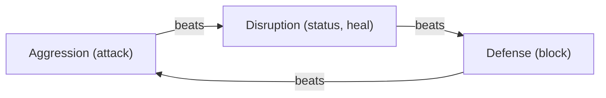
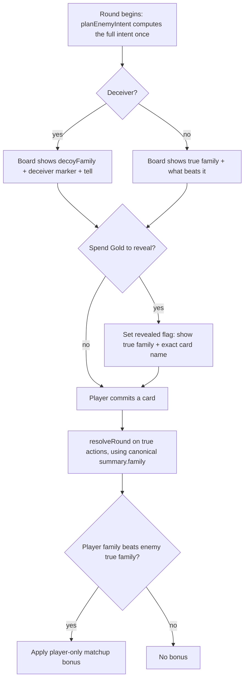

# feat: Reading the Enemy — make the card duel a mind-game

## Summary

Make reading the enemy the central skill of Card Battle, built as four sequenced layers: script the currently-random strong enemies, add a player-only family matchup triangle that rewards countering the enemy's true action, introduce deceiver enemies that show a false intent with a learnable tell, and let players spend Gold to reveal one round's true intent. A final phase extends the balance simulator so the matchup and reveal can be tuned.

## Problem Frame

The Card Battle Planning Board previews enemy intent, speed order, and status, but it previews noise against the hardest fights: the strong non-boss enemies (knight, necromancer, ogre) carry no combat script, so `planEnemyIntent` falls through to weighted-random card selection (`src/game/enemyIntent.ts:224-230`). The difficulty curve is inverted — late fights are statistically harder but mechanically random, and the readability feature goes dark when it matters most. Reading also earns nothing today: `resolveRound` has no relationship between action families, so a correct prediction only means "didn't get hit." This plan gives the duel honest information worth reading, a reason to read it, and a deception layer that makes reads a skill — claiming the genre's sparse simultaneous-selection niche.

---

## Requirements

Carried from the origin requirements doc (see origin). Grouped by layer plus cross-cutting.

**Layer 1 — Script the strong enemies**

- R1. Every non-boss enemy resolves its turn from a defined behavior, not weighted-random fallback; strong enemies gain combat scripts.
- R2. Each strong enemy reads as a distinct, learnable threat identity, not a generically harder weak enemy.
- R3. Weighted-random fallback remains only a safety net for an enemy with no script and no usable card.

**Layer 2 — Family matchup triangle (player-only)**

- R4. Action families relate in a cyclic matchup where one family beats another.
- R5. When the player's committed action beats the enemy's true action family, the player earns a matchup bonus; the enemy never receives a mirror bonus.
- R6. The matchup relationship and the consequence of winning it are surfaced on the planning board before the player commits.
- R7. The matchup is computed against the enemy's true action, so a bluff that misrepresents the family causes a player who trusts it to miss the bonus.

**Layer 3 — Deceiver enemies**

- R8. A deceiver can present an intent summary describing a different family than it will resolve, without changing how the round resolves mechanically.
- R9. The planning board marks deceiver enemies so the player knows deception is possible.
- R10. Each deceiver shows a consistent, learnable tell distinguishing feint from honest intent; the tell is deterministic for a given situation.
- R11. The feint is constrained so a player who reads the tell and counters the true family gets the normal matchup payoff.

**Layer 4 — Gold reveal (buy-down)**

- R12. The player can spend Gold during battle to reveal one round's true intent, piercing a bluff and confirming an honest read.
- R13. The reveal applies to the round it is purchased and does not persist.
- R14. The reveal is presented as a deliberate cost decision in the battle UI, not an always-on reveal.

**Cross-cutting**

- R15. All new combat behavior lives in pure, unit-tested logic; Phaser scenes only render and sync it.
- R16. Every new decision derives deterministically from the seeded RNG and does not perturb the random sequence on untaken paths, keeping Daily Descents comparable.

---

## Key Technical Decisions

- KTD1. Matchup logic as a pure module (`src/game/familyMatchup.ts`), separate from the resolver. `resolveRound` accepts an optional player-only bonus rather than computing families itself. Rationale: honors pure-layer-first (R15) and keeps `ResolveRoundInput` backward-compatible for the balance simulator, which also consumes it (`src/game/balanceSimulator.ts:372`).
- KTD2. Player-only payoff — the enemy never receives a matchup bonus (R5). Rationale: confirmed product decision; balanceable; reading is the player's edge while the enemy's pressure is its script and bluffs.
- KTD3. Triangle wheel (directional starting point, tuned via the simulator): Aggression beats Disruption, Disruption beats Defense, Defense beats Aggression. Family→role mapping: attack→Aggression, block→Defense, status and heal→Disruption; `mixed` resolves to no matchup. Rationale: a legible 3-cycle reusing the existing `EnemyIntentFamily` taxonomy.
- KTD4. Matchup bonus form and magnitude (directional starting point ~+3 effective, shaped by the player's action — bonus damage on an offensive action, bonus mitigation on a defensive one), tuned via the simulator. Flagged as a balance lever.
- KTD5. Deception is a display layer over a canonical-true intent. `planEnemyIntent` always sets `summary.family` to the **true** family; a deceiver additionally sets a supplemental `summary.decoyFamily` (the deterministically-chosen false family) and `isFeint: true`. The board renders `decoyFamily ?? family` for display, while the resolver, matchup, and reveal all read the canonical `summary.family`. Rationale: a supplemental field (not an override) means no downstream consumer must re-derive the true family from `action`, and it eliminates the dual-truth ambiguity in the buy-down pierce. `deceiver?: boolean` on `EnemyDef` gates the capability; `isFeint?: boolean` on `EnemyIntentPlan` marks a feinting round.
- KTD6. The tell is deterministic and surfaced via a new `summary.deceptionTell?` field — separate from the existing `telegraph` field, which stays reserved for boss-special announcements. `Battle.ts` `updateTelegraph()` must gate the `boss_telegraph` SFX on `source === 'boss_special'` so a deceiver tell does not fire boss audio. Rationale: keeps the two render/audio paths independent (R10, R11).
- KTD7. The buy-down **reveals the already-computed intent — it does not re-plan.** `planEnemyIntent` computes the full plan once at commit (true family, the chosen card's exact name, `decoyFamily`, `deceptionTell`). The buy-down sets a per-round `revealed` flag that makes the board render the true family plus the exact card name and clear the decoy display. No second `planEnemyIntent` call, so no RNG snapshot/clone is needed and the seeded sequence is untouched (R16). Gold-gated via a new `RunState.spendGold`; the flag resets next round (R13). Directional cost ~5 Gold, tuned.
- KTD8. The planning board gains a compact matchup/tell row **without growing `planningBoard.h`**: render a ~10px row in the existing ~22-25px gap between the timeline text (ends y≈93) and the status lanes (`laneY` 118 in `src/gfx/battlePlanningBoard.ts`). The board sits near its limit — `battleLayout.test.ts` asserts `prompt.y − boardBottom ≥ 28` (currently exactly 38, 10px headroom) and no overlap with `punchButton`. If a second row is ultimately required (matchup hint and deceiver tell both visible), lower that assertion to 16 and move `prompt` y 340→350 to restore headroom; resolve this geometry as a named pre-step in U4 before U4/U6 render anything. Geometry changes go through `src/game/battleLayout.ts`, never hardcoded scene coordinates (Phaser layout-regression learning).

---

## High-Level Technical Design

The family matchup is a cyclic relationship; the combat round is a branching flow with read, reveal, and payoff gates. Both are directional overviews of the approach, authoritative alongside the prose.

**Family matchup triangle (KTD3):**

**Combat round with the reading loop:**

---

## Implementation Units

Phased by layer; each phase is independently shippable and leaves the game playable.

### Phase 1 — Layer 1: Script the strong enemies

### U1. Script knight, necromancer, and ogre

- Goal: give the three strong enemies combat scripts so the planning board previews real intent (R1, R2), with fallback retained as a safety net (R3).
- Requirements: R1, R2, R3.
- Dependencies: none.
- Files: `src/data/enemies.ts`, `src/game/enemyIntent.test.ts`.
- Approach: add `combatScript` entries to the three strong `EnemyDef`s, each with a recognizable identity (e.g., knight as block-pressure with punishing counters, necromancer as status-pressure, ogre as heavy tempo). Reuse `EnemyCombatPreference` and `EnemyCombatScript.pattern`; add a new `EnemyCombatArchetype` only if an existing one (`tempo_pressure`/`status_pressure`/`block_pressure`) does not fit. **Favor single-axis preference rows so the resulting family is legible** — a `block_damage` preference produces a `mixed` family (`familyForEffects`, `enemyIntent.ts:60`), which KTD3 maps to no matchup, so a block-pressure script built on `block_damage` would show no hint or bonus most rounds. Alternate single-axis rows (e.g., `['block']` then `['damage']`) and audit the card pool to confirm each enemy's primary preference yields a non-mixed family most rounds.
- Patterns to follow: existing medium-enemy scripts in `src/data/enemies.ts` (bandit/cultist/armored_goblin); the `enemy(id, cardIds[])` test helper in `src/game/enemyIntent.test.ts`.
- Test scenarios:
  - For each strong enemy, `planEnemyIntent` returns `source: 'script'` (not `'fallback'`) on a normal round, under a fixed `SequenceRng`.
  - The scripted pattern advances by round index deterministically across rounds.
  - Each strong enemy's primary scripted round yields a non-`mixed` family (so the matchup is visible).
  - An enemy with no script still resolves via `pickFallbackCard` (regression guard for R3).
- Verification: strong-enemy fights show a non-random, repeatable, family-legible intent sequence for a fixed seed.

### Phase 2 — Layer 2: Family matchup triangle

### U2. Pure family-matchup module

- Goal: define the family→role mapping, the beats cycle, and the player-only bonus computation (R4, R5).
- Requirements: R4, R5.
- Dependencies: none (consumed by U3, U4, U10).
- Files: `src/game/familyMatchup.ts` (new), `src/game/familyMatchup.test.ts` (new).
- Approach: map `EnemyIntentFamily` to roles per KTD3; `beats(playerRole, enemyRole)` implements the 3-cycle; `computeMatchupBonus(playerFamily, enemyFamily)` returns the bonus (KTD4) only when the player's family beats the enemy's family, and only for the player. Both inputs are families read from `summary.family` (canonical-true under KTD5), so no consumer re-derives families from `action`.
- Patterns to follow: pure-function modules in `src/game/` with inline test card construction (`makeCard`) per `src/game/combat.test.ts`.
- Test scenarios:
  - The beats cycle is correct in all three directions and non-reflexive (a family never beats itself).
  - A winning matchup returns a positive bonus; a losing or neutral matchup returns zero.
  - `mixed` family yields no matchup either direction.
  - The bonus is shaped by the player's action type (offensive vs defensive) per KTD4.
- Verification: pure tests cover every wheel edge and the neutral cases.

### U3. Apply the matchup bonus in resolution

- Goal: thread the player-only bonus into `resolveRound` and wire its computation in the battle scene (R5, R7).
- Requirements: R5, R7.
- Dependencies: U2.
- Files: `src/game/combat.ts`, `src/scenes/Battle.ts`, `src/game/combat.test.ts`.
- Approach: extend `ResolveRoundInput` with an optional `playerMatchupBonus?: number` and apply it to the enemy during the player's action resolution inside `resolveRound`, so the bonus respects speed timing. In `Battle.ts:playRound`, compute the bonus via `familyMatchup` using the enemy's canonical `summary.family` (true even for deceivers, per KTD5) and pass it into `resolveRound`. U3 is independently unit-testable with any enemy card; it does not require a scripted enemy (U1).
- Execution note: keep `playerMatchupBonus` optional so the existing `balanceSimulator.ts` call site (`src/game/balanceSimulator.ts:372`) compiles unchanged.
- Patterns to follow: `applyAction`/`trackHp` accumulation in `src/game/combat.ts`; `ResolveRoundInput` construction in `src/game/combat.test.ts`.
- Test scenarios:
  - Player action whose family beats the enemy's true family applies the bonus to enemy HP; the log records it.
  - Player action that loses or ties the matchup applies no bonus.
  - The enemy never receives a matchup bonus, even when its family would beat the player's.
  - `resolveRound` with `playerMatchupBonus` omitted produces byte-identical results to today (balance-simulator compatibility).
  - Covers AE1, AE2: a correct counter earns the bonus; a counter to a bluffed (decoy) family does not, because resolution uses the canonical true family.
  - Deterministic under a fixed `SequenceRng`.
- Verification: matchup outcomes change enemy HP only on a player win, and only for the player.

### U4. Surface the matchup on the planning board

- Goal: show what beats the shown intent before the player commits (R6).
- Requirements: R6.
- Dependencies: U2.
- Files: `src/game/battlePlan.ts`, `src/game/battlePlan.test.ts`, `src/gfx/battlePlanningBoard.ts`, `src/game/battleLayout.ts`, `src/game/battleLayout.test.ts`.
- Approach: add an optional `matchupHint` to `BattlePlanState`, populated in `buildBattlePlanState` from `familyMatchup` using the displayed family (`decoyFamily ?? family` so the hint matches what the player sees pre-reveal). Render it on the board per the KTD8 geometry. **Resolve the row geometry as the first step of this unit** (KTD8): place a compact row in the existing timeline-to-lane gap without growing `planningBoard.h`; only if a second row proves necessary, lower the `battleLayout.test.ts` gap assertion 28→16 and move `prompt` y 340→350. Re-assert all clearances in `battleLayout.test.ts`.
- Patterns to follow: `BattlePlanState` field additions in `src/game/battlePlan.ts`; geometry constants in `src/game/battleLayout.ts`.
- Test scenarios:
  - `buildBattlePlanState` includes a `matchupHint` describing what beats the displayed family.
  - No hint is produced for a `mixed`/neutral displayed family.
  - `battleLayout` clearance test confirms the matchup/tell row does not collide with the resolved line, the status lanes, or `punchButton`.
- Verification: the board shows a "what beats this" cue that matches the displayed family.

### Phase 3 — Layer 3: Deceiver enemies

### U5. Deceiver intent capability + tell

- Goal: let a deceiver display a decoy family while keeping the canonical intent true, with a deterministic tell (R8, R10, R11, R7).
- Requirements: R8, R10, R11, R7.
- Dependencies: U2.
- Files: `src/data/enemies.ts` (add `deceiver?: boolean` to `EnemyDef`), `src/game/enemyIntent.ts`, `src/game/enemyIntent.test.ts`.
- Approach: add `deceiver?: boolean` to `EnemyDef` (mirroring the optional `combatScript` pattern) and `isFeint?: boolean` + `decoyFamily?` + `deceptionTell?` to `EnemyIntentPlan`/`EnemyIntentSummary`. In `planEnemyIntent`, when the enemy is a deceiver, keep `summary.family` as the true family and additionally set a deterministically-chosen `decoyFamily` (a family that beats or misleads against the player's likely counter) plus `deceptionTell` and `isFeint: true`. The `action` is unchanged. Derive the decoy and tell from the seeded RNG without consuming draws on non-deceiver paths (R16).
- Patterns to follow: `summarizeCard` and the `EnemyIntentPlan`/`EnemyIntentSummary` shapes in `src/game/enemyIntent.ts`.
- Test scenarios:
  - For a deceiver, `summary.decoyFamily` differs from `summary.family`, and `summary.family` equals the true family of `action`.
  - The tell (`deceptionTell`) is identical across repeated calls with the same seed and state (deterministic, learnable).
  - A player who counters the decoy family gets no matchup bonus; a player who counters the true family does (integrates with U3; Covers AE2, AE3).
  - Non-deceiver enemies set neither `decoyFamily` nor `isFeint`, and their RNG sequence is unchanged versus before this unit (R16 regression; Covers AE5).
- Verification: deceivers mislead the display but resolve and score on the canonical truth.

### U6. Render the deceiver marker and tell

- Goal: mark deceivers and show the tell on the board, distinct from boss telegraphs (R9, R10).
- Requirements: R9, R10.
- Dependencies: U4, U5.
- Files: `src/game/battlePlan.ts`, `src/game/battlePlan.test.ts`, `src/gfx/battlePlanningBoard.ts`, `src/scenes/Battle.ts`.
- Approach: carry the deceiver marker (`isFeint`) and `deceptionTell` into `BattlePlanState`; render a marker plus the tell in the KTD8 row. Render the displayed family as `decoyFamily ?? family`. Gate the existing `boss_telegraph` SFX in `Battle.ts:updateTelegraph()` on `source === 'boss_special'` so the deceiver tell does not fire boss audio (KTD6); render `deceptionTell` with a distinct (or silent) cue. The marker persists after a reveal but the row switches to a "pierced — true family" state (see U9).
- Patterns to follow: the `matchupHint` field and rendering added in U4.
- Test scenarios:
  - `buildBattlePlanState` flags a deceiver intent and carries the tell text.
  - A non-deceiver intent carries no marker or tell.
  - `updateTelegraph` plays `boss_telegraph` only for `source === 'boss_special'`, not for a deceiver round (regression).
- Verification: deceiver fights visibly warn the player and show the tell, with no boss audio.

### U7. Assign deceiver enemies

- Goal: designate which enemies bluff (R8).
- Requirements: R8.
- Dependencies: U5.
- Files: `src/data/enemies.ts`, `src/game/enemyIntent.test.ts`.
- Approach: set `deceiver: true` on a small set (directional: the necromancer, fitting its theme; optionally one boss). If a boss is designated, the boss-special path (`enemyIntent.ts:172-193`) takes precedence on its interval rounds and the deceiver display applies only on non-special rounds — make this priority explicit in `planEnemyIntent`. Keep the count small for launch.
- Test scenarios:
  - Designated enemies produce feints; all others never do.
  - A deceiver boss on a special-interval round shows the boss special (not a feint); on other rounds it can feint.
- Verification: only intended enemies deceive, and boss specials are never masked by a feint.

### Phase 4 — Layer 4: Gold reveal

### U8. Reveal logic + spendGold

- Goal: reveal one round's true intent for a Gold cost, one round only, with no re-plan (R12, R13).
- Requirements: R12, R13.
- Dependencies: U2, U5.
- Files: `src/state.ts`, `src/state.test.ts`, `src/game/enemyIntent.ts`, `src/game/enemyIntent.test.ts`.
- Approach: add `RunState.spendGold(cost): boolean` (checks sufficiency, decrements, returns success) alongside the existing `addGold`. The reveal does **not** re-plan: it consumes the intent already computed at commit, exposing the true family (already canonical in `summary.family`) plus the exact card name. Add a small pure helper (in `enemyIntent.ts`, e.g. `toRevealedSummary(plan)`) that returns a summary with `revealMode: 'exact'`, the true `family`, the card name, and `decoyFamily` cleared. No new module is introduced (the prior `intentReveal.ts` is unnecessary); the wiring lives in the scene (U9).
- Patterns to follow: `addGold` in `src/state.ts`; `summarizeCard` exact-mode shape in `src/game/enemyIntent.ts`.
- Test scenarios:
  - `spendGold` decrements and returns true when affordable; returns false and leaves Gold unchanged when not (in `src/state.test.ts`).
  - `toRevealedSummary` yields the true family/consequence and the exact card name for the round, matching what resolves, with `decoyFamily` cleared (Covers AE4).
  - Revealing a deceiver's intent exposes the true family (integrates with U5).
  - The reveal is derived from the stored plan with no second `planEnemyIntent` call (no RNG draw), so the seeded sequence is unaffected (Covers AE5).
- Verification: paying reveals the truth for exactly one round, costs Gold, and never re-rolls the enemy card.

### U9. Wire reveal + Gold UI into the battle scene

- Goal: present the reveal as an in-battle cost decision with a Gold readout and defined control states (R14).
- Requirements: R14.
- Dependencies: U8.
- Files: `src/scenes/Battle.ts`, `src/game/battleLayout.ts`, `src/game/battleLayout.test.ts`.
- Approach: add an in-battle Gold readout and a reveal control in `create()` (the Hud sleeps during battle, so these are net-new), placed via a `battleLayout` region (not hardcoded) clear of the expanded planning board. Control states: **visible** whenever the round is in planning phase and the intent is not yet revealed; **disabled and showing the Gold cost** when `run.gold < cost`; **hidden/disabled** once revealed this round. The control is available against all enemies (R12: on an honest enemy it still upgrades the display to the exact card name — no meta-tell about deceiver status). On press: `spendGold`, set the round `revealed` flag, rebuild `BattlePlanState` from the revealed summary (so the matchup hint reflects the true family and the deceiver row switches to the pierced state), re-render, and update the Gold readout. The `revealed` flag resets on round cleanup (R13).
- Patterns to follow: `commitEnemyIntent`/`renderPlanningBoard` call sites in `src/scenes/Battle.ts`; input gating via `this.busy`; geometry via `src/game/battleLayout.ts`.
- Test scenarios:
  - `battleLayout` test: the Gold readout and reveal control regions do not overlap the planning board or `punchButton`.
  - Reveal/spend logic is covered by U8; scene wiring verified by manual smoke (control appears, disabled state shows cost when broke, spends Gold, board re-renders to true family + exact card, Gold readout updates).
- Verification: in a live battle, the player can pay to reveal one round's intent, sees Gold decrease, and the board updates to the truth.

### Phase 5 — Balance harness

### U10. Model the matchup and reveal in the simulator

- Goal: let the balance simulator account for the matchup payoff (and optionally the reveal) so the levers in KTD3/KTD4/KTD7 can be tuned, and validate no degenerate dominant line (success criteria).
- Requirements: supports R4, R5, R12 tuning; success criteria.
- Dependencies: U2, U3 (and U5, U8 for full modeling).
- Files: `src/game/balanceSimulator.ts`, `src/game/balanceSimulator.test.ts`.
- Approach: use the enemy's canonical `summary.family` (already surfaced on the plan in `chooseEnemyDecision`) and add a matchup-bonus term to `choosePlayerAction`'s greedy scoring. Optionally add `gold` to `SimBattleState` to model the reveal. Use simulated runs to tune the wheel, bonus magnitude, and reveal cost.
- Patterns to follow: `choosePlayerAction`/`evaluateBattleState`/`applyRound` scoring in `src/game/balanceSimulator.ts`.
- Test scenarios:
  - The simulator's player scoring reflects the matchup bonus (a matchup-winning action scores higher, all else equal).
  - A sanity check that no single family or an "always reveal" line dominates win rate across seeds (tuning guard for the success criteria).
- Verification: the simulator produces comparable, non-degenerate outcomes used to set the final lever values.

---

## Scope Boundaries

### Deferred for later

- Plan-vs-plan / multi-round commit combat — a larger restructure; revisit as a variant once the single-round reading loop proves out.
- The combat event-bus / effect-registry refactor — U3 makes a contained, backward-compatible change to `resolveRound`; the broader refactor that would make new effect verbs fully data-driven is separate.

### Outside this initiative

- Reworking auto-hand composition (player control over which cards form the hand).
- Shareable / async Daily Descent comparison. This plan only preserves seed comparability (R16).

### Deferred to follow-up work

- Symmetric (two-way) matchup for bosses — rejected for v1 (player-only, KTD2); a possible later escalation.

---

## Risks & Dependencies

- `ResolveRoundInput` is consumed by `balanceSimulator.ts` (line 372). The matchup-bonus field must be optional so the simulator and existing tests compile unchanged (U3 execution note).
- The planning board is near its space limit (190px; resolved line at y≈174, lane bottoms at y≈176; `battleLayout.test.ts` permits ~10px height growth). U4 fits the row into the existing timeline-to-lane gap without growing the board; the two-row fallback (lower the gap assertion, move `prompt`) is the contingency. Resolve geometry before U4/U6 render (KTD8).
- Bluffing can feel arbitrary if the tell is unclear; R10/R11 and the deterministic `deceptionTell` (U5) are the mitigation, validated by feel during smoke testing.
- The balance levers (wheel, bonus magnitude, reveal cost) are directional until U10's simulator tuning; shipping Layer 2 without U10 risks an unbalanced matchup.
- Seeded-run contract: deceiver decoy/tell selection must not consume RNG on non-deceiver paths (R16, U5 regression test). The buy-down reveals the stored plan with no re-plan (KTD7), so it adds no RNG draw and needs no RNG snapshot.

---

## Acceptance Examples

Carried from origin; enforced by the cited unit tests.

- AE1. Covers R5, R7 (U3). Enemy truly attacks; player commits a defense that beats aggression → player receives the matchup bonus.
- AE2. Covers R7, R8 (U3, U5). Deceiver displays defense but truly attacks; player counters defense → resolves against the true attack, no bonus.
- AE3. Covers R10, R11 (U5). Deceiver is feinting with a visible tell; player reads it and counters the true family → normal matchup payoff.
- AE4. Covers R12, R13 (U8). Player spends Gold to reveal a deceiver's intent → revealed family matches what resolves and the decoy display clears; next round shows normal fidelity.
- AE5. Covers R16 (U5, U8). Two players on the same Daily seed making identical choices → identical enemy action sequence, including deceiver and reveal rounds (the reveal adds no RNG draw).

---

## Open Questions

Deferred to implementation (non-blocking):

- Final tuned values for the triangle wheel weighting, bonus magnitude, and reveal cost — set as directional defaults now (KTD3, KTD4, KTD7) and finalized via U10's simulator runs.
- KTD3 maps both `heal` and `status` to the Disruption role, so a pure-heal action participates in the triangle. Confirm this is intended during U2/U10 tuning, or split heal out as matchup-neutral if it distorts balance.
- Whether a boss joins the necromancer as a deceiver (U7) — decided during implementation once Layer 3 feel is validated; the boss-special-takes-precedence rule (U7) holds either way.
- Exact visual treatment of the deceiver marker, tell, and pierced state on the board (U6/U9) — directional here; resolved in implementation within the U4 layout row.

---

## Sources & Research

- Origin requirements: `docs/brainstorms/2026-06-29-reading-the-enemy-combat-requirements.md`.
- Seam map and intent internals: `src/game/enemyIntent.ts` (`planEnemyIntent`, `EnemyIntentSummary`, `revealMode`, `telegraph`, `familyForEffects`), `src/data/enemies.ts` (`EnemyCombatScript`, archetypes; strong enemies scriptless).
- Resolver: `src/game/combat.ts` (`resolveRound`, `applyAction`, `ResolveRoundInput`); also consumed by `src/game/balanceSimulator.ts:372`.
- Board: `src/game/battlePlan.ts` (`BattlePlanState`), `src/gfx/battlePlanningBoard.ts` (`laneY` 118), `src/game/battleLayout.ts` (`planningBoard` rect h190; `prompt` y340), `src/game/battleLayout.test.ts` (gap ≥28, no `punchButton` overlap).
- Scene: `src/scenes/Battle.ts` (`commitEnemyIntent`, `renderPlanningBoard`, `playRound`, `updateTelegraph` boss SFX; Hud slept; no in-battle Gold display).
- State: `src/state.ts` (`RunState.gold`, `addGold`; no `spendGold` today). RNG: `src/game/rng.ts` (`GameRng` exposes `frac`/`between`/`pick` only — no snapshot; KTD7 avoids needing one).
- Tests: Vitest; `SequenceRng` from `src/game/test-rng.ts`; `enemy()`/`makeCard` helpers; self-contained tests.
- External (via origin): Sirlin's Yomi (asymmetric payoffs build intuition over lookup tables); Balatro (legible base + deep modifiers).
