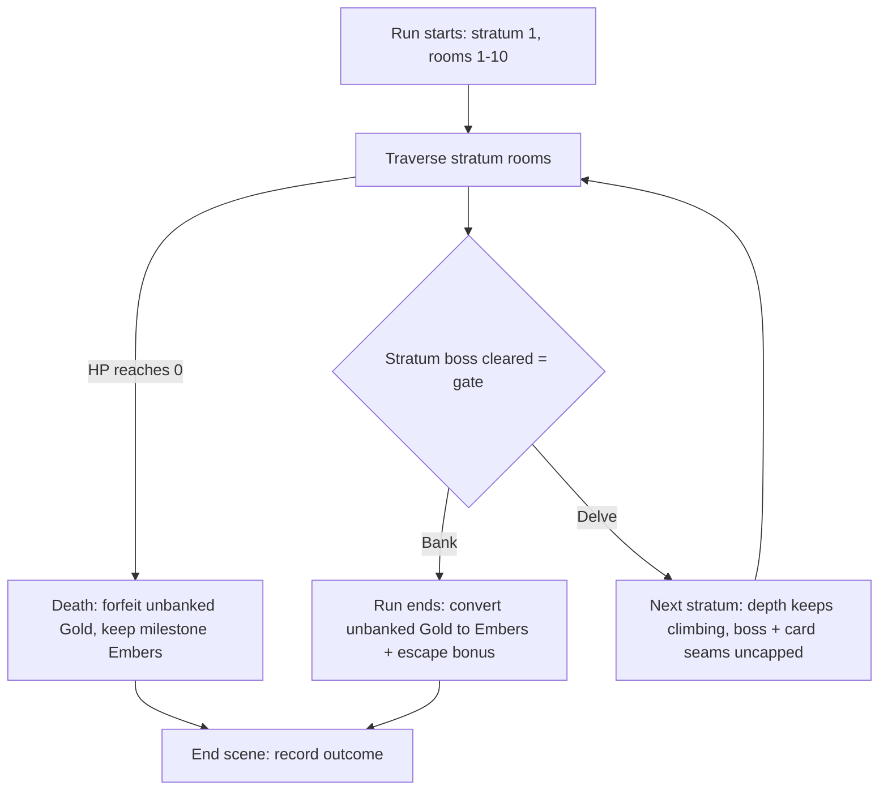

# feat: Endless Descent — Push-Your-Luck Banking

## Summary

Turn beating the room-10 boss into a gate: bank the run's Gold into Embers and walk away a winner, or delve into a harder stratum that forfeits the unbanked Gold on death. Strata continue the dungeon past depth 10 by reusing the existing depth-parametric scaling (uncapping the few formulas that saturate at depth 10) rather than a parallel multiplier layer; banking converts leftover Gold to Embers at run-end; the Daily delve yields a depth score instead. The work lands as pure game-layer logic (conversion, stratum gating, gate decision) plus a thin scene interception, a balance-harness extension to tune it safely, and minimal strong-enemy combat scripts so deep death feels earned.

---

## Problem Frame

Escape is a forward-only crawl that ends at the room-10 boss, and Gold has no path to permanence — even a winning run discards it (`src/scenes/End.ts`: "Gold stays with this run"). The meta is already partly death-proof (milestone Embers survive death), so the real stakes that evaporate on death are Gold, and Gold does nothing once spent. The brainstorm makes "escape" a verb: an endless descent with no safe stopping point, where banking gives Gold a door out of the run and pushing risks it all. See origin for the full product framing.

---

## Key Technical Decisions

- KTD1. Stratum = 10 rooms; the boss re-gates to fire at every stratum boundary (`depth % STRATUM_SIZE == 0`) instead of the current `depth >= MAX_DEPTH`. Room events key off depth-within-stratum (`((depth - 1) % 10) + 1`) so depth 19 behaves like the chest-heavy pre-boss depth 9. The boundary predicate `isStratumBoundary(depth)` is defined once in `src/game/strata.ts` and consumed by both the room-gating (U1) and the gate logic (U3) so it cannot drift.
- KTD2. Conversion and the Ember award stay a single run-end event — banking _is_ ending the run (cash out and stop) and death is the other terminus. Gates only decide continue-or-stop. This keeps the existing `lastAwardedRunId` guard valid (`src/scenes/End.ts`); the gate interception (U5) must therefore route to `End` only on bank or death, never on a delve choice, or the single-award invariant breaks.
- KTD3. Gold→Ember conversion and the Ember-inflation guard live in pure logic (`src/game/metaRewards.ts`), with milestone Embers and the +3 escape bonus kept separate and death-proof. The guard's _binding mechanism_ — diminishing conversion vs. risk that scales faster than reward — is resolved by the U7 harness before U2's shape freezes; if risk-scaling binds, part of the bound lives in the escalation curve (U8), not in conversion. See Open Questions.
- KTD4. Escalation past depth 10 rides the existing deterministic depth-parametric formulas rather than a parallel multiplier layer. Enemy HP (`baseHp + depth`) and enemy/chest Gold (`between(4 + depth, …)`) already scale with depth and keep climbing past 10 with no change; U8 uncaps the two seams that saturate (the boss, whose HP ignores depth, and card-tier weights, which freeze at depth 9). This reuses scaling seams that are already seed-deterministic, so Daily reproducibility holds with no new RNG. (Chosen over a stratum-index multiplier layer — see Alternatives.)
- KTD5. Gate, delve, gating, and conversion logic live in pure `src/game`/`src/dungeon` modules; the Phaser scene intercepts the boss-victory→`End` seam and renders only. Mirrors the campfire-prep staging pattern (`src/game/campfirePrep.ts`): stage the decision, apply atomically, reset.
- KTD6. New recording fields are added only to the chronicle and daily normalizers (default-on-load, no version key). `META_ECONOMY_VERSION` must **not** be incremented — `normalizeMetaState` returns `createDefaultMetaState()` on a version mismatch, which zeroes `embers` and would wipe the death-proof currency the feature depends on. `endedBy` (bank vs. death) is derived from the existing `escaped` flag, so legacy entries normalize correctly with no flat default.
- KTD7. Strong-enemy scripts are the minimal Reading-the-Enemy Layer-1 slice (script knight/necromancer/ogre for readable intent), authored here and cross-referenced to that initiative (`docs/plans/2026-06-29-001-feat-reading-the-enemy-combat-plan.md`). The deeper layers (matchup triangle, deceivers, buy-down) stay out.
- KTD8. The conversion rate, guard magnitude, and the deep-escalation curve are tuned against the extended balance simulator (U7), not pinned in this plan. U7 caps its own stratum iteration so a mis-tuned "push until death" heuristic cannot loop unbounded.

---

## Alternatives Considered

- **Stratum-index multiplier layer (rejected).** The first draft introduced `statMultiplier(stratum)`/`goldMultiplier(stratum)` pure helpers applied at `commitDelve`. Two problems sank it: the helpers had no consumption seam (enemy stats come from `spawnEnemy`/`spawnBoss`, Gold from `rewards.ts`, none of which read a stratum field), and `goldMultiplier` collided with the existing `RunState.goldMultiplier` relic getter. Reusing the existing depth formulas (KTD4) reaches the same deterministic escalation through seams that already exist, and is strictly less code.

---

## High-Level Technical Design

The run becomes a loop of strata separated by gates; conversion happens once, at whichever terminus the run reaches. Difficulty rides the existing depth scaling, which simply keeps climbing.

Pure-logic ownership: room re-gating and the stratum predicate (U1), conversion + guard (U2), gate/delve state (U3), and deep-escalation seams (U8) are all `src/game`/`src/dungeon` modules. The scene (U5) reads that state to render the gate prompt and the delve transition, and routes to `End` on bank or death only. The balance simulator (U7) drives the same pure logic headlessly to tune KTD8's values.

---

## Requirements

Carried from origin (`docs/brainstorms/2026-06-29-push-your-luck-banking-requirements.md`); IDs preserved for traceability.

**Run shape and the gate decision**

- R1. Beating the room-10 boss sets the win state and presents the first gate rather than ending the run outright.
- R2. At each gate the player chooses to bank (end the run and cash out) or delve (begin the next stratum).
- R3. Committing to a stratum is irreversible until the next gate; there is no mid-stratum exit.
- R4. Strata continue the dungeon past depth 10 using the existing depth-parametric generator.

**Gold, Embers, and conversion**

- R5. Gold accumulates across the whole run and is the unbanked, at-risk pool.
- R6. Banking at any gate converts unbanked Gold into Embers, including a boss-win that never delves.
- R7. Dying in any stratum forfeits all unbanked Gold; milestone Embers already earned are retained.
- R8. Milestone Embers (rooms 3/6/9) and the +3 escape bonus are unchanged, stay capped, and are never at risk; the delve's only Ember source is converted Gold.
- R9. Spending Gold mid-run (rest, upgrades) reduces the eventual conversion — buying survival costs future Embers.

**Escalation and difficulty**

- R10. Each successive stratum is harder than the last (enemy stats and the boss continue to scale with depth past 10).
- R11. The strong enemies (knight, necromancer, ogre) gain combat scripts so deep-stratum fights are readable (see origin reading-the-enemy initiative).
- R12. Gold income continues to scale with depth so delving carries positive expected value before the guard caps it.

**Meta-economy safety**

- R13. Expected Ember yield from delving stays bounded by a guard so unlimited delving cannot trivialize the Campfire economy.
- R14. The balance simulator models the bank-or-delve decision and stratum escalation, and verifies neither "always bank at gate 1" nor "always push until death" is a dominant line.

**Daily Descent**

- R15. The delve is available in Daily Descents, but Gold→Ember conversion is disabled there; delving yields depth only. Base-run milestone Embers in a Daily are unchanged.
- R16. Daily delve progress is recorded as a comparable metric.

**Recording**

- R17. The chronicle and daily records gain fields for deepest progress reached and Embers gained via conversion; whether a run ended by banking or dying is derivable from the existing escaped flag.

---

## Implementation Units

### U1. Stratum model and room re-gating past depth 10

- **Goal:** Let the dungeon continue past depth 10 as strata, with the boss firing at each stratum boundary and a single shared boundary predicate.
- **Requirements:** R4, KTD1
- **Dependencies:** none
- **Files:** `src/config.ts`, `src/dungeon/rooms.ts`, `src/dungeon/rooms.test.ts`, new `src/game/strata.ts`, new `src/game/strata.test.ts`
- **Approach:** Add a `STRATUM_SIZE` constant (10). Change `makeNextRoom` so the boss fires when `isStratumBoundary(depth)` is true (`depth % STRATUM_SIZE == 0`) rather than `depth >= MAX_DEPTH`. Map `rollRoomEvent` to depth-within-stratum so the chest-heavy pre-boss table (currently `depth === MAX_DEPTH - 1`) triggers on the last room of every stratum. Add `src/game/strata.ts` with pure helpers `stratumForDepth(depth)` and `isStratumBoundary(depth)`; `MAX_DEPTH` remains the first stratum boundary / base-run length. No multipliers (escalation is U8).
- **Patterns to follow:** existing `rollRoomEvent` weight-table shape. No RNG consumed by the new helpers.
- **Test scenarios:**
  - Boss event fires at depth 10, 20, 30; normal events roll at depths 11-19, 21-29.
  - Depth-within-stratum mapping: depth 19 yields the same event table as depth 9; depth 11 same as depth 1.
  - `stratumForDepth`: depths 1-10 → stratum 1, 11-20 → stratum 2; boundary depth 10 belongs to stratum 1.
  - `isStratumBoundary` true at 10/20/30, false elsewhere, and is a pure function.
- **Verification:** room generation produces a boss at every 10th depth without consuming RNG.

### U2. Gold→Ember conversion and the inflation guard

- **Goal:** Convert unbanked Gold to Embers at run-end behind a bounding guard, leaving milestones and the escape bonus untouched, and disabling conversion for Daily runs.
- **Requirements:** R6, R7, R8, R13, R15, KTD2, KTD3, KTD8
- **Dependencies:** conceptual/tuning only — the guard curve is co-designed with the escalation curve (U8) and validated by U7; no code dependency on other units.
- **Files:** `src/game/metaRewards.ts`, `src/game/metaRewards.test.ts`
- **Approach:** Extend the ember-reward input/return so the currently-unused `gold` parameter drives a conversion term: `convertedEmbers = guard(rawGold, depth)`, where `guard` applies the tunable rate and bounds expected yield. Keep `depthMilestoneEmbers` and `escapeEmbers` as separate breakdown fields. Add a `convertGold: boolean` (false for Daily) so Daily runs compute `convertedEmbers = 0` while milestones/escape behave as today. The death path passes `escaped: false` and no gold term. The guard's mechanism is provisional pending U7 (KTD3) — keep the conversion term and the guard factor separable so the bound can move to the escalation side without reshaping the breakdown.
- **Execution note:** Implement conversion and guard test-first — the breakdown shape is the contract U5/U6 depend on.
- **Patterns to follow:** existing `calculateEmberReward` breakdown object and its tests.
- **Test scenarios:**
  - Covers AE1. Bank with leftover Gold on a normal run → `convertedEmbers > 0`, plus milestones + escape bonus.
  - Covers AE2. Death → `convertedEmbers == 0`, milestone Embers retained, no escape bonus.
  - Covers AE4. Daily bank with leftover Gold → `convertedEmbers == 0`, milestones/escape unchanged.
  - Guard bounds: doubling raw Gold does not double converted Embers past the cap.
  - Milestone/escape fields are identical with and without the gold term (separation invariant).
- **Verification:** conversion is a pure function of (gold, depth, escaped, convertGold); milestones and escape bonus are provably independent of the gold term.

### U3. Delve and gate-decision state

- **Goal:** Model the per-run delve lifecycle — current stratum, gate eligibility, and the bank/delve/death terminus — as pure logic the scene can drive.
- **Requirements:** R1, R2, R3, R5, R9, KTD2, KTD5
- **Dependencies:** U1
- **Files:** new `src/game/delve.ts`, new `src/game/delve.test.ts`, `src/state.ts`, `src/state.test.ts`
- **Approach:** Add a `stratum` field to `RunState`, defaulting to 1, reset by `newRun`. Add `src/game/delve.ts` with pure transitions: a gate check that consumes `isStratumBoundary` from U1 (not a re-derived modulo), `commitDelve(run)` (advance stratum; depth continues climbing so escalation is automatic via U8 — no multiplier to apply), and a resolution helper reporting the bank outcome (unbanked Gold, `escaped: true`) vs. the death outcome (`escaped: false`, stratum reached). Track the run's `escaped` terminus on `RunState` as the single source of truth (the research flagged `escaped` is scene-data-only today). Gold accrues and spends through existing `RunState` methods — no separate pool — so spending reduces the convertible amount (R9).
- **Patterns to follow:** `src/game/campfirePrep.ts` staging (`applyPendingPrepToRun`): stage → apply in-place → return fresh state.
- **Test scenarios:**
  - The gate check is true at depth 10/20/30 (delegating to `isStratumBoundary`), false elsewhere.
  - `commitDelve` increments stratum once and leaves depth climbing; committing twice reaches stratum 3.
  - Resolution: bank reports current unbanked Gold and `escaped: true`; death reports `escaped: false` and the stratum reached.
  - Covers AE3. Spending Gold between gates lowers the unbanked amount the bank resolution reports.
  - `newRun` resets stratum to 1.
- **Verification:** the full bank/delve/death lifecycle is exercised without any Phaser dependency.

### U4. Strong-enemy combat scripts (Reading-the-Enemy Layer 1)

- **Goal:** Give knight, necromancer, and ogre readable, distinct combat scripts so deep-stratum fights are a function of reads, not fallback randomness.
- **Requirements:** R11, KTD7
- **Dependencies:** none
- **Files:** `src/data/enemies.ts`, new or extended `src/game/enemyIntent.test.ts`
- **Approach:** Author a `combatScript` (`{ archetype, pattern }`) for each strong enemy, expressing a recognizable identity (e.g., tempo-pressure knight, status-pressure necromancer, block-pressure ogre) using the existing `EnemyCombatPreference` grammar and round-pattern structure. The `planEnemyIntent` script branch already consumes scripts and prepends `heal` under low HP — no resolver change. Weighted-random fallback stays only as a safety net. This unit edits the `combatScript` data on the three enemy defs; U8 edits the `spawnBoss` function in the same file — coordinate the two edits. Authored once: whichever of this plan / the Reading-the-Enemy plan lands first owns the scripts; the other references them.
- **Patterns to follow:** the bandit `combatScript` in `src/data/enemies.ts`; the script-vs-fallback branch in `src/game/enemyIntent.ts`.
- **Test scenarios:**
  - Each strong enemy resolves from its script (not `pickFallbackCard`) given a normal card pool.
  - The script pattern indexes by round modulo pattern length (round 4 mirrors round 1 for a 3-round pattern).
  - Low-HP branch prepends `heal` to preferences for a script enemy.
  - An enemy with no usable card for its preference still falls back safely.
- **Verification:** the planning board previews a real, repeating intent for all three strong enemies.

### U5. Gate UI, delve transition, and run-end routing

- **Goal:** Intercept the boss-victory→`End` transition with a bank-or-delve decision, physically move the player into the next stratum on delve with a deterministic seed, and route bank/death into `End`.
- **Requirements:** R1, R2, R3, R6, KTD2, KTD5
- **Dependencies:** U1, U3, U4
- **Files:** `src/scenes/Dungeon.ts`, `src/scenes/End.ts`, `src/scenes/Hud.ts`
- **Approach:** Where the exit hatch currently calls `scene.start('End', { victory: true })`, present the gate decision instead (a dedicated overlay or lightweight scene — implementer's call, mirroring existing in-run choice rendering). The boss room is sealed (`openDoors: []`), so **delve** does not reuse normal door priming: on delve, call `commitDelve` (U3) and generate the next stratum's first room directly via `makeNextRoom` at the new depth, seeded deterministically from `run.seed` + stratum index (not the cumulative branch-origin seed), so Daily strata are reproducible across players. On **bank**, route to `End` with the U3 bank resolution (`escaped: true`). On **death**, the existing death path routes to `End` with `escaped: false`. Update `Hud.ts`, which currently renders `Math.min(run.depth, MAX_DEPTH)/MAX_DEPTH`, to show stratum + depth-within-stratum (e.g. "STRATUM 2 · ROOM 3/10") using `stratumForDepth`. The scene reads pure state and renders; it computes no conversion or escalation, and never starts `End` on a delve choice (KTD2).
- **Test scenarios:** `Test expectation: none — scene wiring; decision logic is covered by U3, conversion by U2, escalation by U8, and the balance simulator by U7. The delve seed-determinism is asserted in U1/U3 fixtures. Manual verification of the gate UI and HUD only.`
- **Verification:** beating the boss presents bank-or-delve; banking ends the run with converted Embers; delving enters a visibly harder next stratum with a correct HUD; dying forfeits the haul. Manually confirmed in-app.

### U6. Chronicle and daily recording with safe migration

- **Goal:** Record delve outcomes (deepest progress, converted Embers) and the Daily comparable metric, migrating existing saves without touching meta versioning.
- **Requirements:** R16, R17, KTD6
- **Dependencies:** U2, U3, U5
- **Files:** `src/chronicle.ts`, `src/chronicle.test.ts`, `src/daily.ts`, `src/daily.test.ts`, `src/scenes/End.ts`
- **Approach:** Add `convertedEmbers` to `RunChronicleEntry`; derive bank-vs-death at read time from the existing `escaped` flag rather than storing a redundant `endedBy`. For the Daily comparable metric, reuse the existing `DailyRecord.bestDepth` / `recordDailyAttempt(run.depth)` path — `run.depth` now climbs past 10 unchanged, giving finer leaderboard resolution than a stratum index (depth 21 vs 29 both fall in stratum 3). `End` is the write site for `convertedEmbers` (this unit owns that `End.ts` edit; U5 owns the routing). Extend the chronicle/daily normalizers to default the new field for old saves. Do **not** add fields to `MetaState` or bump `META_ECONOMY_VERSION` (KTD6).
- **Patterns to follow:** `recordRunChronicleEntry`/`recordDailyAttempt` guards; the chronicle/daily normalizers (not `meta.ts`).
- **Test scenarios:**
  - A banked delve run records its `convertedEmbers` and its deep `bestDepth`/`bestGold`.
  - A death-in-delve run records zero converted Embers.
  - Daily record stores the deep `bestDepth` (climbing past 10) and no converted Embers.
  - Migration: an old chronicle/daily record without `convertedEmbers` loads with a 0 default and unchanged Ember/depth totals.
  - Malformed/empty saved data normalizes without throwing.
- **Verification:** new runs persist the delve fields; pre-existing saves load unchanged; `MetaState`/`META_ECONOMY_VERSION` are untouched.

### U7. Balance simulator extension for the bank/delve economy

- **Goal:** Model strata, the bank-or-delve decision, and deep escalation in the simulator, assert no dominant line and bounded Ember yield, and keep the loop terminating.
- **Requirements:** R12, R13, R14, KTD8
- **Dependencies:** U1, U2, U3, U8
- **Files:** `src/game/balanceSimulator.ts`, `src/game/balanceSimulator.test.ts`
- **Approach:** Generalize the `for depth = 2..MAX_DEPTH` loop to continue past `MAX_DEPTH` into strata, with an explicit max-strata iteration cap so a mis-tuned "push until death" heuristic cannot loop unbounded. Replace the dead `BALANCE_ENCOUNTER_POLICY = 'fight-taken-baseline'` with a delve-decision policy and model three heuristics: cautious (bank at gate 1), moderate (delve 1-2 strata), aggressive (push until death). Apply U8's deep-escalation (boss depth term, uncapped card tiers) and U2's conversion. Add summary fields for banked-vs-died rates and average converted Embers by strategy. Add assertions that fail if "always bank at gate 1" or "always push until death" dominates, or if expected Ember yield is unbounded across strata. Use the simulator to settle KTD3's guard mechanism (conversion-side vs. risk-side) before U2's shape freezes.
- **Execution note:** Add the no-dominant-line and bounded-yield assertions first; they gate the KTD8 tuning.
- **Patterns to follow:** `simulateRun`/`simulateScenarioSummary` structure and the custom `SeededRng`; the existing `round < 50` battle guard as the model for the iteration cap.
- **Test scenarios:**
  - The run loop reaches strata past depth 10 and terminates within the max-strata cap.
  - Each of the three heuristics produces a distinct banked/died profile.
  - A deliberately over-generous conversion rate trips the dominant-line assertion.
  - Expected Ember yield stays bounded as simulated strata increase.
- **Verification:** the harness reports balanced outcomes across cautious/moderate/aggressive play, flags any dominant line, and never hangs.

### U8. Uncap deep-escalation seams past stratum 1

- **Goal:** Make difficulty and rewards keep escalating past depth 10 by uncapping the formulas that saturate, so the delve is genuinely harder rather than a flat repeat.
- **Requirements:** R10, R12
- **Dependencies:** U1
- **Files:** `src/data/enemies.ts`, `src/game/cards.ts`, plus their test files
- **Approach:** Enemy HP (`baseHp + depth`) and enemy/chest Gold (`between(4 + depth, …)`) already scale with raw depth and continue past 10 — leave them. Fix the two seams that flatten: give `spawnBoss` a depth (or stratum) term so a stratum-2 boss is harder than stratum-1 (today it takes no depth and returns fixed `baseHp`), and extend `randomCard`'s tier-weight table past its depth-9 `else` branch so deeper strata can still improve card quality. `getEnemyTierForDepth` already saturates at `strong` past depth 6 — acceptable, since only strong enemies and bosses exist (the deferred procedural-enemy generator is what diversifies the deep pool). All terms stay deterministic functions of depth (no new RNG), preserving Daily comparability. This unit shares `src/data/enemies.ts` with U4 (which edits `combatScript` data, not `spawnBoss`).
- **Test scenarios:**
  - A stratum-2 boss has higher HP than a stratum-1 boss (depth term applied).
  - `randomCard` tier weights continue to shift past depth 9 rather than freezing.
  - Enemy HP and awarded Gold increase monotonically across deeper strata.
  - All scaling is deterministic for a fixed seed/depth (Daily reproducibility).
- **Verification:** simulated and in-app deep strata are measurably harder and richer than stratum 1, deterministically.

---

## Scope Boundaries

### Deferred to Follow-Up Work

- Per-stratum modifiers / rule-benders and a procedural enemy generator — the long-term "stay fresh past a few strata" layer (the deep pool is only the three strong enemies + bosses until then); a fast-follow once the loop proves out.
- The spoiler-free share glyph and async leaderboard — the Daily depth metric feeds them, but building the sharing surface is the separate seeded-engine direction.

### Outside this initiative

- The Ledger debt curse and the hunting-boss clock — deferred escalators from the origin.
- The full Reading-the-Enemy reads game beyond Layer 1 (matchup triangle, deceivers, Gold buy-down) — owned by `docs/plans/2026-06-29-001-feat-reading-the-enemy-combat-plan.md`.
- Reward-decay bug fixes (potion-only drops, `iron_armor` drop path, status-upgrade no-op) — Gold-conversion self-heals the decay; honesty fixes are a separate cleanup.
- Mid-stratum exit / per-door banking — rejected in the brainstorm in favor of stratum commitment.

---

## System-Wide Impact

- **Persistence shape.** `RunChronicleEntry` and `DailyRecord` gain a field via their own normalizers; `MetaState` and `META_ECONOMY_VERSION` are deliberately untouched (KTD6) so old saves keep their Embers.
- **Daily comparability.** Strata, the delve seed, and the uncapped depth formulas must stay deterministic and not perturb RNG on untaken paths, or Daily depth scores diverge across players (KTD4; origin reading-the-enemy R16).
- **Base-run economy shifts for everyone.** Universal conversion means every boss win now converts leftover Gold to Embers — a balance change beyond delvers, in scope for the harness (U7) to validate.
- **Meta pacing.** Uncapping Embers (behind risk) pressures the Campfire economy; the bounding guard (KTD3) is the load-bearing safeguard and must be harness-verified before tuning ships.

---

## Risks & Dependencies

- **Escalation lands only if U8 ships.** Enemy HP and Gold continue past depth 10 on their own, but the boss and card-tier seams saturate; without U8 a deep delve is a flat repeat with an unscaled boss. U8 is therefore load-bearing for R10/R12, not optional polish.
- **Guard home may move.** KTD3 pins the guard in conversion, but if U7 finds risk-scaling is the binding mechanism, part of the bound moves to U8's escalation curve. U2 keeps the conversion term and guard factor separable so this does not force a reshape. Resolve before freezing U2 (Open Questions).
- **Delve determinism.** The next stratum's first room must be seeded from `run.seed` + stratum (U5), independent of cumulative branch origin, or Daily strata diverge across players.
- **Degenerate dominant line.** A mis-tuned conversion/escalation curve makes "always bank at gate 1" or "always push until death" dominant. Mitigated by U7 assertions gating KTD8.
- **Ember inflation.** Uncapped delving could flood the Campfire economy. Mitigated by the KTD3 guard, verified by U7.
- **Script double-authoring.** U4 overlaps Reading-the-Enemy Layer 1 and shares `enemies.ts` with U8; coordinate ownership with `docs/plans/2026-06-29-001-feat-reading-the-enemy-combat-plan.md`.
- **Depth > 10 audit.** `roomThreat.ts` has no depth assumptions (verified), but U1/U8 should confirm no other spawn/threat path assumes `depth <= 10` before relying on endless depth.

---

## Acceptance Examples

Carried from origin; each maps to unit test coverage.

- AE1. Bank at the boss gate holding Gold → the Gold converts to Embers, the escape bonus is awarded, the run ends a win. **Covers R1, R6.** Tested in U2; manually verified in U5.
- AE2. Die in a delve stratum holding unbanked Gold → all of it is forfeited with no conversion, milestone Embers are retained, the run ends a loss. **Covers R7, R8.** Tested in U2/U3.
- AE3. Spend Gold at a rest room mid-stratum, then bank at the next gate → only the remaining Gold converts. **Covers R9.** Tested in U3.
- AE4. Daily delve that banks at a later gate → no Embers from conversion, deep `bestDepth` recorded, base milestone Embers unchanged. **Covers R15, R16.** Tested in U2/U6.

---

## Open Questions

Deferred to implementation (resolved against the U7 harness, not blocking):

- **Guard mechanism (resolve before U2 freezes).** Diminishing conversion vs. risk that scales faster than reward. If risk-scaling binds, scope part of the bound to U8's escalation curve rather than solely `metaRewards.ts`. U7 evaluates both before U2's shape is final.
- The conversion rate and its curve across depth, and the boss/card escalation magnitudes — all tuned by U7.
- The gate UI form (dedicated overlay vs. lightweight scene) — implementer's call, mirroring existing in-run choice rendering.

---

## Sources / Research

- Origin requirements: `docs/brainstorms/2026-06-29-push-your-luck-banking-requirements.md`.
- Sibling initiative (bundled scripts): `docs/brainstorms/2026-06-29-reading-the-enemy-combat-requirements.md` and `docs/plans/2026-06-29-001-feat-reading-the-enemy-combat-plan.md`.
- Prior economy work and migration pattern: `docs/plans/2026-06-27-001-feat-gold-embers-economy-plan.md`.
- RNG-parity / pure-vs-scene boundary learning: `docs/solutions/design-patterns/room-threat-system.md`.
- Code seams (verified, file:line):
  - `src/config.ts` `MAX_DEPTH = 10`; `src/dungeon/rooms.ts` `makeNextRoom` boss at `depth >= MAX_DEPTH`, sealed boss room (`openDoors: []`), `rollRoomEvent` depth-9 special case; `primeNextRoomOptions` returns early with no open doors.
  - `src/game/metaRewards.ts` `calculateEmberReward` (unused `gold` param); `src/scenes/End.ts` `awardEmbersOnce` + `lastAwardedRunId` guard, chronicle/daily recording.
  - `src/scenes/Dungeon.ts` boss-victory exit hatch → `scene.start('End', { victory: true })`; `branchSeed` cumulative-origin priming. `src/scenes/Hud.ts` clamps room display to `MAX_DEPTH`.
  - `src/state.ts` `RunState` (gold, depth, `goldMultiplier` relic getter, `newRun` reset; `escaped` is scene-data-only); `src/meta.ts` `normalizeMetaState` zeroes `embers` on `economyVersion` mismatch.
  - `src/data/enemies.ts` `spawnBoss` (no depth term, fixed `baseHp`), `getEnemyTierForDepth` (saturates `strong` past depth 6), `EnemyCombatScript` + scriptless strong enemies; `src/game/enemyIntent.ts` script-vs-fallback branch; `src/game/cards.ts` `randomCard` tier weights freeze at the depth-9 `else` branch.
  - `src/game/rewards.ts` `awardEnemyGold` / `rollChestReward` scale by `run.goldMultiplier`; `src/game/balanceSimulator.ts` `simulateRun` loop, `BALANCE_ENCOUNTER_POLICY` (dead), `SeededRng`, `round < 50` battle guard; `src/chronicle.ts` / `src/daily.ts` record shapes; `src/game/rng.ts` `GameRng`; `src/game/campfirePrep.ts` staging pattern.
- Test convention: vitest, co-located `*.test.ts`, pure-logic fixtures via `makeCard`/`makeRelic`.
