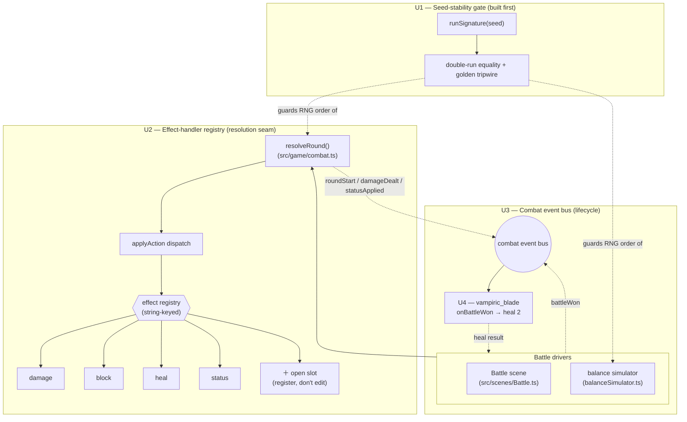

# feat: Combat Content Engine — extension-seam keystone (I4)

## Product Contract

### Summary

Turn combat's closed effect **resolution** into an open, string-keyed **effect-handler registry**, and add a deterministic **combat event bus** for battle-lifecycle moments. This opens the *resolution* seam and removes the duplicated post-victory relic heal — it does **not** by itself make a new player-facing verb cheap end-to-end: a real verb also needs the other `effect.kind` consumers (upgrade, scoring, classification, preview) opened, which a follow-up does (see Scope Boundaries' verb-cost acceptance note). A **seed-stability regression gate** is built first as the safety net — strengthened to sample RNG draw order, not just net outcome — and the existing `vampiric_blade` relic migrates onto the bus as the proof that a real, shipped behavior can live as a subscriber. No player-facing content ships in this plan; the content it unlocks (procedural enemies, synergy tags, new verbs, relic "Jokers") is deferred.

### Problem Frame

Escape's content is thin (17 cards, 4 relics, 3 scripted enemies) not because authoring is expensive but because every new mechanic edits a closed resolver. `CardEffect` (`src/data/cards.ts:7-11`) is a closed union (`damage | block | heal | status`) and `applyAction` (`src/game/combat.ts:134-174`) is a hardcoded if/else with no fallthrough — a new verb does nothing until the resolver is edited. Relic behavior is equally imperative and, in `vampiric_blade`'s case, **duplicated**: the "heal 2 after a win" rule is copy-pasted between the Battle scene (`src/scenes/Battle.ts:631-637`) and the balance simulator (`src/game/balanceSimulator.ts:221-223`).

This plan pays that architecture down once, at the keystone level only. It is deliberately *invisible to players*: its value is that the mechanics behind I1 (Reading the Enemy payoffs), I5 (a Nemesis that biases its script), and future content become cheap and safe to add afterward. The overriding constraint is the **deterministic-run contract** the Daily Descent and chronicle depend on — the refactor touches the most-tested file in the codebase, so it must not change RNG draw order or per-seed outcomes.

### Requirements

- **R1 — Open the resolution seam.** A new effect kind must resolve through `resolveRound` by *registering a handler*, with no edit to `applyAction`'s dispatch body. Proven by a test that registers a custom kind and asserts it applies.
- **R2 — Behavior-preserving refactor.** All 14 existing `resolveRound` cases in `src/game/combat.test.ts` pass unchanged; combat output is byte-identical for every authored card, item, punch, and boss special.
- **R3 — Deterministic combat event bus.** `resolveRound` and the battle drivers emit lifecycle events (round start, damage dealt, status applied, battle won) to registered subscribers in a deterministic order, consuming **no RNG** and reordering **no existing RNG draws**.
- **R4 — Proof subscriber.** `vampiric_blade`'s post-victory heal is expressed once as a bus subscriber and invoked by both the Battle scene and the simulator, removing the current duplication.
- **R5 — Seed-stability gate.** The balance harness asserts that a fixed seed produces an identical run *signature that samples RNG draw order and count*, not just net outcome — so a subscriber that reorders draws (even if the aggregate outcome is unchanged) fails loudly. This gate is authored *before* the refactor and stays green through every subsequent unit.
- **R6 — No player-facing content.** No new card, relic, enemy, or player-visible effect verb ships. The open-union proof is a test-only custom kind, not a game mechanic.

### Scope Boundaries

**In scope:** the effect-handler registry (resolution seam), the combat/battle event bus (emit surface + subscriber registry), the `vampiric_blade` migration, and the seed-stability gate.

#### Deferred to Follow-Up Work

Each is a cheap follow-up *because* this keystone exists, and each was named out-of-scope at scope confirmation:

- **Procedural enemy generator** driven by the existing `EnemyCombatPreference` grammar (`src/data/enemies.ts:17-29`).
- **Synergy-tag system** and **new conditional cards / new player-facing effect verbs**.
- **Full relic-"Joker" migration.** `swift_boots` and `iron_will` (acquisition-time stat mutations in `src/state.ts:147-148`) and `lucky_coin` (the `goldMultiplier` getter at `src/state.ts:136`) are **not** migrated — they operate at the hand-selection, combat-setup, and reward-economy layers, not the battle lifecycle. Forcing them onto a combat event bus would create exactly the cross-layer coupling the "decouple enemy power from reward scaling" learning warns against. See **KTD3**.
- **Opening the non-resolution `effect.kind` switch sites.** A first real player-facing verb must still open ~5 sites — `cardUpgrade.ts` (upgrade scaling), `cardSelection.ts` (hand scoring), `enemyIntent.ts` (family classification + `effectText`, whose else-branch assumes `status`), `rewardImpact.ts` (`cardRole`), and `battlePlan.ts` (`plannedBlock`) — or it is silently mis-scored, mis-previewed, or mis-classified. **Verb-cost acceptance note (makes the payoff falsifiable):** completing this plan does *not* prove a new verb is cheap — the open-union proof (R1) uses a test-only kind that never touches these sites. The follow-up that adds the first real verb must demonstrate it end-to-end across these ~5 sites, and *that* is the true test of the "data + subscribers" claim. See **KTD1** and **Risk R-b**.

**Out of this product's identity:** N/A — this is an internal architecture plan with no product-shape decision.

---

## Planning Contract

### Product Contract preservation

No upstream Product Contract exists (solo `ce-plan-bootstrap`); scope was confirmed via the Phase 0.7 synthesis. **One narrowing was recorded after research:** the confirmed "migrate the existing relics onto the bus" is scoped down to `vampiric_blade` only, because grounding showed the other three relics are not battle-lifecycle events. Rationale in **KTD3**; flagged for the user at handoff.

### Key Technical Decisions

- **KTD1 — Open the *resolution* seam, keep the *authoring* union typed.** The registry is keyed by a plain `string` kind so a new kind can be registered without editing `applyAction`. `CardEffect` (`src/data/cards.ts`) stays a closed, exhaustively-typed union so authored cards remain compile-checked; the resolver operates on a broader `ResolvableEffect` shape. This satisfies R1 (open resolution) without sacrificing type safety on shipped content, and keeps the cut to the *minimal* surface confirmed at scope time — the ~8 other `effect.kind` switch sites are left closed (KTD1 corollary: a new *content* verb, not this plan, addresses them).
- **KTD2 — The event bus is combat/battle-scoped, synchronous, and deterministic; the canonical event set is exactly four.** `roundStart`, `damageDealt`, `statusApplied` (round-level, emitted from inside `resolveRound`) and `battleWon` (battle-level, emitted from the drivers, since victory is detected by the caller). Subscribers fire in registration order. The dispatch **signature threads no `rng`**, so the framework does not invite RNG into subscribers — but that is discipline, not proof (a subscriber body could still import an RNG singleton and draw). The load-bearing guarantee is the strengthened R5 gate (KTD4): any subscriber that changes RNG draw order flips the run signature and fails the gate. Framework discipline + a draw-order-sensitive gate are the two layers; neither alone is claimed sufficient.
- **KTD3 — Only `vampiric_blade` migrates.** It is the sole relic whose trigger is a battle-lifecycle moment, and it is currently duplicated across scene and simulator — so migrating it both proves the bus and removes real duplication. `swift_boots`/`iron_will`/`lucky_coin` stay in their current layers (see Scope Boundaries). This narrows the confirmed "migrate the relics" plural; recorded here rather than silently expanded into a contrived multi-layer bus.
- **KTD4 — Seed-stability gate = double-run byte-equality of a *draw-order-sensitive* run signature, plus one committed golden as a drift tripwire.** The `runSignature` must sample **RNG draw order/count**, not just net outcome — otherwise a reordering that nets to identical aggregates passes green (the adversarial hole this decision closes). Concretely: run the sim under a lightweight *instrumented* `SeededRng` that accumulates a running draw count + rolling hash of successive draw results, and fold that into the signature alongside the outcome fields (victory, death depth, stratum reached, encounters, converted embers). This requires one small sim hook (an injectable RNG) — accepted over the thinner aggregates-only signature precisely because the gate is the load-bearing safety net; the aggregates-only alternative was rejected for leaving R-c's "any regression → red test" claim false. The gate asserts (a) two `simulateRun(seed)` runs produce identical signatures across a seed set, and (b) one fixed seed matches a committed golden. Matches the repo's explicit-assertion style (no `toMatchSnapshot` exists) and extends the seeded-equivalence precedent at `src/game/enemyIntent.test.ts:182`. Golden regenerated only on an *intentional* determinism change, reason in the commit body.
- **KTD5 — Characterization-first sequencing.** The gate (U1) lands before any refactor, so U2–U4 each carry "the seed-stability gate and `combat.test.ts` stay green" as a hard verification bar. This is the same discipline the endless-descent harness used to catch an unplayable deep-difficulty bug (`docs/solutions/design-patterns/decouple-enemy-power-from-player-reward-scaling.md`).

### Alternatives considered

- **Registry-only + a shared heal helper (defer the event bus).** Ship U1+U2 and extract the `vampiric_blade` heal into a plain shared function called by both drivers, deferring the event bus until a second lifecycle subscriber exists. Three reviewers recommended this. *Rejected* — the immediate next directions, I1 (Reading-the-Enemy payoffs) and I5 (Nemesis), both need round-level subscribers (`damageDealt`/`statusApplied`/`roundStart`), so the bus is a deliberate near-term bet rather than speculative generality. The event set is held to the minimal four, and the strengthened R5 gate (KTD4) protects the round-level emit surface from the determinism risk that motivated the deferral. If I1/I5 slip, this bet is the first thing to revisit.
- **Migrate a status-tick (poison/burn) instead of `vampiric_blade` as the proof.** A status-tick rides a round-level (`resolveRound`-internal) event — the determinism-sensitive seam — whereas `vampiric_blade` rides the RNG-free driver-level `battleWon`. *Rejected for the proof role* — converting working status ticks changes the most-tested path for no player benefit (KTD5's minimal-cut discipline). The round-level emit surface is instead covered by U3's deterministic-dispatch tests and the strengthened gate; the first real round-level subscriber lands with I1/I5.

### Assumptions

- The Battle scene's `+2 HP` popup for `vampiric_blade` stays scene-side, driven by the heal amount the subscriber returns; the simulator applies the same hp change without a popup. (Un-validated bet: the subscriber returns a structured result the driver renders, rather than the subscriber touching Phaser.)
- An unregistered effect kind reaching the resolver is a programming error (the authoring union is exhaustive), so the registry **throws** on an unknown kind rather than silently no-oping — fail-fast in dev/test. (Decided: U2's error-path test asserts the throw; the logged-no-op alternative is rejected.)

---

## High-Level Technical Design

Two independent extension seams plus the safety gate that guards both. The battle drivers and `resolveRound` become *emitters*; effects and relics become *subscribers/handlers*.



The dashed determinism edge is the whole point: everything the bus and registry add must leave the `runSignature` unchanged. Diagram is authoritative for component boundaries; per-unit sections below are the implementation contract.

---

## Implementation Units

### U1. Seed-stability regression gate

- **Goal:** Establish an executable "same seed ⇒ identical run" guarantee against *current* behavior, so every later unit is proven not to disturb the deterministic-run contract. Satisfies R5; enables KTD5.
- **Requirements:** R5.
- **Dependencies:** none (built first, against unmodified code).
- **Files:**
  - `src/game/runSignature.ts` (new) — `runSignature(seed, scenario?)` producing a stable, serialized digest from `simulateRun`'s outcome fields **plus an RNG draw-order digest**.
  - `src/game/runSignature.test.ts` (new).
  - `src/game/balanceSimulator.test.ts` (extend) — new `determinism` describe block.
  - `src/game/balanceSimulator.ts` (add the minimal hook to run under an instrumented/injectable RNG so the signature can sample draw order — the strengthened gate requires this; `SeededRng` is module-private, so expose an injection point rather than reaching into it).
- **Approach:** Run `simulateRun(seed, scenario)` under a lightweight *instrumented* RNG that accumulates a running draw count + rolling hash of successive `frac()` results, and fold that digest into the signature alongside the outcome fields (`victory`, `deathDepth`, `stratumReached`, `encounters`, `convertedEmbers`). Because `SeededRng` is module-private, the sim exposes an injectable RNG factory (the one small hook KTD4 justifies) rather than the test constructing the RNG directly. Assert double-run equality over a fixed seed set and one committed golden signature (KTD4). Keep the golden in the test file with a comment on when/how to regenerate.
- **Patterns to follow:** the seeded-equivalence assertion at `src/game/enemyIntent.test.ts:182`; the fixed-seed loops already in `balanceSimulator.test.ts` (`for seed 1..200/400`).
- **Execution note:** Characterization-first — author against current behavior and confirm green *before* any refactor unit begins.
- **Test scenarios:**
  - Happy: for seeds 1..50, `runSignature(seed)` from two `simulateRun(seed)` runs are strictly equal.
  - Golden tripwire: one fixed seed's signature equals a committed golden constant.
  - **Draw-order sensitivity (the load-bearing test):** deliberately perturb RNG consumption (inject or reorder one draw via a test-only instrumented RNG) and assert the signature **changes** — proving the gate samples draw order, not just net aggregates. Without this test the gate could pass green on a real determinism regression (the adversarial hole).
  - Edge: a seed that dies in stratum 1 and a seed that banks both produce stable, distinct signatures (the gate is not accidentally collapsing outcomes).
  - Edge: passing a non-default `scenario` (e.g., a starter kit) yields a stable signature across double runs.
  - `Covers` R5.
- **Verification:** `npm test` green including the new determinism block (with the draw-order-sensitivity test passing); `npm run build` clean. The golden constant is present and documented.

### U2. Combat effect-handler registry

- **Goal:** Replace `applyAction`'s inline `block/heal/damage/status` branches with a string-keyed handler registry, opening the resolution seam (R1) while preserving every existing outcome (R2).
- **Requirements:** R1, R2; KTD1.
- **Dependencies:** U1 (gate must exist and be green).
- **Files:**
  - `src/game/effectHandlers.ts` (new) — `ResolvableEffect` shape, `EffectHandler` type, the registry, and the four built-in handlers registered at module load.
  - `src/game/effectHandlers.test.ts` (new).
  - `src/game/combat.ts` (modify `applyAction` at `:134-174` to iterate effects and dispatch to the registry; keep `resolveRound`'s structure, speed sort, status ticks, and skip logic untouched).
  - `src/game/combat.test.ts` (assertions unchanged; add the open-union proof case).
- **Approach:** The handler context mirrors what `applyAction` mutates today: `{ actor, target, log }` over `MutableCombatant`. Each handler narrows its effect (`damage`, `block`, `heal`, `status`) and performs the same mutation currently inline (`combat.ts:149-170`), including the `armor + roundBlock` reduction and the `addStatus` refresh path. `applyAction` keeps its `'none'`/`skip_attack` short-circuits and its `log.push(uses …)` preamble; only the per-effect body becomes `registry.get(effect.kind)(effect, ctx)`. Register built-ins in one place so a test can register a fifth kind without editing `applyAction` (KTD1).
- **Technical design (directional):**
  ```
  type EffectHandler = (effect: ResolvableEffect, ctx: EffectContext) => void
  registry.register('damage', (e, ctx) => { /* armor+roundBlock reduction, then hp */ })
  // applyAction body: for (const e of combatActionEffects(action)) registry.dispatch(e, ctx)
  ```
  Directional only — not an implementation spec.
- **Patterns to follow:** the discriminated-union + dispatch style already used for `CombatAction` (`combat.ts:58-89`); keep pure logic in `src/game`, no Phaser.
- **Execution note:** Characterization-first — `combat.test.ts` and the U1 gate are the safety net; do not alter their assertions.
- **Test scenarios:**
  - Happy: each built-in kind resolves identically to pre-refactor — the 14 `combat.test.ts` cases stay green unchanged (block reduces damage, poison ticks and expires, heal caps at maxHp, stun consumed, punch base damage, gross HpChange reporting).
  - Multi-effect ordering: `riposte` (damage+block) and `cinder_hex` (damage+status) apply their effects in authored order.
  - Open-union proof (Covers R1): a test registers a custom kind (e.g. `'testverb'`) and runs an action carrying it through `resolveRound`; assert its mutation applies **without any edit to `applyAction`**.
  - Error path: dispatching an effect whose kind has no registered handler throws (per Assumptions) — asserted explicitly.
  - Determinism: the U1 gate stays green (registry adds no RNG).
  - `Covers` R1, R2.
- **Verification:** `combat.test.ts` unchanged and green; `effectHandlers.test.ts` green; U1 gate green; `npm run build` clean.

### U3. Combat event bus (lifecycle emit surface)

- **Goal:** Add a deterministic, RNG-free subscriber surface for battle-lifecycle moments, emitting from `resolveRound` (round-level) and from the drivers (battle-level), with zero behavioral change when no subscriber is registered. Satisfies R3.
- **Requirements:** R3; KTD2.
- **Dependencies:** U2 (shares the combat.ts context/refactor; sequencing avoids churn on the same file).
- **Files:**
  - `src/game/combatEvents.ts` (new) — event type union of exactly four (`roundStart`, `damageDealt`, `statusApplied`, `battleWon`), payload shapes, and a synchronous dispatcher with an ordered subscriber list.
  - `src/game/combatEvents.test.ts` (new).
  - `src/game/combat.ts` (emit round-level events without changing control flow: `roundStart` at the top of the round after status ticks; `damageDealt` and `statusApplied` from **inside the effect handlers** via the U2 `EffectContext`, since after U2 those mutations live behind the registry rather than in `applyAction`'s body).
- **Approach:** The dispatcher holds an ordered subscriber array; `emit(event)` calls each in registration order. Payloads carry read context and, where a subscriber may adjust an outcome, a controlled mutation surface (kept minimal for the keystone — the only real subscriber, U4, only needs to heal the run on `battleWon`). `resolveRound` emits round-level events; `battleWon` is emitted by the drivers in U4, not here. This unit ships the emit surface with an empty subscriber set and proves it is inert. Round-level payloads are kept read-first and minimal; their exact shape firms up with the first real round-level subscriber (I1/I5), so no consumer contract is frozen prematurely.
- **Technical design (directional):** events are a discriminated union; `emit` iterates a frozen-order list; no `rng` parameter is threaded into dispatch (KTD2 makes RNG-in-dispatch structurally impossible).
- **Patterns to follow:** mirror `CombatAction`'s union+dispatch shape; keep it in `src/game` (pure). Do **not** reuse Phaser's `game.events` (that is scene-coordination, `main.ts:88`, `Battle.ts:575`).
- **Test scenarios:**
  - Happy: a test subscriber observes `roundStart`, `damageDealt`, `statusApplied` fired at the correct moments and in deterministic order for a known round.
  - Zero-behavior: with no subscribers, `resolveRound` output is byte-identical to U2 — `combat.test.ts` and the U1 gate stay green.
  - Ordering: two subscribers fire in registration order; a no-op subscriber does not alter results.
  - Determinism: dispatch consumes no RNG (U1 gate green).
  - `Covers` R3.
- **Verification:** `combatEvents.test.ts` green; `combat.test.ts` and U1 gate green; `npm run build` clean.

### U4. Migrate `vampiric_blade` to a battle-lifecycle subscriber

- **Goal:** Express the `vampiric_blade` post-victory heal once as a `battleWon` subscriber and invoke it from both drivers, proving the bus carries real shipped behavior and removing the scene/simulator duplication. Satisfies R4; the first instance of KTD3.
- **Requirements:** R4; KTD2, KTD3.
- **Dependencies:** U3 (needs the `battleWon` event and dispatcher).
- **Files:**
  - `src/game/relicBehaviors.ts` (new) — a relic-id → lifecycle-subscription binding; only `vampiric_blade` (→ `battleWon`: heal 2, capped at maxHp) is bound.
  - `src/game/relicBehaviors.test.ts` (new).
  - `src/game/combatEvents.ts` (consume the binding when wiring subscribers).
  - `src/scenes/Battle.ts` (`victory()` at `:631-637` — replace the hardcoded heal with a `battleWon` dispatch over the run's owned relics; keep the `+2 HP` popup driven by the returned heal amount).
  - `src/game/balanceSimulator.ts` (`applySimulatedPostBattleRewards` at `:221-223` — replace the hardcoded heal with the same dispatch).
  - `src/game/balanceSimulator.test.ts` (existing `vampiric_blade` assertion at `:30-44` must stay green).
- **Approach:** On victory, each driver emits `battleWon` with the run's owned relic ids; the dispatcher runs each owned relic's bound subscriptions. `vampiric_blade` returns a heal amount the driver applies (`run.heal(2)`), so the scene can render its popup and the simulator can apply the hp change headlessly (per Assumptions). No RNG; the heal remains capped at maxHp via `run.heal`.
- **Patterns to follow:** the existing `run.hasRelic` predicate (`state.ts:139-141`) becomes the ownership filter feeding the dispatch, not a per-site behavior branch.
- **Test scenarios:**
  - Happy: with `vampiric_blade` owned, `battleWon` heals 2; without it, no heal.
  - Cap/frequency edge: heal caps at maxHp; fires once per victory, not per round.
  - De-duplication (Covers R4): the simulator path and a scene-equivalent path route through the same subscriber; the existing `balanceSimulator.test.ts` vampiric assertion (`:30-44`) passes unchanged.
  - Non-migrated relics unaffected (KTD3): `swift_boots` hand limit (`state.ts:147`), `iron_will` armor cap (`state.ts:148`), and `lucky_coin` gold multiplier (`state.ts:136`, `rewards.ts`) keep working — their existing tests stay green.
  - Determinism: U1 gate green.
  - `Covers` R4.
- **Verification:** `relicBehaviors.test.ts` green; `balanceSimulator.test.ts` (incl. the pre-existing vampiric assertion) green; U1 gate and `combat.test.ts` green; `npm run build` clean; browser smoke of a won fight shows the `+2 HP` popup when the relic is owned.

---

## Risks & Mitigations

- **R-a — Refactoring the most-tested file drifts behavior or determinism.** `combat.ts` carries 14 characterization tests and every fight in the game. *Mitigation:* U1 gate lands first; U2/U3 are behavior-preserving with `combat.test.ts` assertions frozen; the gate + build are hard bars on every unit.
- **R-b — The union is only half-open.** Resolution is opened, but `cardUpgrade`, `cardSelection` scoring, `enemyIntent` classification (its `effectText` else-branch assumes `status`), `rewardImpact` role, and `battlePlan.plannedBlock` still switch on `effect.kind`. A future content verb that skips them would be silently mis-scored, mis-previewed, or mis-classified. *Mitigation:* documented explicitly in Scope Boundaries as the follow-up surface; this plan ships no player-facing verb, so no live path hits those switches. The follow-up that adds the first real verb must open (or safe-default) them.
- **R-c — The event bus invites RNG-consuming subscribers later.** A subscriber that draws RNG or reorders draws would break the Daily/chronicle contract. *Mitigation:* the dispatch signature threads no `rng` (KTD2), and — the real guarantee — the strengthened, draw-order-sensitive R5 gate (KTD4) turns any such reordering into a red test rather than a silent divergence. *Residual:* the gate runs `simulateRun`; the Battle-scene path is covered only where it shares `resolveRound` and the single `battleWon` subscriber (U4 routes both drivers through one definition, removing scene/sim drift), plus browser smoke.
- **R-d — Scope creep into content.** The open-union proof could tempt shipping a real new verb. *Mitigation:* the proof is a test-only custom kind (R6); no card/relic/enemy data changes.

## Dependencies / Prerequisites

None external. All units are internal to `src/game` and two scene/sim call sites; no new npm dependencies, no data-format or save-state changes.

## Documentation Plan

- Add `CONCEPTS.md` entries for **Combat Effect Handler Registry** and **Combat Event Bus** as durable implementation boundaries (the file already documents implementation boundaries alongside player concepts).
- A `docs/solutions/` learning (the registry/bus extension pattern and the seed-stability gate) is a natural post-implementation capture via `ce-compound` — not authored here.

## Sources & Research

- `docs/ideation/2026-06-29-escape-next-directions-ideation.html` — Idea **I4, "The Compounding Content Engine."** Note: I4's basis described the harness as `BALANCE_ENCOUNTER_POLICY = 'fight-taken-baseline'` with "no skip/flee path." That is **stale** — the endless-descent banking work already generalized the simulator into a strata/delve economy with a dominance gate, so the harness work here is the *seed-stability* addition (R5), not a flee/skip model.
- `docs/solutions/design-patterns/decouple-enemy-power-from-player-reward-scaling.md` — the "no dominant line" harness discipline and the shared-seam audit lesson; the model for KTD5 and the caution behind KTD3.
- `docs/solutions/design-patterns/room-threat-system.md` — "keep pure deterministic game logic; scenes only render," and "don't let systems consume unused random choices" (the determinism care behind KTD2).
- Repo grounding (verified read): `applyAction` is module-private and the only resolution site (`combat.ts:134,248`); the ~8 `effect.kind` switch sites (KTD1 / R-b); `vampiric_blade` duplicated at `Battle.ts:631-637` and `balanceSimulator.ts:221-223`; the three non-lifecycle relics at `state.ts:136,147-148`; no existing event/registry pattern and no `toMatchSnapshot` in the repo (KTD4); seeded-equivalence precedent at `enemyIntent.test.ts:182`.
