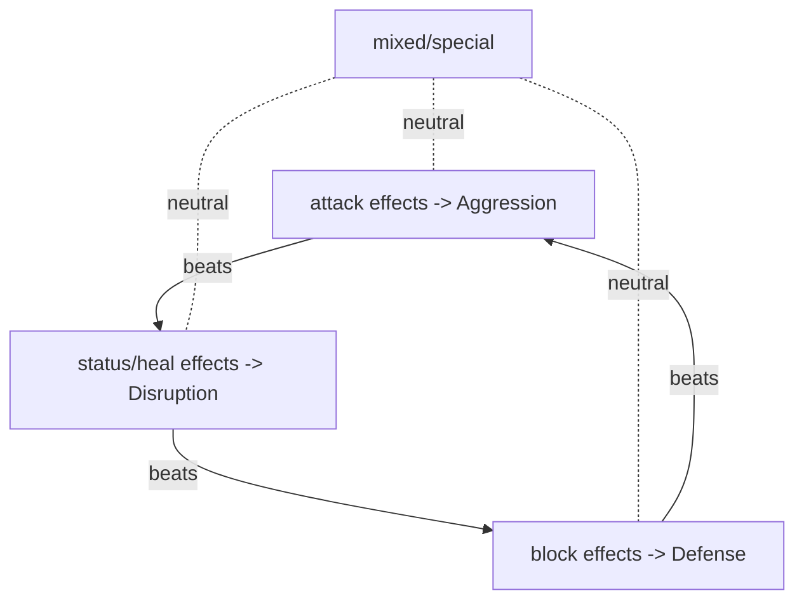
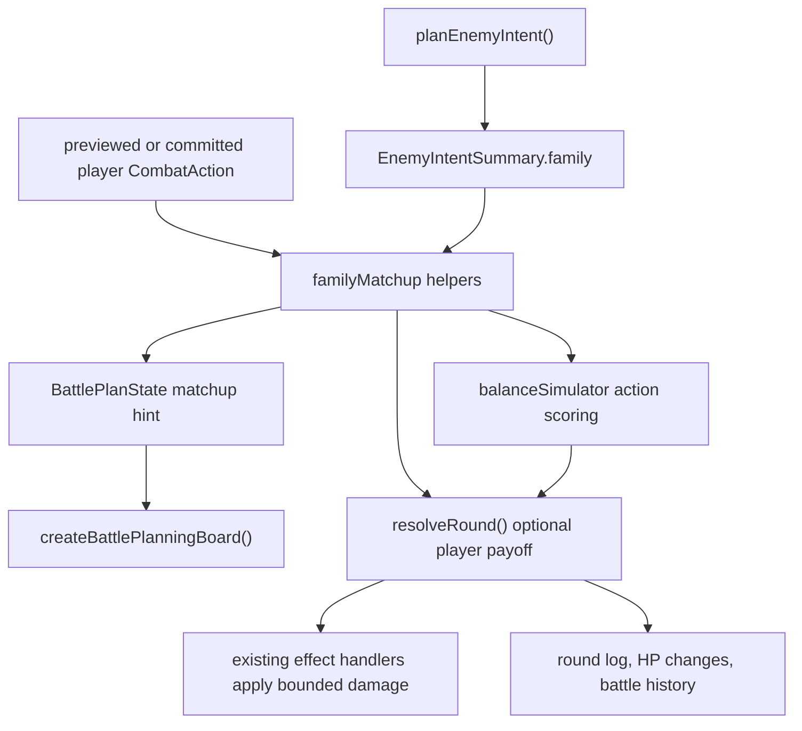

# Family Matchup Payoff - Plan

## Goal Capsule

| Field             | Plan                                                                                                                                                                                                           |
| ----------------- | -------------------------------------------------------------------------------------------------------------------------------------------------------------------------------------------------------------- |
| Objective         | Ship the next Reading the Enemy slice: a player-only Family Matchup payoff and a planning-board hint that tells players what counters the displayed enemy intent.                                              |
| Authority         | This plan narrows the Reading the Enemy brainstorm and supersedes the older full I1 plan only for this slice. The current source state wins where earlier docs are stale.                                      |
| Execution profile | Standard code plan. Pure game logic first; Phaser scene work only renders and wires already-tested state. No new npm dependencies or save-state changes.                                                       |
| Stop conditions   | Stop if the payoff requires deceivers or Gold reveal to be fair, if the board hint cannot fit without a visible layout regression, or if deterministic run signatures drift without an intentional rebaseline. |
| Tail ownership    | Implementation owns tests, build/lint/format gates, and a manual battle smoke test proving the hint and payoff are visible in play.                                                                            |

---

## Product Contract

### Summary

Readable enemy intent already exists: the Card Battle Planning Board previews enemy intent, and strong enemies now have scripts. This plan makes that read matter by adding a player-only Family Matchup: a committed player action family can counter the enemy's true intent family and earn a bounded bonus. The board also shows the counter relationship before the player commits, so the read is a decision surface rather than a passive status panel.

### Problem Frame

The original Reading the Enemy brainstorm identified a broken loop: the game could show enemy intent, but reading it did not produce a distinct reward. Since then, Layer 1 has landed: knight, necromancer, and ogre now carry `combatScript` data. I4 has also landed: combat effects resolve through `effectHandlers.ts`, and battle lifecycle events are guarded by `runSignature.ts`. The next slice should therefore be smaller and more concrete than the older full plan: use the now-readable intent and existing combat seams to award a player-only payoff, then show the player how to earn it.

### Requirements

**Family taxonomy and payoff**

- R1. The game has one canonical mapping from combat effects to action family, shared by enemy intent summaries and the Family Matchup logic.
- R2. Action families map to a three-role cycle: Aggression, Defense, and Disruption.
- R3. When the player's committed action role beats the enemy's true intent role, the player earns a bounded matchup bonus. The v1 bonus starts at 3 pre-mitigation damage, matching the always-available Punch baseline.
- R4. The matchup bonus is player-only; enemies never receive a mirror bonus from beating the player's family.
- R5. Mixed and special intent remain matchup-neutral in this slice.

**Planning-board readability**

- R6. The planning board tells the player what role counters the displayed enemy intent before they commit.
- R7. When the player previews a card, item, or punch, the board can indicate whether that choice wins, loses, ties, or is neutral against the displayed intent.
- R8. The added hint must not overlap existing timeline, status lane, prompt, punch, item, or hand regions.

**Simulation and determinism**

- R9. The battle scene and balance simulator use the same Family Matchup computation and payoff path.
- R10. The balance simulator accounts for the payoff when selecting player actions.
- R11. Simulator tests guard against a degenerate line where one role or "always counter with one family" dominates.
- R12. The feature consumes no new RNG and keeps the run signature stability gate green.

### Acceptance Examples

- AE1. Covers R3, R4. Given the enemy's true intent is Aggression and the player commits a Defense card, when the round resolves, then the enemy takes the player-only matchup bonus and the enemy receives no mirror bonus.
- AE2. Covers R5. Given the enemy intent is Mixed or Special, when the player commits any action, then no matchup bonus is awarded and existing combat resolution is unchanged.
- AE3. Covers R6, R7. Given the board displays Attack intent and the player hovers Guard, when the planning board re-renders, then it shows that Defense counters Aggression and that the hovered choice wins the matchup.
- AE4. Covers R8. Given the matchup hint is visible on the planning board, when the board renders in planning and resolved phases, then the hint does not collide with the timeline, status lanes, center prompt, punch button, item buttons, or hand area.
- AE5. Covers R9, R12. Given two simulated runs use the same seed and choices, when Family Matchup is enabled, then both runs keep identical action and RNG draw sequences except for intentional HP/log differences from the deterministic payoff.

### Scope Boundaries

#### In Scope

- The family/role mapping, player-only payoff, board hint, simulator scoring, and tests needed to ship the matchup slice.
- Small scene wiring in `BattleScene` so the committed enemy intent and previewed player action feed the same pure matchup logic.
- A bounded internal bonus using existing combat resolution seams.

#### Deferred to Follow-Up Work

- Deceiver enemies, false displayed families, learnable tells, and pierced intent states.
- Gold reveal or any in-battle Gold UI.
- Full procedural enemy generation, synergy tags, or new authored card verbs.
- Hand composition agency, doctrines, pin/bench, or singularity builds.
- Game-feel and honesty fixes such as status-upgrade behavior and flee rewards.

#### Outside This Product's Identity

- Symmetric enemy matchup bonuses. Reading the enemy is the player's edge in this initiative; enemy difficulty comes from scripts, stats, and later deception.

### Sources

- `docs/brainstorms/2026-06-29-reading-the-enemy-combat-requirements.md` defines the full four-layer Reading the Enemy product direction.
- `docs/plans/2026-06-29-001-feat-reading-the-enemy-combat-plan.md` is the older full implementation plan. This plan narrows it to the Layer 2 payoff slice and adapts it to the current post-I4 architecture.
- `docs/ideation/2026-06-29-escape-next-directions-ideation.html` ranked "Make Reading the Enemy the Core Skill" as I1.

---

## Planning Contract

### Product Contract Preservation

The upstream brainstorm's Layer 2 requirements are preserved and narrowed. Layer 1 is treated as already implemented because current `src/data/enemies.ts` includes strong-enemy `combatScript` entries. Layers 3 and 4 remain in the Product Contract history but are explicitly deferred here so this plan can ship one coherent slice.

### Key Technical Decisions

- KTD1. Canonical family classification lives in the Family Matchup layer and `enemyIntent.ts` consumes it. The current private `familyForEffects` logic should not be duplicated, because duplicated classification would let the board and payoff disagree.
- KTD2. Role mapping is Aggression for attack, Defense for block, and Disruption for status or heal. Mixed and special stay neutral. This preserves the original brainstorm's triangle while keeping mixed starter-kit cards from becoming ambiguous counters.
- KTD3. The v1 payoff is `MATCHUP_BONUS_DAMAGE = 3` pre-mitigation counter damage applied by the player to the enemy through the existing effect-handler path. The value matches `PUNCH_DAMAGE`, making a correct read visible without equaling a full tier-1 attack card or authoring a new public card effect verb.
- KTD4. The payoff is optional data passed into round resolution and is consumed only during the player's real action turn. If the player is stunned, chooses no action, or the player action does not beat the true enemy family, no bonus fires.
- KTD5. The planning board hint is display-only and is computed from the displayed enemy family. This keeps the current non-deceiver slice simple; future deceivers can swap the displayed family while still resolving against the true family.
- KTD6. Simulator action choice uses the same matchup computation and resolution path as the live battle scene. A separate simulator-only approximation would tune a different game than the player sees.
- KTD7. No new RNG is introduced. This work should change combat outcomes and logs, not enemy action selection, reward rolls, dungeon generation, or draw order.

### High-Level Technical Design

**Family wheel**

**Round data flow**

### Existing Patterns To Follow

- Pure gameplay state first, Phaser render second: `battlePlan.ts`, `battleLayout.ts`, and `roomThreat.ts` already model this boundary.
- Existing battle-board layout metrics are tested in `battleLayout.test.ts`; new hint geometry should add tested relationships rather than relying on visual guesses.
- The event/effect refactor already created `effectHandlers.ts`, `combatEvents.ts`, `runSignature.ts`, and `runSignature.test.ts`; the payoff should reuse these guardrails.
- The Endless Descent learning shows that balance levers need a no-dominant-line harness, not a vibe check.

### Assumptions

- A single counter-damage bonus is enough to prove the read-payoff loop. If simulator tuning shows it is too flat, adjust the amount before landing rather than adding new payoff types in this slice.
- Pure heal actions count as Disruption for v1. If they distort simulator behavior, make heal neutral as a scoped tuning change before landing.
- The board has enough room for one compact hint row inside the existing panel. If implementation proves otherwise, the fallback is a measured layout adjustment covered by `battleLayout.test.ts`.

---

## Implementation Units

### U1. Canonical Family Matchup Module

- **Goal:** Create the pure Family Matchup model: effect/action classification, role mapping, beats relationship, neutral cases, and display labels.
- **Requirements:** R1, R2, R5.
- **Dependencies:** none.
- **Files:**
  - `src/game/familyMatchup.ts`
  - `src/game/familyMatchup.test.ts`
  - `src/game/enemyIntent.ts`
  - `src/game/enemyIntent.test.ts`
- **Approach:** Extract the existing effect-family logic from `enemyIntent.ts` into a shared pure module, then have enemy intent summaries call that shared classifier. Add role helpers that convert `attack`, `block`, `heal`, and `status` into the matchup wheel and keep `mixed`/`special` neutral. Keep labels and short copy in the pure layer so both the board and simulator use the same terms.
- **Patterns to follow:** `enemyIntent.ts` summary generation, `combatActionEffects` in `combat.ts`, and pure test shape in `battlePlan.test.ts`.
- **Test scenarios:**
  - A pure damage card classifies as `attack` and maps to Aggression.
  - A pure block card classifies as `block` and maps to Defense.
  - Pure status and pure heal classify to their existing families and map to Disruption.
  - Mixed damage-plus-block, damage-plus-status, block-plus-heal, and special actions are neutral.
  - The wheel is non-reflexive and directional: Defense beats Aggression, Aggression beats Disruption, Disruption beats Defense.
  - Existing `planEnemyIntent` summaries remain identical for representative attack, block, heal, status, mixed, and boss-special cards after the extractor move.
- **Verification:** Family classification has one implementation and enemy intent tests prove the board's displayed family did not drift during extraction.

### U2. Player-Only Matchup Payoff In Round Resolution

- **Goal:** Award a bounded player-only payoff when the committed player action beats the enemy's true intent family.
- **Requirements:** R3, R4, R5, R12; covers AE1, AE2, AE5.
- **Dependencies:** U1.
- **Files:**
  - `src/config.ts`
  - `src/game/combat.ts`
  - `src/game/combat.test.ts`
  - `src/game/effectHandlers.test.ts`
  - `src/game/runSignature.test.ts`
- **Approach:** Add a gameplay constant for the 3-damage v1 payoff, then extend round resolution with optional player-matchup payoff data. When present and the player action is the action being applied, dispatch a synthetic bounded damage effect through the existing effect-handler path after the player's normal action effects. The bonus uses existing armor/block reduction and HP-change tracking, logs a distinct read-payoff line, and is skipped if the player's action is skipped or neutral. The field is optional so all existing callers preserve current behavior until explicitly wired.
- **Execution note:** Add characterization tests around unchanged resolution with the payoff omitted before adding the bonus path.
- **Patterns to follow:** optional-call-site compatibility from the I4 plan, built-in damage handler behavior in `effectHandlers.ts`, and existing `resolveRound` HP-change tests.
- **Test scenarios:**
  - Covers AE1. Defense beats an enemy attack: the enemy takes normal action effects plus `MATCHUP_BONUS_DAMAGE`, and the log records the read payoff.
  - A losing, tied, mixed, or special matchup applies no bonus and produces the same HP result as omitted payoff data.
  - The enemy never receives a mirror bonus when its action family would beat the player's family.
  - A stunned player does not receive the bonus because the committed action is skipped.
  - The bonus is reduced by enemy armor and round block through the same damage handler as normal damage.
  - Existing custom effect registration and unregistered-kind tests stay green, proving the payoff did not bypass the registry contract.
  - `runSignature` remains deterministic across the existing seed spread; any golden change is treated as a regression unless the implementation intentionally changes deterministic outcomes and documents why.
- **Verification:** Combat tests prove the payoff is player-only, bounded, optional, and routed through existing effect handling; the determinism gate stays green.

### U3. Battle Scene Matchup Wiring

- **Goal:** Wire the live battle scene so the committed enemy intent and player action compute and pass the same payoff data used by pure tests.
- **Requirements:** R3, R4, R9, R12.
- **Dependencies:** U1, U2.
- **Files:**
  - `src/scenes/Battle.ts`
  - `src/game/combat.test.ts`
- **Approach:** In `BattleScene.playRound`, compute the player's action family from the committed action and compare it to `enemyTurn.summary.family`, which remains the true family in this non-deceiver slice. Pass the resulting player-only payoff data into `resolveRound`. Keep all enemy intent planning unchanged: no re-plan, no new RNG, and no change to `enemyUsed` sequencing. Existing combat popups and battle history can consume the gross enemy HP change and round log without special scene-side damage math.
- **Patterns to follow:** current `commitEnemyIntent`, `currentEnemyIntent`, `renderPlanningBoard`, and `playRound` flow in `Battle.ts`; avoid moving combat rules into Phaser code.
- **Test scenarios:**
  - Scene wiring is covered indirectly by U2 pure resolution tests and U4 board-state tests. No dedicated Phaser scene unit test is expected in this repo.
  - Manual smoke: start a battle against an attack-scripted enemy, hover and play a Defense card, verify the enemy HP/log reflects the matchup payoff.
  - Manual smoke: play a losing or neutral card against the same intent and verify no payoff log appears.
- **Verification:** Live battle uses the same payoff helper as tests, produces no additional enemy intent planning call, and shows the payoff through existing HP/log presentation.

### U4. Planning Board Matchup Hint

- **Goal:** Show what counters the displayed enemy intent and whether the previewed player action wins the matchup.
- **Requirements:** R6, R7, R8; covers AE3, AE4.
- **Dependencies:** U1.
- **Files:**
  - `src/game/battlePlan.ts`
  - `src/game/battlePlan.test.ts`
  - `src/gfx/battlePlanningBoard.ts`
  - `src/game/battleLayout.ts`
  - `src/game/battleLayout.test.ts`
- **Approach:** Add a compact `matchupHint` field to `BattlePlanState`, populated from the displayed enemy family and optional previewed player action. Render one concise hint row between the timeline and status lanes, reusing the existing board panel. Keep the base board height if the hint fits. If it does not, adjust layout through `battleLayout.ts` and update geometry tests for prompt and button clearance before changing render coordinates.
- **Patterns to follow:** existing `BattlePlanState` construction, status lane compaction in `battlePlanningBoard.ts`, and the Phaser layout-regression learning that dynamic visual surfaces need pure geometry tests.
- **Test scenarios:**
  - The board state for attack intent with no hovered player action says Defense counters Aggression.
  - The board state for attack intent with a block player action marks the preview as a winning matchup.
  - Losing, tied, mixed, and special previews render as lose/tie/neutral without promising a bonus.
  - The resolved phase retains enough matchup context for the actual round log and board to make sense after commit.
  - Layout tests prove the hint row does not overlap the timeline, status lanes, prompt, punch button, item buttons, or hand area.
  - Long enemy names and longer hint labels stay within the planning-board text width through existing word-wrap or abbreviated labels.
- **Verification:** The board communicates counter information before commit, hover previews update the state, and geometry tests protect the canvas layout.

### U5. Simulator Matchup Scoring And Tuning Guard

- **Goal:** Teach the balance simulator to value matchup-winning actions and guard against a degenerate always-one-family line.
- **Requirements:** R9, R10, R11, R12.
- **Dependencies:** U1, U2.
- **Files:**
  - `src/game/balanceSimulator.ts`
  - `src/game/balanceSimulator.test.ts`
  - `src/game/runSignature.test.ts`
- **Approach:** Carry the enemy intent family from `chooseEnemyDecision` into simulated action evaluation, compute the same player-only payoff candidate used by the live battle, and call `resolveRound` through the U2 path. Add a focused scoring test where a matchup-winning card is preferred over a close non-winning alternative. Add a small strategy comparison or summary assertion that catches one role becoming strictly dominant over a seed spread; this is a local analogue of the Endless Descent no-dominant-line gate.
- **Execution note:** Treat simulator baseline shifts as suspicious until explained. A matchup payoff may legitimately move win-rate bands, but the reason should be documented inline before changing thresholds.
- **Patterns to follow:** `choosePlayerAction`, `applyRound`, `simulateScenarioSummary`, `assessDelveDominance`, and the `runSignature` golden test.
- **Test scenarios:**
  - A matchup-winning player action scores above an otherwise similar non-winning action when enemy intent is fixed.
  - Simulator resolution and live resolution produce equivalent HP/log effects for a representative winning matchup.
  - No single role policy dominates the seed spread beyond a named margin after tuning.
  - Existing baseline win-rate bands are either unchanged or intentionally re-baselined with an inline rationale tied to the payoff.
  - `runSignature` double-run equality remains green because the payoff adds no RNG draws.
- **Verification:** Simulator action choice accounts for reads, balance tests catch a runaway family, and deterministic-run tests remain stable.

### U6. Documentation And Manual Battle Smoke

- **Goal:** Capture the player-facing concept and verify the slice in a running Phaser battle.
- **Requirements:** R6, R7, R8.
- **Dependencies:** U1, U2, U3, U4, U5.
- **Files:**
  - `CONCEPTS.md`
  - `README.md`
- **Approach:** Ensure `CONCEPTS.md` defines Family Matchup as the read-payoff layer under Card Battle. Update README gameplay text only if the board/payoff changes the player-facing explanation enough to keep the "How it plays" section accurate. Run a browser smoke over a normal battle and one strong-enemy battle, checking that the hint, preview state, payoff log, HP change, and no-overlap layout are visible.
- **Test scenarios:**
  - Test expectation: none for docs-only edits; automated coverage lives in U1-U5.
  - Manual smoke: attack intent plus Defense card shows a winning hint and awards the payoff.
  - Manual smoke: status/heal intent plus Aggression card shows a winning hint and awards the payoff.
  - Manual smoke: mixed or special intent shows neutral and awards no payoff.
- **Verification:** The durable vocabulary is documented, README stays accurate, and the visible battle loop matches the Product Contract.

---

## Verification Contract

| Gate                            | Applies To | Done Signal                                                                                                                                                                        |
| ------------------------------- | ---------- | ---------------------------------------------------------------------------------------------------------------------------------------------------------------------------------- |
| `npm test`                      | U1-U5      | All unit, simulator, layout, and determinism tests pass.                                                                                                                           |
| `npm run build`                 | U1-U6      | Strict TypeScript and production bundle build cleanly.                                                                                                                             |
| `npm run lint`                  | U1-U6      | ESLint passes with no unused symbols or type-aware lint failures.                                                                                                                  |
| `npm run format:check`          | U1-U6      | Prettier reports no formatting drift.                                                                                                                                              |
| Browser smoke via `npm run dev` | U3, U4, U6 | In a live battle, the board hint appears before commit, hover previews update it, winning matchups award the payoff, neutral matchups do not, and the board layout stays readable. |

---

## Definition of Done

- U1 through U6 are complete or intentionally removed from scope with this plan updated before implementation continues.
- The Family Matchup helper is the only source of family-role and beats-cycle truth.
- `BattleScene` and `balanceSimulator.ts` both use the same payoff computation and `resolveRound` path.
- Matchup hints are visible, compact, and covered by pure state and layout tests.
- The simulator has at least one guard against a dominant family line.
- The run signature determinism gate remains green or is intentionally re-baselined with a documented deterministic-outcome reason.
- No deceiver, Gold reveal, hand-composition, or unrelated game-feel work is included in the implementation diff.
- Abandoned experiments, duplicate classifiers, and one-off scene-side combat math are removed before the work is declared done.

---

## Appendix

### Research Notes

- Current `src/data/enemies.ts` already scripts knight, necromancer, and ogre, so this plan does not include the older U1 strong-enemy scripting unit.
- Current `src/game/combat.ts` already dispatches effects through `dispatchEffect`, and `src/game/effectHandlers.ts` registers built-in damage, block, heal, and status handlers.
- Current `src/game/combatEvents.ts` and `src/game/runSignature.ts` provide the deterministic guardrails introduced by the I4 plan.
- Current `src/game/battlePlan.ts` builds the planning board state from enemy intent, optional player action, status lanes, and resolved logs.
- Current `src/gfx/battlePlanningBoard.ts` has a fixed board with the timeline starting at y 70 and status lanes at y 118, so the hint row needs measured placement.
- Current `src/game/balanceSimulator.ts` clones RNG for enemy decisions and models cautious/moderate/aggressive delve strategies; matchup work must preserve this deterministic shape.
