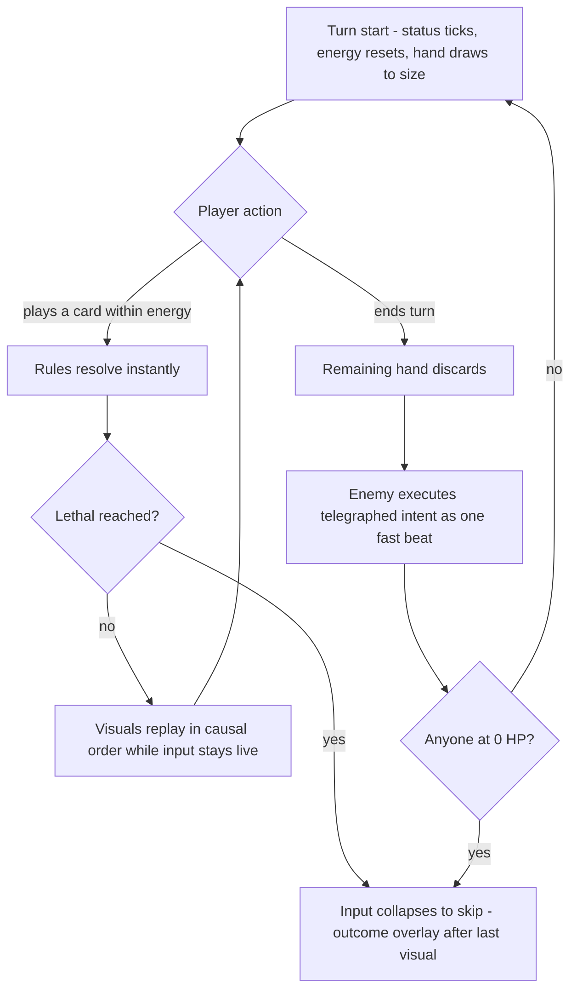
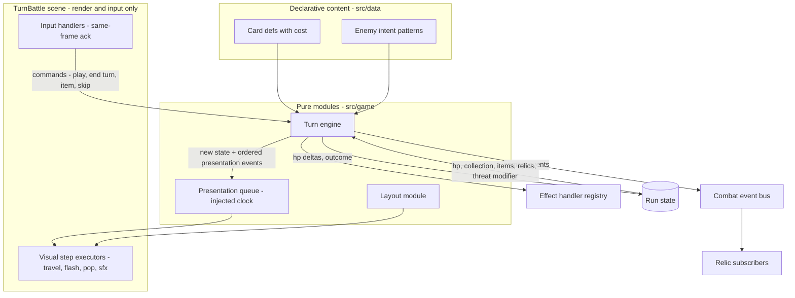

# Slay-the-Spire-Style Combat Rebuild - Plan

## Goal Capsule

- **Objective:** Replace the simultaneous one-action-per-round combat with a Slay-the-Spire-style turn system — energy budget, multi-card turns, full-collection deck, telegraphed enemy intents — that meets hard responsiveness criteria, with feel proven in an isolated playable slice before run-loop integration.
- **Product authority:** The Product Contract below. Vocabulary per CONCEPTS.md. Where the old model's semantics do not translate and no requirement rules, Slay the Spire's convention is the default ruling.
- **Execution profile:** Two milestones. Milestone 1 (U1–U7) is standalone and fully verifiable without touching the run loop. Milestone 2 (U8–U14) swaps the run loop and retires the old model. Pure modules ship test-first with colocated Vitest suites; scene work verifies smoke-first in the browser.
- **Stop conditions:** Do not begin Milestone 2 (U8 onward) until the slice's feel gate (Verification Contract) has passed a user playtest. Surface as a blocker anything that would change Product Contract requirements rather than guessing.
- **Tail ownership:** The numeric balance pass, starting-deck padding size, and end-of-turn discard variant are owned by playtesting after Milestone 2, not by this plan.
- **Open blockers:** None.

---

## Product Contract

### Summary

Rebuild battle combat as a clean Slay-the-Spire-style system: a per-turn energy budget, multiple card plays per turn, the full card collection as a shuffled deck with draw and discard piles, and enemy intents telegraphed each turn. Build it feel-first — an isolated playable slice to tune responsiveness and readable resolution, then run-loop integration with cards and enemies re-authored as declarative data.

### Problem Frame

Battle feels laggy and illegible, and the causes are authored-in rather than performance. After any card play, all input is ignored for a hardcoded 2.3 seconds; clicks during that window die without feedback, which reads as "the game missed my click." Resolution feedback fires as one simultaneous burst 900ms after the play — player and enemy effects at once, with no causal sequence — so it is unclear what the played card did. The hand-recycle rule un-greys every card once all are used, announced only by a prompt line 1.7 seconds later that is easy to miss, so hands appear to reset at random. The player experiences all of this as bugs and lag.

Beyond the defects sits a judgment from play: even fixed, the simultaneous pick-one-action round does not produce the turn cadence the game is chasing. The reference feel is Slay the Spire's, and nothing about the current battle reaches it.

### Key Decisions

- **Fresh slate over translation.** The speed timeline, planning-board predicted-vs-actual framing, enemy-read prediction mechanics, and family-matchup payoff are dropped with the old model rather than ported. This supersedes docs/plans/2026-07-01-001-feat-combat-content-engine-keystone-plan.md and docs/plans/2026-07-01-002-feat-family-matchup-payoff-plan.md; the keystone plan's data-driven-content goal survives through the integration milestone.
- **Deck = full collection.** The genuine Slay-the-Spire loop: every card pickup changes every future battle, card removal gains value, and the reward economy rebalances around deck-building incentives.
- **Feel-first staging.** An isolated slice proves the feel before integration begins, keeping tuning untangled from balance work while the old combat stays live.
- **Rules resolve instantly; presentation replays.** Combat logic completes at the moment of play; visuals replay the outcome as a fast, causally ordered queue; input is never gated on animation. This is the structural guarantee behind every responsiveness requirement, extending the existing combat event bus and effect-handler registry.
- **Slay-the-Spire conventions as baseline numbers.** 3 energy, draw 5, discard the hand at end of turn — structure fixed, numbers open to tuning.
- **Slay-the-Spire parity is the default ruling.** Where old-model semantics do not translate (block lifetime, status timing, stun, reward shape), adopt Slay the Spire's convention unless a requirement overrides it.
- **Combat stays one-on-one.** Multi-enemy encounters and targeting are out of this rebuild.
- **Room Threat reaches into battle.** Threatening rooms modify the battle's starting state (for example an enemy buff or an empowered first intent) instead of remaining a pre-battle-only layer; the concrete modifiers are a Milestone 2 design task.

### Requirements

**Turn structure and deck**

- R1. A battle turn: the player draws a hand from a shuffled draw pile built from the entire card collection, plays any number of cards limited only by energy, and explicitly ends the turn; the enemy then executes its telegraphed intent.
- R2. Cards cost energy; the player has a per-turn energy budget that resets at turn start.
- R3. Played cards go to a discard pile; the unplayed hand is discarded at end of turn; an empty draw pile reshuffles the discard pile into it.
- R4. Draw pile and discard pile counts are always visible, and their contents inspectable — the draw pile in sorted order (never true draw order), the discard pile in true order.
- R5. The enemy's next action (type and raw magnitude, unadjusted for the player's block or armor) is telegraphed before the player commits any card.
- R6. Every existing card and enemy is re-authored for the new model as declarative data: cards gain energy costs and effect definitions; enemies gain per-turn intent patterns.

**Feel and responsiveness**

- R7. Every click or key on an interactive battle element produces a visible same-frame response; illegal actions (unaffordable card, wrong timing) respond with an explicit rejection cue. No input is ever silently swallowed.
- R8. Card play resolves the rules instantly; visuals replay the outcome as a causally ordered sequence — card moves, effect lands, numbers change — never as one simultaneous burst.
- R9. Input is never locked while animations play; the next legal action is accepted immediately and its presentation queues behind the current one.
- R10. A played card visibly travels from hand toward its target or play zone and on to the discard pile, so its lifecycle is spatially legible.
- R11. The enemy turn presents as its own distinct beat and completes in about a second, accelerating or skipping on player input; input on interactive elements during the beat only accelerates, never acts.
- R12. Changes to what the player can do (hand refill, reshuffle, energy reset, status effects) are announced at the point of attention, not only in a peripheral prompt line.

**Resolution semantics**

- R18. Terminal state: the moment rules resolution reaches lethal for either side, the legal input set collapses to skip/accelerate; card, item, and end-turn input receives an explicit "battle decided" rejection cue; the outcome overlay enqueues after the last causal visual and is skippable. Leftover energy and cards are forfeit.
- R19. Block accumulates within a turn, absorbs damage before HP, and expires at that combatant's next turn start; armor remains permanent flat reduction applied after block; the player's current block is displayed beside their HP.
- R20. Status effects tick at the afflicted combatant's turn start, before input opens; death from a tick is final, with no item window.
- R21. Stunning the enemy voids its currently telegraphed intent and visibly replaces the telegraph; a stunned player skips card plays but may still use free actions, announced at turn start.
- R22. A turn with no playable card (unaffordable hand or empty hand) is legible: the end-turn affordance highlights and the reason is announced.
- R23. A draw request draws `min(requested, drawPile + discardPile)` cards; an empty draw pile plus empty discard pile ends drawing without a reshuffle.

**Staging and integration**

- R13. Milestone 1 — slice: the new combat is playable in isolation with a fixed test deck and one or two scripted enemies, reachable from a development entry point; the existing combat remains the live game path.
- R24. The slice is sandboxed: it constructs its own run state, ends in an in-scene victory/defeat panel, and never touches persistent progression (meta, chronicle, embers, daily records) or the dungeon return path.
- R14. Milestone 2 — integration: the new combat replaces the battle scene in the run loop, consuming the same run inputs (HP, collection, items, relics, room context) and producing the same outputs (HP changes, victory or defeat, rewards), so non-combat systems keep working; surfaces that encode the old best-five-hand model are re-specified, not left stale.
- R25. Victory offers a pick-1-of-3 choice of depth-appropriate random cards, or take nothing, before control returns to the dungeon; gold and relic effects are unchanged. Defeat continues to bypass the dungeon return and never emits the battle-end signal.
- R15. Milestone 2 structurally rebalances the reward economy for deck-building: card rewards, card removal, the Reward Impact Preview, and the balance simulator move to the deck model, including padding the starting collection toward the draw size. The full numeric tuning pass stays out of scope.

**Items and dungeon carry-over**

- R16. In-combat items are free actions: usable on the player's turn without spending energy or counting as a card play.
- R17. Battles entered from a threatening room start in a visibly modified state; the specific modifiers are designed in Milestone 2.

### Key Flows

- F1. Player turn loop
  - **Trigger:** Battle starts or the enemy beat completes.
  - **Steps:** Status ticks resolve → energy resets and the hand draws to size, reshuffling if needed → the player plays cards in any order while energy allows, each play resolving per F2 → the player ends the turn → the remaining hand discards → the enemy executes its telegraphed intent as one readable beat → the next turn begins with a new telegraph.
  - **Outcome:** The player is choosing again within about a second of ending the turn. Covers R1, R2, R3, R5, R11, R20.
- F2. Playing one card (the feel-critical path)
  - **Trigger:** Player presses a playable card.
  - **Steps:** The card acknowledges the press on the same frame → rules resolve completely and immediately → the presentation queue plays the card's travel and each effect in causal order, updating numbers as each lands → the player may act again at any moment, new plays queuing their visuals behind the current ones.
  - **Outcome:** The player can narrate what the card did without reading a log, and never waits to act. Covers R7, R8, R9, R10.
- F3. Reshuffle
  - **Trigger:** A draw is required and the draw pile is empty while the discard pile is not.
  - **Steps:** The discard pile visibly shuffles into the draw pile → drawing continues, bounded per R23.
  - **Outcome:** Pile counts stay truthful; the player sees why their deck came back. Covers R3, R4, R12, R23.
- F4. Battle ends mid-turn
  - **Trigger:** Rules resolution reaches lethal while visuals are still replaying or resources remain.
  - **Steps:** The input surface collapses to skip/accelerate → remaining causal visuals play (or skip) → the outcome overlay appears.
  - **Outcome:** Every battle ends through one defined gate; no posthumous plays. Covers R18.

### Acceptance Examples

- AE1. **Covers R7.** Given the player has 1 energy, when they press a 2-cost card, then the card refuses visibly at that instant (for example a cost flash) and nothing else changes.
- AE2. **Covers R8, R9.** Given a previous card's animation is still playing, when the player plays another card, then the second card's rules resolve immediately, its visuals queue behind the first, and no input is lost.
- AE3. **Covers R3, R4, R12.** Given the draw pile holds 2 cards at a draw-5 turn start, then 2 cards draw, the discard pile visibly reshuffles, 3 more cards draw, and both pile counts read correctly throughout.
- AE4. **Covers R1, R5, R11.** Given the player ends their turn, then the telegraphed enemy action — and only that action — executes as a distinct beat, and the next turn (fresh energy, refilled hand, new telegraph) is interactive within about a second.
- AE5. **Covers R18.** Given the player plays a lethal card with 2 energy and 3 cards remaining, then the enemy's death resolves at that instant, further card clicks receive the "battle decided" cue and accelerate the visuals, and the victory overlay appears after the last causal visual.
- AE6. **Covers R2, R7, R22.** Given every card in hand costs more than the remaining energy, then those cards render as unaffordable, pressing one gives the rejection cue, and the end-turn affordance highlights with a "no plays" announcement.
- AE7. **Covers R23.** Given the whole collection is 2 cards at a draw-5 turn start, then 2 cards draw, no reshuffle fires, and pile counts read zero without looping.
- AE8. **Covers R5, R21.** Given the enemy telegraphs an attack and the player plays a stun, then the telegraph visibly changes to a stunned marker and the enemy beat plays a fizzle instead of the attack.

### Success Criteria

- After any single card play, a player can say what happened without consulting a log or history panel.
- Ten consecutive battles produce zero "did that click register?" moments and zero unexplained state changes.
- The turn cadence bears comparison to Slay the Spire: deciding-to-seeing feels sub-second throughout.

### Scope Boundaries

**Dropped with the old model**

- The speed timeline, planning-board predicted-vs-actual resolution, enemy-read prediction mechanics, and the family-matchup payoff. Any of these may return later re-imagined for turn-based combat; nothing in this plan depends on them.
- The punch action — ending the turn replaces the fallback action, and turns with no playable card are made legible (R22) rather than given a filler action.
- The card `speed` stat and enemy preference-matrix combat scripts — replaced by energy costs and authored intent patterns.

**Deferred for later**

- Multi-enemy encounters and targeting.
- The full numeric balance pass over cards, enemies, and rewards (Milestone 2 covers structural rebalance only).
- New Slay-the-Spire-idiom mechanics beyond what porting requires (powers, exhaust). The shipped card-upgrade mechanic is ported, not dropped.
- In-battle flee. Escape remains a pre-battle dungeon decision; battles commit the player.
- Art and audio work beyond what the feedback requirements need.

**Explicitly not needed**

- Rendering performance work — the current jank is authored delays, not engine load.
- A debug pass on the reported card-click inconsistency — this rebuild replaces its entire code path.

### Dependencies / Assumptions

- The combat event bus (src/game/combatEvents.ts) and effect-handler registry (src/game/effectHandlers.ts) carry no per-round assumptions and are the seams the new combat extends.
- Preserving the run-loop interface (R14) is what keeps dungeon, economy, and meta systems untouched; if that interface must change, the change is its own decision, not a silent side effect.
- The battle-end contract is asymmetric by design: victory emits the battle-end signal after the reward choice; defeat routes directly to the end screen and never emits it. The new scene preserves this, and an implementer must not "clean it up."

### Outstanding Questions

**Resolve during slice playtesting (non-blocking)**

- End-of-turn discard: confirm the discard-the-hand baseline; retain-hand is the main variant.
- Tuning numbers: energy, draw count, hand-size cap, enemy-beat pacing, animation durations.

**Deferred to Milestone 2 tuning (non-blocking)**

- Starting-deck padding size and composition (R15).
- Smoke Bomb power level — negating a known telegraph is much stronger than skipping a random action.
- Whether free-action items need a per-turn usage cap.

### Sources / Research

- Feel diagnosis, verified against code: input lockout (src/scenes/Battle.ts:461 sets busy, cleared at :597 inside a 2300ms delayed call), silent click rejection (src/scenes/Battle.ts:314-316), single-burst resolution at +900ms (src/scenes/Battle.ts:544-585), hand recycle with a late prompt (src/scenes/Battle.ts:480-482).
- Scene contract: Dungeon launches battle via `scene.launch('Battle', { enemy, rng })` plus self-pause (src/scenes/Dungeon.ts:835-843); return is the `battle-end` boolean game event plus shared run-state mutation; defeat routes Battle → End directly (src/scenes/Battle.ts:743-752).
- Current deck model: the battle hand is selected from the collection via selectCombatHand (src/game/cardSelection.ts:44) with no draw or discard piles; no energy concept exists in src/game/ or src/data/; CardDef has no cost field (src/data/cards.ts:13-23).
- Surviving seams: src/game/combatEvents.ts:19-38 and src/game/effectHandlers.ts:19-25 make no assumptions about actions per round.
- Test conventions: pure modules with colocated Vitest suites, RNG injected as `GameRng` and scripted with `SequenceRng` (src/game/test-rng.ts); no Phaser imports in any test.
- Institutional learnings: pure-core-plus-thin-scene split (docs/solutions/design-patterns/room-threat-system.md), pure layout helpers with numeric assertions (docs/solutions/ui-bugs/phaser-screen-layout-readability-regressions.md), audit shared generation seams before economy changes (docs/solutions/design-patterns/decouple-enemy-power-from-player-reward-scaling.md).
- Superseded plans, both premised on simultaneous rounds: docs/plans/2026-07-01-001-feat-combat-content-engine-keystone-plan.md, docs/plans/2026-07-01-002-feat-family-matchup-payoff-plan.md.
- Reference experience: Slay the Spire's input cadence — instant acknowledgment, queued visuals, input never locked.

---

## Planning Contract

Product Contract preservation: R1–R17 keep their original identities and meanings. Amendments are limited to added qualifiers on R4 (pile inspection order), R5 (raw telegraph magnitude), R11 (beat-input rule), R14 (old-model surfaces re-specified), and R15 (starting-deck padding). New requirements R18–R25, flow F4, and acceptance examples AE5–AE8 were added, and Scope Boundaries were amended (punch rationale, card-upgrade preservation, flee non-goal, dead data) — all confirmed in the pre-write scoping synthesis. No original product decision was reversed.

### Key Technical Decisions

- KTD1. **Headless turn engine.** All combat rules live in a pure module (`src/game/turnEngine.ts`): explicit state in, new state plus an ordered presentation-event list out, RNG injected as `GameRng`. Mirrors `resolveRound`'s snapshot shape and the Room Threat System's pure-core precedent. Scene callbacks never make rule decisions — the exact anti-pattern that produced the current Battle scene.
- KTD2. **Presentation queue with an injectable clock.** A pure scheduling module (`src/game/presentationQueue.ts`) consumes presentation events and drives visual steps through injected executors; the scene supplies executors wrapping the established float-text/flash/shake/`playSfx` idioms. Unit-testable without Phaser; supports accelerate and skip; never gates input.
- KTD3. **Extend the event bus and effect registry, never fork them.** New lifecycle events (turn start, card drawn, card played, energy changed, reshuffle, intent telegraphed, block changed, battle ended) extend the `CombatEvent` union in src/game/combatEvents.ts; card effects keep flowing through `dispatchEffect`, and new mechanics (draw, energy gain) become `registerEffectHandler` registrations.
- KTD4. **Costs and intents as data extensions.** `CardDef` gains `cost`; during Milestone 1 the engine reads cost through a `cardCost(card)` accessor with a tier-based default so the slice's test deck works before content re-authoring; Milestone 2 makes `cost` explicit on all defs and retires `speed`. Enemy intent patterns are authored cycles shaped like the existing `BossSpecial` (`{ telegraph, effects }`), replacing `EnemyCombatScript` preference matrices; boss specials keep interval semantics against a per-player-turn counter. The in-place card-upgrade transform (src/game/cardUpgrade.ts) is ported to the new fields.
- KTD5. **Parallel scene with the launch contract preserved.** The new scene is `TurnBattleScene` (`src/scenes/TurnBattle.ts`, key `TurnBattle`), registered alongside the old one in src/main.ts. Milestone 2 swaps the launch site in Dungeon (payload extended with the threat modifier) and deletes the old scene; the `battle-end` boolean, run-state mutation, HUD sleep/wake, and defeat asymmetry all carry over unchanged.
- KTD6. **Layout as a pure module.** Screen regions (hand fan, piles, energy, intent panel, end-turn, log) come from a pure layout module (`src/game/turnBattleLayout.ts`) with numeric-assertion tests, following the `getBattleLayout` precedent and the layout-regression learning. No ad hoc Y-coordinate math in the scene.
- KTD7. **Threat modifier derived where threat state exists.** A pure function beside src/dungeon/roomThreat.ts maps the room's threat state at contact into a `BattleStartModifier` carried in the launch payload — the only site that holds both.
- KTD8. **Slice sandbox.** The slice entry is a URL parameter consumed at boot (mirroring the existing `?seed=` pattern in Campfire), constructs a private `RunState` (never `getRun()`), and ends in an in-scene panel. Optional `window.__` debug handle for automated smoke, mirroring the existing handles in src/main.ts.
- KTD9. **Reward impact re-conceived as deck composition.** `previewRewardImpact`'s enters-hand/replaces-card vocabulary is meaningless under a full deck; Milestone 2 re-expresses it as deck-composition deltas (size, draw likelihood) at its three call sites, and the simulator's `chooseRewardCard` heuristic follows.

### High-Level Technical Design

The turn lifecycle diagram lives in the Product Contract (Key Flows). The component shape:

The engine resolves a command completely and synchronously; the queue replays its event list at presentation pace; input handlers stay live and route either new commands (legal), rejection cues (illegal), or acceleration (terminal state or enemy beat). The scene owns no rules.

### Assumptions

- Existing status-effect types and `EffectContext` shapes in src/game/ are reusable by the engine without breaking the old combat during the parallel period; if a shared type must change shape, duplicate it into the engine for Milestone 1 and unify at Milestone 2 deletion.

---

## Implementation Units

| U-ID | Unit                                                  | Key files                                               | Depends on     |
| ---- | ----------------------------------------------------- | ------------------------------------------------------- | -------------- |
| U1   | Turn engine core: piles, energy, turn state           | src/game/turnEngine.ts                                  | —              |
| U2   | Resolution semantics: block, statuses, stun, terminal | src/game/turnEngine.ts, src/game/effectHandlers.ts      | U1             |
| U3   | Intent patterns and enemy beat                        | src/game/intentPatterns.ts, src/data/enemies.ts         | U1             |
| U4   | Presentation events and queue                         | src/game/combatEvents.ts, src/game/presentationQueue.ts | U1             |
| U5   | Battle layout module                                  | src/game/turnBattleLayout.ts                            | —              |
| U6   | TurnBattle scene                                      | src/scenes/TurnBattle.ts, src/gfx/                      | U2, U3, U4, U5 |
| U7   | Slice entry and sandbox                               | src/main.ts, src/scenes/Title.ts, src/audio/sfx.ts      | U6             |
| U8   | Card content re-authoring                             | src/data/cards.ts, src/game/cardUpgrade.ts              | U7 gate        |
| U9   | Enemy content re-authoring                            | src/data/enemies.ts, src/game/enemyIntent.ts            | U8             |
| U10  | Run-loop swap and threat modifier                     | src/scenes/Dungeon.ts, src/dungeon/roomThreat.ts        | U8, U9         |
| U11  | Victory rewards and deck-impact preview               | src/scenes/TurnBattle.ts, src/game/rewardImpact.ts      | U10            |
| U12  | Retire the curated-hand ecosystem                     | src/state.ts, src/scenes/Hud.ts, src/gfx/deckPanel.ts   | U10            |
| U13  | Balance simulator re-point                            | src/game/balanceSimulator.ts                            | U10            |
| U14  | Old combat removal and vocabulary update              | src/scenes/Battle.ts (delete), CONCEPTS.md              | U11, U12, U13  |

### Milestone 1 — the slice

### U1. Turn engine core: piles, energy, turn state

- **Goal:** A pure, fully tested turn state machine: build draw pile from a card list, draw with reshuffle, energy budget and spend, play-card and end-turn commands, turn counter.
- **Requirements:** R1, R2, R3, R22, R23.
- **Dependencies:** None.
- **Files:** src/game/turnEngine.ts, src/game/turnEngine.test.ts.
- **Approach:** Snapshot-in/snapshot-out functions over an explicit `TurnBattleState` (piles, hand, energy, turn, combatant snapshots), returning `{ state, events }` with an ordered presentation-event list. RNG injected as `GameRng` (shuffle uses it). Card cost read through a `cardCost(card)` accessor with tier-based default (KTD4). No Phaser imports.
- **Execution note:** Test-first; this unit is the foundation everything replays.
- **Patterns to follow:** `resolveRound`'s pure shape in src/game/combat.ts; `SequenceRng` scripting from src/game/test-rng.ts; colocated test structure of src/game/combat.test.ts.
- **Test scenarios:**
  - Happy: draw 5 from a 10-card pile → hand 5, draw 5, discard 0; play a 1-cost card with 3 energy → energy 2, card in discard, ordered events emitted.
  - Covers AE3. Draw 5 with draw pile 2 and discard 4 → draws 2, reshuffle event, draws 3 more; counts consistent.
  - Covers AE7. Draw 5 with 2 total cards → draws 2, no reshuffle event, no loop.
  - Covers AE6. Hand all unaffordable → `playableActions` empty, end-turn-highlight event emitted.
  - Edge: playing an unaffordable card is rejected at the command layer with no state change; end turn discards remaining hand; energy resets next turn; shuffle determinism under a scripted RNG.
- **Verification:** `npm test` green with the new suite; no Phaser or scene imports anywhere in the module.

### U2. Resolution semantics: block, statuses, stun, terminal state

- **Goal:** Block lifetime, status ticks, stun behavior, and the terminal-state rule implemented in the engine.
- **Requirements:** R18, R19, R20, R21.
- **Dependencies:** U1.
- **Files:** src/game/turnEngine.ts, src/game/turnEngine.test.ts, src/game/effectHandlers.ts, src/game/effectHandlers.test.ts.
- **Approach:** Block as a per-combatant pool absorbed before HP and cleared at that combatant's turn start; ticks fire in turn-start resolution before the input-open event; enemy stun replaces the pending intent and emits a telegraph-changed event; terminal detection after every rules mutation flips the state into `decided`, after which only skip/accelerate commands are legal. Effects flow through `dispatchEffect`; new kinds (draw, energy gain) register handlers with the disposer pattern.
- **Patterns to follow:** Handler registration and disposer tests in src/game/effectHandlers.test.ts; existing status types in src/game/combat.ts.
- **Test scenarios:**
  - Covers AE5. Lethal mid-turn with energy and cards remaining → state `decided`, subsequent play commands rejected with a battle-decided reason, events end with the outcome marker.
  - Covers AE8. Stun played against a telegraphed attack → intent replaced, telegraph-changed event, enemy beat resolves as fizzle.
  - Block absorbs then expires at own next turn start; armor applies after block; overkill through block computes correctly.
  - Lethal poison tick at player turn start → death before input opens; no item window.
  - Stunned player: play commands rejected, item command legal.
  - Error: unregistered effect kind still throws (existing registry contract).
- **Verification:** `npm test` green; every AE listed above has a directly corresponding passing test.

### U3. Intent patterns and the enemy beat

- **Goal:** Authored enemy intent cycles with telegraph data, selection per turn, boss interval specials mapped to the turn counter, enemy-beat resolution through the engine.
- **Requirements:** R5, R11 (rules side), R17 (modifier hook shape only — the modifier itself lands at U10).
- **Dependencies:** U1.
- **Files:** src/game/intentPatterns.ts, src/game/intentPatterns.test.ts, src/data/enemies.ts (slice-only additions).
- **Approach:** Intent pattern = ordered cycle of `{ telegraph, effects }` entries (BossSpecial shape); an `IntentState` advances per player turn; boss specials interleave on `turn % interval`. Two scripted slice enemies authored here. The old `EnemyCombatScript` stays untouched until U9.
- **Test scenarios:** Cycle order and wraparound; interval special fires on the right turns and telegraphs ahead; telegraph string matches the resolved effects (truthfulness); stun-voided intent does not advance the cycle (or does — pick one, test it, document in code).
- **Verification:** `npm test` green.

### U4. Presentation events and queue

- **Goal:** The event vocabulary and a pure queue that schedules visual steps, supports accelerate/skip, and never blocks command processing.
- **Requirements:** R8, R9, R11, R12, R18 (presentation side).
- **Dependencies:** U1.
- **Files:** src/game/combatEvents.ts, src/game/combatEvents.test.ts, src/game/presentationQueue.ts, src/game/presentationQueue.test.ts.
- **Approach:** Extend the `CombatEvent` union with the new lifecycle events (KTD3) — existing subscribers (vampiric_blade) must compile and behave unchanged. The queue takes `{ event, duration }` steps, an injected clock, and executor callbacks; exposes `enqueue`, `tick`, `accelerate`, `skipAll`, and an idle signal. Pure scheduling only — no Phaser.
- **Test scenarios:** Steps play in order with durations from the injected clock; enqueue while playing appends without disturbing the current step; accelerate compresses remaining durations; skipAll drains synchronously to idle; queue idle event fires once; existing `battleWon` subscriber still receives its event.
- **Verification:** `npm test` green; grep confirms no scene/Phaser import.

### U5. Battle layout module

- **Goal:** Pure layout regions for the new screen with numeric-assertion tests.
- **Requirements:** R4, R12 (geometry preconditions).
- **Dependencies:** None.
- **Files:** src/game/turnBattleLayout.ts, src/game/turnBattleLayout.test.ts.
- **Approach:** One function from game dimensions to named rects: hand fan (variable count), draw/discard pile badges, energy display, intent panel, end-turn button, announcement anchor, log region. Follow `getBattleLayout` in src/game/battleLayout.ts; per the layout-regression learning, assert clearances numerically (e.g., hand top clears intent panel bottom by a stated gap at max hand size).
- **Test scenarios:** Hand spacing at 1, 5, and max cards stays within screen bounds; no region overlap at max content; pile badges and energy remain visible with a 10-line log.
- **Verification:** `npm test` green.

### U6. TurnBattle scene

- **Goal:** The player-facing screen: render, input with same-frame acknowledgment and rejection cues, card travel animation, pile inspection, executors for the queue.
- **Requirements:** R4, R7, R8, R9, R10, R11, R12, R19 (block display), R22.
- **Dependencies:** U2, U3, U4, U5.
- **Files:** src/scenes/TurnBattle.ts, src/gfx/pileView.ts (new), src/gfx/cardview.ts (reuse), src/gfx/deckPanel.ts (reuse for inspection, sorted-order variant).
- **Approach:** Scene holds engine state, forwards commands, and renders from state + queue executors. Input: pointer-down on a card gives an immediate pressed transform this frame, then either a play command or a rejection cue (cost flash / battle-decided / wrong-timing). Unaffordable cards render dimmed with cost highlighted. Card travel tween hand → play zone → discard badge (wrapping the float/flash idioms). Enemy beat: any input accelerates; interactive elements do not act during the beat (R11). Pile inspection via [C]: draw pile sorted, discard true order (R4). Announcements (reshuffle, no-plays, stunned) render at the announcement anchor, not the prompt line. HP bars: lift the existing `bar()` closure from the old scene.
- **Execution note:** Smoke-first — this unit's proof is the browser, not unit coverage; keep all logic that can be pure in U1–U5.
- **Patterns to follow:** Scene structure of src/scenes/Battle.ts (lifecycle only, not its rules-in-scene shape); tween idioms catalogued from the old scene (float text, flash, shake).
- **Test scenarios:** Test expectation: none — render/input wiring is covered by the slice smoke checklist (Verification Contract); all decision logic is tested in U1–U5.
- **Verification:** Slice smoke checklist passes end-to-end; `npm run build` green.

### U7. Slice entry and sandbox

- **Goal:** A reachable, safe playground: URL-parameter entry, fixed test deck with costs, scripted enemies, private run state, in-scene end panel.
- **Requirements:** R13, R24.
- **Dependencies:** U6.
- **Files:** src/main.ts, src/scenes/Title.ts, src/audio/sfx.ts, src/scenes/TurnBattle.ts.
- **Approach:** A `?battle=slice` URL parameter (checked where Title boots, mirroring Campfire's `?seed=` read) starts `TurnBattle` with a slice config: private `RunState`, fixed 8–10 card deck exercising every effect kind, enemy choice. Victory/defeat panel offers Again / Other enemy / Title — never routes to End, never writes meta/chronicle/daily. New sfx keys (`card_draw`, `shuffle`, `end_turn`) added to `SfxKey` + `SPECS`. Optionally expose a `window.__slice` handle beside the existing debug handles.
- **Test scenarios:** Test expectation: none — entry wiring; covered by smoke checklist (including the negative check: after a slice defeat, stored meta/chronicle values are unchanged).
- **Verification:** `npm run dev` → slice URL reaches battle in one step; feel gate playtest can run entirely from here.

### Milestone 2 — integration (gated on the slice feel gate)

### U8. Card content re-authoring

- **Goal:** All cards carry explicit energy costs; `speed` retired; upgrade transform ported.
- **Requirements:** R6.
- **Dependencies:** U7 gate passed.
- **Files:** src/data/cards.ts, src/data/cards.test.ts, src/game/cardUpgrade.ts, src/game/cardUpgrade.test.ts.
- **Approach:** Add required `cost` to `CardDef`, author values for all 16 defs (tier-informed starting points; tuning deferred), delete `speed` and fix compile fallout in old-model modules slated for deletion by stubbing, not redesign. Upgrade transform mutates the new fields (e.g., cost or magnitude) and keeps the `+` naming.
- **Test scenarios:** Every def has a cost within the legal range; upgraded card keeps uid and gains the upgrade marker; starter-kit-only exclusion unchanged.
- **Verification:** `npm test` and `npm run build` green.

### U9. Enemy content re-authoring

- **Goal:** Every enemy and boss authored as intent patterns; random mirrored card decks and preference matrices removed.
- **Requirements:** R5, R6.
- **Dependencies:** U8.
- **Files:** src/data/enemies.ts, src/data/enemies.test.ts, src/game/intentPatterns.ts, src/game/enemyIntent.ts (retire).
- **Approach:** Author per-enemy cycles preserving each archetype's character (tempo/status/block pressure) and fold `BossSpecial` into interval entries. `spawnEnemy`/`spawnBoss` keep depth-based HP scaling but stop rolling card decks. `dungeonThreatProfile` is untouched (dungeon-side). src/game/enemyIntent.ts stops being the live path here; deletion lands in U14.
- **Test scenarios:** Each enemy's pattern resolves legal effects; depth scaling unchanged (existing enemy tests keep passing where still meaningful); boss interval entries fire on schedule.
- **Verification:** `npm test` green.

### U10. Run-loop swap and threat modifier

- **Goal:** The dungeon launches the new battle; threat state parameterizes it; items and the return contract work.
- **Requirements:** R14, R16, R17.
- **Dependencies:** U8, U9.
- **Files:** src/scenes/Dungeon.ts, src/dungeon/roomThreat.ts, src/dungeon/roomThreat.test.ts, src/scenes/TurnBattle.ts, src/main.ts.
- **Approach:** Pure `battleStartModifier(threatState)` beside the room-threat module (KTD7) — e.g., alerted/chasing threats grant the enemy opening block or an empowered first intent. Dungeon's `startBattle` launches `TurnBattle` with `{ enemy, rng, modifier }` and pauses; victory path emits `battle-end(true)` after the reward choice; defeat routes to End directly and never emits (preserved asymmetry). Items render as free actions (shield → block via the R19 pool, heal, smoke bomb → visible intent negation). HUD sleep/wake carries over.
- **Test scenarios:** `battleStartModifier` mapping per threat intent (ignore/alert/chase/boss) with scripted states; smoke-bomb negation marks the telegraph and skips the beat (engine-level test).
- **Verification:** Full-loop browser smoke: encounter → battle → reward → continue; boss → hatch/gate flow intact; defeat → End with embers awarded exactly once.

### U11. Victory rewards and deck-impact preview

- **Goal:** Pick-1-of-3 card reward and a deck-composition impact preview replacing hand-membership language.
- **Requirements:** R25, R15 (preview part).
- **Dependencies:** U10.
- **Files:** src/scenes/TurnBattle.ts, src/game/rewards.ts, src/game/rewardImpact.ts, src/game/rewardImpact.test.ts, src/scenes/Dungeon.ts (rest picker call site).
- **Approach:** Victory overlay offers three `randomCard(rng, depth)` rolls (dedupe by def) plus take-nothing; gold award and `emitBattleWon` ordering unchanged from the old flow. `previewRewardImpact` re-expressed as deck deltas (deck size change, rough draw odds) at all three call sites — chest, victory, rest picker (KTD9).
- **Test scenarios:** Three distinct offers at various depths under scripted RNG; take-nothing leaves the collection unchanged; impact labels for add/remove/upgrade expressed in deck vocabulary.
- **Verification:** `npm test` green; reward overlay smoke in a full run.

### U12. Retire the curated-hand ecosystem

- **Goal:** No surface still speaks the best-five-hand model.
- **Requirements:** R14 (re-specified surfaces).
- **Dependencies:** U10.
- **Files:** src/state.ts, src/scenes/Hud.ts, src/gfx/deckPanel.ts, src/game/deckOrdering.ts, src/game/cardSelection.ts, src/scenes/End.ts, src/data/relics.ts, src/scenes/Title.ts, src/config.ts, src/game/combat.ts.
- **Approach:** Remove `combatHand`/`refreshCombatHand`/`handLimit` from `RunState`; HUD strip becomes deck count + existing item/relic info; dungeon [C] overlay becomes a collection browser (deckPanel copy rewritten); End screen counts the collection; `swift_boots` becomes +1 draw per turn with rewritten description; punch removed everywhere (`CombatAction` variant, `PUNCH_DAMAGE` in src/config.ts, Title copy).
- **Test scenarios:** State tests updated: addCard/removeCard no longer maintain a hand; removeCard floor unchanged; relic behavior test for swift_boots' new effect.
- **Verification:** `rg -i "combatHand|handLimit|punch"` returns only deletion-pending old-scene files (removed in U14); `npm run build` green.

### U13. Balance simulator re-point

- **Goal:** The simulator's battle kernel runs the new turn engine so economy assertions stay meaningful.
- **Requirements:** R15.
- **Dependencies:** U10.
- **Files:** src/game/balanceSimulator.ts, src/game/balanceSimulator.test.ts, src/game/startingCards.ts.
- **Approach:** Replace `SimBattleState`/`applyRound`/`choosePlayerAction`/`simulateBattle` with a greedy multi-card turn policy over the engine; run-level economy walk (`simulateRun`, delve economy, `SeededRng`) survives. Audit every consumer of `randomCard`/shared generation seams before changing reward generation (per the decoupling learning). Pad the starting collection toward draw size here (`DEFAULT_STARTING_CARD_PICKS` and/or starter pool), keeping the no-dominant-line assertions green as a set.
- **Execution note:** Add a simulator assertion for the new invariant (e.g., no strategy dominance across seeds) before tuning constants; re-validate tuned constants as a set, not individually.
- **Test scenarios:** Simulated battles terminate within a turn cap across seeds; economy metrics stay within existing test tolerances, or tolerances are consciously re-baselined with rationale in the test.
- **Verification:** `npm test` green including the simulator suite.

### U14. Old combat removal and vocabulary update

- **Goal:** One combat system in the tree; glossary reflects it.
- **Requirements:** Scope hygiene; Definition of Done cleanup criterion.
- **Dependencies:** U11, U12, U13.
- **Files:** delete src/scenes/Battle.ts, src/game/battlePlan.ts, src/gfx/battlePlanningBoard.ts, src/game/battleLayout.ts, src/game/familyMatchup.ts (and tests), src/game/enemyIntent.ts, round-model remnants in src/game/combat.ts; update src/main.ts scene registry, CONCEPTS.md (Card Battle definition, drop Planning Board/Family Matchup entries, keep event bus/registry entries).
- **Approach:** Delete, fix compile fallout, and sweep: `rg` for `speed`, `resolveRound`, `matchup`, `battlePlan`, preference-matrix types. Keep `effectHandlers.ts`, `combatEvents.ts`, and status-effect types — they are the new system's foundation.
- **Test scenarios:** Test expectation: none — deletions; the full suite passing is the proof.
- **Verification:** `npm test`, `npm run build`, `npx eslint .` all green; no references to deleted modules; a full run plays clean in the browser.

---

## Verification Contract

| Gate                    | Command / procedure                                                                                                                                                                                                   | Applies to                                         |
| ----------------------- | --------------------------------------------------------------------------------------------------------------------------------------------------------------------------------------------------------------------- | -------------------------------------------------- |
| Unit tests              | `npm test`                                                                                                                                                                                                            | All units; every pure module has a colocated suite |
| Type + bundle           | `npm run build` (tsc --noEmit + vite build)                                                                                                                                                                           | Every unit; required baseline per AGENTS.md        |
| Lint/format             | pre-commit hook (`npx lint-staged`); `npx eslint .` for full sweeps                                                                                                                                                   | Every unit                                         |
| Slice smoke (feel gate) | `npm run dev` → slice URL; manually verify AE1–AE8; play 10 battles checking the Success Criteria (narratable plays, zero dead clicks, sub-second cadence); confirm slice defeat writes no meta/chronicle/daily state | End of Milestone 1; gates Milestone 2              |
| Full-loop smoke         | `npm run dev`: dungeon movement → encounter → battle → reward pick → rest upgrade → boss → gate; defeat path → End screen, embers awarded once                                                                        | U10–U14                                            |

The slice feel gate is a user playtest, not an agent check — Milestone 2 starts only after the user confirms the feel.

---

## Definition of Done

- All fourteen units landed in dependency order; `npm test` and `npm run build` green throughout.
- Milestone 1: slice reachable via its URL parameter; AE1–AE8 verified in the browser; feel gate passed by user playtest; slice provably writes no persistent state.
- Milestone 2: the dungeon runs entirely on the new combat; old scene and round-model modules deleted; no surface (HUD, deck overlay, End screen, Title copy, relic text) still describes the curated-hand or punch model.
- Acceptance examples AE1–AE8 each map to a passing automated test where unit-testable (AE1, AE3, AE5–AE8 at engine/queue level) and to the smoke checklist where visual (AE2, AE4).
- Cleanup: no dead code from abandoned approaches or the old model (speed stat, preference matrices, planning board, matchup payoff) remains in the tree; CONCEPTS.md matches the shipped vocabulary.
- Non-blocking open questions (tuning numbers, starting-deck padding size, discard variant, smoke-bomb power, item cap) are carried into playtest notes, not silently dropped.
