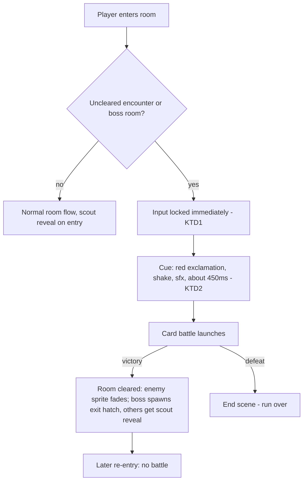

# Instant Encounter Combat - Plan

## Goal Capsule

- **Objective:** Start the card battle immediately when the player enters a room with a monster, and delete the in-room threat phase (patrol, pursuit, contact detection, grace window) and its battle-start modifiers.
- **Product authority:** The Product Contract below, confirmed by the project owner on 2026-07-02 from playtester feedback. The Planning Contract governs implementation choices within that scope.
- **Execution profile:** Three dependency-ordered units. Pure logic is verified by Vitest; dungeon-scene behavior is verified by browser smoke testing — no scene test harness exists, matching repo convention (AGENTS.md).
- **Stop conditions:** Surface a blocker instead of improvising if implementation contradicts the Product Contract — for example, if the immediate input lock proves infeasible in the scene update loop.
- **Open blockers:** None.

---

## Product Contract

### Summary

Entering an uncleared encounter or boss room starts the card battle immediately. The Room Threat System's in-room phase is removed, and the threat-based battle-start modifier goes with it — every fight, boss included, starts with no opening Block.

### Problem Frame

The Room Threat System (2026-06-28) turned encounter rooms into pre-battle threat spaces: monsters patrol or chase, battle starts on contact, and players can slip out an open door to skip a normal fight. Playtest feedback favors the older instant fight — the pre-battle cat-and-mouse reads as friction, not tension. The system also carries real code weight (threat profiles, intent transitions, pursuit movement, grace timing, escape rules) that is not earning its complexity.

### Key Decisions

- **Entry is commitment.** The pre-fight escape valve ("slip out an open door, skip the fight, forfeit rewards") is removed with the chase phase. Avoiding a fight means not entering the room, informed by the existing scout-charge reveal of adjacent room types.
- **No battle-start modifiers at all.** The alert/chase opening-Block bonuses (+2/+3) die with the intent states, and the boss's flat +4 is removed with them. Encounter context no longer affects how a battle starts.
- **Full deletion, not dormancy.** The traversal system is removed rather than disabled — reducing carrying cost is a goal of this change, not a side effect.

### Requirements

**Encounter trigger**

- R1. Entering an uncleared encounter or boss room starts the card battle immediately; the player gets no free-move phase in the room before battle.
- R2. Re-entering a cleared room never restarts battle; the cleared-room concept is preserved.

**Threat system removal**

- R3. Monsters no longer act in dungeon rooms: no patrol, no alert or chase pursuit, no contact detection, no post-entry grace window.
- R4. The pre-fight escape is removed: a player inside an uncleared encounter room cannot leave to skip its fight.

**Battle start**

- R5. Battles start with no threat-derived modifier: no enemy opening Block from encounter context for normal fights or boss fights.

Key Flows are omitted: the behavior is a single-step trigger (room entry starts battle), and Requirements plus Acceptance Examples cover its paths.

### Acceptance Examples

- AE1. **Covers R1.** Given an uncleared encounter room, when the player steps into it, then the card battle starts immediately with no monster movement or player action in between.
- AE2. **Covers R4.** Given the player entered an uncleared encounter room through an open door, when battle triggers, then there is no window to step back out and skip the fight.
- AE3. **Covers R5.** Given a battle triggered by entering a boss room, when the first turn begins, then the boss has no opening Block granted by encounter context.
- AE4. **Covers R2.** Given a cleared encounter room, when the player re-enters it, then no battle starts.

### Scope Boundaries

- No in-battle flee mechanic — losing the pre-fight escape is not compensated inside combat.
- No new encounter telegraphing — the scout-charge reveal of adjacent room event types stays as-is.
- No compensatory stat rebalance — difficulty effects of removing the modifiers (notably the boss's lost +4 opening Block) belong to the playtest-owned balance pass.

#### Deferred to Follow-Up Work

- Refresh docs/solutions/design-patterns/room-threat-system.md to mark the pattern historical (owned by the solutions-refresh workflow, not this change).
- A generation safety net preventing a stratum's landing room from rolling an encounter — deliberately not added; see KTD7.

### Dependencies / Assumptions

- Verified 2026-07-02: nothing outside the room-threat module, the dungeon scene, and enemy definitions consumes the threat system, and no save state serializes monster positions — the removal is contained.
- Assumption: making some fights unavoidable (when the floor layout forces a room) is acceptable; the playtester feedback favors commitment, and the balance pass owns confirming runs stay fair.

### Sources

- docs/plans/2026-06-28-001-feat-room-threat-system-plan.md — the system this plan reverses; its R1 ("Entering a normal encounter room must no longer start battle by itself") is inverted here.
- docs/solutions/design-patterns/room-threat-system.md — documents the legacy entry-equals-commitment pattern this plan returns to; it will describe a removed system once this ships.
- Git commit `bb7501c` (pre-threat-system `src/scenes/Dungeon.ts`) — the actual legacy code: `!` mark plus `time.delayedCall(450, ...)` into `startBattle`, with input locked only inside `startBattle` — the lock timing this plan corrects (KTD1).
- src/dungeon/roomThreat.ts — threat profiles, intent and movement logic, escape rules, and `battleStartModifier`; deleted by this plan.
- src/scenes/Dungeon.ts — `onRoomEntered`, `startBattle`, `onBattleEnd`, the per-frame `updateRoomThreat`, `createThreatActor`/`syncThreatActor`, and the door-loop escape check.
- src/game/turnEngine.ts — `BattleStartModifier` type, `TurnEngineConfig.modifier`, and the opening-block application inside `createBattle`.
- src/scenes/TurnBattle.ts — carries the modifier from scene launch data into `createBattle`.
- src/data/enemies.ts — per-enemy `dungeonThreatProfile` and `getEnemyThreatProfile`.
- src/config.ts — `ROOM_THREAT_*` constants consumed only by the threat module.

---

## Planning Contract

**Product Contract preservation:** unchanged from the confirmed brainstorm, except the Outstanding Questions section was resolved and removed — the entry cue (KTD2) and the threat-profile data field (KTD6) are settled below — and Scope Boundaries gained the Deferred to Follow-Up Work subsection.

### Key Technical Decisions

- **KTD1 — Lock input the moment the room is entered, not when battle launches.** Set the battle-lock flag (`battleActive` or a dedicated equivalent) in `onRoomEntered` before scheduling the cue delay, so the existing update-loop guard blocks movement, doors, item use, and overlays for the whole cue. The literal legacy pattern (git `bb7501c`) locked only inside `startBattle`, leaving a ~450ms window in which a player could walk out an open door — reintroducing it verbatim would violate R1/R4/AE2, since non-boss encounter rooms always have three open forward doors.
- **KTD2 — Keep a ~450ms entry cue, reusing the existing contact-cue effects.** Relocate the current red `!` float text, camera shake, and `hit_player` sound from the contact site to room entry, followed by `time.delayedCall(~450ms)` into `startBattle`. Phaser scene timers run independently of the update-loop guard, so the locked cue still fires. The cue is presentation only; the lock (KTD1) carries the commitment.
- **KTD3 — Replace the threat actor with a static enemy sprite.** Keep a plain enemy image as the cue's visual anchor and the victory fade-out target — boss centered, normal enemies at a fixed cell — reusing the existing scale (4 normal / 4.5 boss) and depth conventions. The intent marker, contact ring, and per-frame position sync are deleted.
- **KTD4 — Scout reveal for uncleared encounter rooms fires post-victory only.** Drop the pre-battle `tryRevealScoutOptions` call for uncleared encounter/boss rooms; the existing post-victory call in `onBattleEnd` covers them. Pre-battle text would be covered by the battle scene within the cue window, and a limited scout charge would be spent on fights the player might lose. Other room types keep their entry-time reveal.
- **KTD5 — Delete the entire battle-start modifier chain, not an always-null hook.** Remove the `BattleStartModifier` type, `TurnEngineConfig.modifier`, the opening-block application in `createBattle`, and the TurnBattle scene plumbing. No other caller sets the modifier, and "full deletion, not dormancy" is a Product Contract decision.
- **KTD6 — Delete the per-enemy threat-profile data.** Remove `dungeonThreatProfile` from `EnemyDef` and all 12 dungeon-facing enemy entries, `getEnemyThreatProfile`, and the orphaned `ROOM_THREAT_*` constants in src/config.ts. Resolves the origin's outstanding question: deleted, not repurposed.
- **KTD7 — No generation change for delve landings.** A new stratum's first room is rolled by the normal event table and can be an encounter, so choosing Delve at a gate can fade the player straight into an instant fight (the old grace window used to cushion this). Accepted per the unavoidable-fights assumption; confirmed at planning.

### High-Level Technical Design

The new room-entry lifecycle replaces the per-frame threat loop:

Both room-entry paths — normal door transitions and the stratum-descent fade — already funnel through `onRoomEntered`, so the trigger change lands in one place. Prose is authoritative over the diagram.

### System-Wide Impact

- Boss fights get measurably easier at the moment this lands (the guaranteed +4 opening Block disappears). The balance simulator is unaffected — grep-verified that it never consumed the modifier — so no test re-baselining is expected; real-game difficulty is playtest-owned.
- Scout-charge economics shift: charges are spent on encounter rooms only after clearing them, no longer on entry (KTD4).

### Risks

- The lock flag must not suppress the cue timer: `battleActive` currently short-circuits the update loop, which is intended, but the implementation must confirm the `delayedCall` and cue tweens still run while the guard is active (Phaser timers are scene-level, not update-gated — verify in smoke).
- `onBattleEnd`'s victory fade currently destroys three threat objects (sprite, marker, contact ring); after KTD3 only the sprite exists — missing this leaves a null-reference path on the first victory.

---

## Implementation Units

### U1. Instant battle trigger in the Dungeon scene

- **Goal:** Entering an uncleared encounter or boss room locks input immediately, plays the entry cue, and launches the battle; all in-room threat behavior is gone from the scene.
- **Requirements:** R1, R2, R4 (AE1, AE2, AE4); KTD1-KTD4, KTD7.
- **Dependencies:** None.
- **Files:** src/scenes/Dungeon.ts
- **Approach:** Rewrite the encounter/boss branch of `onRoomEntered` (both callers — the door-transition tween completion and the stratum-descent fade completion — already route through it): set the battle lock before scheduling the cue, play the relocated `!`/shake/sfx cue anchored on the enemy sprite, and `delayedCall(~450ms)` into `startBattle`; skip the pre-battle scout reveal for these rooms. Replace `createThreatActor`/`syncThreatActor` and the `RoomThreatActor` shape with a minimal static enemy actor (sprite only, boss centered / normal at a fixed cell, existing scale and depth). Delete `updateRoomThreat` and its update-loop call, and the door-loop escape check with its boss push-back feedback. `startBattle` passes `modifier: null` for now (U2 removes the parameter). Update `onBattleEnd`'s victory fade to the sprite-only actor.
- **Execution note:** Scene code has no unit harness — prove this unit with browser smoke, per AGENTS.md.
- **Test scenarios (manual smoke via `npm run dev`):**
  - Covers AE1: enter an uncleared encounter room → `!` cue, then battle within ~half a second; the monster never moves.
  - Covers AE2: hold movement toward the entry door during the cue → the player does not move and battle starts anyway.
  - During the cue, press the deck-overlay and potion keys → ignored.
  - Covers AE4: re-enter a cleared room → no battle, no cue.
  - Enter a boss room → instant boss fight; after victory the exit hatch spawns.
  - Delve at a gate into a stratum whose first room rolls an encounter → fight starts right after the fade-in (KTD7 accepted behavior).
  - Win a normal encounter → enemy sprite fades out, scout reveal appears post-victory (KTD4); lose a fight → End scene as today.
  - Test expectation: no new unit tests — no Dungeon scene test harness exists; manual smoke is the repo convention for scene changes.
- **Verification:** Smoke checklist passes; `npm run build` stays green.

### U2. Delete the room-threat module and battle-start modifier system

- **Goal:** Remove `roomThreat.ts`, the full `BattleStartModifier` chain, and the per-enemy threat-profile data.
- **Requirements:** R3, R5 (AE3); KTD5, KTD6.
- **Dependencies:** U1 (the Dungeon scene no longer imports the module).
- **Files:** delete src/dungeon/roomThreat.ts, src/dungeon/roomThreat.test.ts; modify src/game/turnEngine.ts (drop the `BattleStartModifier` interface, `TurnEngineConfig.modifier`, and the opening-block application in `createBattle`), src/scenes/TurnBattle.ts (drop the modifier import, scene-data field, instance field, init assignments, and `createBattle` pass-through), src/scenes/Dungeon.ts (drop `modifier: null` from the battle launch payload), src/data/enemies.ts (drop the `dungeonThreatProfile` field from `EnemyDef` and all entries, `getEnemyThreatProfile`, and the roomThreat import), src/data/enemies.test.ts (drop the two threat-profile tests and imports), src/game/turnEngine.test.ts (replace the modifier test), src/config.ts (drop the `ROOM_THREAT_*` constants).
- **Patterns to follow:** Full-deletion posture from the enemy-power decoupling learning (docs/solutions/design-patterns/decouple-enemy-power-from-player-reward-scaling.md): remove the seam entirely rather than zeroing it.
- **Test scenarios:**
  - Covers AE3: `createBattle` starts the enemy at block 0 with no modifier input possible — adjust or replace the former modifier test in src/game/turnEngine.test.ts to assert the clean start.
  - Remaining enemies tests (tiers, HP scaling, intent patterns) pass without threat imports.
  - Full suite green; `npm run build` type-check confirms no dangling references to the deleted module, type, field, or constants.
- **Verification:** `npm test` and `npm run build` green; `grep -r "roomThreat\|BattleStartModifier\|dungeonThreatProfile\|ROOM_THREAT_" src/` returns nothing.

### U3. Align player-facing docs and vocabulary

- **Goal:** Documentation reflects entry-is-commitment.
- **Requirements:** Traceability for R1/R4; prevents doc drift.
- **Dependencies:** U1, U2.
- **Files:** README.md (replace the "Normal encounters can be escaped through an open door before fighting" gameplay line with the instant-fight behavior), CONCEPTS.md (retire the Room Threat System entry; describe the instant encounter trigger under the Dungeon Loop vocabulary).
- **Test scenarios:** Test expectation: none — documentation-only.
- **Verification:** README and CONCEPTS no longer describe monster movement, pre-fight escape, or threat-based battle modifiers.

---

## Verification Contract

| Gate                 | Command                                                                              | Applies to | Done signal                                                                    |
| -------------------- | ------------------------------------------------------------------------------------ | ---------- | ------------------------------------------------------------------------------ |
| Unit tests           | `npm test`                                                                           | U2         | Suite green with threat tests removed and the clean-battle-start test in place |
| Type-check + build   | `npm run build`                                                                      | U1, U2     | `tsc --noEmit` and Vite build pass with the module deleted                     |
| Browser smoke        | `npm run dev` + U1 checklist                                                         | U1         | All eight smoke scenarios observed                                             |
| Dead-reference sweep | `grep -r "roomThreat\|BattleStartModifier\|dungeonThreatProfile\|ROOM_THREAT_" src/` | U2         | No matches                                                                     |

---

## Definition of Done

- R1-R5 hold, evidenced by the U1 smoke checklist (AE1, AE2, AE4), the U2 clean-battle-start test (AE3), and the dead-reference sweep (R3).
- `npm test` and `npm run build` pass.
- README.md and CONCEPTS.md no longer describe the removed system (U3).
- No abandoned or experimental code from intermediate steps remains in the diff (e.g., U1's temporary `modifier: null` is gone after U2).
