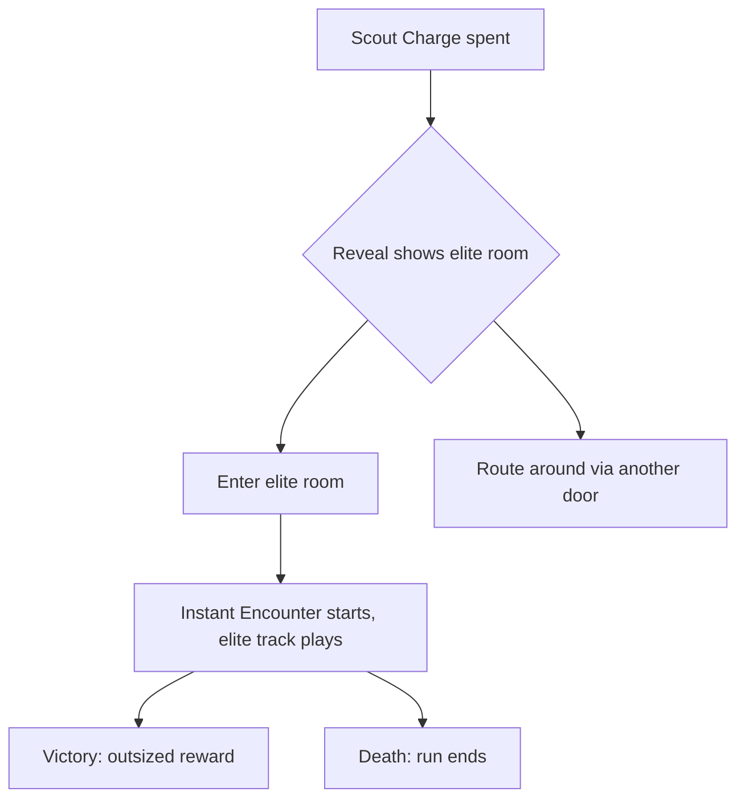
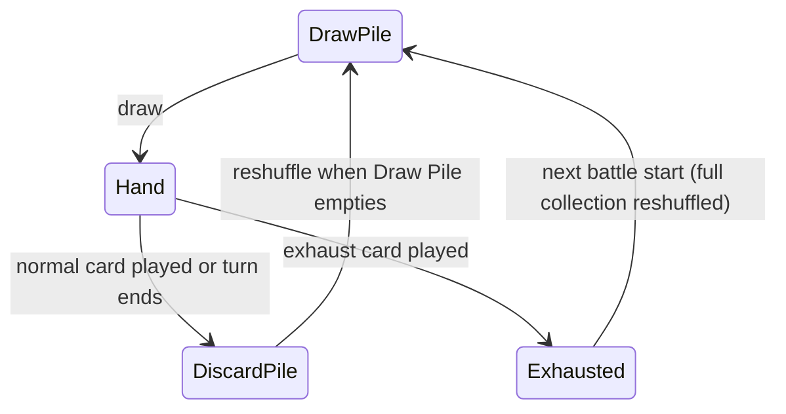
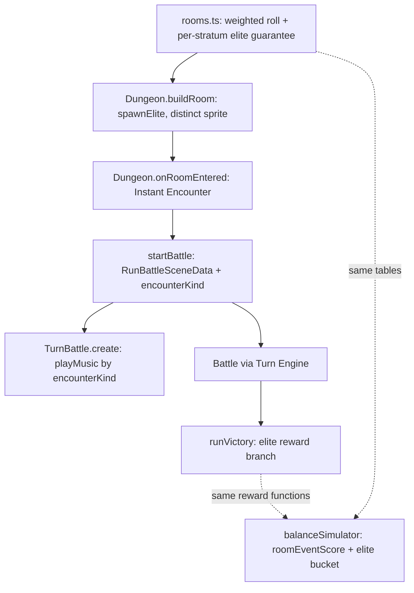
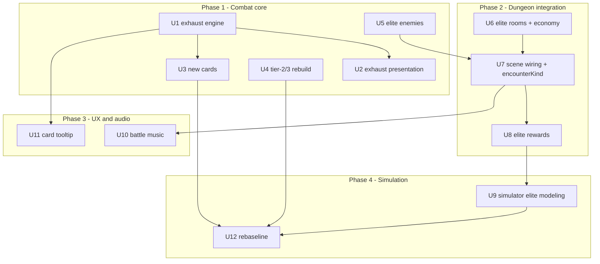

# Roguelike Difficulty Rework - Plan

## Goal Capsule

- **Objective:** Retune run difficulty to roguelike-hard — losing is the normal outcome, with roughly 20–40% of runs reaching the first Gate — through authored elite encounters, rebuilt tier-2/3 enemy patterns, a leaner room economy, and a deeper card pool, supported by card hover tooltips and battle music.
- **Product authority:** The Product Contract below, confirmed with the project owner on 2026-07-03. Planning decisions live in the Planning Contract; on conflict, the Product Contract wins.
- **Execution profile:** Implement units in dependency order (see Unit Index). The numeric rebaseline (U12) runs once, after all difficulty units land — never per-change.
- **Stop conditions:** Surface a genuine blocker instead of guessing when a change would alter product scope (an R-ID) or when the rebaseline cannot reach the 20–40% band without violating a Key Decision (e.g., elites stop being opt-in).
- **Open blockers:** None. All open questions are deferred to implementation and marked non-blocking.

---

## Product Contract

### Summary

Add a hand-authored elite encounter class before each stratum boss, rebuild tier-2/3 intent patterns to genuinely threaten a prepared player, shift the room table toward fights and away from free healing, and ship 6–10 new cards that introduce draw and exhaust play. Card hover tooltips and a new battle-music layer (default, elite, and boss tracks) keep the added complexity legible. Success is the balance simulator's first-stratum clear rate landing in a 20–40% band, down from ~96%.

### Problem Frame

The Slay-the-Spire combat rebuild landed with structure fixed and numbers open to tuning, and the numbers say the game is trivial: the balance simulator wins ~96% of runs. Playtesting locates the collapse in tier-2 and tier-3 encounters — they are too simple to beat with the current card pool — while tier-1 fights feel right.

Two structural causes compound the flat threat curve. The room table makes only 32% of rooms encounters while 48% are chests or potions and 14% are rest rooms, so a 10-room stratum averages about three fights against five reward or heal rooms — attrition never accumulates. And the card pool is almost entirely attack and block stat lines, so harder fights would read as stat checks rather than decisions; there are no spike threats between the stratum start and its boss.

The cost is that runs carry no tension: mastery has nothing to bite on, and Endless Descent's push-your-luck identity — Delve deeper or Bank and escape — has no real risk half.

### Key Decisions

- **Roguelike-hard is the target feel.** Most runs die; winning the first stratum is an achievement. The measurable band is a 20–40% first-stratum clear rate in the balance simulator.
- **Authored elites over a systemic affix layer.** A composable affix system was weighed (better depth scaling, natural stratum-theme infrastructure) and rejected in favor of 3–5 bespoke elites with signature mechanics — maximum personality per fight, accepting the authoring cost per depth band. Affix and stratum-theme infrastructure remains available as a later iteration.
- **Difficulty lives inside 10-room strata.** Extending strata to 20 rooms was rejected: length is not difficulty, and at roguelike-hard win rates longer runs only raise the time cost of each death. Density and spike fights carry the challenge instead.
- **Exhaust is battle-scoped.** An exhausted card is out for the rest of the current battle only and returns with the full collection next battle. Permanent deck removal is a separate, deferred economy feature.
- **Elites are opt-in via routing.** Elite rooms are Scout Charge-visible and can be routed around; they are risk/reward choices, not walls.
- **The Ember economy stays frozen.** Fewer runs reaching Gates means Ember income drops and meta-progression slows; this is accepted for now, with a retune deferred until the difficulty baseline settles.
- **A default battle track is in scope.** Dedicated elite and boss music only reads as special against a default; since no music layer exists at all, the base track ships with this work.

### Requirements

**Threat curve and elites**

- R1. Tier-2 and tier-3 enemies get rebuilt intent patterns that threaten a prepared player — multi-hit turns, block and status pressure, scaling moves — not only larger numbers.
- R2. A new elite encounter class ships with 3–5 hand-authored elite enemies, each carrying a signature mechanic that teaches a specific counterplay lesson.
- R3. Every stratum places at least one elite room before its boss.
- R4. Elite rooms are a distinct room type in Scout Charge reveals, so engaging one is an informed choice.
- R5. Defeating an elite grants rewards clearly better than a normal encounter's.

**Run economy**

- R6. The room event distribution shifts toward encounters and away from potion and rest rooms, so attrition accumulates across a stratum.

**Card pool**

- R7. New cards exercise the existing draw effect, letting a played card draw further cards.
- R8. New cards introduce the exhaust keyword: a played exhaust card leaves play for the rest of the current battle instead of going to the Discard Pile.
- R9. Roughly 6–10 new cards ship, weighted toward utility and tempo play rather than additional attack and block stat lines.

**Card legibility**

- R10. Hovering a card shows a detail popup with its full rules text, including explanations of keywords such as exhaust, draw, and statuses.

**Audio**

- R11. A default battle music track plays during normal encounters — the game's first music layer.
- R12. Elite and boss battles each play a dedicated track distinct from the default.

### Key Flows

- F1. Elite routing
  - **Trigger:** The player spends a Scout Charge in a room with unexplored doors.
  - **Steps:** The reveal names an elite room behind one door; the player weighs the signature threat against the reward and either enters — the Instant Encounter starts and the elite track plays — or routes through another door.
  - **Outcome:** Elite fights are chosen, never stumbled into.
  - **Covers:** R3, R4, R5, R12.

- F2. Exhaust card play
  - **Trigger:** The player plays a card marked exhaust during a Card Battle.
  - **Steps:** The card's effects resolve; the card leaves play for the rest of the battle, joining neither the Draw Pile nor the Discard Pile; at the next battle start the full collection, including it, is reshuffled.
  - **Outcome:** Powerful effects are rationed per battle without shrinking the deck permanently.
  - **Covers:** R8.

### Acceptance Examples

- AE1. **Covers R8.** Given a hand containing an exhaust card, when it is played, it appears in neither the Draw Pile nor the Discard Pile for the remainder of that battle; at the next battle start it is back in the shuffled Draw Pile.
- AE2. **Covers R7.** Given both the Draw Pile and Discard Pile are empty, when a draw effect resolves, it draws nothing further — matching the existing empty-piles rule.
- AE3. **Covers R4.** Given a Scout Charge reveal on a door leading to an elite room, the reveal names the elite room type distinctly from a normal encounter.
- AE4. **Covers R11, R12.** Given the player enters an elite or boss room, that battle plays its dedicated track; a normal encounter entered afterwards plays the default battle track.

### Success Criteria

- The balance simulator's first-stratum clear rate lands in a 20–40% band (from ~96%), with average death depth and per-encounter buckets used to locate outlier fights.
- Tier-1 encounters remain winnable for a fresh starting deck; the difficulty concentrates in tier-2/3 fights, elites, and bosses.
- Deaths read as earned in playtest: the threat was visible through telegraphed intents and card tooltips before it killed.

### Scope Boundaries

Deferred for later:

- Multi-monster battles with per-card targeting — the strongest depth idea raised, deserving its own plan on a settled baseline.
- Stratum themes / global effects (for example, sacrificed HP feeding the boss) — the natural next difficulty iteration, with player-facing communication as a hard requirement when it comes.
- 20-room strata — revisit only if strata still feel thin after this rework.
- Ember income retune for a losing-is-normal world.
- Permanent card removal (purge) economy.

Deferred to follow-up work (plan-local):

- Tooltips on the pile inspector's text rows — its rows are plain text, not card views; v1 tooltips cover hand and reward cards only.
- Renaming the `scoutCharges`/"Scout Flame" code and UI naming to match CONCEPTS.md's "Scout Charge" — out of scope; new UI copy follows the existing in-game "Scout Flame" wording.
- Removing the unused `SLICE_ENEMIES` sandbox data in `src/data/enemies.ts` — dead relative to the live game path; do not target it, do not clean it up here.
- Exhaust-aware scoring depth in the simulator's card policy — v1 scores exhaust cards with the existing heuristics; deepen only if the rebaseline produces nonsense.

Not changing:

- Starting card availability, judged adequate as-is.

### Dependencies / Assumptions

- All audio today is procedurally synthesized: short sound effects plus one looping ambience drone (`src/audio/sfx.ts`); no music tracks or audio asset files exist anywhere in the repo. The music layer is net-new and procedural (KTD6).
- The balance simulator (`src/game/balanceSimulator.ts`) is the measuring stick for the 20–40% band. It plays through the real Turn Engine, so engine changes flow into it automatically; its routing and card policies need the U9 extensions before its numbers are trusted for elites.
- Assumption: a denser encounter mix inside 10-room strata yields enough fights to hit the difficulty target without changing stratum length.
- The Scout Charge reveal surfaces room event types per open door (`tryRevealScoutOptions` in `src/scenes/Dungeon.ts`), so a new elite room event flows into reveals through the existing mechanism. Terminology caveat: code and UI call this "Scout Flame" (`scoutCharges` state, `scoutFlame` meta flag), while `CONCEPTS.md` canonically says Scout Charge.
- The suspended-AudioContext autoplay restriction is already handled globally (`src/main.ts` resumes on first pointer/key event), and keyboard movement necessarily precedes any encounter, so battle music never starts against a suspended context.

### Outstanding Questions

Deferred to implementation (non-blocking):

- Final numeric tuning values — room weights, elite HP/damage scalars, reward multipliers, the simulator's elite-engagement score — are settled during the U12 rebaseline as a set, not individually up front.
- Music composition specifics (note sequences, instrumentation per track) — settled during U10 within the loop constraints in KTD6.

### Sources / Research

- `src/config.ts` — `STRATUM_SIZE = 10`; boss fires at stratum boundaries (`src/game/strata.ts`).
- `src/dungeon/rooms.ts` — room event weights (encounter 32, chest 27, potion 21, rest 14, trap 6) and the chest-heavy pre-boss table; `RoomEvent` union; per-door independent generation.
- `src/data/enemies.ts` — `EnemyTier` is `weak | medium | strong`; no elite concept exists; `spawnEnemy`/`spawnBoss` selection; `SLICE_ENEMIES` is unused sandbox data.
- `src/data/cards.ts` — `CardEffect` already includes `draw` and `energy` kinds; exactly 16 cards exist; no exhaust mechanic anywhere.
- `src/game/turnEngine.ts` — `playCard` routes every played card to the Discard Pile unconditionally; `createBattle` rebuilds the Draw Pile from the full collection each battle; `drawCards` reshuffles only the Discard Pile.
- `src/game/effectHandlers.ts` — string-keyed registry; `ResolvableEffect` is deliberately open; unregistered kinds throw.
- `src/game/intentPatterns.ts` — `empowerPattern` provides depth-based scaling to build on.
- `src/gfx/cardview.ts` — cards render a short description on their face; no hover detail popup exists anywhere; `src/gfx/pileView.ts` renders piles as plain text rows.
- `src/game/rewards.ts` — pick-1-of-3 victory card offers and depth-scaled gold, the baseline elite rewards must beat; also consumed by the simulator's reward path.
- `src/audio/sfx.ts` — procedural synthesis via OfflineAudioContext; the `ambience` loop demonstrates gapless looping (integer-cycle seams) and the dedupe/mute guard pattern.
- `src/game/balanceSimulator.ts` — plays the real Turn Engine; `roomEventScore` routing prefers reward rooms; band assertions live in `src/game/balanceSimulator.test.ts`.
- `docs/solutions/design-patterns/decouple-enemy-power-from-player-reward-scaling.md` — audit consumers of shared depth-scaled functions; tune coupled constants as a set over the full seed set.
- `docs/solutions/ui-bugs/phaser-screen-layout-readability-regressions.md` — canvas layout regressions surface only visually; pure layout helpers plus browser smoke are both required.
- `docs/plans/2026-07-01-003-feat-sts-combat-rebuild-plan.md` — combat structure fixed, numbers open to tuning; energy 3, draw 5 baselines.

---

## Planning Contract

Product Contract preserved unchanged from the brainstorm (R1–R12, F1–F2, AE1–AE4). Planning resolved the brainstorm's four deferred-to-planning questions into KTD3 (elite placement), KTD5 (elite rewards), KTD7 (tooltip shape), and KTD8 (simulator policy); Scope Boundaries gained a plan-local deferred list.

### Key Technical Decisions

- **KTD1 — Exhaust is an engine-routed card flag, not an effect kind.** `CardDef` gains `exhaust?: boolean`; `TurnBattleState` gains a per-battle `exhaustPile`. `playCard` routes the played card to the exhaust pile instead of the Discard Pile after its effects resolve, emitting a new `cardExhausted` presentation event. The effect handler registry is untouched — exhaust has no per-target resolution semantics; it is pile routing, exactly parallel to the existing discard push. AE1 (return next battle) needs zero code: `createBattle` already rebuilds the Draw Pile from the full collection.
- **KTD2 — Elites are a dedicated roster, not a rung on the depth-tier ladder.** `EnemyTier` gains `'elite'`; a new `ELITES` array and `spawnElite(rng, depth)` sit beside `spawnEnemy`/`spawnBoss`. Elites are room-triggered, so folding them into `getEnemyTierForDepth`'s depth bands would let them leak into normal encounters.
- **KTD3 — The elite guarantee means "offered once per stratum," satisfied at generation.** A run-level flag tracks whether the current stratum has generated an elite room; within a mid-stratum depth window (excluding the start and the chest-heavy pre-boss room) one door's roll is forced to elite if none has been offered. Routing around it does not re-offer — the guarantee is "was reachable," preserving the opt-in decision. Generation stays deterministic in (seed, path), so Daily Descents reproduce. Confirmed with the project owner.
- **KTD4 — One `encounterKind` seam feeds rewards and music.** `RunBattleSceneData` gains `encounterKind: 'normal' | 'elite' | 'boss'`, threaded from `Dungeon.startBattle`. Both downstream consumers (victory rewards, track selection) read this single field; it lands early (U7) because two units depend on it.
- **KTD5 — Elite rewards: an extra card offer with a tier bias, plus a gold multiplier.** Victory after an elite offers 4 cards (up from 3) rolled with a depth bias toward higher tiers, and roughly doubled gold. The scene (`runVictory`) and the simulator (`applySimulatedPostBattleRewards`) call the same reward functions and must change in lockstep, or simulated numbers desync from shipped behavior.
- **KTD6 — Battle music is procedural, pre-rendered loop buffers — no assets, no library.** Three tracks (`battle_default`, `battle_elite`, `battle_boss`) follow the `sfx.ts` ambience pattern: mono, 8–16 bar loops (~10–20s), rendered with OfflineAudioContext at boot, registered under a `music_` key prefix, looped gaplessly via native buffer looping. Sustained layers obey the integer-cycle seam rule (frequency × duration is a whole number of cycles). A `playMusic` helper stops any other `music_` sound first, dedupes, and respects `game.sound.mute`. The battle track replaces the ambience drone for the battle scene's lifetime — ambience pauses at battle start and resumes in the dungeon; music continues through the victory reward overlay and stops in the scene's existing SHUTDOWN hook. Audio synthesis stays on unseeded `Math.random()`, never the gameplay RNG. Confirmed with the project owner. (ZzFXM's tracker-style pattern tables are a useful authoring-format reference; the playback mechanism needs nothing new.)
- **KTD7 — The tooltip is a pure layout helper plus a data-driven keyword glossary.** Geometry (edge clamping within the 720×640 canvas, clearance above the hand) lives in a pure, Phaser-free module mirroring `turnBattleLayout.ts`; rules text is generated from the card's effects array, exhaust flag, and a canonical keyword→explanation map (new, also the first home for status keyword copy). V1 attaches to hand cards (reusing the existing `pointerover`/`pointerout` raise and its committed/beat gating) and victory reward cards; the pile inspector's text rows are excluded. Confirmed with the project owner.
- **KTD8 — The simulator must actually fight elites, and the rebaseline runs once.** `roomEventScore` gets a tuned elite score plus an engagement floor so the simulated player engages elites at a representative rate rather than routing around every one; elite outcomes report as their own bucket in the summary. All coupled constants (enemy patterns, room weights, card pool, elite scalars) are tuned and re-validated as a set over the full seed set in U12 — never per-change — per the documented reward-scaling coupling lesson.
- **KTD9 — Exhaustive-switch hardening at the three silent-failure sites.** `buildRoom` and `onRoomEntered` in `src/scenes/Dungeon.ts` and `roomEventScore` in the simulator all switch on `RoomEvent` without compile-time exhaustiveness (`noImplicitReturns` is off); a missing `'elite'` case ships a room that does nothing. Each gets an explicit elite case, and where cheap, a default-throw or `Record<RoomEvent, …>` shape so the next room type fails at compile time.

### Constraints

- Audit every consumer before changing any shared depth-scaled function (`randomCard`, `awardEnemyGold`, `empowerPattern` callers) — a past bug had one function silently arming both player rewards and enemy power.
- New elite reveal and room UI copy follows the existing in-game "Scout Flame" wording, not the CONCEPTS.md name.
- Elites use the Instant Encounter commitment model — no contact triggers or in-room monster phases (that system was removed deliberately).
- Boot-time budget: render music in parallel with SFX; if boot latency grows noticeably, lazily render the elite/boss tracks on first use.

### High-Level Technical Design

The elite path is one data flow with a single kind-discriminating seam:

Unit dependency shape (phases run left to right; U10/U11 are parallel tracks):

The card-zone lifecycle including the new exhaust zone is diagrammed in the Product Contract (Key Flow F2).

---

## Implementation Units

Unit Index:

| U-ID | Title                                              | Key files                                                                                       | Depends on |
| ---- | -------------------------------------------------- | ----------------------------------------------------------------------------------------------- | ---------- |
| U1   | Exhaust mechanic in the Turn Engine                | `src/data/cards.ts`, `src/game/turnEngine.ts`, `src/game/combatEvents.ts`                       | —          |
| U2   | Exhaust presentation and pile visibility           | `src/scenes/TurnBattle.ts`, `src/gfx/pileView.ts`                                               | U1         |
| U3   | New cards: draw, exhaust, utility                  | `src/data/cards.ts`                                                                             | U1         |
| U4   | Tier-2/3 intent pattern rebuild                    | `src/data/enemies.ts`                                                                           | —          |
| U5   | Elite enemies and spawn                            | `src/data/enemies.ts`                                                                           | —          |
| U6   | Elite room type, placement guarantee, room economy | `src/dungeon/rooms.ts`, `src/state.ts`                                                          | —          |
| U7   | Dungeon scene wiring and encounterKind             | `src/scenes/Dungeon.ts`, `src/scenes/TurnBattle.ts`                                             | U5, U6     |
| U8   | Elite rewards                                      | `src/game/rewards.ts`, `src/scenes/TurnBattle.ts`, `src/game/balanceSimulator.ts`               | U7         |
| U9   | Simulator elite modeling                           | `src/game/balanceSimulator.ts`                                                                  | U8         |
| U10  | Battle music layer                                 | `src/audio/music.ts` (new), `src/scenes/Boot.ts`, `src/scenes/TurnBattle.ts`, `src/main.ts`     | U7         |
| U11  | Card hover tooltip                                 | `src/game/tooltipLayout.ts` (new), `src/gfx/cardTooltip.ts` (new), `src/data/keywords.ts` (new) | U1         |
| U12  | Numeric rebaseline and dominance re-check          | `src/game/balanceSimulator.test.ts`                                                             | U3, U4, U9 |

### U1. Exhaust mechanic in the Turn Engine

- **Goal:** A played card marked exhaust leaves play for the rest of the battle instead of entering the Discard Pile.
- **Requirements:** R8 (F2; AE1, AE2).
- **Dependencies:** None.
- **Files:** `src/data/cards.ts`, `src/game/turnEngine.ts`, `src/game/combatEvents.ts`, `src/game/turnEngine.test.ts`.
- **Approach:** Add `exhaust?: boolean` to `CardDef`. Add `exhaustPile: Card[]` to `TurnBattleState`, initialized empty in `createBattle`. In `playCard`, after all effects resolve, route the played card to `exhaustPile` and emit a new `cardExhausted` `CombatEvent` when the flag is set; otherwise keep the existing discard push. `drawCards`' reshuffle continues to touch only the Discard Pile. End-of-turn hand discard is untouched — exhaust fires only on play.
- **Execution note:** Pure engine work — implement test-first.
- **Patterns to follow:** The `cardDiscarded` routing and event emission in `playCard`; the clone-in/clone-out command shape of `TurnCommandResult`.
- **Test scenarios:**
  - Covers AE1. Playing an exhaust card puts it in `exhaustPile` and in neither `discardPile` nor `drawPile`; the `cardExhausted` event fires (and `cardDiscarded` does not).
  - Covers AE1. A subsequent `createBattle` from the same collection includes the previously exhausted card in the fresh Draw Pile.
  - Covers AE2. With both piles empty and cards in `exhaustPile`, a draw effect draws nothing — exhausted cards are never reshuffled in.
  - Ending the turn with an unplayed exhaust card in hand discards it normally.
  - A non-exhaust card still routes to the Discard Pile (regression).
  - `playCard` does not mutate the input state (clone-safety, existing convention).
- **Verification:** `npm test` green; `npm run build` clean.

### U2. Exhaust presentation and pile visibility

- **Goal:** Exhausting reads clearly on screen and the exhaust count is visible.
- **Requirements:** R8 (F2).
- **Dependencies:** U1.
- **Files:** `src/scenes/TurnBattle.ts`, `src/gfx/pileView.ts`.
- **Approach:** Add a `STEP_MS` entry and `runStep` case for `cardExhausted`, modeled on the `cardDiscarded` case but with a distinct visual (burn-out/fade in place rather than travel to the discard pile). Add an exhausted count line and section to the pile inspector panel (plain text rows, consistent with the existing draw/discard sections).
- **Patterns to follow:** The `cardDiscarded` `runStep` case; `createPileInspector`'s text-row sections.
- **Test scenarios:** Test expectation: presentation-only — pure additions (if any layout math is extracted) get unit tests; otherwise covered by browser smoke of an exhaust card play showing the burn-out beat and an incremented exhaust count.
- **Verification:** Browser smoke: play an exhaust card, watch the distinct beat, open the pile panel and see the exhausted section.

### U3. New cards: draw, exhaust, utility

- **Goal:** 6–10 new cards deepen the pool with draw, exhaust, and tempo play.
- **Requirements:** R7, R9.
- **Dependencies:** U1 (exhaust flag).
- **Files:** `src/data/cards.ts`, plus its co-located test file.
- **Approach:** Author new `CARD_DEFS` across tiers 1–3 using the existing `draw` and `energy` effect kinds and the new exhaust flag. Directional examples, final numbers at implementation: a cheap cantrip (draw 1 + small block), a big draw burst that exhausts ("draw 2, exhaust"), an energy surge that exhausts, a low-cost multi-effect tempo card, a defensive exhaust panic button (large block, exhaust), one or two utility attacks with rider effects. Keep card-face descriptions short; full rules text is the tooltip's job (U11). New cards enter reward pools automatically via `randomCard`'s tier gating — run the consumer audit on `randomCard` before merging (it feeds chest rewards, victory offers, and starter choices; confirm nothing enemy-side consumes it).
- **Patterns to follow:** Existing `CARD_DEFS` entries; tier conventions (tier gates reward depth).
- **Test scenarios:**
  - Each new card's effects resolve through the engine without throwing (table-driven over the new defs).
  - A draw-effect card draws the stated count; with an empty Draw Pile it triggers reshuffle first (existing behavior, regression).
  - Exhaust-flagged cards route to the exhaust pile when played (integration with U1).
  - Card data sanity: unique ids, costs within 0–3, every new def has a non-empty description.
- **Verification:** `npm test` green; new cards appear in victory offers during a smoke run.

### U4. Tier-2/3 intent pattern rebuild

- **Goal:** Medium and strong enemies threaten a prepared player through pattern design, not just numbers.
- **Requirements:** R1.
- **Dependencies:** None (parallel with U1–U3).
- **Files:** `src/data/enemies.ts`, `src/data/enemies.test.ts` (plus `src/game/intentPatterns.test.ts` coverage if pattern helpers change).
- **Approach:** Rebuild the intent patterns of the existing `medium` and `strong` `ENEMIES` (the plan's "tier-2/3" maps to those code tiers): multi-hit turns, block-plus-damage mixes, status pressure (poison/burn/stun via existing status effects), and escalation through `special` intervals. Telegraphs stay honest — text matches effects. `empowerPattern` depth scaling continues to apply on top. Do not touch `SLICE_ENEMIES` (dead sandbox data).
- **Test scenarios:**
  - Every rebuilt pattern cycles correctly and its special fires on its interval without advancing the cycle index (existing pattern-engine tests as the template).
  - `empowerPattern` still boosts the heaviest hit of each rebuilt entry.
  - Telegraph honesty: each entry's telegraph names the action whose effects follow (data-shape assertion where feasible).
- **Verification:** `npm test` green; a mid-stratum smoke fight feels meaningfully more dangerous.

### U5. Elite enemies and spawn

- **Goal:** 3–5 authored elites with signature mechanics exist and can be spawned.
- **Requirements:** R2.
- **Dependencies:** None (parallel; U7 consumes it).
- **Files:** `src/data/enemies.ts`, `src/data/enemies.test.ts`, possibly `src/game/effectHandlers.ts` (one new handler, see below).
- **Approach:** Add `'elite'` to `EnemyTier`; author an `ELITES: EnemyDef[]` roster with elite-grade HP and a steeper depth scalar than normals. Signature concepts (directional guidance — final names, numbers, and text at implementation), each teaching one counterplay lesson:
  - A bruiser whose special escalates damage every few turns — punishes slow, defensive play (race check).
  - A lurker whose cycle alternates guarded dormancy with burst rounds — rewards reading the pattern and timing burst damage.
  - A hexer that shuffles a status card into the player's Draw Pile — fights the deck itself; needs one new registered effect kind (add-card-to-draw-pile) via the Combat Effect Handler Registry, extending the handler context with pile access if required (the registry exists exactly for this).
  - A leech that heals itself on hit — punishes chip damage and turtling (existing heal effect, self-targeted).
  - A duelist mixing block-and-strike entries every turn — rewards block-piercing bursts and energy management.
- **Patterns to follow:** `iron_warden`'s cycle+special authoring shape; `spawnBoss` as the `spawnElite` template; the `registerEffectHandler` disposer pattern for the new effect kind's tests.
- **Test scenarios:**
  - `spawnElite` returns only elite-tier defs; `spawnEnemy` never returns them (tier-ladder isolation).
  - Elite HP scaling exceeds same-depth normal scaling.
  - The hexer's new effect kind inserts the status card into the Draw Pile via the registry (test with the disposer pattern); an unregistered kind still throws.
  - Every elite def passes the same pattern-validity checks as U4.
- **Verification:** `npm test` green.

### U6. Elite room type, placement guarantee, room economy

- **Goal:** Elite rooms exist, exactly one is offered per stratum, and the room economy leans toward fights.
- **Requirements:** R3, R6.
- **Dependencies:** None (U7 consumes it).
- **Files:** `src/dungeon/rooms.ts`, `src/state.ts` (run-level offered flag), co-located tests.
- **Approach:** Add `'elite'` to `RoomEvent`. Shift the standard weight table toward encounters and away from potion/rest (directional: encounters to ~40 from 32, potion/rest down proportionally; final weights are U12's to settle). Elite placement per KTD3: a run-level "elite offered this stratum" flag, reset at each stratum boundary; within a mid-stratum window (excluding the start room and the pre-boss slot), force one door's room to elite when the flag is unset; mark offered at generation. Keep generation deterministic in (seed, path).
- **Test scenarios:**
  - Walking any single path through a stratum across many seeds always encounters at least one elite _offer_ (generated room), never in the pre-boss or boss slot.
  - The offered flag resets at the stratum boundary (second stratum gets its own elite).
  - Routing away from a generated elite does not force a second one later in the stratum (KTD3 semantics).
  - Same seed and same path produce identical room sequences (determinism regression, Daily Descent guarantee).
  - Weight-table sanity: weights sum as expected; encounter share increased, potion+rest share decreased.
- **Verification:** `npm test` green.

### U7. Dungeon scene wiring and encounterKind

- **Goal:** Elite rooms play end-to-end — revealed, entered, fought — and every battle knows its kind.
- **Requirements:** R4 (F1; AE3), plus the plumbing for R5 and R12.
- **Dependencies:** U5, U6.
- **Files:** `src/scenes/Dungeon.ts`, `src/scenes/TurnBattle.ts` (`RunBattleSceneData`).
- **Approach:** Add the `elite` entry to `ROOM_EVENT_LABEL` (copy consistent with existing "Scout Flame" reveal wording). Add the `'elite'` case to `buildRoom` (spawn via `spawnElite`, reuse `createEnemyActor` with a distinct tint/scale between normal and boss). Include `'elite'` in `onRoomEntered`'s battle-trigger condition — same Instant Encounter cue as encounters and bosses. Thread `encounterKind: 'normal' | 'elite' | 'boss'` through `startBattle` into `RunBattleSceneData` (KTD4). Add an elite branch to `onBattleEnd` so cleared elite rooms behave like cleared encounters. Apply KTD9 hardening at both touched switch sites.
- **Test scenarios:**
  - Covers AE3. The Scout reveal for a door leading to an elite room shows the elite label, distinct from "encounter" (pure: label map completeness is compile-checked by the `Record<RoomEvent, string>` type — extend it, don't bypass it).
  - Scene glue beyond that is browser smoke: reveal an elite, enter it, battle starts instantly with the elite sprite visibly distinct; victory clears the room.
- **Verification:** `npm run build` clean (the `Record` type forces the label); browser smoke of the full elite loop.

### U8. Elite rewards

- **Goal:** Beating an elite pays clearly better than a normal fight.
- **Requirements:** R5.
- **Dependencies:** U7 (`encounterKind`).
- **Files:** `src/game/rewards.ts`, `src/scenes/TurnBattle.ts` (`runVictory`), `src/game/balanceSimulator.ts` (`applySimulatedPostBattleRewards`), `src/game/rewards.test.ts`.
- **Approach:** Per KTD5: elite victories offer 4 cards with a depth bias toward higher tiers and roughly doubled gold. Implement in the shared reward functions (kind-aware parameters), then update **both** call sites in the same change — `runVictory` and the simulator's reward path. Run the consumer audit on every touched reward function first.
- **Test scenarios:**
  - Elite victory offers 4 distinct cards; normal victory still offers 3 (regression).
  - Elite offers skew toward higher tiers at equal depth (statistical over a seeded RNG).
  - Elite gold is a multiple of the normal formula's output for the same rolls.
  - Simulator parity: the simulator's post-battle reward call produces the same offer/gold shape as the scene path for `encounterKind: 'elite'`.
- **Verification:** `npm test` green; smoke an elite victory and see the richer reward screen.

### U9. Simulator elite modeling

- **Goal:** The simulator engages elites at a representative rate and reports them separately.
- **Requirements:** Success criteria (the 20–40% band's validity); KTD8.
- **Dependencies:** U8.
- **Files:** `src/game/balanceSimulator.ts`, `src/game/balanceSimulator.test.ts`.
- **Approach:** Add the `'elite'` case to `roomEventScore` with a tuned mid score plus an engagement floor (some elite fights happen even when scout-charge routing would prefer reward rooms), so simulated behavior approximates a player who takes elites for the payoff. Spawn elite battles via `spawnElite` in the sim's battle path. Add an elite bucket to `byEncounter` and surface an elite engagement rate and win rate in `BalanceSimulationSummary`. Exhaust cards keep the existing flat scoring (deferred, see Scope Boundaries). Apply KTD9 hardening at `roomEventScore`.
- **Test scenarios:**
  - Across the seed set, the simulator's elite engagement rate lands in a sane band (neither ~0% nor ~100%).
  - The elite bucket populates with wins/losses and the summary exposes it.
  - Deterministic seeds produce identical summaries run-to-run (regression).
- **Verification:** `npm test` green.

### U10. Battle music layer

- **Goal:** Battles have music; elites and bosses sound different from normals.
- **Requirements:** R11, R12 (F1; AE4).
- **Dependencies:** U7 (`encounterKind` for track selection).
- **Files:** `src/audio/music.ts` (new), `src/audio/sfx.ts` (extract shared render helpers if useful), `src/scenes/Boot.ts`, `src/scenes/TurnBattle.ts`, `src/main.ts`, `src/audio/music.test.ts`.
- **Approach:** Per KTD6: three procedural mono loop tracks rendered at boot in parallel with SFX, registered under a `music_` prefix; `playMusic(scene, key)` stops other `music_` sounds, dedupes via the sound-manager check (the `startAmbience` pattern), and respects `game.sound.mute`. `TurnBattleScene.create` selects the track by `encounterKind`; the track persists through the victory overlay and stops in the scene's existing SHUTDOWN hook (both victory and defeat route through it). Ambience pauses at battle start and resumes on return to the dungeon. Sustained layers follow the integer-cycle seam rule. Synthesis randomness uses `Math.random()`, never the gameplay RNG.
- **Execution note:** Mostly audio/scene glue — prefer smoke-first verification; unit coverage targets the pure spec math only (OfflineAudioContext is unavailable under Vitest).
- **Patterns to follow:** `ambience`'s `RenderSpec`, integer-cycle frequencies, and dedupe/mute guard; the SHUTDOWN cleanup pattern already in the battle scene.
- **Test scenarios:**
  - Pure: each track spec's sustained-layer frequencies satisfy the integer-cycle rule for its loop duration; loop durations sit in the 10–20s budget.
  - Pure: track-selection mapping returns the right key per `encounterKind`.
  - Covers AE4 (smoke): normal fight plays the default track; elite and boss fights play theirs; music survives the reward overlay; returning to the dungeon restores ambience; mute silences everything; re-entering battles doesn't stack instances.
- **Verification:** `npm test` green for the pure parts; the AE4 smoke checklist passes; boot time has not visibly regressed.

### U11. Card hover tooltip

- **Goal:** Hovering a card shows its full rules text with keyword explanations.
- **Requirements:** R10.
- **Dependencies:** U1 (exhaust keyword exists); richer once U3 cards land.
- **Files:** `src/game/tooltipLayout.ts` (new, pure), `src/gfx/cardTooltip.ts` (new), `src/data/keywords.ts` (new), `src/scenes/TurnBattle.ts` (hand + reward integration), co-located tests for the pure modules.
- **Approach:** Per KTD7: a pure layout module computes tooltip placement — anchored above the hovered card, clamped to the 720×640 canvas, flipping below when clipped, with clearance from the hand row. A keyword glossary maps effect kinds and flags (damage, block, heal, draw, energy, exhaust, poison, burn, stun) to canonical one-line explanations; tooltip content is generated from the card's effects plus the glossary — no per-card hand-written rules text. The view is a Phaser container spawned on `pointerover` and destroyed on `pointerout`, hooked into the existing hand-card raise handlers (inheriting the committed/beat gating and the disable-on-play behavior for free) and into the victory reward card views at their fixed overlay depth.
- **Execution note:** Build and test the layout helper first; browser smoke is mandatory before calling this done — prior canvas-layout regressions were invisible to unit tests.
- **Patterns to follow:** `turnBattleLayout.ts` (pure geometry with plain-number tests); `createPileInspector`'s container build/destroy shape; the existing `pointerover` raise in `makeHandCardView`.
- **Test scenarios:**
  - Pure layout: tooltip rect stays within canvas bounds for cards at the far left, far right, and center of the hand; flip-below fires when the card sits near the top; the tooltip never overlaps the hovered card's own rect.
  - Glossary: every `CardEffect` kind and the exhaust flag produce non-empty explanation text; a card with multiple effects lists all of them in play order.
  - Smoke: hover each surface (hand, reward offers) at screen edges; tooltip appears/disappears cleanly; no tooltip during card travel or enemy beats.
- **Verification:** `npm test` green; browser smoke across both surfaces and the canvas edges.

### U12. Numeric rebaseline and dominance re-check

- **Goal:** The simulator certifies the roguelike-hard band, and no single strategy dominates.
- **Requirements:** Success criteria; KTD8.
- **Dependencies:** U3, U4, U9 (all difficulty-affecting content landed).
- **Files:** `src/game/balanceSimulator.test.ts` (band assertions), tuning constants across `src/data/enemies.ts`, `src/dungeon/rooms.ts`, `src/game/rewards.ts` as measurement dictates.
- **Approach:** Run the full seed set and tune coupled constants **as a set** — room weights, elite scalars, tier-2/3 numbers, card costs — until `winRate` lands in [0.20, 0.40]. Rewrite the band assertions (the current floor is `winRate ≥ 0.88` with a comment that the numeric pass is playtest-owned) to the new band, including the starter-kit variant block and the "full prep materially improves" comparison (which should hold with real headroom now). Re-check both dominance gates (card-emphasis and delve-strategy) — a much harder base run can create dominance where none existed. Add a weak-tier win floor so tier-1 winnability is asserted, and elite-bucket expectations from U9.
- **Execution note:** This is an iterative measurement pass — expect several tune-and-rerun cycles; record the final constants and the measured rates in the test comments, mirroring the existing baseline comment style.
- **Test scenarios:**
  - Band: `winRate` in [0.20, 0.40] over the full seed set; boss-reach and boss-kill-given-reach bands re-derived from measurement.
  - Tier-1 floor: weak-tier encounter win rate stays above a high floor (fresh-deck winnability).
  - Dominance: no card emphasis and no delve strategy dominates (existing gates, re-tuned thresholds).
  - Prep still helps: full campfire prep beats baseline win rate.
- **Verification:** `npm test` green on the full suite; the recorded band and buckets match the success criteria.

---

## Verification Contract

| Gate                | Command                        | Applies to           | Done signal                               |
| ------------------- | ------------------------------ | -------------------- | ----------------------------------------- |
| Type check + build  | `npm run build`                | every unit           | clean exit, no `tsc` errors               |
| Unit + engine tests | `npm test`                     | every unit           | all Vitest suites green                   |
| Balance band        | `npm test -- balanceSimulator` | U9, U12              | band assertions pass on the full seed set |
| Browser smoke       | `npm run dev`, manual          | U2, U7, U8, U10, U11 | checklist below                           |

Browser smoke checklist (per AGENTS.md, manual smoke is required for gameplay changes): reveal an elite via Scout Flame and read its distinct label; enter it and confirm the Instant Encounter cue, distinct sprite, and elite music; win and confirm the richer reward screen; play an exhaust card and watch the burn-out beat and pile-panel count; hover hand and reward cards at canvas edges for tooltip clamping; confirm default/boss tracks, music through the victory overlay, ambience resuming in the dungeon, mute silencing all audio, and no stacked music on repeated battles.

---

## Definition of Done

- All twelve requirements (R1–R12) are implemented and traceable to landed units; the four acceptance examples pass (AE1/AE2 in engine tests, AE3 in the label test plus smoke, AE4 in smoke).
- `npm run build` and the full `npm test` suite are green.
- The rebaselined simulator reports first-stratum `winRate` in [0.20, 0.40] on the full seed set, the elite bucket is populated at a sane engagement rate, tier-1 winnability holds, and both dominance gates pass.
- The browser smoke checklist in the Verification Contract passes end to end.
- Tuning iterations leave no dead or experimental code: abandoned constants, commented-out patterns, and scratch tracks are removed before done.
