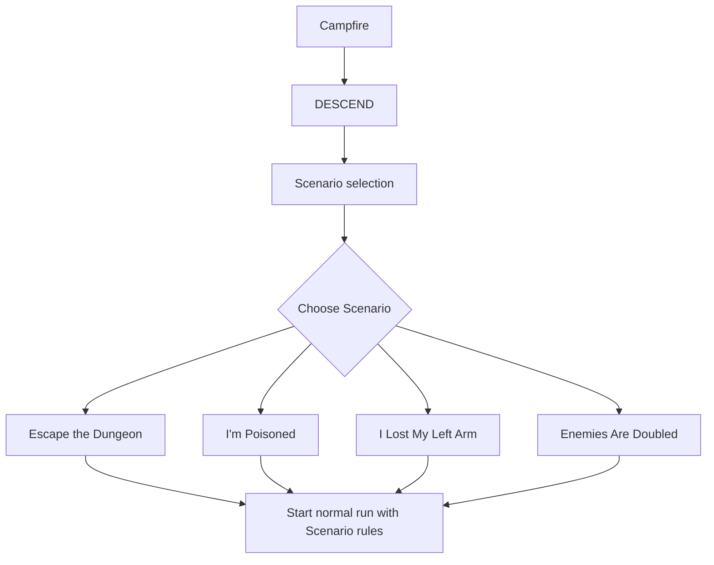
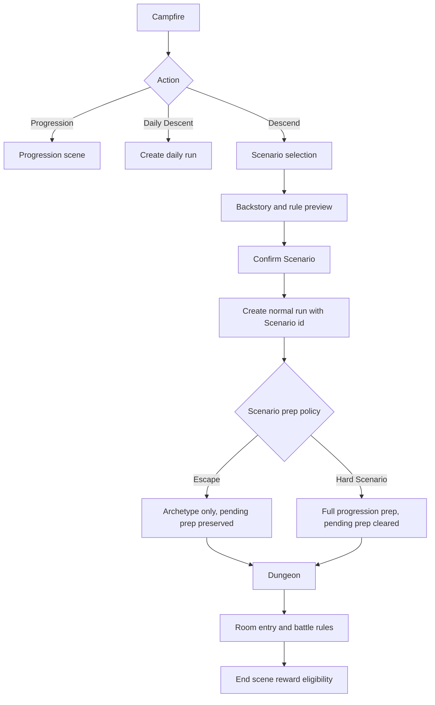
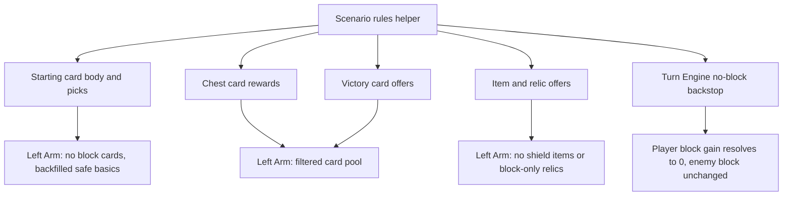

# Scenarios - Plan

## Goal Capsule

- **Objective:** Replace the normal run start with Scenario selection, deliver four selectable scenarios with backstory and rules text, retire Starter Kits, and keep Daily Descent separate.
- **Product authority:** The Product Contract is unchanged from the confirmed brainstorm on 2026-07-05. The Planning Contract only defines how to build it.
- **Execution profile:** Implement in dependency order from U1 through U8. Scenario rules are game rules and belong in `src/game/` or data helpers first, with Phaser scenes rendering and forwarding choices.
- **Stop conditions:** Stop and ask before changing product scope on Daily Descent, Escape rewards, Starter Kit compensation, armor availability, or hard-scenario reward bonuses.
- **Tail ownership:** Implementation must satisfy the Verification Contract and Definition of Done before handoff.

---

## Product Contract

### Summary

Normal runs start by choosing a Scenario. Each Scenario gives the run a premise, shows a short backstory before selection, and applies one run-level rule. "Escape the Dungeon" is the clean/default premise with no progression rewards; the three hard scenarios use full progression and normal rewards.

### Problem Frame

The game already has persistent progression, archetypes, Daily Descent, and a normal dungeon loop, but the beginning of a normal run has no selectable premise. Scenarios add an explicit run identity at the moment the player commits to a descent.

Starter Kits overlap with archetypes as a pre-run identity system. This feature retires Starter Kits and leaves archetypes as the retained long-term playstyle choice.

### Key Decisions

- Scenario selection replaces the normal `[ DESCEND ]` handoff. The player chooses a Scenario before the run starts.
- Four Scenarios ship in v1: "Escape the Dungeon", "I'm Poisoned", "I Lost My Left Arm", and "Enemies Are Doubled".
- "Escape the Dungeon" is the plain/default Scenario: it keeps the selected archetype, ignores other pre-run advantages, and suppresses post-run progression rewards.
- The three hard Scenarios use full remaining progression setup and award normal progression rewards.
- "I'm Poisoned" deals random 1-2 HP loss on each new room entry after the start room, and this can kill the player.
- "I Lost My Left Arm" means the player cannot gain block from any source. Block-granting cards, rewards, prep options, and relics are excluded. Armor remains separate and allowed.
- "Enemies Are Doubled" affects normal encounters only: each normal encounter becomes two full-strength normal enemies. Elites and bosses stay authored single fights.
- Starter Kits are removed from the run-start and progression model.
- Daily Descent stays separate and does not route through Scenario selection.
- Hard Scenarios do not grant bonus rewards in v1.

### Requirements

**Scenario selection and narrative**

- R1. Normal `[ DESCEND ]` flow must show a Scenario selection before the run starts.
- R2. Scenario selection must offer exactly four Scenarios in v1: "Escape the Dungeon", "I'm Poisoned", "I Lost My Left Arm", and "Enemies Are Doubled".
- R3. Each Scenario must show a short backstory before selection and make the Scenario rule legible before the player commits.
- R4. Daily Descent must remain separate and must not route through Scenario selection.

**Scenario rules**

- R5. "Escape the Dungeon" must keep the selected archetype but ignore other pre-run advantages and suppress post-run progression rewards.
- R6. "I'm Poisoned" must deal random 1-2 HP loss on each new room entry after the start room, and the loss can kill.
- R7. "I Lost My Left Arm" must prevent the player from gaining block from any source and exclude any player-facing setup or reward option with block-granting effects. Armor remains available as a separate mechanic.
- R8. "Enemies Are Doubled" must turn normal encounters into two full-strength normal enemies while leaving elites and bosses single authored fights.

**Progression and content cleanup**

- R9. The three hard Scenarios must use full remaining progression setup and award normal progression rewards.
- R10. Starter Kits must be removed or retired from run start, progression UI, and Scenario behavior. Archetypes are the retained run identity system.
- R11. Scenario names and backstories should use clear existing vocabulary and avoid obscure fantasy terms where plain wording is stronger.

**Validation and readability**

- R12. Visible Scenario selection and Scenario feedback must be smoke-tested in browser because Phaser layout/readability regressions have happened before.
- R13. Balance-sensitive Scenario changes must run through the existing balance simulator surface and expected bands should move only when the new difficulty is intentional.

### Key Flows

- F1. Normal Scenario start
  - **Trigger:** The player selects `[ DESCEND ]` from the Campfire.
  - **Steps:** The game shows the Scenario selection screen; the player reads a backstory and rule summary; the player confirms one Scenario; the run starts with that Scenario modifier.
  - **Outcome:** Normal runs always have an explicit Scenario.
  - **Covers:** R1, R2, R3.

- F2. Escape run end
  - **Trigger:** A run using "Escape the Dungeon" ends by death, escape, or other normal terminus.
  - **Steps:** The normal ending flow resolves the run result, but no Embers, contracts, unlocks, or other post-run progression rewards are awarded from that run.
  - **Outcome:** Escape is a clean dungeon attempt, not a progression farming path.
  - **Covers:** R5.

- F3. Hard Scenario run
  - **Trigger:** The player chooses "I'm Poisoned", "I Lost My Left Arm", or "Enemies Are Doubled".
  - **Steps:** The selected Scenario rule applies for the run; all remaining eligible progression setup applies; normal post-run progression rewards apply.
  - **Outcome:** Hard Scenarios are real progression runs with an extra constraint.
  - **Covers:** R6, R7, R8, R9.

### Acceptance Examples

- AE1. **Covers R1-R4.** Given the player is at the Campfire, when they choose `[ DESCEND ]`, then they see exactly four Scenario options with backstory/rule text before the run starts; when they choose Daily Descent, they do not see Scenario selection.
- AE2. **Covers R5.** Given the player has an archetype selected and other progression advantages unlocked, when they choose "Escape the Dungeon", then the run keeps the archetype, ignores other pre-run advantages, and awards no post-run progression rewards at the end.
- AE3. **Covers R6.** Given the player is in an "I'm Poisoned" run, when they enter any new room after the start room, then they lose 1 or 2 HP randomly; if this reduces HP to 0, the run can end immediately.
- AE4. **Covers R7.** Given the player is in an "I Lost My Left Arm" run, when setup, card rewards, shops, prep, or relic choices are generated, then no block-granting option is offered; if any block gain would resolve at runtime, it grants 0 block.
- AE5. **Covers R8.** Given the player enters a normal encounter in an "Enemies Are Doubled" run, then the battle contains two full-strength normal enemies; when the player enters an elite or boss encounter, the encounter is not doubled.
- AE6. **Covers R10.** Given Starter Kits were previously unlockable, when this feature ships, then Starter Kit selection no longer appears in progression/run-start behavior and no Scenario depends on Starter Kits.

### Scope Boundaries

- Daily Descent behavior is unchanged.
- Hard Scenarios do not add bonus rewards in v1.
- This is not a staged MVP; the intended first slice includes all four Scenarios, backstory selection, rules, Starter Kit retirement, and reward behavior.
- Final visual polish beyond a usable backstory/selection flow is not part of this requirements artifact.
- Armor is not removed by "I Lost My Left Arm"; only block is blocked.

### Dependencies / Assumptions

- Removing Starter Kits is acceptable in the same change package as Scenarios.
- Archetypes remain the primary pre-run identity system.
- The Left Arm scenario's block filtering can treat block-granting effects as disallowed content, while non-block defensive mechanics such as armor remain allowed.
- Scenario difficulty can be tuned after simulator and browser smoke testing, but the product rules above are fixed unless the owner changes scope.

### Sources / Research

- `README.md` - current game loop summary and feature vocabulary.
- `CONCEPTS.md` - current run, progression, Daily Descent, Starter Kit, and Archetype vocabulary.
- `src/scenes/Campfire.ts` - normal descent, progression, and Daily Descent entry points.
- `src/game/campfirePrep.ts` - pre-run progression setup applied to normal runs.
- `src/scenes/Dungeon.ts` - room-entry hook, battle start, and run-state room handling.
- `src/scenes/End.ts` - post-run Ember and contract reward flow.
- `src/scenes/TurnBattle.ts` - battle victory rewards and enemy pack handling.
- `src/game/metaRewards.ts` - meta reward calculation.
- `src/game/rewards.ts` - card/gold reward generation.
- `src/game/startingCards.ts` - starting deck and opening picks.
- `src/data/cards.ts` - block effects and card pool filtering surface.
- `src/data/enemies.ts` - normal, elite, and boss enemy data.
- `src/game/balanceSimulator.ts` - automated scenario/balance validation surface.

---

## Planning Contract

### Product Contract Preservation

Product Contract unchanged. Planning adds implementation choices for run-state shape, content filtering, migration cleanup, validation, and UI handoff only.

### Key Technical Decisions

- KTD1. **Player-facing Scenario is run state, not meta progression.** A Scenario is chosen for one normal run and stored on `RunState`; it is not a persistent preference in meta. Daily runs remain a separate run mode and never read Scenario selection.
- KTD2. **Scenario selection is a dedicated scene between Campfire and Dungeon.** Campfire keeps `[ DESCEND ]`, `[ DAILY DESCENT ]`, and `[ PROGRESSION ]`; `[ DESCEND ]` routes to Scenario selection, and the new scene creates the run only after the player confirms a backstory/rule preview.
- KTD3. **Scenario rules live in shared helpers.** Scenario data, reward eligibility, prep eligibility, content filters, and encounter-spawn helpers live in `src/data/` or `src/game/` so scenes and the simulator consume the same rule surface.
- KTD4. **Escape prep means archetype only and no pending-prep consumption.** "Escape the Dungeon" applies the selected archetype, the default starting body, and normal opening picks, but ignores Starter Variety, one-run prep, starting relics, relic pool unlocks, Scout Flame, bargains, and Relic Charm. Because those one-run advantages are not applied, pending prep should remain available for a later hard Scenario run.
- KTD5. **Starter Kits are retired at the save boundary.** The implementation removes Starter Kit data, UI, run state, simulator knobs, and kit-only card paths. Existing save fields normalize away during the meta migration; no Ember refund is planned unless the owner changes scope.
- KTD6. **Left Arm uses filters plus a runtime backstop.** Player-facing card, item, and relic generation excludes anything that grants block or only improves block. The turn engine also gets a player-only "no block gain" guard so missed content cannot grant block at runtime. Enemy block and armor remain available.
- KTD7. **Left Arm preserves deck and offer counts with scenario-safe backfill.** Removing block cards must not shrink the structural opening deck body or collapse opening/reward choices below expected counts when safe non-block options exist. Replace or backfill with scenario-safe non-block basics instead of letting the deck become too small.
- KTD8. **Doubled enemies spawn two full normal enemies, not a pack budget.** "Enemies Are Doubled" calls the normal solo enemy spawner twice for normal encounters. It does not reuse the budget-anchored minion-pack model, and it never doubles elites or bosses.
- KTD9. **Progression reward suppression is an eligibility gate.** Escape runs skip Embers, contracts, unlocks, and other post-run progression changes. Non-progression run history can still record the outcome with zero reward so the UI can show that a run happened without granting meta progress.
- KTD10. **BalanceScenario stays simulator-only.** The existing `BalanceScenario` type is not the player-facing Scenario system. If the simulator needs to exercise player Scenarios, add a separate field for the selected player Scenario rather than overloading the type name.

### High-Level Technical Design

### Assumptions

- Retiring Starter Kits does not need a player-facing Ember refund in v1.
- Escape runs may still write a non-reward chronicle entry, but must not complete contracts, unlock relics, or add Embers.
- "I Lost My Left Arm" excludes `shield` items such as Iron Armor and block-retention relics such as Stone Heart; armor-granting or armor-cap mechanics remain allowed.
- If a Left Arm card pool cannot fill a requested offer count at the preferred tier, the generator should backfill from scenario-safe non-block cards rather than offering block.

### Risks & Dependencies

- Save migration risk: Starter Kit fields are present in current meta state and many tests. The retirement unit needs explicit normalization coverage so old saves do not crash.
- UI readability risk: Scenario selection adds several blocks of copy to a Phaser canvas. Use a pure layout helper and browser smoke to avoid the fixed-coordinate overlap class already documented for Campfire, Title, and Progression.
- Balance risk: Poisoned and Doubled Enemies intentionally move difficulty. Rebaseline only scenario-specific assertions and document the reason when simulator bands or `runSignature` change.
- Rule-divergence risk: The simulator already mirrors live combat and rewards closely; scenario spawn/filter helpers must be shared so live Dungeon and simulator do not drift.

### Sources & Research

- `docs/solutions/ui-bugs/phaser-screen-layout-readability-regressions.md` - use tested layout helpers and browser smoke for text-heavy Phaser screens.
- `docs/solutions/design-patterns/multi-enemy-pack-combat-refactor.md` - existing battle engine already supports `enemies[]`; doubled enemies should reuse the collection shape and keep full normal enemies distinct from budget packs.
- `docs/solutions/design-patterns/decouple-enemy-power-from-player-reward-scaling.md` - simulator fidelity and coupled balance constants need revalidation when encounter shape or difficulty changes.
- `docs/solutions/design-patterns/room-threat-system.md` - keep dungeon rules testable in pure helpers where practical, with Phaser scene code rendering and routing.

---

## Implementation Units

### U1. Scenario Domain And Run-State Contract

- **Goal:** Add the player-facing Scenario vocabulary and the run-state hooks other units can consume.
- **Requirements:** R1, R2, R5, R6, R7, R8, R9, R11.
- **Dependencies:** None.
- **Files:** `src/data/scenarios.ts`, `src/data/scenarios.test.ts`, `src/game/scenarioRules.ts`, `src/game/scenarioRules.test.ts`, `src/state.ts`, `src/state.test.ts`.
- **Approach:** Define the four stable Scenario ids, display names, backstories, and rule summaries in one data module. Add scenario-rule helpers for prep eligibility, progression-reward eligibility, poisoned room-entry behavior, no-block behavior, and doubled-encounter behavior. Add a normal-run Scenario field to `RunState` and keep Daily behavior independent.
- **Patterns to follow:** `src/data/archetypes.ts` for display metadata; `src/game/relicRegistry.ts` for rule helper style; `src/state.ts` for run-owned mutable state.
- **Test scenarios:**
  - Scenario data exposes exactly the four v1 Scenarios with stable ids, non-empty backstories, and non-empty rule summaries.
  - Unknown Scenario lookup rejects or fails in the same style as existing `archetypeDef`/`relicDef` helpers.
  - A new normal run can hold a selected Scenario id without affecting `isDaily` or `dailyKey`.
  - Scenario helper predicates classify Escape as no-progression/no-full-prep, and classify the three hard Scenarios as full-progression/full-prep.
- **Verification:** Scenario data and helper tests pass, and no scene needs hardcoded Scenario rule branching for basic predicates.

### U2. Retire Starter Kits

- **Goal:** Remove Starter Kits as a runtime/progression concept while preserving Starter Variety and Archetype selection.
- **Requirements:** R5, R9, R10, AE2, AE6.
- **Dependencies:** U1.
- **Files:** `src/data/starterKits.ts`, `src/data/starterKits.test.ts`, `src/meta.ts`, `src/meta.test.ts`, `src/game/progression.ts`, `src/game/progression.test.ts`, `src/game/progressionLayout.ts`, `src/game/progressionLayout.test.ts`, `src/scenes/Progression.ts`, `src/game/campfirePrep.ts`, `src/game/campfirePrep.test.ts`, `src/game/campfireSummary.ts`, `src/game/campfireSummary.test.ts`, `src/state.ts`, `src/data/cards.ts`, `src/data/cards.test.ts`, `src/game/balanceSimulator.ts`, `src/game/balanceSimulator.test.ts`, `src/game/runSignature.test.ts`, `README.md`, `CONCEPTS.md`, `src/scenes/Title.ts`.
- **Approach:** Delete the Starter Kit data module and reachable UI rows. Remove meta fields for unlocked/active kits through a versioned normalization step that drops stale saved values. Remove run-state starter-kit fields and starter-kit signature insertion from run prep. Remove or repurpose `starterKitOnly` card definitions so there is no runtime-only kit card pool. Update copy that says kits add a signature. Keep Starter Variety as the existing fourth-opening-card unlock.
- **Patterns to follow:** `src/meta.ts` versioned migration and normalization; `src/game/progressionLayout.ts` pure layout tests for section spacing; `src/game/campfireSummary.ts` compact summary pattern.
- **Test scenarios:**
  - Covers AE6. Saved meta containing old unlocked and active Starter Kit fields normalizes without them and does not crash.
  - Progression UI helpers no longer format, buy, select, or clear Starter Kits.
  - Campfire summary no longer mentions Starter Kits, while still showing Archetype, Starter Variety, relic path, and starting relic state.
  - Run prep never adds a signature kit card and no longer stores a starter-kit id on the run.
  - Card pool tests no longer depend on `starterKitOnly`; any removed signature cards are absent from standard/archetype reward pools unless intentionally reauthored as normal cards.
  - Balance simulator no longer exposes active-kit knobs or starter-kit scenario assertions.
- **Verification:** Starter Kit imports are gone from runtime source and tests except historical plan docs; Starter Variety and Archetype tests still pass.

### U3. Scenario-Aware Run Start And Progression Rewards

- **Goal:** Start normal runs with the selected Scenario and enforce Escape's prep/reward rules.
- **Requirements:** R1, R4, R5, R9, AE2.
- **Dependencies:** U1, U2.
- **Files:** `src/game/campfirePrep.ts`, `src/game/campfirePrep.test.ts`, `src/game/runCompletion.ts`, `src/game/runCompletion.test.ts`, `src/scenes/End.ts`, `src/chronicle.ts`, `src/chronicle.test.ts`, `src/game/metaRewards.test.ts`, `src/game/contracts.test.ts`.
- **Approach:** Make run-prep application Scenario-aware. Escape applies archetype plus the structural default deck/opening setup and preserves pending prep because it does not consume one-run advantages. Hard Scenarios use the existing full prep path and clear pending prep. Extract reward/completion eligibility into a pure helper consumed by `EndScene`: Escape skips Embers/contracts/unlocks, while hard Scenarios and Daily keep their current semantics. Decouple duplicate run recording from Ember award size so a no-reward Escape can still be marked handled without granting progress.
- **Patterns to follow:** Existing `applyPendingPrepToRun` one-shot prep semantics; `calculateEmberReward` for pure reward calculation; `recordRunChronicleEntry` idempotence by `runId`.
- **Test scenarios:**
  - Covers AE2. Escape with active archetype, Starter Variety unlocked, pending prep, starting relic, and relic path starts with the archetype but ignores other advantages.
  - Escape run prep leaves pending prep intact for a later hard Scenario run.
  - A hard Scenario applies the same pending prep and progression benefits a normal run currently applies, then clears pending prep.
  - Escape victory/death awards zero Embers and completes no contracts even when depth, escape, elite, or relic criteria would normally qualify.
  - Hard Scenario victory uses existing Ember, contract, and unlock behavior.
  - Daily Descent reward behavior remains unchanged and still bypasses Scenario selection.
- **Verification:** Reward/prep tests prove Escape cannot grant progression and hard Scenarios remain normal progression runs.

### U4. Scenario Selection Scene

- **Goal:** Add the player-facing selection flow before normal runs start.
- **Requirements:** R1, R2, R3, R4, R11, R12, AE1.
- **Dependencies:** U1, U3.
- **Files:** `src/scenes/ScenarioSelect.ts`, `src/game/scenarioSelectLayout.ts`, `src/game/scenarioSelectLayout.test.ts`, `src/scenes/Campfire.ts`, `src/main.ts`.
- **Approach:** Register a new Phaser scene with a list of the four Scenarios, a preview area for selected backstory/rule text, a confirm command, and a back command to Campfire. Campfire `[ DESCEND ]` routes to this scene; `[ DAILY DESCENT ]` keeps the current direct daily-start path. The scene creates the normal run only on confirmation so backing out does not consume prep or seed state.
- **Patterns to follow:** `src/scenes/Progression.ts` for scroll/masked text handling if copy needs overflow; `src/game/titleLayout.ts` and `src/game/progressionLayout.ts` for pure layout helpers; `src/scenes/Campfire.ts` for action button style.
- **Execution note:** Treat layout as a first-class proof target. Add pure layout assertions before browser smoke because this screen is copy-heavy.
- **Test scenarios:**
  - Covers AE1. Layout helper leaves distinct regions for list, backstory/rule text, confirm, and back command.
  - The scene shows all four Scenario names and can preview each Scenario's backstory/rule without starting a run.
  - Confirming a Scenario creates a normal run with that Scenario selected and routes to Dungeon.
  - Backing out returns to Campfire without clearing pending prep or changing the current run.
  - Daily Descent from Campfire does not visit Scenario selection.
- **Verification:** Unit layout tests pass and browser smoke confirms readable copy and correct routing.

### U5. Poisoned Room-Entry Rule

- **Goal:** Implement the "I'm Poisoned" HP loss on room entry, including death before combat.
- **Requirements:** R6, R12, AE3.
- **Dependencies:** U1, U3.
- **Files:** `src/game/scenarioRules.ts`, `src/game/scenarioRules.test.ts`, `src/state.ts`, `src/state.test.ts`, `src/scenes/Dungeon.ts`.
- **Approach:** Add a scenario room-entry effect that runs after the start room and before encounter commitment in `Dungeon.onRoomEntered`. It rolls 1-2 HP loss from the dungeon RNG, shows readable feedback, emits HUD updates, and routes to End if HP reaches 0 before trap or battle handling. Room-enter relic healing can resolve before poison, but poison remains able to kill before the player acts.
- **Patterns to follow:** `RunState.onRoomEntered()` for room-enter relic effects; `Dungeon.onRoomEntered()` for the centralized room-entry hook; direct HP tick semantics from poison/burn status concepts.
- **Test scenarios:**
  - Covers AE3. The start room does not apply poison loss.
  - Entering the second and later rooms in a Poisoned run loses exactly 1 or 2 HP based on scripted RNG.
  - A Poisoned run at 1 HP can die on room entry before an encounter starts.
  - Non-Poisoned Scenarios do not lose HP on room entry.
  - Wanderer's Flask healing and poison both apply in a deterministic order.
- **Verification:** State/rule tests prove the HP math; browser smoke confirms the visible poison cue and pre-combat death route.

### U6. Left Arm No-Block Filtering And Engine Backstop

- **Goal:** Prevent player block from any source and keep Left Arm content generation block-free.
- **Requirements:** R7, R12, R13, AE4.
- **Dependencies:** U1, U2, U3.
- **Files:** `src/game/scenarioRules.ts`, `src/game/scenarioRules.test.ts`, `src/game/startingCards.ts`, `src/game/startingCards.test.ts`, `src/data/cards.ts`, `src/data/cards.test.ts`, `src/game/rewards.ts`, `src/game/rewards.test.ts`, `src/data/relics.ts`, `src/data/relics.test.ts`, `src/data/items.ts`, `src/game/campfirePrep.ts`, `src/game/campfirePrep.test.ts`, `src/game/turnEngine.ts`, `src/game/turnEngine.test.ts`, `src/game/balanceSimulator.ts`, `src/game/balanceSimulator.test.ts`.
- **Approach:** Centralize predicates for block-granting cards, shield items, and block-only relic effects. Thread Scenario through starting-card picks, starting deck body construction, chest card rewards, victory card offers, item/relic offers, and simulator choices. Replace starting `Guard` pad slots and block opening picks with safe non-block alternatives so Left Arm maintains structural deck size. Add a player-only no-block guard in the turn engine config as a defense-in-depth backstop; enemy block intent still works.
- **Patterns to follow:** `cardPoolForArchetype` and `rollVictoryCardOffers` for shared pool filtering; `relicBattleSetup` for relic classification; `turnEngine` config for battle-scoped modifiers.
- **Test scenarios:**
  - Covers AE4. Left Arm starting deck contains no block cards and still has a stable structural body.
  - Left Arm starting offers, chest card rewards, and victory card offers never include cards with block effects.
  - Left Arm item and relic generation excludes shield/block-only options such as Iron Armor and Stone Heart, while armor mechanics such as Iron Will remain eligible.
  - Playing or using a missed player block effect in a Left Arm battle grants 0 block and emits a consistent presentation result.
  - Enemy block effects still grant enemy block in Left Arm battles.
  - Non-Left-Arm Scenarios keep current block cards, shield items, and block relic behavior.
- **Verification:** Filtering tests cover every reward/setup surface and turn-engine tests prove runtime block prevention.

### U7. Doubled Normal Encounters

- **Goal:** Make "Enemies Are Doubled" spawn two full normal enemies for normal encounters only.
- **Requirements:** R8, R13, AE5.
- **Dependencies:** U1, U3.
- **Files:** `src/data/enemies.ts`, `src/data/enemies.test.ts`, `src/scenes/Dungeon.ts`, `src/game/balanceSimulator.ts`, `src/game/balanceSimulator.test.ts`, `src/game/runSignature.test.ts`.
- **Approach:** Add a shared scenario-aware encounter spawn helper used by both Dungeon and the simulator. For the doubled Scenario, normal encounter rooms spawn two full `spawnEnemy` results at the current depth. Elites and bosses keep their existing single-enemy spawners, and existing budget-anchored minion packs remain for other Scenarios only if current encounter rules roll them.
- **Patterns to follow:** Existing `spawnEncounter`/`spawnEnemy` split; `RunBattleSceneData.enemies`; simulator `simulateBattle(run, enemyOrPack, rng)` already accepts arrays.
- **Test scenarios:**
  - Covers AE5. A doubled normal encounter returns exactly two full normal enemies with normal depth scaling.
  - Doubled normal encounters do not call the budget-anchored minion-pack path.
  - Elite and boss encounters remain single authored fights in the doubled Scenario.
  - Live Dungeon battle handoff and simulator both consume the same doubled encounter helper.
  - Scenario-specific simulator summary for doubled enemies is deterministic for repeated seeds.
- **Verification:** Enemy spawn tests and simulator tests prove doubled normal fights without changing elite/boss cardinality.

### U8. Documentation, Balance Rebaseline, And Browser Smoke

- **Goal:** Bring player-facing docs and validation evidence in line with the new Scenario model.
- **Requirements:** R10, R11, R12, R13.
- **Dependencies:** U2, U4, U5, U6, U7.
- **Files:** `README.md`, `CONCEPTS.md`, `src/game/balanceSimulator.test.ts`, `src/game/runSignature.test.ts`.
- **Approach:** Update README and CONCEPTS to describe Scenarios, remove Starter Kit vocabulary from current gameplay docs, and clarify Archetype as the retained run identity. Rebaseline simulator assertions only where Scenario rules intentionally move difficulty, with comments explaining whether a number is baseline, hard-scenario, or deterministic-signature evidence. Complete browser smoke of Campfire, Scenario selection, Daily bypass, and each Scenario's visible first effect.
- **Patterns to follow:** Existing balance test comments that document intentional rebaselines; Phaser readability solution doc for browser smoke expectations.
- **Test scenarios:**
  - README no longer tells players kits add a signature card.
  - CONCEPTS defines Scenario and no longer describes Starter Kit as a current run-start mechanic after implementation.
  - Balance simulator has explicit coverage for baseline/Escape and each hard Scenario, with expected bands or documented severe-difficulty expectations.
  - `runSignature` stays stable for repeated runs and is re-goldened only with an intentional comment if Scenario draw order changes.
- **Verification:** Documentation matches reachable gameplay, simulator assertions are intentional, and browser smoke covers all Scenario entry paths.

---

## Verification Contract

| Gate                     | Command / Method       | Covers | Done signal                                                                                                                                                                                                                   |
| ------------------------ | ---------------------- | ------ | ----------------------------------------------------------------------------------------------------------------------------------------------------------------------------------------------------------------------------- |
| Unit and simulator tests | `npm test`             | U1-U8  | All Vitest tests pass, including scenario helpers, meta migration, run prep, turn engine, rewards, simulator, and run signature tests.                                                                                        |
| Production build         | `npm run build`        | U1-U8  | TypeScript strict checks and Vite production build complete cleanly.                                                                                                                                                          |
| Lint                     | `npm run lint`         | U1-U8  | ESLint reports no issues.                                                                                                                                                                                                     |
| Format check             | `npm run format:check` | U1-U8  | Prettier reports no changed files needed.                                                                                                                                                                                     |
| Whitespace check         | `git diff --check`     | U1-U8  | No trailing whitespace or patch formatting errors.                                                                                                                                                                            |
| Browser smoke            | `npm run dev`          | U4-U8  | Manual smoke confirms Campfire -> Scenario selection, all four previews, Escape run start, Poisoned room-entry damage/death, Left Arm no block offers, Doubled normal battle with two full enemies, and Daily Descent bypass. |

Browser smoke should inspect the rendered Phaser canvas, not only console output. Check that Scenario text fits, buttons do not overlap, and the player can back out without consuming prep.

---

## Definition of Done

- All Product Contract requirements R1-R13 are implemented or explicitly covered by tests and smoke evidence.
- Normal `[ DESCEND ]` always routes through Scenario selection; Daily Descent never does.
- Escape runs keep archetype only, preserve unused pending prep, and award no Embers, contracts, unlocks, or other progression rewards.
- Poisoned runs lose 1-2 HP on every non-start room entry and can die before room effects or combat.
- Left Arm runs cannot gain player block from any source, never offer block-granting player content, and still allow armor.
- Doubled Enemies runs spawn two full normal enemies only for normal encounters.
- Starter Kits are gone from current runtime code, progression UI, run prep, simulator knobs, and current gameplay docs.
- The balance simulator and `runSignature` either stay stable or are rebaselined with comments that tie the drift to intentional Scenario behavior.
- Abandoned or superseded code paths from the removed Starter Kit implementation are deleted rather than left unreachable.
- The final diff contains no unrelated cleanup beyond the Scenario and Starter Kit retirement scope.
