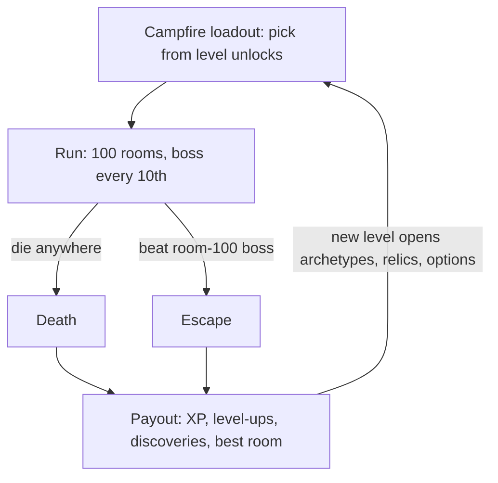
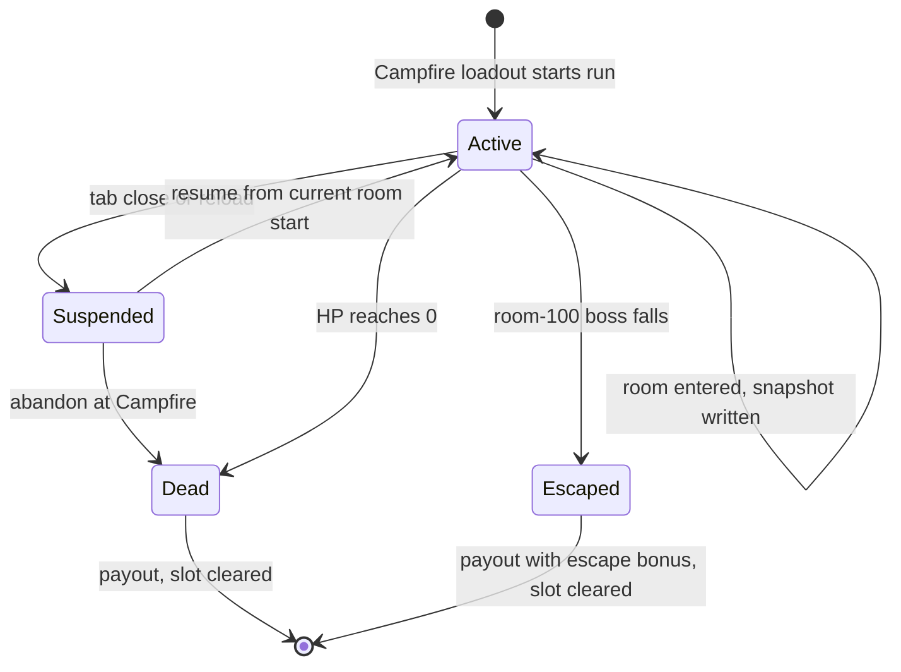
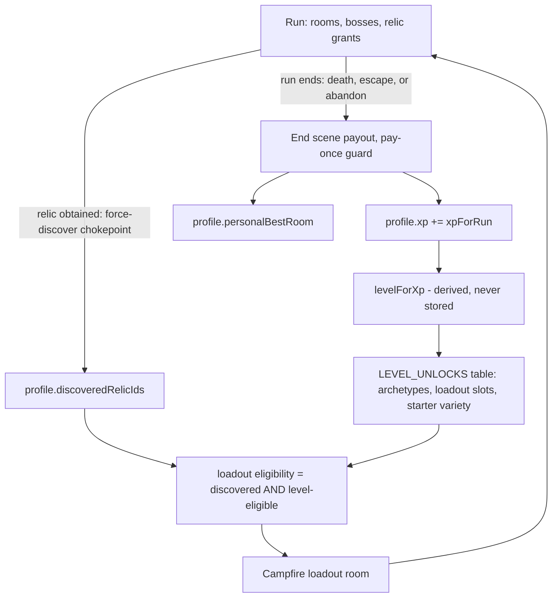

# Hundred-Room Escape - Plan

## Goal Capsule

- **Objective:** Replace the endless stratum/banking descent with a fixed 100-room escape run, and replace the Ember economy with a lifetime XP/level progression where level gates access, never stats.
- **Product authority:** The Product Contract below is owner-confirmed. Implementation must not re-open pinned decisions (run length, no early exit, access-only leveling, no meta currency, full reset, open drop pool, abandon-as-death) without owner sign-off.
- **Execution profile:** Land units in dependency order (U1 → U2 → U3/U4 → U5/U6 → U7 → U8); each unit is one atomic commit-sized change with its tests. Balance tuning (U7) is harness-driven — tune the curve constants as a set, never in isolation.
- **Stop conditions:** Stop and surface if a unit forces a product-behavior change beyond the Requirements, if the Earned band proves unreachable without violating access-only leveling, or if suspend/resume cannot preserve run determinism.
- **Open blockers:** None. Remaining open items are tuning-level and marked deferred (see Outstanding Questions).

---

## Product Contract

Product Contract preservation: changed R6 (scope clarified via new R21), R16 (re-expressed — no in-run shop exists today; drop-pool/pick gating made explicit, shop deferred), R19 (scenarios added to the re-expression scope), AE1 (boss count corrected 3 → 4); added R21 (universal XP) and R22 (abandon-as-death). All confirmed by the owner at plan scoping.

### Summary

The run becomes a fixed 100-room escape: a boss every 10th room, the last one at room 100 — beat it and you have escaped; die and the run ends, paying out lifetime XP either way. XP is never spent: it levels the character, and level gates access to archetypes, discovered relics, and loadout options, while gold stays run-scoped. Strata, gates, banking, and Embers retire entirely; the Campfire becomes the loadout room; runs suspend and resume across sittings; the update ships with a full profile reset.

### Problem Frame

The current run has no end and no legible goal. Strata are abstract depth bands — "Stratum 3" carries no meaning in a player's mind, and the only victory is Banking: choosing to stop, which feels like quitting while ahead rather than winning. The game is called _Escape_, yet nothing in it is ever escaped.

The endless model also constrains difficulty design. Five co-tuned constants exist solely to keep infinite delving EV-balanced (no dominant bank-or-push line, bounded Ember yield), which forces gentle deep-scaling slopes and caps instead of a deliberate difficulty arc. A hardcore identity — a goal that is genuinely hard to reach — has no place to live in a structure that must stay winnable-in-expectation forever.

### Key Decisions

- **A fixed 100-room run replaces the endless descent.** "100 rooms to escape" is a concrete story position a human can hold; an unbounded stratum count is not. The room count is the product's central promise and is not a tuning knob.
- **Death or escape are the only ways a run ends.** Banking, gates, and the delve choice are removed rather than reframed — no consolation exits, so the goal stays singular.
- **Access-only leveling.** Level unlocks choices (archetypes, relics, loadout options) but never grants stats, so 100 rooms stays hardcore regardless of grinding; a level-1 and a level-20 character with identical loadouts are identically strong.
- **No meta currency.** Gold dies with the run and nothing replaces Embers. The meta layer is exactly lifetime XP, character level, and permanent discovery flags — death keeps its teeth, and there is no wallet to grind.
- **Boss every 10 rooms.** Keeps the existing 10-room heartbeat and its cadence machinery (boss spawns, elite windows, tier progression) while re-expressing it: ten escalating summits between the player and escape.
- **"Earned" difficulty bar.** First escape after roughly 10–20 serious attempts for a skilled player; ~1-in-4 escape rate at mastery with a high-level loadout. This is the tuning north star that replaces the retired bank-or-delve dominance target.
- **Suspend and resume.** A multi-hour hardcore run in a browser must survive a closed tab; the run stays one continuous life, persisted between rooms.
- **Full player-base reset, no migration.** The old economy has no fair exchange rate into the new one (Embers map to neither XP nor discoveries), so all persisted profiles are cleared and everyone starts at level 1.
- **Open drop pool, gated picks.** In-run relic drops are discovery-blind — encountering new relics is _how_ discovery happens. Discovery and level gate only deliberate access: the loadout pick and any future shop stock. A gated drop pool would make discovery impossible for a fresh profile.
- **Abandon counts as a death.** A suspended run can be abandoned; it resolves exactly like dying at the current room (XP for depth reached, slot cleared). It is a convenience over deliberate suicide, not a free reroll — R2's no-consolation-exits rule holds.
- **XP is universal.** Every run type pays XP at its end. The Ember-era scenario carve-outs that suppressed progression rewards retire; Daily Descents pay XP while continuing to ignore loadout for comparability.
- **Daily Descent inherits the 100-room shape.** A short daily variant was considered and deferred; suspend-and-resume makes a multi-sitting daily workable, and a suspended daily credits the day it was started.

### Requirements

**Run structure**

- R1. A run is a fixed 100-room descent; defeating the room-100 boss is the game's only victory and ends the run as an escape.
- R2. Death is the only other run terminus — banking, gates, and the delve choice are removed entirely.
- R3. A boss guards every 10th room (10, 20, ..., 100); the room-100 boss is the final and hardest.
- R4. The HUD shows run position as room N of 100, with no stratum readout.
- R5. An in-progress run auto-suspends between rooms (single slot) and resumes exactly where it left off on return; death or escape clears the slot.
- R22. A suspended run can be abandoned from the Campfire; abandoning resolves as a death at the current room — XP paid for depth reached, slot cleared.

**Progression: XP, level, discovery**

- R6. XP is awarded once, when the run ends (death or escape), scaled by rooms reached plus boss-kill bonuses; there are no mid-run level-ups.
- R7. XP is never spent; lifetime XP maps to a character level on a D&D-style curve.
- R8. Level grants access only, never stats or in-run resources.
- R9. Level gates the unlock schedule: archetypes (a fresh profile starts neutral-only), discovered relics becoming available, and loadout options.
- R10. A relic counts as discovered once obtained in any run; discovery is permanent, profile-scoped, and a precondition for the relic appearing in any loadout or shop offer.
- R11. The end-of-run screen is the progression moment: XP earned, level-ups reached, new discoveries, and personal-best room.
- R21. Every run type pays XP: the scenario carve-outs that suppressed progression rewards retire, and Daily Descents pay XP while continuing to ignore loadout and archetype for comparability.

**Economy**

- R12. Gold is run-scoped — earned and spent inside the run, gone at its end; no currency of any kind persists across runs.
- R13. Embers and the gold-to-ember conversion retire, with no replacement meta currency.
- R14. The Campfire becomes the loadout room: the player assembles a run start (archetype, starting relic choice) from what level has unlocked; it sells nothing.
- R15. Ember-priced content (campfire purchases, bargains, the starter variety unlock) re-homes to level gates or retires — nothing remains Ember-priced.
- R16. Deliberate relic access — the loadout starting-relic pick, and any future in-run shop stock — requires the relic to be discovered and level-eligible; the in-run drop pool stays open regardless of discovery so discovery can happen. (A dedicated in-run shop is deferred; see Scope Boundaries.)

**Balance and difficulty**

- R17. Difficulty is calibrated to the Earned bar: first escape after roughly 10–20 serious attempts for a skilled player, approaching a ~1-in-4 escape rate at mastery, with mid-skill deaths clustering around rooms 40–80.
- R18. The balance harness replaces the bank-or-delve dominance assertions with survival-curve assertions against the Earned target for a competent policy over the 100-room arc.
- R19. Every depth/stratum-keyed system re-expresses in the 100-room frame: enemy, elite, and boss scaling; card-tier progression; elite windows; room-event tables; gold income; contract goals; scenario rules (each scenario re-tuned to stay playable across 100 rooms); and run signatures (Daily Descent determinism preserved).

**Reset**

- R20. The update ships with a full profile reset: all persisted meta state (Embers, unlocks, chronicle, daily records) is cleared with no migration path; every player starts at level 1 with an undiscovered relic pool.

### Key Flows

- F1. Core loop
  - **Trigger:** Player starts a run from the Campfire.
  - **Steps:** Assemble loadout from level-unlocked options; descend rooms 1–100 with a boss every 10th; run ends at death or at the room-100 boss; payout screen shows XP, level-ups, discoveries, personal-best room; return to Campfire with any new access applied.
  - **Covers:** R1–R3, R6–R9, R11, R14.
- F2. Discovery
  - **Trigger:** Player obtains a relic not previously discovered.
  - **Steps:** Relic is flagged discovered immediately and permanently; from then on it appears in loadout and shop offers once its level requirement is met — even if the run ends two rooms later.
  - **Covers:** R9, R10, R16.
- F3. Suspend and resume
  - **Trigger:** Player leaves mid-run (tab close, reload, quit).
  - **Steps:** Run state persists at each room entry in a single slot; returning resumes from the current room's start; death or escape clears the slot. From the Campfire the player may instead abandon, which resolves as a death at the current room.
  - **Covers:** R5, R22.

### Acceptance Examples

- AE1. **Covers R6, R11.** Given a run that dies at room 47 with four bosses killed (rooms 10, 20, 30, 40), when the run ends, then the payout screen shows XP scaled to 47 rooms plus four boss bonuses, any level-up crossed, and room 47 as personal best if it exceeds the prior one.
- AE2. **Covers R10.** Given a player obtains a never-before-seen relic at room 60 and dies at room 62, when they return to the Campfire, then the relic is permanently discovered and appears in offers once their level meets its requirement.
- AE3. **Covers R5.** Given a suspended run at room 47, when the player reloads the game, then the run resumes at room 47 with identical deck, HP, gold, and relics.
- AE4. **Covers R1, R6.** Given the player defeats the room-100 boss, when the run ends, then the victory screen records an escape and pays the full-run XP including an escape bonus.
- AE5. **Covers R20.** Given a pre-update profile holding Embers, unlocks, and chronicle history, when the update loads, then the profile is a fresh level-1 state with no discoveries and no migrated values.
- AE6. **Covers R8.** Given two characters at level 1 and level 20 entering runs with identical loadouts, when either fights any encounter, then their in-run stats and resources are identical.
- AE7. **Covers R22.** Given a suspended run at room 30, when the player abandons it at the Campfire, then the run pays out exactly as a death at room 30 would (XP for 30 rooms, two boss bonuses — at a room-entry snapshot the room-30 boss is not yet fought) and the slot clears.

### Scope Boundaries

**Outside this product's identity**

- Level-granted stats or in-run resource bonuses — leveling must never soften the 100 rooms.
- Any persistent currency or wallet — no Ember successor, no partial gold carryover.
- Early-exit or banking mechanics in any reframed form.

**Deferred for later**

- Post-escape content: NG+, prestige, harder loops beyond the room-100 victory screen.
- A short-form Daily Descent variant; dailies run the full 100-room shape for now.

**Deferred to Follow-Up Work**

- A dedicated in-run relic shop room type (the shop half of R16). No in-run shop exists today — the only gold sinks are rest-room actions — so v1 gates the loadout pick only and keeps the drop pool open; a shop room is a clean follow-up once discovery/level gating primitives exist.
- A user-facing "your progress was reset" notice. The reset applies silently, consistent with the existing version-mismatch reset behavior.

### Dependencies / Assumptions

- Depth-agnostic content (archetype, relic, and scenario definitions) carries over unchanged as content; only its gating changes.
- Suspend/resume is net-new: no in-progress-run persistence exists today — localStorage covers meta progression, chronicle, daily records, and audio settings only.
- The five co-tuned endless-economy constants (`STRATUM_CLEAR_HEAL`, `DEEP_HP_SLOPE`, `BOSS_HP_PER_DEPTH_BEYOND_FIRST`, `GOLD_PER_EMBER`, `CONVERSION_GUARD_CAP`) lose their tuning rationale together; balance work is one 100-room curve exercise, not five isolated edits.
- The CONCEPTS.md vocabulary rewrite (Stratum, Gate, Delve, Bank, Ember retire; Level, XP, Discovery, Loadout enter) ships with the implementation, not before it.

### Outstanding Questions

**Deferred to implementation (tuning-level, non-blocking — structure is fixed by KTD-6/KTD-7; numbers are tuned against the harness)**

- Final XP-curve and per-level unlock-schedule values (which archetypes, relics, and loadout options open at which levels).
- Boss roster across the ten decades: default is reuse-and-escalate existing bosses with the room-100 boss as a distinct final; new identities per decade are optional content.
- Scenario re-tune values (e.g., the poisoned-entry cadence) — bounded shape decided, numbers harness-driven.

### Sources / Research

- Run terminuses today are Bank and death only; no win-by-depth state exists: `src/game/delve.ts` (`resolveBank`, `commitDelve`), `src/scenes/Dungeon.ts:1495-1597` (gate UI; victory fires only from banking), `src/scenes/End.ts`.
- Stratum geometry and anchors: `src/config.ts:11-13` (`MAX_DEPTH = 10`, `STRATUM_SIZE = 10`), `src/game/strata.ts` (unbounded band math).
- Live run state is a module-singleton class with behavior, not a data bag: `src/state.ts:23-63` (`RunState` fields incl. `relicPool: ReadonlySet`), `src/state.ts:145-157` (`addRelic` side effects), `src/state.ts:166-175` (`getRun`/`newRun`).
- The dungeon is a branching room graph keyed on origin coordinates + door choice, generated lazily and deterministically: `src/scenes/Dungeon.ts:368-371` (`branchSeed`), `src/scenes/Dungeon.ts:104-107` (`NextRoomOption.rngState`), `src/scenes/Dungeon.ts:142-151` (`create()` always starts fresh — no resume path exists).
- Persistence conventions: `src/meta.ts:20-21,174-204` (versioned payload, hard-reset on version mismatch — the no-migration reset lever), `src/chronicle.ts` (version-in-key, discard-on-mismatch), `src/daily.ts:36-60` (date-keyed single slot; record write currently drops a completion whose `dailyKey` is not today — see `src/scenes/End.ts:223-231`).
- Relic entry points all filter through `run.relicPool`: `src/game/campfirePrep.ts:28-34,47` (`relicPoolForRun` — currently built from purchased unlocks), `src/data/relics.ts:178-213` (`randomRelic`/`rollRelicOffers`), grants at `src/scenes/TurnBattle.ts:1642-1660` (boss/elite) and `src/game/rewards.ts:71-85` (chest).
- No in-run shop exists; gold sinks are fixed-price rest actions: `src/game/restEconomy.ts`. Campfire purchase logic (`src/data/campfirePurchases.ts`) is implemented but wired to no UI anywhere.
- Ember-priced content: `src/data/campfirePurchases.ts`, `src/data/campfireBargains.ts`, `src/game/progression.ts` (`buyRelicPathUnlock`, `buyRelicUnlock`, `buyStarterCardVarietyUnlock`; archetype selection is free at `progression.ts:53-71`).
- Run-end award pattern to reuse: `src/scenes/End.ts:25-90` (`awardEmbersOnce` keyed on `meta.lastAwardedRunId`; `awardContractsOnce`); lifetime accumulators precedent: `src/chronicle.ts:20-28` (`bestDepth` et al.).
- Balance harness structure: `src/game/balanceSimulator.ts:551-656` (competent policy), `:798-968` (`simulateRun` — endless loop, bank-or-delve exits), `:790-796` (default measurement is first-gate only), `:1118-1194` (delve-economy surface to delete), `:746-798` (reference-deck HP-cost anchor — survives unchanged); test layout in `src/game/balanceSimulator.test.ts` (delve block at 337–415 retires; determinism gate at 418 regenerates).
- Contracts are live (evaluated in `src/scenes/End.ts:68-85`); `delve_past_first_gate` references `run.stratum` and must be replaced; the switch's exhaustiveness check at `src/data/contracts.ts:87-90` is a useful forcing function.
- Scenario audit: `src/game/scenarioRules.ts:63-79` (`im_poisoned` chip damage is uncapped per-room — unsurvivable over 100 rooms at `PLAYER_MAX_HP = 34`); reward suppression via `src/game/runCompletion.ts` retires under R21.
- Institutional learnings applied: co-tune difficulty constants as a set against the harness; prove state-reshape safety via unchanged goldens; serialize pure game state only (never Phaser scene objects); compute Campfire/loadout layout geometry in pure helpers (`docs/solutions/design-patterns/`, `docs/solutions/ui-bugs/`).

---

## Planning Contract

### Key Technical Decisions

- KTD1. **Run constants replace stratum geometry.** `RUN_LENGTH = 100` and `BOSS_ROOM_INTERVAL = 10` in `src/config.ts`; `src/game/strata.ts`, `src/game/delve.ts`, and `src/game/gateSummary.ts` are deleted, not adapted. Boss fires at `depth % BOSS_ROOM_INTERVAL === 0`; victory fires when the depth-100 boss dies. The elite window re-keys from stratum to decade (`floor((depth - 1) / 10)`). `RunState` drops `stratum` and renames `eliteOfferedForStratum` to a decade-keyed field.
- KTD2. **Profile is a new persistence surface; reset is one lever.** A new `src/profile.ts` module (`escape.profile.v1` key, chronicle-style discard-on-mismatch — no migration machinery) holds `xp`, `discoveredRelicIds`, `personalBestRoom`, and `lastAwardedRunId`. Level is derived (`levelForXp`), never stored. The R20 reset = bump `META_ECONOMY_VERSION` to 4 (existing hard-reset path) plus boot-time removal of the legacy chronicle/daily keys when no profile exists yet. Chronicle and daily records continue as features on fresh keys.
- KTD3. **XP and unlocks are data tables, not scattered constants.** `xpForRun(roomsReached, bossesKilled, escaped)` and `levelForXp(xp)` live in `src/profile.ts` as pure functions over tunable tables; `LEVEL_UNLOCKS` (level → archetype ids, loadout-slot grants, starter-variety) is one data table in `src/data/` so the whole schedule is tunable in one place. Discovery is written at acquisition time through one chokepoint helper (grant paths call it; the run ending two rooms later cannot lose it), XP strictly at run end via the existing pay-once pattern (`lastAwardedRunId`).
- KTD4. **Drop pool opens; gating moves to picks.** `relicPoolForRun` returns the full relic pool (minus scenario predicates); the purchased-unlock machinery (`unlockedRelicIds`, `buyRelic*`) retires. Loadout eligibility = `discoveredRelicIds ∩ levelEligible(level)`. Contract relic rewards force-discover their relic (a second explicit discovery channel). Archetype selection gains a level gate in `src/game/progression.ts`.
- KTD5. **Suspend snapshot = pure state at room-entry commit.** One slot (`escape.run.v1`) written when a room is entered, before any in-room action: `RunState.toJSON()` (Set → array; hydrate via a `RunState.fromJSON` that reconstructs through the class, never a cast) plus dungeon graph position (current room descriptor, origin, primed door options with their `rngState` strings). Anything mid-room — combat, reward panel, boss intro — replays from the room's start on resume; in-room gains not yet committed are re-rolled. Room generation stays deterministic from seed + position, so resume-then-continue must equal an uninterrupted run (asserted by test). Branching navigation is preserved; nothing linearizes.
- KTD6. **Difficulty becomes one deliberate 100-room curve family.** The linear-to-10-then-gentle-slope shapes (`enemyHpForDepth`, elite/boss slopes, `intentBonusForDepth`, `deepTierWeights`, depth-scaled gold) re-anchor: rooms 1–10 stay approximately today's first stratum (the balance baseline), then escalation is tuned to the Earned bar with boss walls — no EV constraint anymore. The replacement constants are co-tuned as a set against the harness; the plan treats them as one tuning exercise (U7), never piecemeal edits.
- KTD7. **The harness measures survival, not banking.** `simulateRun` loses `DelveStrategy`/`shouldDelve`/`MAX_SIMULATED_STRATA` and runs to depth 100 or death. New assertions: escape rate for a bare level-1 loadout sits near zero; a strong loadout (archetype + starting relic + full unlocks) lands in an Earned band (roughly 15–35%, exact bounds set during tuning); median death room for mid-tier loadouts falls in the 40–80 band. The competent card policy and the reference-deck HP-cost anchor survive unchanged. The run-signature golden regenerates once, deliberately, when `stratum`/`maxStrata` leave the signature.
- KTD8. **Daily records key off the run's daily key, not today's date.** The daily record write matches `run.dailyKey` so a daily suspended across midnight still credits its start day; starting today's daily while yesterday's hangs suspended routes through the abandon flow (R22).

### High-Level Technical Design

Run lifecycle with the new suspend/abandon states:

Meta-layer data flow (what persists, what derives, what gates):

Diagrams are directional; the unit approaches below are authoritative where they differ.

---

## Implementation Units

### U1. Fixed 100-room run core

- **Goal:** The run is 100 rooms with a boss every 10th; victory exists; strata, gates, and banking are gone.
- **Requirements:** R1–R4, R12 (partial: banking removal), R19 (mechanical re-keying).
- **Dependencies:** None.
- **Files:** `src/config.ts`, `src/state.ts`, `src/scenes/Dungeon.ts`, `src/scenes/Hud.ts`, `src/scenes/End.ts`, `src/dungeon/rooms.ts`, `src/data/contracts.ts`, `src/data/cards.ts` (mechanical re-key only: `deepTierWeights` drops its `stratumForDepth` import for inline decade math, values unchanged — curve re-tuning stays in U7), `src/game/runSignature.ts`, `src/game/balanceSimulator.ts` (mechanical loop change only); delete `src/game/strata.ts`, `src/game/delve.ts`, `src/game/gateSummary.ts` and their tests; update `src/dungeon/rooms.test.ts`, `src/game/contracts.test.ts`, `src/game/runSignature.test.ts`, `src/game/balanceSimulator.test.ts` (delete the delve-economy block), `src/daily.test.ts`; new `src/game/runStructure.test.ts` (or fold into existing suites per convention).
- **Approach:** Per KTD1. The room-100 boss kill routes to `End` with victory instead of the gate panel; death paths keep routing to `End` directly. Room-event tables re-key: pre-boss slot at `depth % 10 === 9`, the deep/recovery-leaning table split collapses into one depth-parametric table (curve values re-tuned in U7 — this unit preserves current values where they exist). Contracts: snapshot drops `stratum`; `delve_past_first_gate` is replaced by a room-milestone goal (e.g., reach room 20) — contract ids may change freely because R20 wipes completions; keep the switch exhaustiveness check. `simulateRun` mechanically loses the bank-or-delve exit (runs to 100 or death) and the delve-economy surface is deleted; survival assertions come in U7. Run-signature drops stratum fields; regenerate the golden once in this unit.
- **Patterns to follow:** The contracts exhaustiveness check as a forcing function; unchanged reference-deck determinism as reshape-proof (learnings: golden tests prove shape-only changes).
- **Test scenarios:** Boss spawns at exactly rooms 10, 20, ..., 100 and nowhere else; defeating the room-100 boss ends the run as victory; defeating the room-90 boss does not; death at any room ends the run; HUD renders `ROOM 47/100` (no stratum text); elite offered at most once per decade and re-offered in the next; replaced contract goal completes at its room threshold and the retired one is gone; run signature is stable across two identical seeded runs (regenerated golden).
- **Verification:** `npm test` green with strata/delve/gateSummary suites deleted and goldens regenerated; `npm run build` clean; manual: play past room 10 — no gate panel, run continues seamlessly.

### U2. Profile module and full reset

- **Goal:** Lifetime XP/level/discovery/personal-best persistence exists; the one-time full reset lands.
- **Requirements:** R6 (curve mechanics), R7, R10 (storage), R13 (partial: ember state removal), R20. AE5.
- **Dependencies:** None (parallel with U1).
- **Files:** New `src/profile.ts` + `src/profile.test.ts`; new `src/data/levelUnlocks.ts` + test; `src/meta.ts` (strip ember/economy fields, `META_ECONOMY_VERSION` → 4), `src/game/metaRewards.ts` (delete), `src/chronicle.ts`, `src/daily.ts` (fresh keys + legacy-key removal), `src/meta.test.ts`, `src/chronicle.test.ts`, `src/daily.test.ts`.
- **Approach:** Per KTD2/KTD3. `profile.ts` mirrors the chronicle load/save shape (try/catch, normalize, discard-on-mismatch). `xpForRun` and `levelForXp` are pure table-driven functions; propose an early-fast/late-slow curve (levels 2–5 within a handful of runs, meaningful grind by 10+) as directional starting values — final numbers are U7-adjacent tuning. `LEVEL_UNLOCKS` maps levels to archetype ids, starting-relic slot, and starter-variety; starting proposal: slot at level 2, first archetype at 3, remaining archetypes spread to ~8. Reset: on boot, if the profile key is absent, remove the legacy chronicle/daily/meta keys before loading anything.
- **Test scenarios:** `levelForXp` is monotonic and matches the table at boundaries (one XP below/at each threshold); `xpForRun` scales with rooms, adds boss bonuses, adds the escape bonus only when escaped (Covers AE1 arithmetic, AE4); discovery ledger dedupes and never shrinks; personal best only increases; malformed/legacy payloads load as fresh defaults; boot with old-shape meta + chronicle + daily keys present yields a level-1 profile and removed legacy keys (Covers AE5); ember fields are gone from the meta type (compile-level).
- **Verification:** `npm test`; a browser profile carrying pre-update localStorage opens to a fresh level-1 state.

### U3. Run-end payout and the progression moment

- **Goal:** Every run end pays XP once and shows the payout: XP, level-ups, discoveries, personal best.
- **Requirements:** R6, R11, R21. AE1, AE4.
- **Dependencies:** U1, U2.
- **Files:** `src/scenes/End.ts`, `src/game/runCompletion.ts`, `src/game/scenarioRules.ts`, `src/chronicle.ts` (record entry unchanged, fresh key), tests for the award path (`src/game/runCompletion.test.ts` or equivalent).
- **Approach:** Replace `awardEmbersOnce` with `awardXpOnce` keyed on `profile.lastAwardedRunId` (survives a suspend/resume cycle — a resumed-then-finished run pays exactly once). Retire the scenario progression-reward suppression (R21): every terminus pays; dailies pay XP (they already ignore loadout at prep time). End screen ordering: XP earned → level bar with any level-ups crossed (support multiple) → newly discovered relics this run → personal-best room marker. Contract evaluation stays.
- **Patterns to follow:** `awardEmbersOnce`/`awardContractsOnce` pay-once idiom in `src/scenes/End.ts:25-90`.
- **Test scenarios:** Death at room 47 with four boss kills pays rooms + four bonuses (Covers AE1); room-100 victory adds the escape bonus (Covers AE4); re-entering the End scene with the same run pays zero additional XP; a daily run's end pays XP; the escape-the-dungeon scenario pays XP (carve-out retired); crossing two level thresholds in one payout reports both.
- **Verification:** `npm test`; manual: die in a short run, see the payout screen with XP and best-room line.

### U4. Discovery, open drop pool, and level-gated access primitives

- **Goal:** Relics drop discovery-blind, discovery records at acquisition, and all deliberate access checks level + discovery.
- **Requirements:** R9, R10, R15 (unlock machinery retirement), R16. AE2, AE6.
- **Dependencies:** U2.
- **Files:** `src/game/campfirePrep.ts`, `src/data/relics.ts`, `src/game/progression.ts`, `src/scenes/TurnBattle.ts`, `src/game/rewards.ts`, `src/state.ts` (grant chokepoint), `src/data/contracts.ts` (force-discover on relic rewards), tests: `src/game/campfirePrep.test.ts`, `src/game/progression.test.ts`, `src/data/relics.test.ts`.
- **Approach:** Per KTD4. `relicPoolForRun` returns the full pool minus scenario predicates; delete `buyRelicPathUnlock`/`buyRelicUnlock`/`buyStarterCardVarietyUnlock` and relic `unlockCost` data. Route every relic grant (boss, elite, chest, contract reward, loadout starting relic) through one helper that adds to the run and marks discovery on the profile; contract rewards force-discover. Add `eligibleStartingRelics(profile)` (= discovered ∩ level-eligible) and `isArchetypeUnlocked(profile, id)`; `setActiveArchetype` rejects locked archetypes. Starter variety becomes a `LEVEL_UNLOCKS` entry consumed by `campfirePrep`.
- **Test scenarios:** A fresh level-1 profile's drop pool contains non-starter relics (discovery is reachable); a relic granted mid-run is discovered even when the run ends immediately after (Covers AE2); loadout eligibility excludes undiscovered and under-leveled relics and includes discovered+eligible ones; a locked archetype cannot be activated, an unlocked one can; contract completion force-discovers its reward relic; identical loadouts at levels 1 and 20 produce identical `RunState` (Covers AE6).
- **Verification:** `npm test`; manual: find a relic, die, see it offered in the loadout once leveled.

### U5. Campfire loadout room and Progression rework

- **Goal:** The Campfire/Progression surface presents level, XP, and loadout assembly — and sells nothing.
- **Requirements:** R14, R15. F1.
- **Dependencies:** U2, U4.
- **Files:** `src/scenes/Campfire.ts`, `src/scenes/Progression.ts`, `src/game/campfirePrep.ts`; delete `src/data/campfirePurchases.ts`, `src/data/campfireBargains.ts` and their tests; layout helper + test per the layout-geometry pattern.
- **Approach:** Campfire header shows level + XP progress and personal best; Progression becomes the loadout picker: archetype (level-gated), starting relic (from `eligibleStartingRelics`), starter-variety display as a level unlock; all Ember pricing/copy is gone. Compute section geometry in pure helpers with clearance assertions before rendering (learnings: layout regressions came from ad-hoc Y nudging).
- **Test scenarios:** Layout helper: sections don't overlap at min/max content sizes (many unlocks vs none); prep application: chosen archetype + starting relic land on a new `RunState`; no code path references purchases/bargains after deletion (compile-level). Test expectation for pure scene rendering: manual browser smoke (screenshot), consistent with repo convention.
- **Verification:** `npm run build`; browser smoke: assemble a loadout at level 3+, start a run, verify it applied.

### U6. Suspend, resume, and abandon

- **Goal:** A run survives tab close and resumes at the current room; abandoning resolves as death.
- **Requirements:** R5, R22, KTD8 (daily crediting). AE3, AE7, F3.
- **Dependencies:** U1 (run shape), U3 (payout path for abandon).
- **Files:** `src/state.ts` (`toJSON`/`fromJSON`), new `src/game/runSnapshot.ts` + test, `src/scenes/Dungeon.ts` (snapshot on room entry; resume branch in `create()`), `src/scenes/Campfire.ts` (Resume / Abandon affordances), `src/scenes/End.ts` (clear slot; abandon payout), `src/daily.ts` + `src/scenes/End.ts` (record write keyed on `run.dailyKey`), `src/game/runSnapshot.test.ts`.
- **Approach:** Per KTD5. Snapshot at room-entry commit only: serialized `RunState` + dungeon position (room descriptor, origin, primed `NextRoomOption`s with `rngState`). `Dungeon.create()` branches: fresh start (today's path) vs rehydrate (rebuild room/doors from the snapshot; the primed options' saved `rngState` preserves determinism). Mid-room states (combat, reward panels, boss intro) are deliberately not captured — resume replays the room from its start. Campfire with a live slot offers Resume (rehydrate) and Abandon (resolve as death at current depth through the standard payout, then clear). Daily record writes match `run.dailyKey` regardless of today's date.
- **Execution note:** Write the resume-equivalence test first: an uninterrupted seeded run and the same run suspended/resumed at several rooms must produce identical room sequences and outcomes.
- **Test scenarios:** Round-trip: `fromJSON(toJSON(run))` reproduces every field including the relic-pool set and derived getters (Covers AE3 state half); resume-equivalence per the execution note (Covers AE3 determinism half); snapshot written on room entry is unchanged by in-room actions until the next room; death and escape both clear the slot; abandon pays exactly a death-at-room-N payout and clears (Covers AE7); a suspended daily finished after midnight credits its original `dailyKey`; a corrupt snapshot discards to no-slot (no crash, no half-resume).
- **Verification:** `npm test`; browser: mid-run reload resumes the same room; abandon from Campfire shows the death payout.

### U7. Survival-curve harness and difficulty tuning

- **Goal:** The balance harness asserts the Earned bar over 100 rooms, and the difficulty curve is tuned to pass it.
- **Requirements:** R17, R18, R19 (curve + scenario re-tune halves).
- **Dependencies:** U1, U4 (loadout tiers exist to simulate).
- **Files:** `src/game/balanceSimulator.ts`, `src/game/balanceSimulator.test.ts`, `src/data/enemies.ts`, `src/data/cards.ts`, `src/game/rewards.ts`, `src/game/scenarioRules.ts`, `src/game/runSignature.ts` (golden if signature inputs change), `src/config.ts` (curve constants).
- **Approach:** Per KTD6/KTD7. Add loadout-tier simulation inputs (bare / mid / strong) on top of the competent policy; measure escape rate, median death room, and per-decade survival. Assert: bare ≈ near-zero escape; strong within the Earned band; mid-tier median death in rooms 40–80. Re-anchor the scaling family (enemy HP, elite, boss, intent, card tiers, gold income) as one co-tuned set — rooms 1–10 hold today's baseline; document the harness's new assumptions in the module header (single linear arc, no banking, access-only loadouts). Re-tune `im_poisoned` to a bounded cadence that the harness shows survivable; verify the other three scenarios' bands. The reference-deck HP-cost anchor stays untouched as the combat-level invariant.
- **Test scenarios:** The new survival describe-block with the three tier assertions; per-decade survival is monotonically decreasing (difficulty actually escalates); card tier-3 share grows across decades; boss HP at room 100 exceeds room 10's by the tuned factor; `im_poisoned` strong-loadout escape rate is nonzero; determinism gate green with final goldens.
- **Verification:** `npx vitest run src/game/balanceSimulator.test.ts` passes within its existing runtime budget; `npm test` green.

### U8. Vocabulary, docs, and dead-code sweep

- **Goal:** The repo speaks the new model everywhere; nothing stratum- or Ember-shaped survives.
- **Requirements:** R13 (final), R19 (final); the Dependencies/Assumptions vocabulary item.
- **Dependencies:** U1–U7.
- **Files:** `CONCEPTS.md`, `README.md`, `AGENTS.md` (balance-sim policy note if it references banking), repo-wide sweep of remaining `stratum`/`ember` references in `src/`.
- **Approach:** CONCEPTS.md: retire Stratum/Gate/Delve/Bank/Ember; rewrite Gold (no banking clause), Run, Campfire, Scenario (universal XP), Daily Descent (XP note), Archetype (level gate), Relic (discovery); add Level, XP, Discovery, Loadout, Suspend, Escape (victory). README gameplay section updates. `rg -i 'stratum|ember'` over `src/` must return nothing.
- **Test scenarios:** Test expectation: none — documentation and dead-code removal; the sweep is verified by grep and the full suite.
- **Verification:** `npm test`, `npm run build`, clean grep.

---

## Verification Contract

| Gate            | Command                                            | Proves                                                                                                          |
| --------------- | -------------------------------------------------- | --------------------------------------------------------------------------------------------------------------- |
| Full suite      | `npm test`                                         | All units' tests, profile/persistence normalization, run structure, resume-equivalence determinism              |
| Types + bundle  | `npm run build`                                    | Strict TS compile (`tsc --noEmit`) and Vite build after deletions                                               |
| Balance harness | `npx vitest run src/game/balanceSimulator.test.ts` | Earned-bar survival bands, per-decade escalation, reference-deck anchor, determinism golden                     |
| Browser smoke   | `npm run dev` (manual)                             | Loadout → run → suspend/reload/resume → death payout → level unlock visible at Campfire; no gate panel anywhere |

Golden regenerations (run signature in U1, final values in U7) are deliberate, reviewed changes — never silent test-fixture updates. The reference-deck HP-cost anchor must pass unchanged in every unit; if it moves, combat math changed and the unit is wrong.

---

## Definition of Done

- R1–R22 implemented, with exactly one carve-out: the in-run shop half of R16 is deferred per Scope Boundaries.
- All Acceptance Examples (AE1–AE7) covered by passing tests or the browser smoke where scene-level.
- `npm test` and `npm run build` green; the survival-curve block asserts the Earned bar and passes.
- Resume-equivalence holds: a suspended-and-resumed seeded run is indistinguishable from an uninterrupted one.
- A pre-update browser profile boots into a fresh level-1 state (reset verified end-to-end).
- `rg -i 'stratum|ember' src/` returns nothing; CONCEPTS.md speaks the new vocabulary.
- No abandoned-attempt or dead code remains in the diff (deleted modules leave no orphaned imports, comments, or test helpers).
