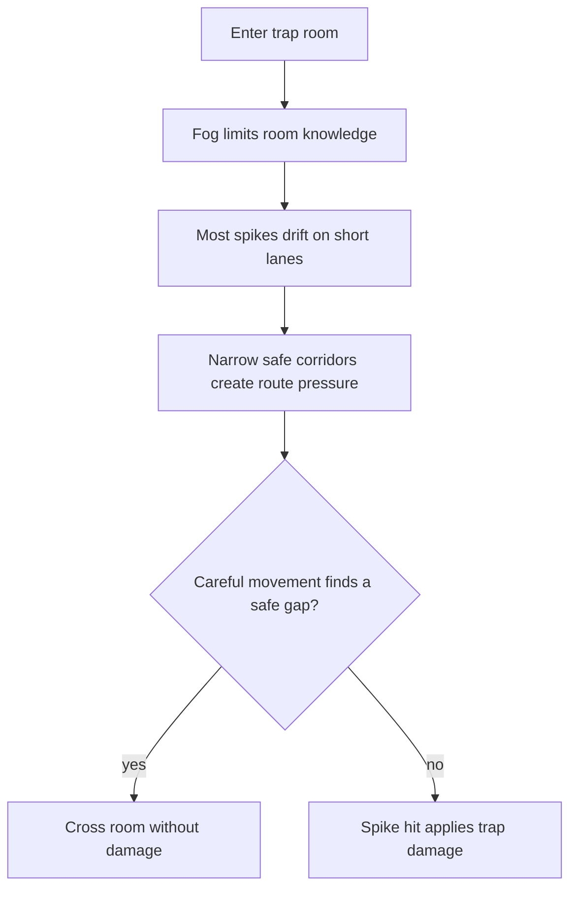
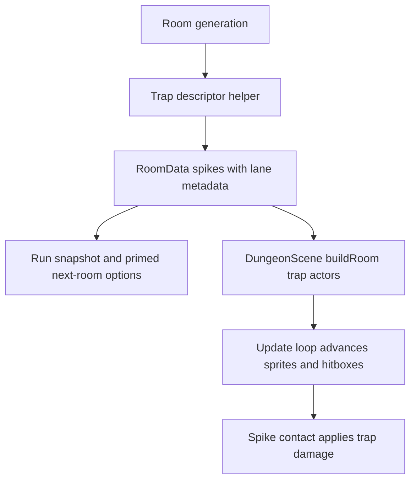

# Moving Trap Rooms - Plan

## Goal Capsule

- **Objective:** Make trap rooms meaningfully dangerous by turning static spike layouts into active lane-drift hazards with narrower safe corridors.
- **Product authority:** The Product Contract below is owner-confirmed. Planning may tune exact speeds, rail lengths, counts, and collision geometry, but must preserve the confirmed behavior shape: all newly generated trap rooms, most spikes moving, always active, slow short rails, and safe navigable gaps.
- **Execution profile:** Land deterministic trap descriptors first, then persistence compatibility, then Dungeon scene rendering/collision, then visual tuning and browser smoke.
- **Stop conditions:** Stop and surface if the implementation appears to require changing trap damage, trap-room odds, rewards, run economy, or the 100-room balance curve. Stop if safe gaps cannot be preserved with moving spikes and narrower corridors.
- **Open blockers:** None. Exact speed, rail length, density, and hitbox tuning are implementation-time calibration within the Product Contract.

---

## Product Contract

Product Contract preservation: preserved with an implementation compatibility clarification for already-suspended legacy rooms.

### Summary

Trap rooms become active movement challenges instead of static layouts the player can memorize on entry. Every newly generated trap room uses mostly moving spikes that drift slowly on short predictable lanes while narrower safe corridors force careful navigation.

### Problem Frame

Current trap rooms are too easy. The player can see enough of the layout at entry to understand the path before the fog matters, and the existing pressure is weak enough that no trap hits may occur during normal play.

The desired change is not random punishment. Trap rooms should become tense spatial rooms where the player must read moving hazards under limited vision, while still believing that a careful route existed.

### Key Decisions

- **Lane drift is the trap movement model.** Spikes move on short rails rather than raising, retracting, or reshuffling whole layouts, so the hazard stays readable while the path is no longer solved from the first second.
- **Every newly generated trap room gets the new behavior.** The rule is consistent from the start instead of appearing only in later rooms. Already-suspended legacy rooms may use the compatibility path described in the Planning Contract.
- **Most spikes move.** The room should feel materially different from the current static trap room, not like a static layout with one decorative moving spike.
- **Spikes are always active.** Moving spikes can damage the player even if they drift in from fog; the fairness contract comes from slow readable rails and safe gaps, not guaranteed preview.
- **Narrower safe corridors are part of the feature.** Movement alone may still be too forgiving, so trap layouts should pressure the route by reducing corridor slack without becoming unavoidable.

### Requirements

**Hazard behavior**

- R1. Every newly generated trap room must include lane-drifting spikes.
- R2. Most spikes in a trap room must move on short predictable rails.
- R3. Moving spikes must always be dangerous while active in the room, including when they move outside the current vision circle.
- R4. Spike movement must be slow enough that careful navigation can respond to it.
- R5. Spike movement must vary the exact safe path after entry so the player cannot solve the room by memorizing the first visible layout.

**Room pressure**

- R6. Trap layouts must use narrower safe corridors than the current static layout.
- R7. Trap rooms must preserve at least one navigable safe route through the room.
- R8. Safe gaps must stay legible under fog when the player approaches them.
- R9. Safe-entry protection must remain: the player should not take unavoidable trap damage immediately on room entry.

**Player experience**

- R10. Trap rooms should create tense navigation even for a player who already noticed the initial spike layout.
- R11. Damage should feel earned by poor movement or risky routing, not by invisible randomness.
- R12. The feature must not turn trap rooms into timed raise/retract puzzles.
- R13. The feature must not shift whole trap layouts between unrelated patterns.

### Key Flow

- F1. Trap-room navigation
  - **Trigger:** Player enters a trap room.
  - **Steps:** The room shows the initial hazard field briefly; fog limits ongoing visibility; most spikes drift on short lanes; the player navigates narrower corridors and may take damage on contact.
  - **Outcome:** The player must keep reading the room while moving instead of relying on the first visible layout.
  - **Covers:** R1-R11.

### Acceptance Examples

- AE1. **Covers R1, R2.** Given the player enters any newly generated trap room, when the room is active, then most spikes are drifting on short lanes rather than all remaining static.
- AE2. **Covers R5, R10.** Given the player watches the layout at entry, when they begin moving through the fog, then the exact safe path has changed enough that the initial layout alone does not solve the room.
- AE3. **Covers R3, R11.** Given a moving spike drifts into the player's path, when the player's collision point intersects it, then trap damage can apply even if the spike was outside vision moments earlier.
- AE4. **Covers R7, R9.** Given the player enters a trap room and moves carefully, when they choose a safe route, then there is at least one route that avoids immediate entry damage and allows crossing without forced hits.
- AE5. **Covers R12, R13.** Given a trap room is active, when spikes move, then the room does not rely on timed inactive windows or whole-layout pattern swaps.

### Success Criteria

- A player who previously never got hit by traps should experience trap rooms as a credible source of damage.
- The common playtest read should be "I needed to navigate carefully," not "I memorized the opening layout" or "that hit was random."
- Browser smoke must verify the visible behavior because fog, movement, and hitboxes can be logically correct while still reading poorly on the Phaser canvas.

### Scope Boundaries

- Timed raise/retract spike cycles are out of scope.
- Whole-room pattern-shift layouts are out of scope.
- Random unavoidable damage is out of scope.
- New trap-room rewards, penalties, room-event odds, or run-economy changes are out of scope.
- New art direction beyond readable motion cues is out of scope.

### Dependencies / Assumptions

- Trap rooms keep the existing fog identity: the player has limited ongoing visibility after entry.
- Trap damage remains a contact hazard, not a separate card-battle or status system.
- Existing trap fairness expectations around door-adjacent and spawn-adjacent safe space still apply unless planning finds a product-level reason to revisit them.

### Sources / Research

- `src/scenes/Dungeon.ts` contains the current fog overlay, static spike rendering, and spike-damage contact checks.
- `src/dungeon/rooms.ts` contains current trap spike placement and safe-entry placement rules.
- `src/dungeon/rooms.test.ts` contains existing trap fairness coverage for door-adjacent cells, spawn breathing room, bounds, and uniqueness.
- `docs/solutions/design-patterns/room-threat-system.md` records the local pattern that spatial room pressure should stay deterministic and browser-smoked for readability.

---

## Planning Contract

### Research Summary

Escape is a Phaser 3, TypeScript, Vite, and Vitest browser game. Room rules live primarily in `src/dungeon/rooms.ts`, while `src/scenes/Dungeon.ts` renders rooms, advances player movement, maintains the fog mask, and checks spike contact.

Current trap rooms store static spike grid cells on `RoomData.spikes`. `DungeonScene.buildRoom()` renders those cells as spike images and stores fixed `Phaser.Geom.Rectangle` hitboxes; the update loop checks the player's foot point against those rectangles and applies `applyTrapDamage()`.

Run snapshots persist the current `RoomData`, player position, RNG state, room-build RNG state, and primed next-room options. Generated trap-motion descriptors therefore need to survive `RoomData` serialization, but transient animation phase can stay scene-owned because the live code saves at room-entry style checkpoints rather than every animation frame.

### Key Technical Decisions

- KTD1. **Persist trap descriptors in room data.** Trap movement should be generated by dungeon rules and stored with the room, not invented by the scene, so Scout options, Daily Descent determinism, suspend/resume, and tests all observe the same room.
- KTD2. **Keep trap geometry pure and testable.** A dungeon-level trap helper should own fair cells, spike density, lane bounds, movement evaluation, and safe-route checks; the Phaser scene should render and sync the resulting state.
- KTD3. **Create pressure through layout and motion, not damage tuning.** This plan leaves trap damage, room-event weights, rewards, and simulator balance alone; difficulty comes from more moving hazards and narrower safe corridors.
- KTD4. **Make scene state a projection of descriptors.** `DungeonScene` should hold trap actors whose sprites and hitboxes are updated from descriptor plus elapsed time, while `destroyBuilt()` remains responsible for cleanup.
- KTD5. **Treat browser smoke as correctness evidence.** Unit tests can prove deterministic generation and hitbox math, but only a rendered Phaser smoke can prove moving spikes, fog, and collision feedback read fairly.

### High-Level Technical Design

The descriptor helper is the source of truth for what a trap room is. The scene should not choose which spikes move or where their rails are; it should ask the helper for the current position and keep the sprite and contact rectangle aligned.

### Assumptions

- Existing simple `{ col, row }` spike data may exist in suspended runs. The implementation should load those snapshots safely, even if that one already-suspended trap room renders static until the player leaves it.
- The update does not need to persist animation phase unless implementation discovers a real mid-room resume path. If phase is not persisted, generated descriptors still need stable phase offsets so a rebuilt room starts consistently.
- The balance simulator is not a spatial trap-room simulator. It should continue to model trap rooms at its existing abstraction unless implementation uncovers a compile-time contract change.

### System-Wide Impact

- `RoomData` and run snapshots gain a richer trap representation, so serialization compatibility matters.
- Trap-room rendering changes from fixed rectangles to time-varying actors, so visual readability and cleanup are part of correctness.
- Daily and seeded runs depend on deterministic room generation; any extra RNG consumption in trap generation must be deliberate and covered.

---

## Implementation Units

### U1. Deterministic trap descriptor model

- **Goal:** Replace static-only spike placement with deterministic trap descriptors that can express lane drift, narrower corridors, and safe gaps.
- **Requirements:** R1-R9, R12, R13; F1; AE1, AE2, AE4, AE5.
- **Dependencies:** None.
- **Files:** `src/dungeon/rooms.ts`, `src/dungeon/rooms.test.ts`, `src/dungeon/traps.ts`, `src/dungeon/traps.test.ts`, `src/config.ts`.
- **Approach:** Extract trap placement into a pure helper that returns spike descriptors with a base grid cell and optional lane-drift metadata. Generate most trap spikes as moving lane hazards, keep door-adjacent and spawn-adjacent fair space, increase corridor pressure through denser or better-placed hazards, and validate that at least one safe route remains.
- **Execution note:** Start with deterministic helper tests before wiring the scene.
- **Patterns to follow:** Existing `rollSpikes()` fairness tests in `src/dungeon/rooms.test.ts`; deterministic RNG injection through `GameRng` and `SequenceRng`.
- **Test scenarios:**
  - Covers AE1. Given a generated trap room from each entry direction, more than half of its spike descriptors are lane-drifting hazards.
  - Covers AE4. Given a generated trap room from each entry direction, no descriptor starts or sweeps through the door-adjacent fair cells or the spawn breathing-room cell.
  - Covers AE2. Given the same seed and path, generated trap descriptors are identical, including movement lanes and phase offsets.
  - Covers AE5. Given any generated trap descriptor, it describes lane drift only and does not encode inactive timing windows or whole-layout swaps.
  - Given a dense trap layout, the helper reports at least one navigable safe route while keeping the center lane meaningfully pressured.
- **Verification:** Trap descriptors are deterministic, mostly moving, safe-entry compatible, and safe-route checked in pure tests.

### U2. Snapshot and room-data compatibility

- **Goal:** Thread the richer trap descriptors through room generation, primed next-room options, and run snapshot hydration without breaking existing saves.
- **Requirements:** R1-R5, R7-R9; AE1-AE4.
- **Dependencies:** U1.
- **Files:** `src/dungeon/rooms.ts`, `src/dungeon/rooms.test.ts`, `src/game/runSnapshot.ts`, `src/game/runSnapshot.test.ts`.
- **Approach:** Extend `RoomData.spikes` to preserve lane metadata for trap rooms. Update snapshot normalization to keep valid descriptors, reject malformed descriptors, and tolerate legacy `{ col, row }` spikes safely.
- **Patterns to follow:** `normalizeRoom()` and `normalizeNextRoomOptions()` in `src/game/runSnapshot.ts`; existing room-generation determinism tests in `src/dungeon/rooms.test.ts`.
- **Test scenarios:**
  - Covers AE1. Given a newly generated trap room, `RoomData.spikes` preserves movement descriptors after JSON serialization and hydration.
  - Covers AE4. Given primed next-room options that include a trap room, hydrated options retain the same descriptors and safe-route properties.
  - Given a legacy snapshot containing only `{ col, row }` spikes, hydration succeeds and produces safe static-compatible descriptors.
  - Given a snapshot with invalid lane bounds or non-finite descriptor values, hydration rejects the snapshot without throwing.
  - Given two identical seeds and door paths, snapshot-normalized trap rooms remain equal after hydration.
- **Verification:** Suspend/resume data preserves new trap-room descriptors and does not corrupt old simple spike snapshots.

### U3. Moving spike rendering and collision

- **Goal:** Render trap descriptors as moving spike actors and make damage use the actor's current position rather than the original grid cell.
- **Requirements:** R1-R5, R8-R11; F1; AE1-AE4.
- **Dependencies:** U1, U2.
- **Files:** `src/scenes/Dungeon.ts`, `src/dungeon/traps.ts`, `src/dungeon/traps.test.ts`, `src/game/hazards.ts`.
- **Approach:** Replace the fixed `spikeRects` model with trap actors that keep sprite, descriptor, and current hitbox together. Advance trap actors before spike collision checks in the update loop, keep the fog mask behavior unchanged, and continue using `applyTrapDamage()` for the damage result.
- **Patterns to follow:** `BuiltRoom` ownership and `destroyBuilt()` cleanup in `src/scenes/Dungeon.ts`; existing potion/chest/rest proximity checks; `applyTrapDamage()` as the rule-only damage seam.
- **Test scenarios:**
  - Covers AE3. Given a moving descriptor and elapsed time, the pure position helper returns a contact rectangle at the current lane position rather than the base cell.
  - Given a descriptor at each lane endpoint, position evaluation reverses or oscillates without leaving its lane bounds.
  - Given a static-compatible legacy descriptor, position evaluation returns its base cell.
  - Manual browser smoke: entering a trap room shows moving spikes under the fog mask, and a spike hit applies the existing trap feedback and invulnerability window.
  - Manual browser smoke: standing on the entry cell immediately after room entry does not cause unavoidable damage.
- **Verification:** Moving spike sprites and hitboxes stay aligned, trap damage still flows through `applyTrapDamage()`, and room cleanup leaves no stale trap actors.

### U4. Trap-room pressure tuning and rendered smoke

- **Goal:** Tune the lane lengths, speed, density, and corridor pressure until trap rooms are credible hazards without feeling random.
- **Requirements:** R4-R11; Success Criteria.
- **Dependencies:** U1, U2, U3.
- **Files:** `src/config.ts`, `src/dungeon/traps.ts`, `src/dungeon/traps.test.ts`, `src/scenes/Dungeon.ts`, `README.md`.
- **Approach:** Calibrate named constants through a browser-smoke loop, keeping the Product Contract boundaries fixed. Update README only if the shipped player-facing feature description would otherwise be stale.
- **Execution note:** Prefer smoke-first tuning here; unit tests prove bounds, but the tuning target is rendered feel.
- **Patterns to follow:** `docs/solutions/ui-bugs/phaser-screen-layout-readability-regressions.md` for browser-smoking Phaser canvas behavior; current `README.md` feature inventory style.
- **Test scenarios:**
  - Covers AE2. Browser smoke confirms the initial visible layout is not enough to solve the room once spikes begin drifting.
  - Covers AE4. Browser smoke confirms a careful route through a trap room exists without forced hits.
  - Covers AE3. Browser smoke confirms at least one moving spike can damage the player when the player takes a bad route.
  - Given configured speed and rail bounds, pure tests assert spikes do not move faster or farther than the named safe-readability limits.
  - Given the final tuned density, pure tests assert most spikes move and at least one safe route remains.
- **Verification:** Trap rooms produce visible navigation pressure in-browser, without changing trap damage amount, room odds, rewards, or the run economy.

---

## Verification Contract

| Gate             | Command / Check                                   | Covers | Done Signal                                                                                                   |
| ---------------- | ------------------------------------------------- | ------ | ------------------------------------------------------------------------------------------------------------- |
| Unit tests       | `npm test`                                        | U1-U4  | Trap descriptor, snapshot, and motion-helper tests pass with existing suite.                                  |
| Type safety      | `npm run typecheck`                               | U1-U4  | New `RoomData` and scene changes type-check under strict TypeScript.                                          |
| Production build | `npm run build`                                   | U1-U4  | Vite bundle builds after TypeScript validation.                                                               |
| Lint             | `npm run lint`                                    | U1-U4  | ESLint accepts the new helpers and scene changes.                                                             |
| Formatting       | `npm run format:check`                            | U1-U4  | Markdown and TypeScript formatting are stable.                                                                |
| Whitespace       | `git diff --check`                                | U1-U4  | No trailing whitespace or patch formatting errors.                                                            |
| Browser smoke    | Run the Vite dev server and play into a trap room | U3, U4 | Moving spikes render under fog, safe entry holds, bad routing causes trap damage, and a careful route exists. |

---

## Definition of Done

- The Product Contract remains preserved: all newly generated trap rooms use lane-drifting, always-active spikes; most spikes move; safe corridors are narrower; safe gaps remain mandatory.
- All implementation units are complete in dependency order, with unit tests covering deterministic generation, safe-entry geometry, safe-route preservation, descriptor hydration, and motion math.
- Browser smoke confirms rendered fog, moving spike sprites, hitboxes, damage feedback, and entry safety in an actual Phaser scene.
- Trap damage amount, trap-room event odds, rewards, run economy, and the 100-room balance curve are unchanged unless the owner explicitly reopens product scope.
- Any temporary debug hooks or experimental tuning code used during browser smoke are removed before final handoff.
- `npm test`, `npm run typecheck`, `npm run build`, `npm run lint`, `npm run format:check`, and `git diff --check` pass or any pre-existing unrelated failure is documented with evidence.
